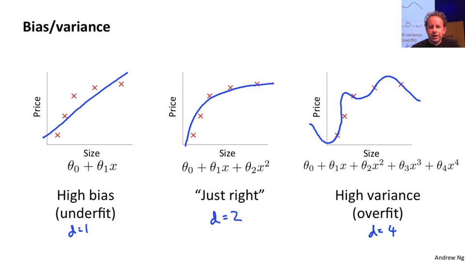
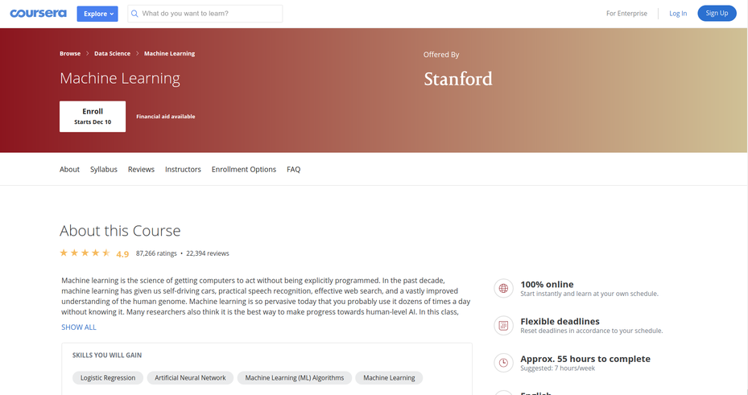
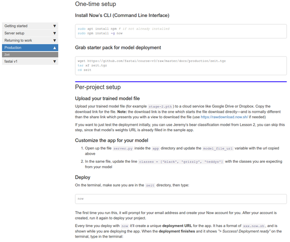
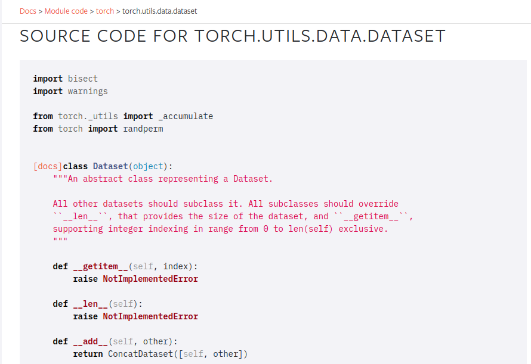

# Lesson 3 - Multi-label, Segmentation, Image Regression, and More

_These are my personal notes from fast.ai Live (the new International Fellowship programme) course and will continue to be updated and improved if I find anything useful and relevant while I continue to review the course to study much more in-depth. Thanks for reading and happy learning!_

Live date: 9 Nov 2018, GMT+8

## Topics

* Multi-label classification
* Kaggle Planet Amazon dataset of satellite images
* fastai Data Block API
* fastai DataBunch class
* Image segmentation with CamVid
* U-Net
* Learning rate annealing
* Mixed precision training
* Image regression with BIWI head pose dataset
* NLP classification
* Universal approximation theorem

## Lesson Resources

* [Course website](https://course.fast.ai/)
* [Lesson 3 video player](https://course.fast.ai/videos/?lesson=3)
* [Video](https://www.youtube.com/watch?v=MpZxV6DVsmM)
* [Official resources and updates (Wiki)](https://forums.fast.ai/t/lesson-3-official-resources-and-updates/29732)
* [Forum discussion](https://forums.fast.ai/t/lesson-3-chat/29733)
* [Advanced forum discussion](https://forums.fast.ai/t/lesson-3-advanced-discussion/29750)
* [FAQ, resources, and official course updates](https://forums.fast.ai/t/faq-resources-and-official-course-updates/27934)
* Jupyter Notebook and code
  * [lesson3-planet.ipynb](https://nbviewer.jupyter.org/github/fastai/course-v3/blob/master/nbs/dl1/lesson3-planet.ipynb)
  * [lesson3-camvid.ipynb](https://nbviewer.jupyter.org/github/fastai/course-v3/blob/master/nbs/dl1/lesson3-camvid.ipynb)
  * [lesson3-head-pose.ipynb](https://nbviewer.jupyter.org/github/fastai/course-v3/blob/master/nbs/dl1/lesson3-head-pose.ipynb)
  * [lesson3-imdb.ipynb](https://nbviewer.jupyter.org/github/fastai/course-v3/blob/master/nbs/dl1/lesson3-imdb.ipynb)

## Assignments

* Run lesson 3 notebooks.
* Replicate lesson 3 notebooks with your own dataset.
* Dig into the Data Block API.

## Other Resources

### Blog Posts and Articles

* [Universal Language Model Fine-tuning (ULMFiT) for Text Classification](http://nlp.fast.ai/category/classification.html) used in [`language_model_learner`](https://docs.fast.ai/text.html)
* [Michael Nielsen's book](http://neuralnetworksanddeeplearning.com/)
* Quick and easy model deployment on Zeit Now guide
* [Data Block API](https://docs.fast.ai/data_block.html)

### Other Useful Information

* Useful online courses for machine learning background:
  * [Machine Learning](https://www.coursera.org/learn/machine-learning) taught by Andrew Ng (Coursera)
  * [Introduction to Machine Learning for Coders](https://course.fast.ai/ml) taught by Jeremy Howard
* [Python partials](https://docs.python.org/3/library/functools.html#functools.partial)
* Nov 14 Meetup - [Conversation between Jeremy Howard and Leslie Smith](https://www.meetup.com/sfmachinelearning/events/255566613/)
* [List of vision transforms](https://docs.fast.ai/vision.transform.html#List-of-transforms)

### Useful Tools and Libraries

* Fast.ai Video Viewer with searchable transcript
* [MoviePy](https://zulko.github.io/moviepy) Python module for video editing mentioned by Rachel
* [WebRTC example for web video](https://github.com/etown/dl1/blob/master/face/static/index.html) from Ethan Sutin

### Papers

* Optional reading
  * [Cyclical Learning Rates for Training Neural Networks by Leslie Smith](https://arxiv.org/abs/1506.01186)

# My Notes

A quick correction on citation.



This chart originally cane from Andrew Ng's excellent machine learning course on Coursera. Apologies for the incorrect citation.



**Machine Learning course**

[Andrew Ng's machine learning course](https://www.coursera.org/learn/machine-learning) on Coursera is great. In some ways, it's a little dated but a lot of the content is as appropriate as ever and taught in a bottom-up style. So it can be quite nice to combine it with our top down style and meet somewhere in the middle.

Also, if you are interested in machine learning foundations, you should check out our [machine learning course](https://course.fast.ai/ml) as well. It is about twice as long as this deep learning course and takes you much more gradually through some of the foundational stuff around validation sets, model interpretation, how PyTorch tensor works, etc. I think all these courses together, if you really dig deeply into the material, do all of them. I know a lot of people who have and end up saying "oh, I got more out of each one by doing a whole lot". Or you can backwards and forwards to see which one works for you.

## Deploy web app with your model in production

We started talking about deploying your web app last week. One thing that's going to make life a lot easier for you is that https://course-v3.fast.ai/ has a production section where right now we have one platform but more will be added showing you how to deploy your web app really easily. When I say easily, for example, here is [how to deploy on Zeit guide](https://course-v3.fast.ai/deployment_zeit.html) created by San Francisco study group member, Navjot.



As you can see, it's just a page. There's almost nothing to and it's free. It's not going to serve 10,000 simultaneous requests but it'll certainly get you started and I found it works really well. It's fast. Deploying a model doesn't have to be slow or complicated anymore. And the nice thing is, you can use this for a Minimum Viable Product (MVP) if you do find it's starting to get a thousand simultaneous requests, then you know that things are working out and you can start to upgrade your instance types or add to a more traditional big engineering approach. If you actually use this starter kit, it will create my teddy bear finder for you. So the idea is, this template is as simple as possible. So you can fill in your own style sheets, your own custom logic, and so forth. This is designed to be a minimal thing, so you can see exactly what's going on. The backend is a simple REST style interface that sends back JSON and the frontend is a super simple little JavaScript thing. It should be a good way to get a sense of how to build a web app which talks to a PyTorch model.

**Examples of web apps people have built during the week [3:36](https://youtu.be/PW2HKkzdkKY?t=216)**

Edward Ross built the "What Australian car is that?" app.


I thought it was interesting that Edward said on the forum that building of this app was actually a great experience in terms of understanding how the model works himself better. It's interesting that he's describing trying it out on his phone. A lot of people think "oh, if I want something on my phone, I have to create some kind of mobile TensorFlow, ONNX, whatever tricky mobile app"﹣you really don't. You can run it all in the Cloud and make it just a web app or use some kind of simple little GUI frontend that talks to a REST backend. It's not that often that you'll need to actually run stuff on the phone. So this is a good example of that.

<table>
  <tr>
    <td> <a href="https://forums.fast.ai/t/share-your-work-here/27676/400">Guitar Classifier</a> by Christian Werner</td>
    <td><a href="https://forums.fast.ai/t/share-your-work-here/27676/340">Healthy or Not!</a> by Nikhil Utane </td>
  </tr>
  <tr>
    <td> <a href="https://forums.fast.ai/t/share-your-work-here/27676/333">Hummingbird Classifier</a> by Nissan Dookeran</td>
    <td> <a href="https://forums.fast.ai/t/share-your-work-here/27676/409">Edible Mushroom?</a> by Ramon</td>
  </tr>
  <tr>
    <td> <a href="https://forums.fast.ai/t/share-your-work-here/27676/387">Cousin Recognizer</a> by Charlie Harrington</td>
    <td> <a href="https://forums.fast.ai/t/share-your-work-here/27676/386">Emotion Classifier</a> by Ethan Sutin and Team 26</td>
  </tr>
  <tr>
    <td> <a href="https://forums.fast.ai/t/share-your-work-here/27676/350">American Sign Language</a> by Keyur Paralkar</td>
    <td> <a href="https://forums.fast.ai/t/share-your-work-here/27676/355">Your City from Space</a> by Henri Palacci</td>
  </tr>
  <tr>
    <td> <a href="https://forums.fast.ai/t/share-your-work-here/27676/367">Univariate time series as images using Gramian Angular Field</a> by Ignacio Oguiza</td>
    <td> <a href="https://forums.fast.ai/t/share-your-work-here/27676/348">Face Expression Recognition</a> by Pierre Guillou</td>
  </tr>
  <tr>
    <td><a href="https://forums.fast.ai/t/share-your-work-here/27676/352">Tumor-normal sequencing</a> by Alena Harley</td>
    <td>&nbsp;</td>
  </tr>
<table>

Nice to see what people have been building in terms of both web apps and just classifiers. What we are going to do today is look at a whole a lot more different types of model that you can build and we're going to zip through them pretty quickly and then we are going to go back and see how all these things work and what the common denominator is. All of these things, you can create web apps from these as well but you'll have to think about how to slightly change that template to make it work with these different applications. I think that'll be a really good exercise in making sure you understand the material.

## Multi-label classification with Planet Amazon dataset [[9:51](https://youtu.be/PW2HKkzdkKY?t=591)]

[lesson3-planet.ipynb](https://nbviewer.jupyter.org/github/fastai/course-v3/blob/master/nbs/dl1/lesson3-planet.ipynb)

The first one we're going to look at is a dataset of satellite images. Satellite imaging is a really fertile area for deep learning. Certainly a lot of people are already using deep learning in satellite imaging but only scratching the surface. The dataset we are going to look at looks like this:


It has satellite tiles and for each one, as you can see, there's a number of different labels for each tile. One of the labels always represents the weather (e.g. cloudy, partly_cloudy). And all of the other labels tell you any interesting features that are seen there. So primary means primary rainforest, agriculture means there's some farming, road means road, and so forth. As I am sure you can tell, this is a little different to all the classifiers we've seen so far because there's not just one label, there's potentially multiple labels. So multi-label classification can be done in a very similar way but the first thing we are going to need to do is to download the data.

### Downloading the data [[11:02](https://youtu.be/PW2HKkzdkKY?t=662)]

This data comes from Kaggle. Kaggle is mainly known for being a competitions website and it's really great to download data from Kaggle when you're learning because you can see how would I have gone in that competition. And it's a good way to see whether you know what you are doing. I tend to think the goal is to try and get in the top 10%. In my experience, all the people in the top 10% of a competition really know what they're doing. So if you can get in the top 10%, then that's a really good sign.

Pretty much every Kaggle dataset is not available for download outside of Kaggle (at least competition datasets) so you have to download it through Kaggle. The good news is that Kaggle provides a python-based downloader tool which you can use, so we've got a quick description here of how to download stuff from Kaggle.

You first have to install the Kaggle download tool via `pip`.

```bash
#! pip install kaggle --upgrade
```

What we tend to do when there's one-off things to do is we show you the commented out version in the notebook and you can just remove the comment. If you select a few lines and then hit <kbd>ctrl</kbd>+<kbd>/</kbd>, it uncomment them all. Then when you are done, select them again, <kbd>ctrl</kbd>+<kbd>/</kbd> again and re-comments them all. So this line will install `kaggle` for you. Depending on your platform, you may need `sudo` or `/something/pip`, you may need `source activate` so have a look on the setup instructions instructions or the returning to work instructions on the course website to see when we do `conda` install, you have to the same basic steps for your pip install.

Once you've got that module installed, you can then go ahead and download the data. Basically it's as simple as saying `kaggle competitions download -c competition_name -f file_name` the only other steps you do that is you have to authenticate yourself and there is a little bit of information here on exactly how you can go about downloading from Kaggle the file containing your API authentication information. I wouldn't bother going through it here, but just follow these steps.

> Then you need to upload your credentials from Kaggle on your instance. Login to kaggle and click on your profile picture on the top left corner, then 'My account'. Scroll down until you find a button named 'Create New API Token' and click on it. This will trigger the download of a file named 'kaggle.json'.

> Upload this file to the directory this notebook is running in, by clicking "Upload" on your main Jupyter page, then uncomment and execute the next two commands (or run them in a terminal).

```bash
#! mkdir -p ~/.kaggle/
#! mv kaggle.json ~/.kaggle/
```

> You're all set to download the data from [Planet competition](https://www.kaggle.com/c/planet-understanding-the-amazon-from-space). You **first need to go to its main page and accept its rules**, and run the two cells below (uncomment the shell commands to download and unzip the data). If you get a `403 forbidden` error it means you haven't accepted the competition rules yet (you have to go to the competition page, click on *Rules* tab, and then scroll to the bottom to find the *accept* button).

```python
path = Config.data_path()/'planet'
path.mkdir(exist_ok=True)
path
```

```
PosixPath('/home/jhoward/.fastai/data/planet')
```

```bash
# ! kaggle competitions download -c planet-understanding-the-amazon-from-space -f train-jpg.tar.7z -p {path}
# ! kaggle competitions download -c planet-understanding-the-amazon-from-space -f train_v2.csv -p {path}
# ! unzip -q -n {path}/train_v2.csv.zip -d {path}
```

Sometimes stuff on Kaggle is not just zipped or `tar`ed but it's compressed with a program called 7zip which will have a .7z extension. If that's the case, you'll need to either `apt install p7zip` or here is something really nice. Some kind person has created a `conda` installation of 7zip that works on every platform. So you can always just run this `conda install` ﹣doesn't even require a `sudo` or anything like that. This is actually a good example of where conda is super handy. You can actually install binaries and libraries and stuff like that and it's nicely cross-platform. So if you don't have 7zip installed, that's a good way to get it.

> To extract the content of this file, we'll need 7zip, so uncomment the following line if you need to install it (or run `sudo apt install p7zip` in your terminal).

```bash
# ! conda install -y -c haasad eidl7zip
```

This is how you unzip a 7zip file. In this case, it's tared and 7zipped, so you can do this all in one step. `7za` is the name of the 7zip archival program you would run.

That's all basic stuff which if you are not familiar with the command line and stuff, it might take you a little bit of experimenting to get it working. Feel free to ask on the forum, make sure you search the forum first to get started.

```bash
# ! 7za -bd -y -so x {path}/train-jpg.tar.7z | tar xf - -C {path}
```

## Multiclassification [[14:49](https://youtu.be/PW2HKkzdkKY?t=889)]

Once you've got the data downloaded and unzipped, you can take a look at it. In this case, because we have multiple labels for each tile, we clearly can't have a different folder for each image telling us what the label is. We need some different way to label it. The way Kaggle did it was they provided a CSV file that had each file name along with a list of all the labels. So in order to just take a look at that CSV file, we can read it using the Pandas library. If you haven't used pandas before, it's kind of  the standard way of dealing with tabular data in Python. It pretty much always appears in the `pd` namespace. In this case we're not really doing anything with it other than just showing you the contents of this file. So we can read it, take a look at the first few lines, and there it is:

```python
df = pd.read_csv(path/'train_v2.csv')
df.head()
```

|      | image_name | tags                                      |
| ---- | ---------- | ----------------------------------------- |
| 0    | train_0    | haze primary                              |
| 1    | train_1    | agriculture clear primary water           |
| 2    | train_2    | clear primary                             |
| 3    | train_3    | clear primary                             |
| 4    | train_4    | agriculture clear habitation primary road |

We want to turn this into something we can use for modeling. So the kind of object that we use for modeling is an object of the DataBunch class. We have to somehow create a data bunch out of this. Once we have a data bunch, we'll be able to go `.show_batch` to take a look at it. And then we'll be able to go `create_cnn` with it, and we would be able to start training.

So **really the trickiest step previously in deep learning has often been getting your data into a form that you can get it into a model**. So far we've been showing you how to do that using various "factory methods" which are methods where you say "I want to create this kind of data from this kind of source with these kinds of options." That works fine, sometimes, and we showed you a few ways of doing it over the last couple of weeks. But sometimes you want more flexibility, because there's so many choices that you have to make about:

- Where do the files live
- What's the structure they're in
- How do the labels appear
- How do you spit out the validation set
- How do you transform it

## Data Block API [[17:05](https://youtu.be/PW2HKkzdkKY?t=1025)]

So we've got this unique API that I'm really proud of called the [Data Block API](https://docs.fast.ai/data_block.html). The Data Block API makes each one of those decisions a separate decision that you make. There are separate methods with their own parameters for every choice that you make around how to create/set up my data.

**Announcement:** :loudspeaker: _2018-11-13: there's been one change to fastai v1.0.24 and above—`ImageFileList` is now called `ImageItemList`. You'll need to make that change in any notebooks that you've created too. Reference: [forum: Name 'ImageFileList' is not defined in fastai version 1.0.24](https://forums.fast.ai/t/name-imagefilelist-is-not-defined-in-fastai-version-1-0-24/30463?u=cedric)_

```python
tfms = get_transforms(flip_vert=True, max_lighting=0.1, max_zoom=1.05, max_warp=0.)
```

```python
np.random.seed(42)
src = (ImageItemList.from_folder(path)
       .label_from_csv('train_v2.csv',sep=' ',folder='train-jpg',suffix='.jpg')
       .random_split_by_pct(0.2))
```

```python
data = (src.datasets()
        .transform(tfms, size=128)
        .databunch().normalize(imagenet_stats))
```

For example, to grab the planet data we would say:

- We've got a list of image files that are in a folder
- They're labeled based on a CSV with this name (`train_v2.csv`)
  - They have this separator (` `) ﹣remember I showed you back here that there's a space between them. By passing in separator, it's going to create multiple labels.
  - The images are in this folder (`train-jpg`)
  - They have this suffix (`.jpg`)
- They're going to randomly spit out a validation set with 20% of the data
- We're going to create datasets from that, which we are then going to transform with these transformations (`tfms`)
- Then we going to create a data bunch out of that, which we will then normalize using these statistics (`imagenet_stats`)

So there's all these different steps. To give you a sense of what that looks like, the first thing I'm going to do is go back and explain what are all of the PyTorch and fastai classes you need to know about that are going to appear in this process. Because you're going to see them all the time in the fastai docs and PyTorch docs.

### Dataset (PyTorch) [[18:30](https://youtu.be/PW2HKkzdkKY?t=1110)]

The first one you need to know about is a class called a Dataset. The Dataset class is part of PyTorch and this is the source code for the Dataset class:



As you can see. it actually does nothing at all. The Dataset class in PyTorch defines two things: `__getitem__` and `__len__`. In Python these special things that are "underscore underscore something underscore underscore" ﹣Pythonists call them "dunder" something. So these would be "dunder get items" and "dunder len". They're basically special magical methods with some special behavior. This particular method means that your object, if you had an object called `o`, it can be indexed with square brackets (e.g. `o[3]`).  So that would call `__getitem__` with 3 as the index.

Then this one called `__len__` means that you can go `len(o)` and it will call that method. In this case, they're both not implemented. That is to say, although PyTorch says "in order to tell PyTorch about your data, you have to create a dataset", it doesn't really do anything to help you create the dataset. It just defines what the dataset needs to do. In other words, the starting point for your data is something where you can say:

- What is the third item of data in my dataset (that's what `__getitem__` does)
- How big is my dataset (that's what `__len__` does)

Fastai has lots of Dataset subclasses that do that for all different kinds of stuff. So far, you've been seeing image classification datasets. They are datasets where `__getitem__`  will return an image and a single label of what is that image. So that's what a dataset is.
