# Lesson 6 - Foundations of Convolutional Neural Networks

_These are my personal notes from fast.ai Live (the new International Fellowship programme) course and will continue to be updated and improved if I find anything useful and relevant while I continue to review the course to study much more in-depth. Thanks for reading and happy learning!_

Live date: 28 Nov 2018, GMT+8

## Topics

* Regularization
  * Dropout
  * Batch Normalization
  * Data augmentation
* Deep dive into Computer Vision Convolutional Neural Networks (CNNs)
* Platform.ai
* Rossmann Store Sales Kaggle competition
* Data cleaning
* Entity Embeddings
* Categorical variables
* Pre-processing
* Ethics and Data Science

## Lesson Resources

* [Documentations](https://course.fast.ai/)
* [Lesson 5 video player](https://course.fast.ai/videos/?lesson=6)
* [Video](https://www.youtube.com/watch?v=hkBa9pU-H48)
* [Official resources and updates (Wiki)](https://forums.fast.ai/t/lesson-6-official-resources-and-updates/31441)
* [Forum discussion](https://forums.fast.ai/t/lesson-6-in-class-discussion/31440)
* [Advanced forum discussion](https://forums.fast.ai/t/lesson-6-advanced-discussion/31442)
* [FAQ, resources, and official course updates](https://forums.fast.ai/t/faq-resources-and-official-course-updates/27934)
* Jupyter Notebook and code
  * [lesson6-rossmann.ipynb](https://nbviewer.jupyter.org/github/fastai/course-v3/blob/master/nbs/dl1/lesson6-rossmann.ipynb)
  * [rossman_data_clean.ipynb](https://nbviewer.jupyter.org/github/fastai/course-v3/blob/master/nbs/dl1/rossman_data_clean.ipynb)
  * [lesson6-pets-more.ipynb](https://nbviewer.jupyter.org/github/fastai/course-v3/blob/master/nbs/dl1/lesson6-pets-more.ipynb)

## Other Resources

### Papers

* Optional reading
  * [Entity Embeddings of Categorical Variables](http://arxiv.org/abs/1604.06737) by Cheng Guo and Felix Berkhahn
  * [Dropout: A Simple Way to Prevent Neural Networks from Overfitting](http://jmlr.org/papers/v15/srivastava14a.html) by Nitish Srivastava, Geoffrey Hinton, Alex Krizhevsky, Ilya Sutskever and Ruslan Salakhutdinov.
  * [Batch Normalization: Accelerating Deep Network Training by Reducing Internal Covariate Shift](https://arxiv.org/abs/1502.03167) by Sergey Ioffe and Christian Szegedy.
  * [How Does Batch Normalization Help Optimization](https://arxiv.org/abs/1805.11604) by Shibani Santurkar, et al.

### Blog Posts and Articles

* [CNNs from different viewpoints](https://medium.com/impactai/cnns-from-different-viewpoints-fab7f52d159c)

## Assignments

* Run lesson 6 notebooks.
* Create your own dropout layer in Python.
* Read fastai docs:
  * [Image transforms for data augmentation](https://docs.fast.ai/vision.transform.html)
  * Remember these notebooks you can open up and run thise code yourself and get this output.

# My Notes

Hi everybody, welcome to lesson 6.

We're going to do a deep dive into computer vision convolutional neural networks, what is a convolution and we're also going to learn the final regularization tricks after the last lesson learning about weight decay and/or L2 regularization.

**Software Update**

:exclamation: Always remember to do an update on fastai library and course repo. :exclamation:

```sh
# library update
conda install -c fastai fastai

# course repo update
git pull
```

## Platform.ai

I am really excited about and I have had a small hand and helping to create. For those of you that saw [my talk on TED.com](https://www.ted.com/talks/jeremy_howard_the_wonderful_and_terrifying_implications_of_computers_that_can_learn), you might have noticed this really interesting demo that we did about four years ago showing a way to quickly build models with unlabeled data.

The reason I am mentioning it here is that it's going to let you create models on different types of data sets to what you can do now that is to say data sets that you don't have labels for yet. Platform.ai actually going to help you label them.

**Quick demo about Platform.ai.** [[00:01:21](https://youtu.be/U7c-nYXrKD4?t=81)]

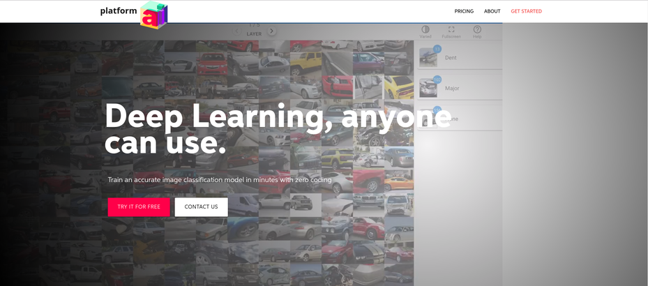

If you'd go to Platform.ai and choose to get started you'll be able to create a new project and if you create a new project you can either upload your own images.

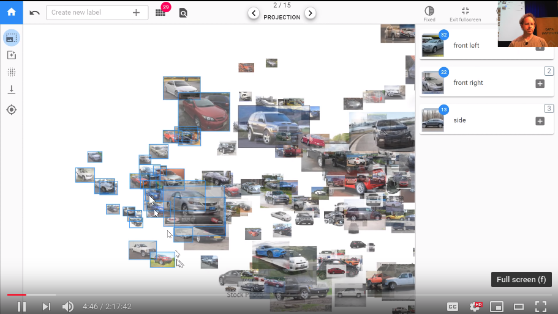

What we're doing here is we're trying to take advantage of the **combination of the human plus machine** the machine is pretty good at quickly doing calculations but as a human, we're pretty good at looking at a lot of things at once and seeing the odd one out. In this case, we're looking for cars that aren't front right and so by laying the one on in front of us we can do that really quickly it's like okay definitely that one so just click on the ones that you don't want all right it's all good so then you can just go back and so then what you can do is you can either put them into a new category but I can create a new label or you can click on one of the existing ones so before I came, I just created a few so here's front right so I just clicks on it here there we go.

> TL;DR: This makes it easier to label image data and build simple models without coding. It is working so well because humans can see a lot of things same time.

---

## [Rossmann Store Sales Kaggle competition](https://www.kaggle.com/c/rossmann-store-sales) [[00:09:43](https://youtu.be/U7c-nYXrKD4?t=583)]

From last week's discussion of regularization specifically in the context of the tabular learner, this was the init method in the tabular learner:

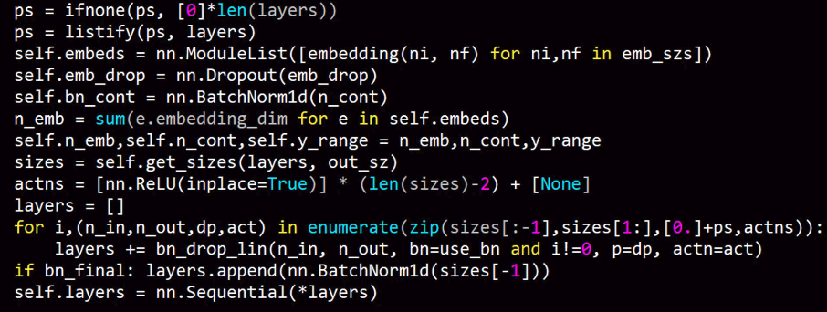

Our goal was to understand everything here and we're not quite there yet.

Last week we were looking at the adult dataset which is a really simple dataset that's just for toy purposes. So this week let's look at a dataset that's much more interesting a Kaggle competition dataset. We know kind of what the best in the world and you know Kaggle competition results tend to be much harder to beat than academic state-of-the-art results tend to be because of a lot more people work on Kaggle competitions than most academic data sets. It's a really good challenge to try and do well on a Kaggle competition dataset. The Rossmann dataset is if they've got 3000 drugs in Europe and you're trying to predict how many products they're going to sell in the next couple of weeks.

**Interesting things about this**

- The test set for this is from a time period that is more recent than the training set. This is really common if you want to predict things there's no point predicting things that are in the middle of your training set you want to predict things in the future.
- The evaluation metric they provided is the root mean squared percent error so this is just a normal root mean squared error except we go actual minus prediction divided by actual. It's the percent error that we're taking the root mean square of.

    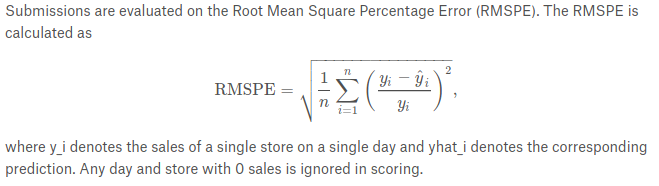

- It's always interesting to look at the leaderboard. The leaderboard the winner was 0.1. The paper, [Entity Embeddings of Categorical Variables](http://arxiv.org/abs/1604.06737) that we've roughly replicated was point 105 106 and 10th place out of 3,000 was 0.11 ish bit less.

**Additional data**

The data that was provided by Kaggle has a small number of files. But they also let competitors provide additional external data as long as they shared it with all the competitors. In practice, the data the set we're going to use contains 6 or 7 tables. The way that you join tables and stuff isn't really part of a deep learning course so I am going to skip over it and instead refers you to [Introduction to Machine Learning for Coders](https://course.fast.ai/ml) which will take you step-by-step through the data preparation.

For now, it's readily available in course repo [rossman_data_clean.ipynb notebook](https://nbviewer.jupyter.org/github/fastai/course-v3/blob/master/nbs/dl1/rossman_data_clean.ipynb). You'll see the whole process there. You'll need to run through that notebook to create these pickle files that we read here. I just wants to mention one particularly interesting part of the Rossmann data clean notebook which is you'll see there's something that says `add_date()` part. I have been mentioning for a while that we're going to look at time series and pretty much everybody who I have spoken to about it has assumed that he's going to do some kind of recurrent neural network but I am not.

Interestingly the kind of the main academic group that studies time series is econometrics and but they tend to study one very specific kind of time series which is where the only data you have is a sequence of time points of one thing like that’s the only thing you have is one sequence. In real life that’s almost never the case. Normally we would have some information about the store that represents or the people that represents, we have metadata, we have sequences of other things measured at similar time periods or different time periods. Most of the time, I find in practice the state-of-the-art results when it comes to competitions on some kind of more real-world datasets don't tend to use recurrent neural networks but instead they tend to take the time piece which in this case it was a date we were given in the data and they add a whole bunch of metadata. So in our case for example we've added day of week. So we were given a date. We've added day of week, year, month, week of year, day of month, day of week, day of year, and a bunch of booleans at the month start or end quarter, year start or end, elapsed time since 1970 so forth.

If you run this one function `add_date` part and pass it a date, it will add all of these columns to your dataset for you. What that means is that let's take a very reasonable behavior example. Purchasing behavior probably changes on pay day. Pay day might be the 15th of the month. So if you have a thing here called this is day of month here, then it will be able to recognize everytime something is a fifteen there and associated it with a higher in this case embedding matrix value.

So this way it basically you can't expect a neural net to do all of our feature engineering for us. We can expect it to kind of find non-linearities and interactions and stuff like that but for something like taking a date like this and figuring out that the fifteen of the month is something when interesting things happen. It's much better if we can provide that information for it.

So this is a really useful function to use and once you've done this you can treat many kinds of time-series problems as regular tabular problems. I say many kinds, not all. If there's very complex kind of state involved in a time series such as equity trading or something like that, this probably won't be the case or this won't be the only thing you need. But in this case, it'll get us a really good result. And in practice most of the time I find this works well.

Tabular data is normally in Pandas so we just stored them as standard Python pickle files. We can read them in. We can take a look at the first 5 records and the key thing here is that we're trying to on a particular date for a particular store ID we want to predict the number of sales. Sales is the dependent variable.

**Pre-processing** [[00:16:58](https://youtu.be/U7c-nYXrKD4?t=1018)]

Transforms are something which we run every time when we take a batch of data. Preprocessing is instead something we run once for all of our data before we start training. What is similar between these is that we need to use the same values for the train, test, and validation sets. When we first preprocess train data with certain values we need to use those same values for test and valid sets.

Pre-processor:
- `Categorify`: it's going to take these strings `Mar,Jun,Sept,Dec`, it's going to find all of the possible unique values of it and it's going to create a list of them and then it's going turn the strings into numbers.
- `FillMissing`: create for everything that's missing, anything that has a missing value, it'll create an additional column with the column name underscore na (i.e: `CompetitionDistance_na`) and it will set it for `True` for any time that was missing and then what we do is we replace `CompetitionDistance` with the median for those.

```python
df.column_name.cat.categories
```

```
Index(['Feb,May,Aug,Nov', 'Jan,Apr,Jul,Oct', 'Mar,Jun,Sept,Dec'], dtype='object')
```

```python
df.column_name.cat.codes
```

```
280   -1
584   -1
588    1
847   -1
896    1
dtype: int8
```

You don’t need to run pre-processes manually. When you create `TabularList` object it will have `procs` parameter where you define pre-processes.

```python
procs=[FillMissing, Categorify, Normalize]
```

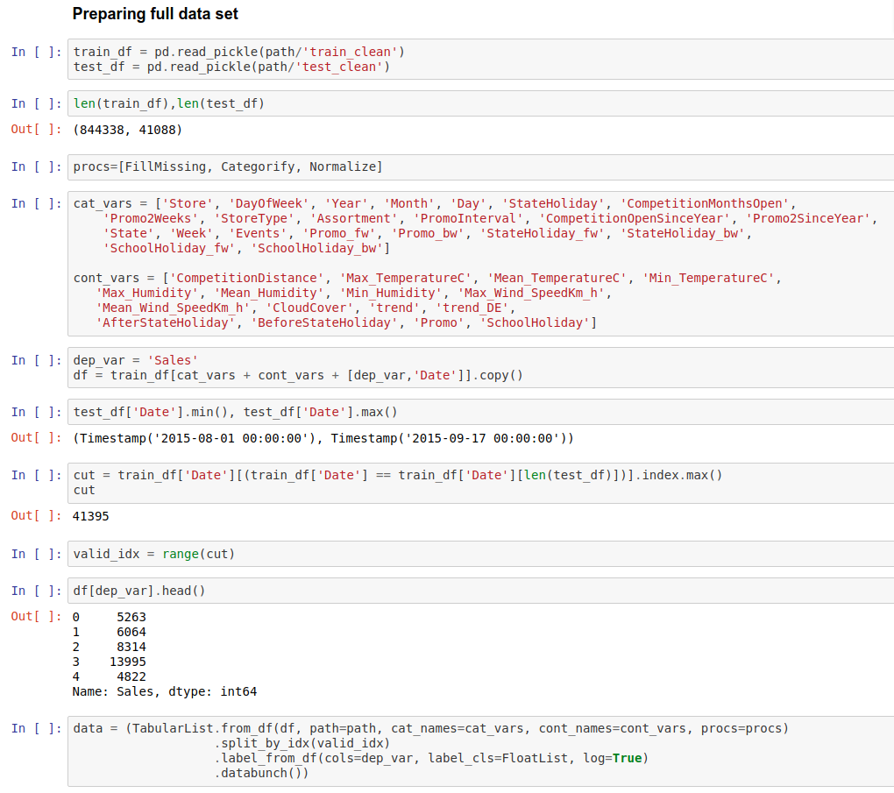

Fastai assumes that you want to do classification if you pass dependent variables that are in `int` format. That is why you can pass `label_cls` parameter where you can tell that you want these to be floats and that way be handled as a regression problem.

In many cases, it is better to look at percentage differences rather than exact differences and that is why sometimes we need to use RMSPE instead of RMSE. We use this by just setting log true and then taking RMSE. Fastai is using RMSE as default for regression problems.

We can set `y_range` and that ways tell the model to not predict over or under some value. For example, if we are predicting prices of houses we know that price can’t be less than 0.

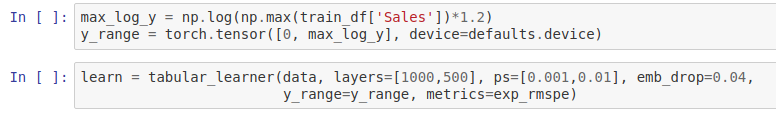

We set intermediate layers to go from 1,000 input activations to 500 output activations so there are 500,000 weights in that matrix. It is a lot for dataset where is only a few hundred thousand rows. This is going to overfit so we need to regularize it. Some beginners might reduce the weights but as we learned from the last lesson it is better to just regularize the model. By default, fastai is using weight decay but for this problem (and often for other problems) we need more regularization. Regularization can be added by passing in `ps` and `emb_drop`.

---

## Dropout [[00:30:03](https://youtu.be/U7c-nYXrKD4?t=1803)]


Picture from the paper, [Dropout: A Simple Way to Prevent Neural Networks from Overfitting](http://jmlr.org/papers/v15/srivastava14a.html).

The picture on the left is normal neural network and the picture on the right is the same network after applying dropout. Every arrow shows multiplications between weights and activations. A circle represents sum.

When we use dropout we throw away some percentage of the activations (a type of parameters that is not weights). For each mini-batch, we throw away different activations. Amount of activations we are going to ignore is `p` which can be `0.5`.

In the picture, some of the inputs are also deleted but that isn’t common practice anymore. When we are overfitting it means that some part of our model is learned to recognize some particular image and not features as it should. When we use dropout it will assure that this can’t happen. Having too much dropout will reduce the capacity of the model.

In fastai, `ps` means that we can add multiple dropouts for different layers same way we can add multiple learning rates.

[[00:34:47](https://youtu.be/U7c-nYXrKD4?t=2087)] We turn off the dropout (and other regularization methods) when we are testing (inference time) the model. But then we have two times more parameters. In the paper, researchers suggested multiplying all weights with `p`. In PyTorch and many other libraries, this multiplying is done during the training so we don’t need to care about it.

:memo: [[00:37:24](https://youtu.be/U7c-nYXrKD4?t=2244)] That'd be a good exercise to try see if you can create your own dropout layer in Python and see if you can replicate the results we get with this dropout there:

```cpp
noise.bernoulli_(1 - p);
noise.div_(1 - p);
return multiply<inplace>(input, noise);
```

[[00:37:49](https://youtu.be/U7c-nYXrKD4?t=2269)] `emb_drop` is dropout for embedding layer. We use special dropout for embedding layer because it can be a little bit higher.

---

## Batch Normalization [[00:42:20](https://youtu.be/U7c-nYXrKD4?t=2540)]

What it is is extremely unclear. Let me describe it to you. It's kind of a bit of regularization, it's kind of a bit of training helper. It's called batch normalization and it comes from this paper, [Batch Normalization: Accelerating Deep Network Training by Reducing Internal Covariate Shift](https://arxiv.org/abs/1502.03167).

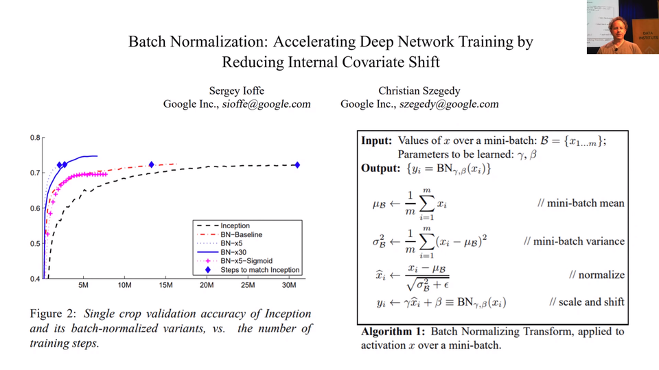

[[00:45:09](https://youtu.be/U7c-nYXrKD4?t=2709)] What is internal covariate shift? Well, it doesn't matter because this is one of those things where researchers came up with some intuition and some idea about these things they wanted to try, they did it, it worked well, they post-hoc added on some mathematical analysis to try and claim why it worked and it turned out they were totally wrong. In the last 2 months, there's been 2 papers, so it took 3 years for people to really figure this out. In the last 2 months there' been 2 papers that have shown batch normalization doesn't reduce covariate shift at all. And even if it did, that has nothing to do with why it works. That's kind of interesting insight again why we should be focusing on being practitioners and experimentalists and developing an intuition.

[[00:45:57](https://youtu.be/U7c-nYXrKD4?t=2757)] What BatchNorm does is what you see in this picture in this paper, [How Does Batch Normalization Help Optimization](https://arxiv.org/abs/1805.11604):

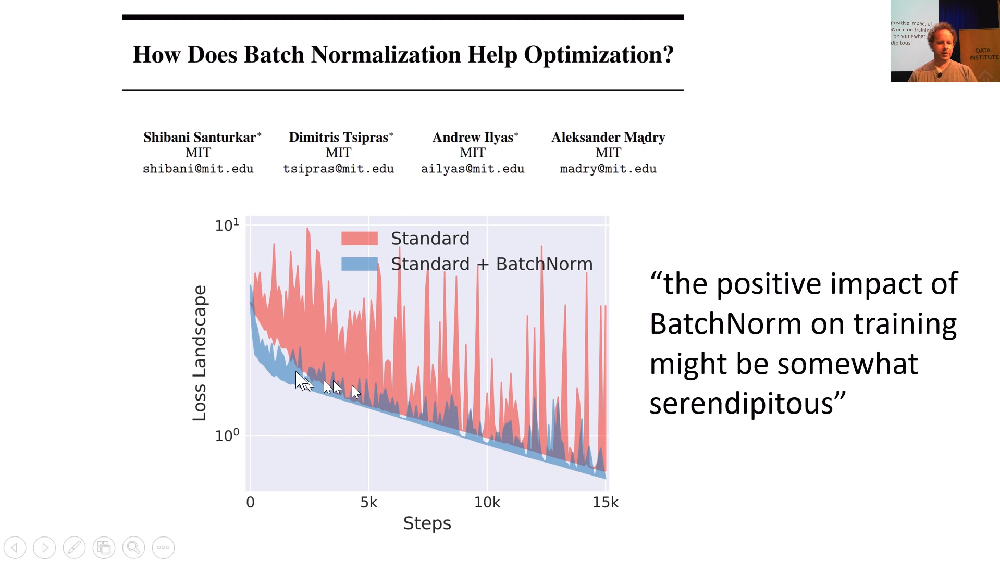

First BatchNorm takes activations. Then it takes mean and variance of those, and using those values it will normalize. Finally, (this is important) we instead of just adding bias, multiply the activations with something which is like bias. By using BatchNorm, loss decrease more smoothly and that way can be trained using higher learning rate.

Why this multiplication bias thing is working so well? Let’s say that we are again predicting movie reviews that are between 1–5. Activations in the last layer are between -1–1. We should make a new set of weights where mean and spread is increased. We can’t just move up the values because the weights are interacting very differently. With bias, we can increase the spread and now with BatchNorm, we can increase scale. Details don’t matter that much but the thing you need to know is that you want to use it. There is some other type of normalizations nowadays but BatchNorm might be the best. Jeremy told that Fastai library is using also something called WeightNorm which is developed in the last couple of months.

[[00:51:50](https://youtu.be/U7c-nYXrKD4?t=3110)] We create for each continues variable own BatchNorm and then run those. One thing Jeremy pointed is that we don’t calculate own mean and standard derivation for every mini-batch but rather take an exponentially weighted moving average of mean and standard derivation. We tune that by changing the momentum parameter (which isn’t the same as momentum regularizer). A smaller value will assure that mean and standard derivation doesn’t change so much and vice versa.

When to use these techniques:
- **weight decay** -  with or without dropout depending on the problem. (Test which is working best)
- **BatchNorm** - always
- **dropout** - with or without weight decay depending on the problem. (Test which is working best)

In general, it is often good to have a little dropout and weight decay.

Next, we are going to look at data augmentation. It is also a regularization technique. It might be the least studied regularization although there is no cost which means that you can do it and get better regularization without needing to train longer or risk to underfit.

**Question:question:**: In what proportion would you use dropout vs. other regularization errors, like, weight decay, L2 norms, etc.? [[00:55:00](https://youtu.be/U7c-nYXrKD4?t=3300)]

:exclamation: Remember that [L2 regularization and weight decay are kind of two ways of doing the same thing](https://bbabenko.github.io/weight-decay/). We should always use weight decay version, not the L2 regularization version. :exclamation:

So there's weight decay, there's batch norm which has a regularizing effect, there's data augmentation which we will see soon and there's dropout. Batch norm you pretty much always want. So that's easy. Data augmentation we will see in a moment. So then it's really between dropout vs. weight decay. I have no idea. I don't think I've seen anybody to find a compelling study on how to combine those two things. Can you always use one instead of the other? Why? Why not? I don't think anybody has figured that out. I think in practice, it seems that you generally want a bit of both. You pretty much always want some weight decay. But you often also want a bit of dropout. But honestly, I don't know why. I've not seen anybody really explain why or how to decide. So this is one of these things you have to try out and kind of get a feel for what tends to work for your kinds of problems. I think the defaults that we provide in most of our learners should work pretty well in most situations but yeah, definitely play around with it.

---

## Data Augmentation [[00:56:46](https://youtu.be/U7c-nYXrKD4?t=3406)]

The next kind of regularization we're going to look at is data augmentation and data augmentation is one of the least well studied types of regularization but it's the kind that I think I'm kind of the most excited about. The reason I'm kind of the most excited about it is that there's basically almost no cost to it. You can do data augmentation and get better generalization without it taking longer to train without underfitting to an extent at least. So let me explain. So what we're going to do now is we're going to come back to computer vision and we're going to come back to our pets dataset again. So, let's load it in.

[lesson6-pets-more.ipynb](https://nbviewer.jupyter.org/github/fastai/course-v3/blob/master/nbs/dl1/lesson6-pets-more.ipynb)

```python
tfms = get_transforms(max_rotate=20, max_zoom=1.3, max_lighting=0.4, max_warp=0.4,
                      p_affine=1., p_lighting=1.)
```

`get_transforms` parameters:
- `p_affine`: probability of affine transform.
- `p_lighting`: probability of lighting transform.
- `max_rotate`: how much rotate (left and right angle).
- `max_zoom`: how much to max zoom in.
- `max_warp`: how much warp the image.

More about these and other parameters, check the [docs](https://docs.fast.ai/vision.transform.html).

[[00:59:03](https://youtu.be/U7c-nYXrKD4?t=3543)] Remember these notebooks you can open up and run thise code yourself and get this output. All of these HTML documentation documents are auto-generated from the notebooks in the `docs_source` directory in the fastai repo.

**Padding mode** [[01:01:30](https://youtu.be/U7c-nYXrKD4?t=3690)]

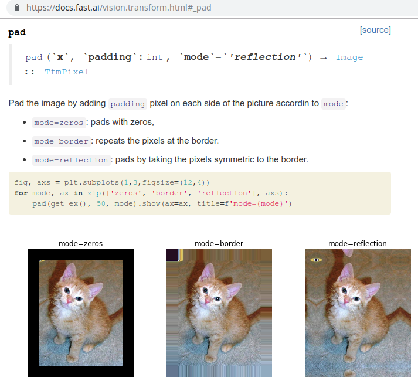

Reflections nearly always better by the way. I don't know that anybody else has really studied this but we have studied it in some depth, haven't actually written a paper about it but just enough for our own purposes to say reflection works best most of the time. So that's the default.

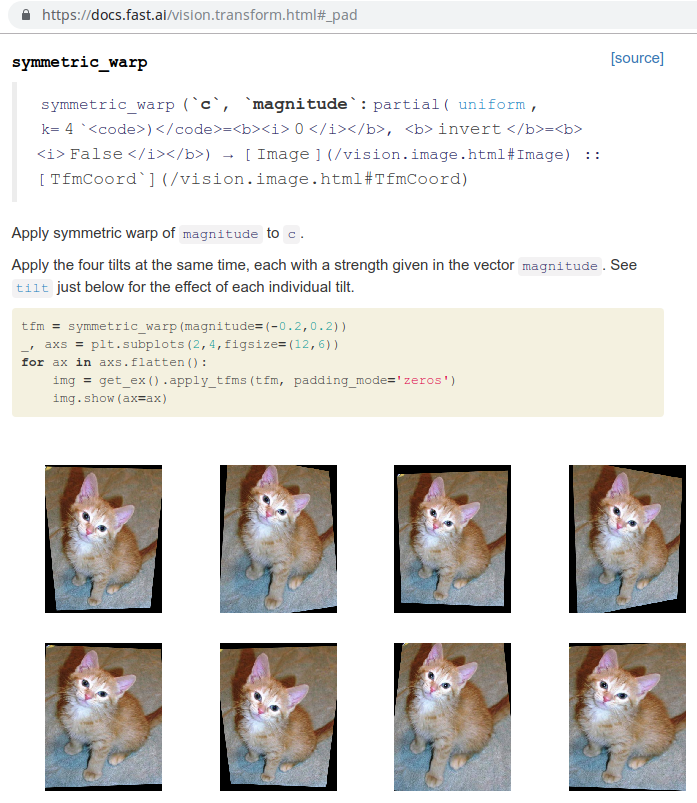

**Perspective Warping** [[01:02:04](https://youtu.be/U7c-nYXrKD4?t=3724)]

So the cool thing is as you can see, each of these pictures, as if this cat was being taken kind of from different angles. They're all kind of optically sensible. This is a really great type of data augmentation. It's also one which I don't know of any other library that does it or at least certainly one that does it in a way that's both fast and keep the image crisp as it is in fastai. If you're looking to win a Kaggle competition, this is the kind of thing that's going to get you above the people that aren't using the fastai library.

[[01:03:46](https://youtu.be/U7c-nYXrKD4?t=3826)] Because this is a training dataset, it's going to use data augmentation. So you can see the same doggy using lots of different kinds of data augmentation. You can see why this is going to work really well because these pictures all look pretty different but we didn't have to do any extra hand labeling or anything. It's like free extra data. **Data augmentation is really really great**.

One of the big opportunities for research is to figure out ways to do data augmentation in other domains. So how could you do data augmentation with text data or genomic data or histopathology data or whatever. Almost nobody is looking at that and to me it's one of the biggest opportunities that could let you decrease data requirements like by 5 to 10x.

---

## Convolutional Neural Network (CNN) [[01:05:16](https://youtu.be/U7c-nYXrKD4?t=3916)]

[lesson6-pets-more.ipynb](https://nbviewer.jupyter.org/github/fastai/course-v3/blob/master/nbs/dl1/lesson6-pets-more.ipynb)

Because we are going to study convolutional neural networks, we are going to create a convolutional neural network. You know how to create them.

After training a CNN model we want to see what is happening there. We are going to learn what is happening by creating heatmap.

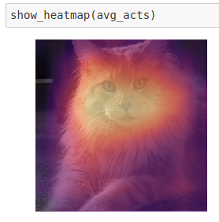

[[01:05:59](https://youtu.be/U7c-nYXrKD4?t=3959)]

There is pre-build function for this in fastai but I am going to show how to make it without fastai.

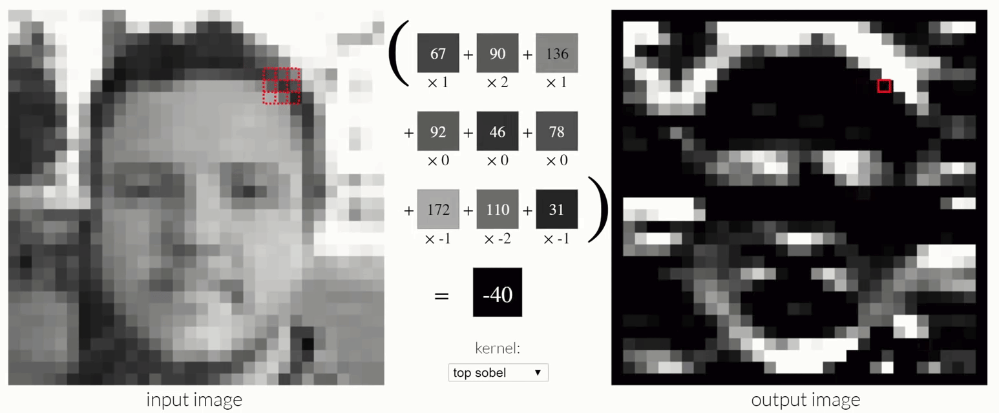
http://setosa.io/ev/image-kernels/

[[01:07:41](https://youtu.be/U7c-nYXrKD4?t=4061)]

[[01:15:01](https://youtu.be/U7c-nYXrKD4?t=4501)] Let's take a look at this from another angle or quite a few other angles. We're going to look at a fantastic [post](https://medium.com/impactai/cnns-from-different-viewpoints-fab7f52d159c) from a guy called Matt Kleinsmith who is actually a student in the first year that we did this course and he wrote this as part of his project work back then.

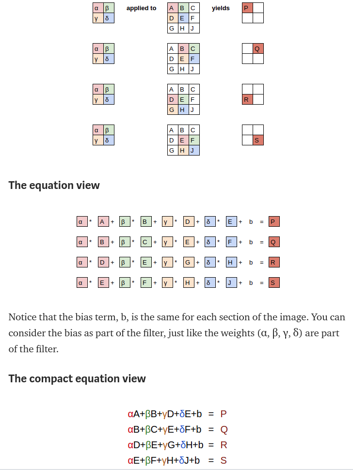

This is how we do CNN if we have RGB image. Notice that although the kernel is three dimensional the output for 3x3x3 area is still one pixel.

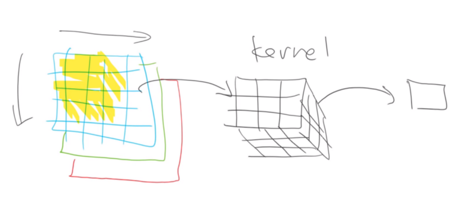

We can add more kernels and combine together. 16 is a common number.

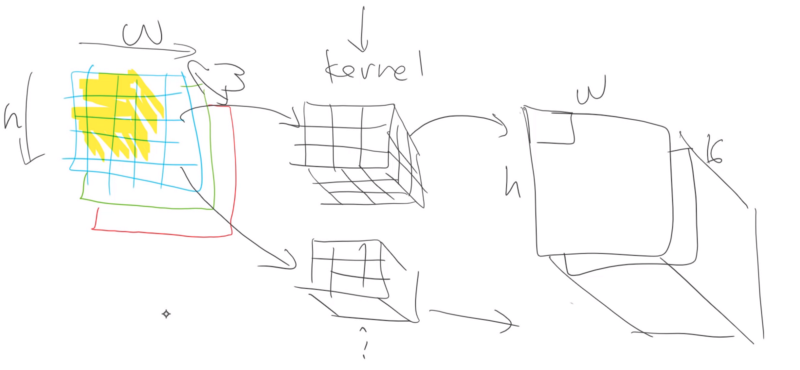

Now you are at a point where you start to understand how everything is working and that way you can use some variation of fastai techniques. Often things in the library are designed to work generally well so you might get better results by changing some things.

We can create own kernel. Expand will make tensor 3x3x3 kernel and the first dimension is created because now we can store more than one kernel.

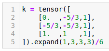

First index is the number of kernels.

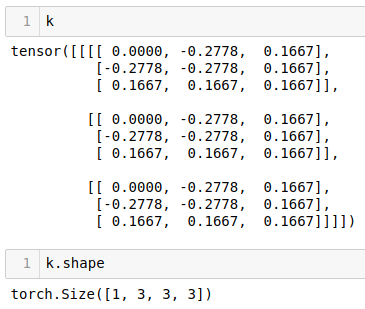

Data we import conv2d need to be in batches and that is why we create one additional dimension.

Average pooling is taking the mean of every layer. Then if we want to have 37 outputs we just multiply the average pooling results with a matrix that is 37 numbers wide. Idea is that all 512 matrices are representing some feature.

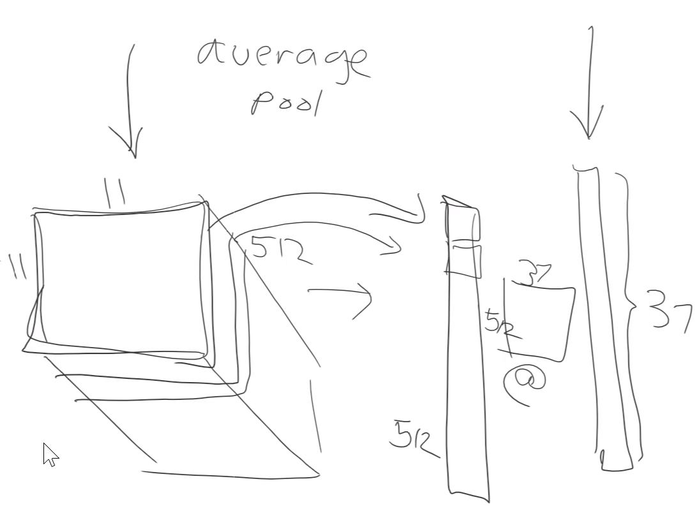

When we want to create heatmap to the picture best way is to average over 512 dimensions instead of 11x11 area. That way we get 11x11 area where every pixel is average of 512 pixels. Then we can see how much that pixel activated on average.

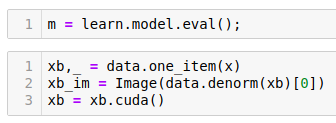

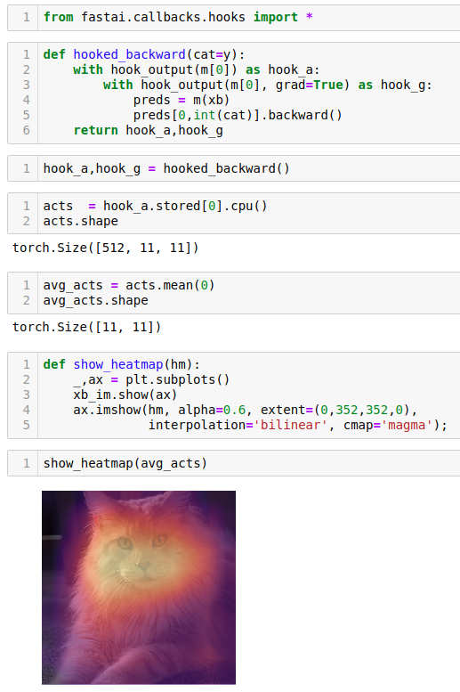

---

## Ethics and Data Science [[01:48:56](https://youtu.be/U7c-nYXrKD4?t=6536)]

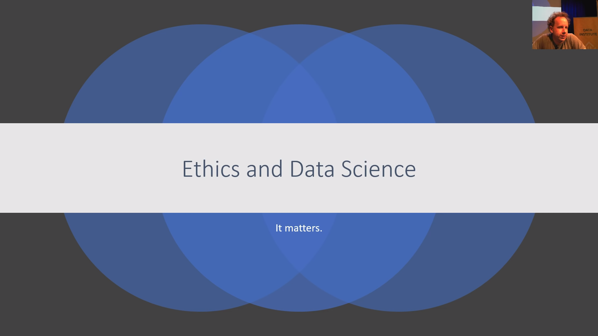

> TL;DR: It matters.

**Next lesson**

In the next lesson, we are going to be looking at generative models both text and image generative models. Generative models are where you can create a new piece of text or a new image or a new video or a new sound. As you probably are aware, this is the area that deep learning has developed the most in in the last 12 months. We are now at a point where we can generate realistic looking videos, images, audio and to some extent even text.

### Ethical principles and bias principles in AI

There are many things in this journey which have ethical considerations, but perhaps this area of generative modeling is one of the largest ones. So, before I got into it, I wanted to specifically touch on ethics and data science. Most of the stuff I'm showing you actually comes from Rachel, and Rachel has a really cool [TEDx San Francisco talk](https://youtu.be/LqjP7O9SxOM) that you can check out on YouTube. A more extensive analysis of ethical principles and bias principles in AI which you can find at this talk [here](https://youtu.be/WC1kPtG8Iz8), and she has a playlist that you can check out.

### Gender shades

We've already touched on an example of bias which was this gender shades study where, for example, lighter male skin people on IBM's main computer vision system are 99.7% accurate, and darker females are some hundreds of times less accurate in terms of error (so extraordinary differences). It is, first of all, important to be aware that not only can this happen technically, but this can happen on a massive companies rolled out publicly available highly marketed system that hundreds of quality control people have studied and lots of people are using. It's out there in the wild.


They all look kind of crazy, right? So it's interesting to think about why. One of the reasons why is that the data we feed these things. We tend to use, me included, a lot of these datasets kind of unthinkingly. But like ImageNet which is the basis of like a lot of the computer vision stuff we do is over half American and Great Britain.


When it comes to the countries that actually have most of the population in the world, I can't even see them here. They're somewhere in these impossibly thin lines. Because remember, these datasets are being created almost exclusively by people in US, Great Britain, and nowadays increasingly also China. So there's a lot of bias in the content we're creating, because of a bias in the people that are creating that content even when, *in theory*, it is being created in a very kind of neutral way, but you can't argue with the data. It's obviously not neutral at all.

### Biased algorithms


When you have biased data creating biased algorithms, you then need to ask "what are we doing with that?". We've been spending a lot of time talking about image recognition. A couple of years ago, this company DeepGlint advertised their image recognition system which can be used to do mass surveillance on large crowds of people, find any person passing through who is a person of interest in theory. So putting aside even the question of "is it a good idea to have such a system?" you kind of think "is it a good idea to have such a system where certain kinds of people are 300 times more likely to be misidentified?"


Then thinking about it, so this is now starting to happen in America—these systems are being rolled out. There are now systems in America that will identify a person of interest in a video and send a ping to the local police. These systems are extremely inaccurate and extremely biased. And what happens then, of course, is if you're in a predominantly black neighborhood where the probability of successfully recognizing you is much lower, and you're much more likely to be surrounded by black people, and so suddenly all of these black people are popping up as persons of interest, or in a video of a person of interest. All the people in the video are all recognized as in the vicinity of a person of interest, you suddenly get all these pings going off the local police department causing the police to run down there. Therefore likely to lead to a larger number of arrests, which is then likely to feedback into the data being used to develop the systems.

So this is happening right now. Thankfully, a very small number of people are actually bothering to look into these things. I mean ridiculously small, but at least it's better than nothing. One of the best ways that people get publicity is to do "funny" experiments like let's try the mug shot image recognition system that's being widely used and try it against the members of Congress, and find out that there are 28 black members of Congress who would have been identified by this system (obviously incorrectly).


We see this kind of bias in a lot of the systems we use, not just image recognition but text translation when you convert "She is a doctor. He is a nurse" into Turkish, you quite correctly get a gender inspecific pronoun because that's what Turkish uses. You could then take that and feed it back into Turkish with your gender in specific pronoun, and you will now get "He is a doctor. She is a nurse." So the bias, again, this is in a massively widely rolled out, carefully studied system. It's not like even these kind of things (a little one-off things) then get fixed quickly, these issues have been identified in Google Translate for a very long time, and they're still there. They don't get fixed.

The kind of results of this are, in my opinion, quite terrifying. Because what's happening is that in many countries including America where I'm speaking from now, algorithms are increasingly being used for all kinds of public policy, judicial, and so forth purposes.


For example, there's a system called COMPAS which is very widely used to decide who's going to jail. It does that in a couple of ways; it tells judges what sentencing guidelines they should use for particular cases, and it tells them also which people (the system says) should be let out on bail. But here's the thing. White people, it keeps on saying let this person out even though they end up reoffending, and vice versa. It's systematically out by double compared to what it should be in terms of getting it wrong with white people versus black people. So this is  kind of horrifying because, amongst other things, the data that it's using in this system is literally asking people questions about things like "did any of your parents ever go to jail?" or "do any of your friends do drugs?" They're asking questions about other people who they have no control over. So not only are these systems very systematically biased, but they're also being done on the basis of data which is totally out of your control. "Are your parents divorced?" is another question that's being used to decide whether you go to jail or not.

When we raise these issues on Twitter or in talks or whatever, there's always a few people (always white men) who will always say like "that's just the way the world is." "That's just reflecting what the data shows." But when you actually look at it, it's not. It's actually systematically erroneous. And systematically erroneous against people of color, minorities—the people who are less involved in creating the systems that these products are based on.

### Hate speech

Sometimes this can go a really long way. For example, in Myanmar there was a genocide of Rohingya people. That genocide was very heavily created by Facebook. Not because anybody at Facebook wanted it, I mean heavens no, I know a lot of people at Facebook. I have a lot of friends at Facebook. They're really trying to do the right thing. They're really trying to create a product that people like, but not in a thoughtful enough way. Because when you roll out something where literally in Myanmar—a country that maybe half of people didn't have electricity until very recently. And you say "hey, you can all have free internet as long as it's just Facebook", you must think carefully about what you're doing. Then you use algorithms to feed people the stuff they will click on. Of course what people click on is stuff which is controversial, stuff that makes their blood boil. So when they actually started asking the generals in the Myanmar army that were literally throwing babies onto bonfires, they were saying "we know that these are not humans. We know that they are animals, because we read the news. We read the internet." Because this is the stories that the algorithms are pushing. The algorithms are pushing the stories, because the algorithms are good. They know how to create eyeballs, how to get people watching, and how to get people clicking. Again, nobody at Facebook said let's cause a massive genocide in Myanmar. They said let's maximize the engagement of people in this new market on our platform.


They very successfully maximized engagement. It's important to note people warned executives of Facebook how the platform was being used to incite violence as far back as 2013, 2014, 2015. And 2015, someone even warned executives that Facebook could be used in Myanmar in the same way that the radio broadcast were used in Rwanda during the Rwandan genocide. As of 2015, Facebook only had four contractors who spoke Burmese working for them. They really did not put many resources into the issue at all, even though they were getting very very alarming warnings about it.

### Ethics is complicated


So why does this happen? The part of the issue is that ethics is complicated, and **you will not find Rachel or I telling you how to do ethics, how do you fix this—we don't know. We can just give you things to think about.** Another part of a problem we keep hearing is, it's not my problem, I'm just a researcher, I am just a techie, I'm just building a data set, I'm not part of a problem, I'm part of this foundation that's far enough away that I can imagine that I'm not part of this. But if you're creating ImageNet, and you want it to be successful, you want lots of people to use it, you want lots of people to build products on it, lots people to do research on top of it. If you're trying to create something that people are using, you want them to use, then please try to make it something that won't cause massive amounts of harm, and doesn't have massive amounts of bias.

It can actually come back and bite you in the arse. The Volkswagen engineer who ended up actually encoding the thing that made them systematically cheat on their diesel emissions tests on their pollution tests ended up in jail. Not because it was their decision to cheat on the tests, but because their manager told them to write their code, and they wrote the code. Therefore they were the ones that ended up being criminally responsible, and they were the ones that were jailed. So if you do, in some way, a crappy thing that ends up causing trouble, that can absolutely come back around and get you in trouble as well.


Sometimes it can cause huge amounts of trouble. If we go back to World War II, then this was one of the first great opportunities for IBM to show off their amazing tabulating system. And they had a huge client in Nazi Germany. And Nazi Germany used this amazing new tabulating system to encode all of the different types of Jews that they had in the country and all the different types of problem people. So Jews were 8, gypsies were 12, then different outcomes were coded; executions were 4, death in a gas chamber was 6.

A Swiss judge ruled that IBM was actively involved facilitating the commission of these crimes against humanity. There are absolutely plenty of examples of people building data processing technology that are directly causing deaths, sometimes millions of deaths. We don't want to be one of those people. You might have thought "oh you know, I'm just creating some data processing software" and somebody else is thinking "I'm just the sales person" and somebody else is thinking "I'm just the biz dev person opening new markets." But it all comes together. So we need to care.

### Myth of neutral platforms


One of the things we need to care about is getting humans back in the loop. When we pull humans out of the loop is one of the first times that trouble happens. I don't know if you remember, I remember this very clearly when I first heard that Facebook was firing the human editors that were responsible for basically curating the news that ended up on the Facebook pages. And I've got to say, at the time, I thought that's a recipe for disaster. Because I've seen again and again that humans can be the person in the loop that can realize this isn't right. It's very hard to create an algorithm that can recognize "this isn't right.". Or else, humans are very good at that. And we saw that's what happened. After Facebook fired the human editors, the nature of stories on Facebook dramatically changed. You started seeing this proliferation of **conspiracy theories**, and the kind of the algorithms went crazy with recommending more and more controversial topics. And of course, that changed people's consumption behavior causing them to want more and more controversial topics.

One of the really interesting places this comes in, Cathy O'Neil (who's got a great book called Weapons of Math Destruction) and many others have pointed out. What happens to algorithms is that they end up impacting people. For example, COMPAS sentencing guidelines go to a judge. Now you can say the algorithm is very good. I mean in COMPAS' case, it isn't. It actually turned out to be about as bad as random because it's a black box and all that. But even if it was very good, you could then say "well, the judge is getting the algorithm; otherwise they're just be getting a person—people also give bad advice. So what?". Humans respond differently to algorithms. It's very common, particularly for a human that is not very familiar with the technology themselves like a judge to see like "oh that's what the computer says.". The computer looked it up and it figured this out.

It's extremely difficult to get a non-technical audience to look at a computer recommendation and come up with a nuanced decision-making process. So what we see is that algorithms are often put into place with no appeals process. They're often used to massively scale up decision making systems because they're cheap. Then the people that are using those algorithms tend to give them more credence than they deserve because very often they're being used by people that don't have the technical competence to judge them themselves.


A great example was here's an example of somebody who lost their health care. They lost their health care because of an error in a new algorithm that was systematically failing to recognize that there are many people that need help with cerebral palsy and diabetes. So this system which had this error that was later discovered was cutting off these people from the home care that they needed. So that cerebral palsy victims no longer had the care they needed. So their life was destroyed basically.

When the person that created that algorithm with the error was asked about this and more specifically said should they have found a better way to communicate the system, the strengths, the failures, and so forth, he said "yeah, I should probably also dust under my bed.". That was the level of interest they had.

This is extremely common. I hear this all the time. And it's much easier to see it from afar and say "okay, after the problems happened I can see that that's a really shitty thing to say.". But it can be very difficult when you're kind of in the middle of it.

Rachel: I just want to say one more thing about that example. This was a case where it was separate; there was someone who created the algorithm, then I think different people implemented the software, and this is now in use in over half of the 50 states, then there was also the particular policy decisions made by that state. So this is one of those situations where nobody felt responsible because the algorithm creators are like "oh no, it's the policy decisions of the state that were bad.". And the state can be like "oh no, it's the ones who implemented the software" and so everyone's just kind of pointing fingers and not taking responsibility.

And you know, in some ways maybe it's unfair, but I would argue the person who is creating the data set and the person who is implementing the algorithm is the person best placed to get out there and say "hey here are the things you need to be careful of" and make sure that they are part of the implementation process.


We've also seen this with YouTube. It's similar to what happened with Facebook and we've heard examples of students watching the fast.ai courses who say "hey Jeremy and Rachel, watching the fast.ai courses, really enjoyed them and at the end of one of them the YouTube autoplay fed me across to a conspiracy theory.". What happens is that once the system decides that you like the conspiracy theories, it's going to just feed you more and more.

Rachel: Just briefly. You don't even have to like conspiracy theories. The goal is to get as many people hooked on conspiracy theories as possible is what the algorithms trying to do whether or not you've expressed interest.

The interesting thing again is I know plenty of people involved in YouTube's recommendation systems. None of them are wanting to promote conspiracy theories. But people click on them, and people share them, and what tends to happen is also people that are into conspiracy theories consume a lot more YouTube media. So it actually is very good at finding a market that watches a lot of hours of YouTube and then it makes that market watch even more.


So this is an example of a feedback loop. The New York Times is now describing YouTube as perhaps the most powerful radicalizing instrument of the 21st century. I can tell you my friends that worked on the YouTube recommendation system did not think they were creating the most powerful radicalizing instrument of the 21st century. And to be honest, most of them today when I talk to them still think they're not. They think it's all bull crap. Not all of them, but a lot of them now are at the point where they just feel like they're the victims here, people are unfairly … you know, they don't get it, they don't understand what we're trying to do. It's very very difficult when you are right out there in the heart of it.

So you've got to be thinking from right at the start. What are the possible unintended consequences of what you're working on? And as the technical people involved, how can you get out in front and make sure that people are aware of them.

Rachel: I just also need to say that in particular, many of these conspiracy theories are promoting white supremacy, they're kind of far-right etho-nationalism, anti-science, and i think maybe five or ten years ago, I would have thought conspiracy theories are more fringe thing, but we're seeing huge societal impact it can have for many people to believe these.

And you know, partly it's you see them on YouTube all the time, it starts to feel a lot more normal. So one of the things that people are doing to try to say how to fix this problem is to explicitly get involved in talking to the people who might or will be impacted by the kind of decision making processes that you're enabling.


For example, there was a really cool thing recently where literally statisticians and data scientists got together with people who had been inside the criminal system (i.e. had gone through the bail and sentencing process of criminals themselves) and talking to the lawyers who worked with them, and put them together with the data scientists, and actually put together a timeline of how exactly does it work, and where exactly the other places that there are inputs, and how do people respond to them, and who's involved.

This is really cool. This is the only way for you as a data product developer to actually know how your data product is going to be working.


A really great example of somebody who did a great job here was Evan Estola at Meetup who said "hey, a lot of men are going to our tech meetups and if we use a recommendation system naively, it's going to recommend more tech meetups to man, which is going to cause more men to go to them, and then when women do try to go, they'll be like "oh my god, there's so many men here" which is going to cause more men to go to the tech meetups. So showing recommendations to men, and therefore not showing them to women.

What Evan and meetup decided was to make an explicit product decision that this would not even be representing the actual true preferences of people. It would be creating a runaway feedback loop. So let's explicitly stop it before it happens, and not recommend less tech meetups women and more tech meetups to men. So I think it's really cool. It's like it's saying, we don't have to be slaves to the algorithm. We actually get to decide.

### Regulation


Another thing that people can do to help is regulation. Normally, when we talk about regulation, there's a natural reaction of like "how do you regulate these things? That's ridiculous—you can't regulate AI.". But actually when you look at it, again and again, and this fantastic paper called [Datasheets for Datasets](https://arxiv.org/abs/1803.09010) has lots of examples of this. There are many many examples of industries where people thought they couldn't be regulated, people thought that's just how it was. Like cars. People died in cars all the time because they literally had sharp metal knobs on dashboards, steering columns weren't collapsible, and all of the discussion in the community was "that's just how cars are" and when people died in cars, it's because of the people. But then eventually the regulations did come in. And today, driving is dramatically safer—dozens and dozens of times safer than it was before. So often there are things we can do through policy.

### Make the world a _better_ place


To summarize, we are part of the 0.3-0.5% of the world that knows how to code. We have a skill that very few other people do. Not only that, we now know how to code deep learning algorithms which is like the most powerful kind of code I know. So I'm hoping that we can explicitly think about at least not making the world worse, and perhaps explicitly making it better.

**You know about problems no one else knows about**


So why is this interesting to you as an audience in particular? That's because fast.ai in particular is trying to make it easy for domain experts to use deep learning. This picture of the goats here is an example of one of our international fellows from a previous course who is a goat dairy farmer and told us that they were going to use deep learning on their remote Canadian island to help study udder disease in goats.

To me, this is a great example of a domain experts problem which nobody else even knows about, let alone know that it's a computer vision problem that can be solved with deep learning. So in your field, whatever it is, you probably know a lot more now about the opportunities in your field to make it a hell of a lot better than it was before.

You're probably able to come up with all kinds of cool product ideas, maybe build a startup or create a new product group in your company or whatever. But also, please be thinking about what that's going to mean in practice, and think about:
- where can you put humans in the loop?
- where can you put those pressure release valves?
- who are the people you can talk to who could be impacted who could help you understand?

And get the humanities folks involved to understand history and psychology and sociology and so forth. That's our plea to you.

If you've got this far, you are definitely at a point now where you're ready to make a serious impact on the world. So, I hope we can make sure that that's a positive impact. See you next week. :clap: :clap: :clap:
