# Lesson 7 - ResNets, U-Nets, GANs and RNNs

_These are my personal notes from fast.ai Live (the new International Fellowship programme) course and will continue to be updated and improved if I find anything useful and relevant while I continue to review the course to study much more in-depth. Thanks for reading and happy learning!_

Live date: 13 Dec 2018, GMT+8

## Topics

* Residual Networks (ResNets)
* DenseNets
* U-Nets
* Image restoration
* Generative Adversarial Networks (GANs)
  * Wasserstein GAN (WGAN)
* Super resolution
  * Feature/perceptual loss function
* Recurrent Neural Networks (RNNs)
* What now?
* Coming up: part 2!
* AMA

## Lesson Resources

* [Course website](https://course.fast.ai/)
* [Lesson 5 video player](https://course.fast.ai/videos/?lesson=7)
* [Video](https://www.youtube.com/watch?v=DGdRC4h78_o)
* [Official resources and updates (Wiki)](https://forums.fast.ai/t/lesson-7-official-resources/32553)
* [Forum discussion](https://forums.fast.ai/t/lesson-7-in-class-chat/32554)
* [Advanced forum discussion](https://forums.fast.ai/t/lesson-7-further-discussion/32555)
* [FAQ, resources, and official course updates](https://forums.fast.ai/t/faq-resources-and-official-course-updates/27934)
* Jupyter Notebook and code
  * [lesson7-resnet-mnist.ipynb](https://nbviewer.jupyter.org/github/fastai/course-v3/blob/master/nbs/dl1/lesson7-resnet-mnist.ipynb)
  * [lesson7-superres-gan.ipynb](https://nbviewer.jupyter.org/github/fastai/course-v3/blob/master/nbs/dl1/lesson7-superres-gan.ipynb)
  * [lesson7-wgan.ipynb](https://nbviewer.jupyter.org/github/fastai/course-v3/blob/master/nbs/dl1/lesson7-wgan.ipynb)
  * [lesson7-superres.ipynb](https://nbviewer.jupyter.org/github/fastai/course-v3/blob/master/nbs/dl1/lesson7-superres.ipynb)
  * [lesson7-human-numbers.ipynb](https://nbviewer.jupyter.org/github/fastai/course-v3/blob/master/nbs/dl1/lesson7-human-numbers.ipynb)
  * [lesson7-superres-imagenet.ipynb](https://nbviewer.jupyter.org/github/fastai/course-v3/blob/master/nbs/dl1/lesson7-superres-imagenet.ipynb)

## Other Resources

### Papers

* Optional reading
  * [Deep Residual Learning for Image Recognition by Kaiming He et al.](https://arxiv.org/abs/1512.03385)
  * [Visualizing the Loss Landscape of Neural Nets by Hao Li et al.](https://arxiv.org/abs/1712.09913)
  * [The One Hundred Layers Tiramisu: Fully Convolutional DenseNets for Semantic Segmentation by Simon Jégou et el.](https://arxiv.org/abs/1611.09326)
  * [U-Net: Convolutional Networks for Biomedical Image Segmentation by Olaf Ronneberger et al.](https://arxiv.org/abs/1505.04597)
  * [A guide to convolutional arithmetic for deep learning by Vincent Dumoulin et al.](https://arxiv.org/abs/1603.07285)
  * [Perceptual Losses for Real-Time Style Transfer and Super-Resolution by Justin Johnson et al.](https://arxiv.org/abs/1603.08155)

### Other Useful Information

* [Interview with Jeremy at GitHub](https://www.youtube.com/watch?v=v16uzPYho4g)

### Useful Tools and Libraries

* [ipyexperiments](https://github.com/stas00/ipyexperiments/) - handy library from [@stas](https://forums.fast.ai/u/stas) that is even better than `gc.collect` at reclaiming your GPU memory.

## Assignments

* Run lesson 7 notebooks.
* Practice.
* Go back, watch the videos again
* See the [what now?](#so-what-now-015859) section

# My Notes

Welcome to lesson 7. The last lesson of part 1. This will be a pretty intense lesson. Don't let that bother you because partly what I want to do is to give you enough things to think about to keep you busy until part 2. In fact, some of the things we cover today, I'm not going to tell you about some of the details. I'll just point out a few things. I'll say like okay that we're not talking about yet, that we're not talking about yet. Then come back in part 2 to get the details on some of these extra pieces. So today will be a lot of material pretty quickly. You might require a few viewings to fully understand at all or a few experiments and so forth. That's kind of intentional. I'm trying to give you stuff to to keep you amused for a couple of months.

**Share your work**

I wanted to start by showing some cool work done by a couple of students; Reshama and Nidhin who have developed an Android and an iOS app, so check out [Reshma's post on the forum](https://forums.fast.ai/t/share-your-work-here/27676/679?u=hiromi) about that because they have a demonstration of how to create both Android and iOS apps that are actually on the Play Store and on the Apple App Store, so that's pretty cool. First ones I know of that are on the App Store's that are using fast.ai. Let me also say a huge thank you to Reshama for all of the work she does both for the fast.ai community and the machine learning community more generally, and also the [Women in Machine Learning](https://wimlworkshop.org/) community in particular. She does a lot of fantastic work including providing lots of fantastic documentation and tutorials and community organizing and so many other things. So thank you, Reshama and congrats on getting this app out there.

## ResNet MNIST [[00:02:12](https://youtu.be/nWpdkZE2_cc?t=132)]

The first notebook we'll look at is [lesson7-resnet-mnist.ipynb](https://nbviewer.jupyter.org/github/fastai/course-v3/blob/master/nbs/dl1/lesson7-resnet-mnist.ipynb). What I want to do is look at some of the stuff we started talking around last week around convolution and convolutional neural networks and start building on top of them to create a fairly modern deep learning architecture largely from scratch. When I say from scratch, I'm not going to reimplement things we're already know how to implement but kind of use the pre-existing PyTorch bits for those.

So we are going to use the MNIST dataset. As I read this in, I am going to show some more details about pieces of the Data Block API.

### Data Block API

We start by using the data block API one function at a time.

```python
il = ImageImageList.from_folder(path, convert_mode='L')
il.items[0]
```

```
PosixPath('/home/jhoward/.fastai/data/mnist_png/training/8/d65.png')
```

This saves the paths to the images.

```python
defaults.cmap='binary'
```

Normally when you show images those are in RGB and this time we want to use binary colormap so we can change it this way.

```python
il
```

```
ImageItemList (70000 items)
[Image (1, 28, 28), Image (1, 28, 28), Image (1, 28, 28), Image (1, 28, 28), Image (1, 28, 28)]...
Path: /home/jhoward/.fastai/data/mnist_png
```

Our image list contains 70K images and then we can see the shape of first five images and also where these images are from.

You want to include that unit axis at the start. Fastai will do that for you even if it is reading 1 channel images.

```python
il[0].show()
```

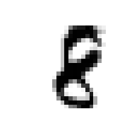

We can print certain images.

```python
sd = il.split_by_folder(train='training', valid='testing')
```

Then we need to define validation set. If you don’t have that, we need to tell it using `.no_split()` method to create kind of empty validation set. You can't skip it entirely. You have to say how to split and of the 2 options is no split.

```python
sd
```

```
ItemLists;

Train: ImageItemList (60000 items)
[Image (1, 28, 28), Image (1, 28, 28), Image (1, 28, 28), Image (1, 28, 28), Image (1, 28, 28)]...
Path: /home/jhoward/.fastai/data/mnist_png;

Valid: ImageItemList (10000 items)
[Image (1, 28, 28), Image (1, 28, 28), Image (1, 28, 28), Image (1, 28, 28), Image (1, 28, 28)]...
Path: /home/jhoward/.fastai/data/mnist_png;

Test: None
```

My split data is a training set and a validation set.

```python
ll = sd.label_from_folder()
```

Because our data is in folders where folder name tell what label items inside it want we can just use this function.

```python
ll
```

```
LabelLists;

Train: LabelList
y: CategoryList (60000 items)
[Category 8, Category 8, Category 8, Category 8, Category 8]...
Path: /home/jhoward/.fastai/data/mnist_png
x: ImageItemList (60000 items)
[Image (1, 28, 28), Image (1, 28, 28), Image (1, 28, 28), Image (1, 28, 28), Image (1, 28, 28)]...
Path: /home/jhoward/.fastai/data/mnist_png;

Valid: LabelList
y: CategoryList (10000 items)
[Category 8, Category 8, Category 8, Category 8, Category 8]...
Path: /home/jhoward/.fastai/data/mnist_png
x: ImageItemList (10000 items)
[Image (1, 28, 28), Image (1, 28, 28), Image (1, 28, 28), Image (1, 28, 28), Image (1, 28, 28)]...
Path: /home/jhoward/.fastai/data/mnist_png;

Test: None
```

Now we have also the labels.

```python
x,y = ll.train[0]
x.show()
print(y,x.shape)
```

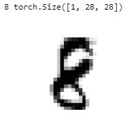

```python
tfms = ([*rand_pad(padding=3, size=28, mode='zeros')], [])
ll = ll.transform(tfms)
```

[[00:07:56](https://youtu.be/nWpdkZE2_cc?t=476)] Next thing we are going to add transforms but we don’t use normal `getTransforms()` function because we are doing digit recognition and we don't want to flip or rotate these, that will change the meaning of it. Also because these images are so small kind of doing zoom will make it fuzzy or unreadable. So normally for small images of digits like these, you just add a little bit of random padding. This empty array here is referring to the validation set transform. So no transform for the validation set.

```python
data = ll.databunch(bs=128).normalize()
```

Now we've got a transform LabelLists. We can pick a batch size and choose databunch, we can choose normalize. In this case, we are not using a pre-trained model. So there's no reason to use ImageNet stats here. So if you call `normalize()` like this without passing in stats, it will grab a batch of data at random and use that to decide what normalization stats to use. That's a good idea if you're not using a pre-trained model.

How many transform version of the image do you create? The answer is infinite. Each time we grab one thing from the dataset, we do a random transform on the fly. So potentially every one will look a bit different.

### Basic CNN with BatchNorm [[00:11:01](https://youtu.be/nWpdkZE2_cc?t=661)]

Let's start out creating a simple CNN simple convnet.

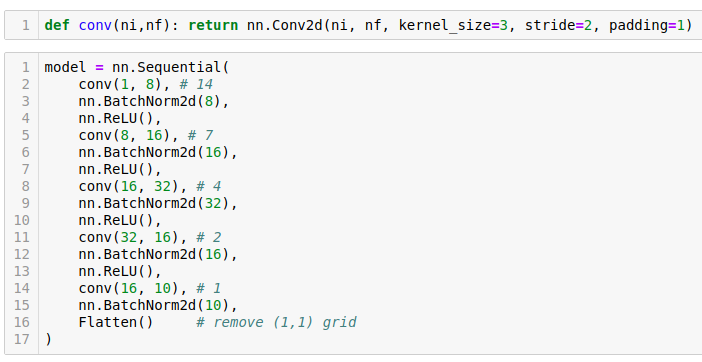

The code comment is grid size and it is halving the size because stride is 2 so the kernel is moving two pixels at a time.


Then we turn it into a learner.

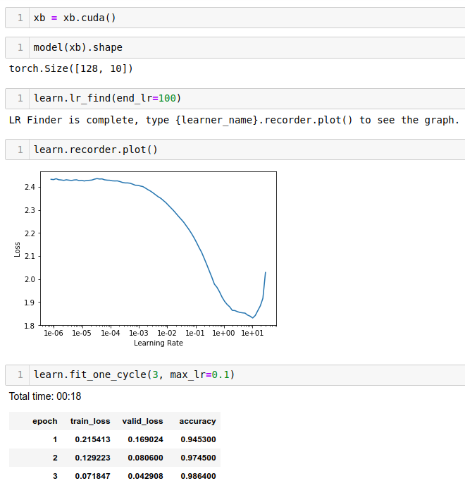

Train it. So that's how easy it is to create a pretty accuracte digit detector.

### Refactor [[00:15:42](https://youtu.be/nWpdkZE2_cc?t=942)]

Let's refactor that a little. Rather than saying conv, BatchNorm, ReLU all the time, fastai already has something called `conv_layer` which lets you create conv, BatchNorm, ReLU combinations. It has various options to do other tweaks to it, but the basic version is just exactly what I've showed you.

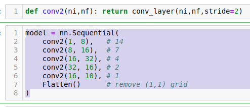

So we can refactor that like so. That's exactly the same neural net.

---

## Residual Network (ResNet) [[00:16:23](https://youtu.be/nWpdkZE2_cc?t=983)]

How can we improve this? What we really want to do is to create a deeper network. A very easy way to create a deeper network would be after every stride 2 conv, add a stride 1 conv. Because stride 1 conv doesn't change the feature map size at all. So you can add as many you like. But there's a problem.

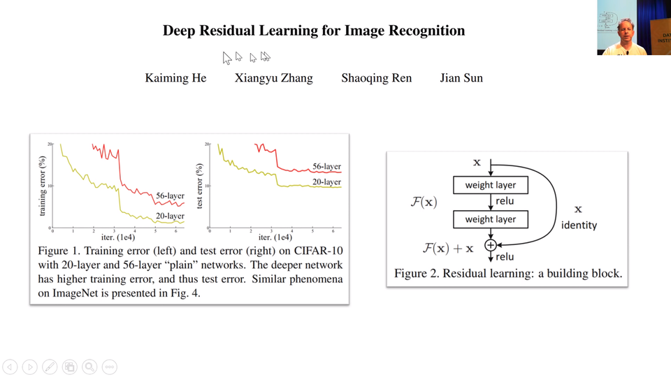

The problem was pointed out in this paper, very influential paper called ["Deep Residual Learning for Image Recognition" by Kaiming He and colleagues](https://arxiv.org/abs/1512.03385) then at Microsoft Research. They did something interesting. Let's look at the training error. So forget generalization even. Let's look at the training error of a network train on CIFAR-10 and let's try one network with 20 layers just basic 3x3 conv basically the same network I've showed you but without BatchNorm. So I train a 20-layer one and the 56-layer one on the training set. So the 56-layer one has a lot more parameters, it got a lot more this stride 1 convs in the middle. The one with a lot more parameters should seriously overfit. You would expect the 56-layer one to zip down to zero-ish training error pretty quickly. And that is not what happened. It is worst for the shallower network.

So when you see something wierd happen, really good researcher don't go "No it is not working.". They go "That's interesting.". Kaiming He said "That's interesting. What is going on?". He said "I don't know but what I do know is this. I could take this 56-layer network and make a new version of it which is identical but has to be at least as good as the 20-layer network and here's how. Every 2 convolutions, I am going to add together the input to those 2 convolutions, add it together with the result of those 2 convolutions.". In other words, he is saying instead of saying `output = c2(c1(x))`, instead he is saying `output = x + c2(c1(x))`. That 56-layer worth of convolutions in that.

His theory was has to be at least as good as the 20-layer version because it could always just set conv2 and conv1 to a bunch of weights for everything except for the first 20 layers because the _x_, the input can just go straight through. So this thing here as you can see called an identity connection. It's the "identity" function, nothing happen at all. It is also known as the skip connection.

So that was the theory. That is what the paper described as the intuition behind this is what would happen if we created something which has to train at least as well as the 20-layer neural network because it kind of contains the 20-layer neural network is literally a path you can skip over all the convolutions. So what happens? What happened was he won ImageNet that year. He easily won ImageNet that year and in fact today, we had that record breaking result on ImageNet speed training ourselves. You know in the last year, we used this too. ResNet has been revolutionary.

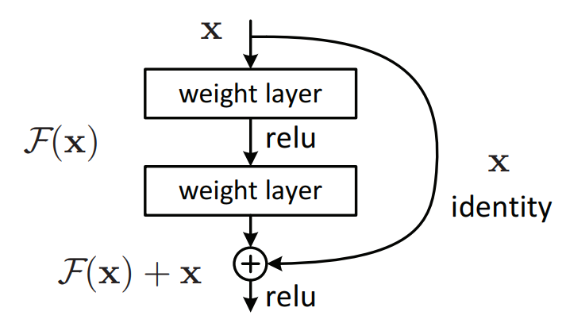

Here's a trick if you are interested to do novel research. Anytime you find some model for anything whether it's for medical image segmentation or some kind of GAN or whatever and that was written a couple of years ago, they might have forgoten to put ResBlock in. So replace their convolutional path with a bunch of ResBlock and you almost always get better results faster. It's a good trick.

## Visualizing the Loss Landscape of Neural Nets [[00:21;16](https://youtu.be/nWpdkZE2_cc?t=1276)]

At NeurIPS 2018, we saw a new presentation where they actually figured out how to visualize the loss surface of the neural net which is really cool. This is a fantastic paper, ["Visualizing the Loss Landscape of Neural Nets"](https://arxiv.org/abs/1712.09913). Anybody who is watching this lesson 7 is at the point they will understand most of the most important of concepts in this paper. You could read this now. You won't necessarily get all of it but I am sure you find it get enough to find it interesting.

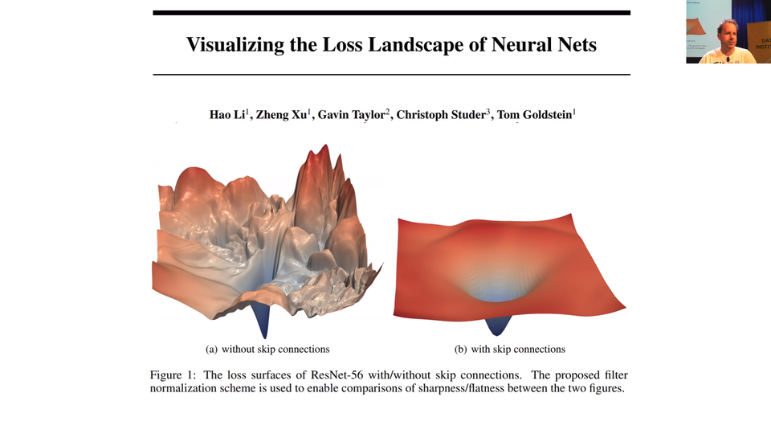

So the big picture was this one. Here's what happened.
These plots represent the loss function and as we can see adding skip connections will make it much simpler.

## ResNet-ish [[00:22:57](https://youtu.be/nWpdkZE2_cc?t=1377)]

```python
class ResBlock(nn.Module):
    def __init__(self, nf):
        super().__init__()
        self.conv1 = conv_layer(nf,nf)
        self.conv2 = conv_layer(nf,nf)

    def forward(self, x): return x + self.conv2(self.conv1(x))
```

In our code, we can create a ResBlock in just the way I described. We create a `nn.Module`. We create 2 `conv_layer`s. Remember that `conv_layer` is conv2d, ReLU, BatchNorm. Then in `forward`, we go `conv1` of `x`, `conv2` of that and then add `x`.

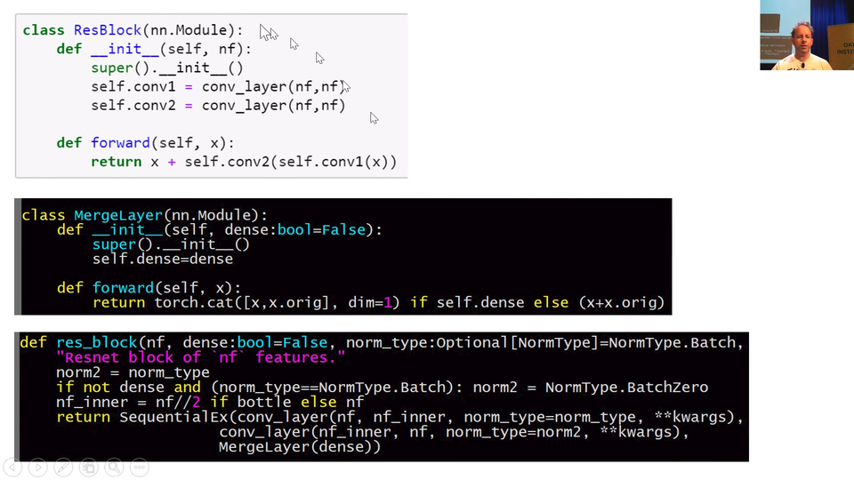

There is a `res_block` function already in fastai. So you can instead call `res_block` instead and you just pass in say how many filters you want.

```python
class MergeLayer(nn.Module):
    "Merge a shortcut with the result of the module by adding them or concatenating thme if `dense=True`."
    def __init__(self, dense:bool=False):
        super().__init__()
        self.dense=dense

    def forward(self, x): return torch.cat([x,x.orig], dim=1) if self.dense else (x+x.orig)

def res_block(nf, dense:bool=False, norm_type:Optional[NormType]=NormType.Batch, bottle:bool=False, **kwargs):
    "Resnet block of `nf` features."
    norm2 = norm_type
    if not dense and (norm_type==NormType.Batch): norm2 = NormType.BatchZero
    nf_inner = nf//2 if bottle else nf
    return SequentialEx(conv_layer(nf, nf_inner, norm_type=norm_type, **kwargs),
                      conv_layer(nf_inner, nf, norm_type=norm2, **kwargs),
                      MergeLayer(dense))
```

[[00:26:18](https://youtu.be/nWpdkZE2_cc?t=1578)] If you look at the definition of `res_block` in the fastai code, you'll see it looks a little bit different to this (notebook `ResBlock(nn.Module)`) and that's because I created something a MergeLayer. A MergeLayer is something which in the forward says `(x+x.orig)`. So you can see that something ResNet-ish going on here. What is `x.orig`? If you create a special kind of sequential model called a `SequentialEx`, this is like fastai `Sequential` extended. It's just like a normal sequential model but we store the input in `x.orig`. This here `SequentialEx(conv_layer(nf, nf_inner, norm_type=norm_type, **kwargs), conv_layer(nf_inner, nf, norm_type=norm2, **kwargs), MergeLayer(dense))` will do exactly the same as this (notebook `ResBlock(nn.Module)`). So you can create your own variations of ResNet block very easily with `SequentialEx()` and `MergeLayer()`.

---

## DenseNet [[00:27:21](https://youtu.be/nWpdkZE2_cc?t=1641)]

There's something else here which is when you create your MergeLayer, you can optionally set `dense=True`. What happen if you do? If you do, it doesn't go `x+x.orig`. It goes `torch.cat([x,x.orig])`. In other words, rather than putting a 'plus (_+_)' in this connection, it does a concatenate. That is pretty interesting because what happens is that you have your input coming in to your ResBlock and once you use concatenate instead of plus, it's not called a ResBlock anymore, it's called a DenseBlock. And it is not called a ResNet anymore, it is called a DenseNet. The DenseNet was invented about a year after the ResNet.

If you read the DenseNet paper, it can sounds incredibly complex and different, but actually it's literally identical but plus here is replaced with concat. So you have your input coming in to your DenseBlock.


_[:warning: WIP: incomplete video transcribe for this part :warning:]_

> TL;DR: DenseNets take a lot of memory because we need to store all these values but layers have a small amount of parameters. This is why you should try DenseBlocks with problems where you have a small dataset.

_:memo: New in fastai v1.0.37: `SequentialEx`, `MergeLayer`, and `res_block` to more easily create resnet and densenet architectures._

---

[[00:30:16](https://youtu.be/nWpdkZE2_cc?t=1816)]

> TL;DR: Jeremy is breaking the records for many different problems by applying modern techniques to old papers. He said that he thinks what the paper writers might have done differently if they would have access to the newest techniques.

## U-Net

[[00:30:51](https://youtu.be/nWpdkZE2_cc?t=1851)] So I have really been rebuilding this next architecture that we will look at called U-Net in a more modern style recently and got to a point now I keep showing you this [semantic segmentation paper](https://arxiv.org/abs/1611.09326) with the state-of-the-art for CamVid which was 91.5. This week I got it up to 94.1 using the architecture I am about to show you. So we keep pushing this further and further. It was really all about adding all of the modern tricks. Many of which I will show you today. Some of which we will see in part.

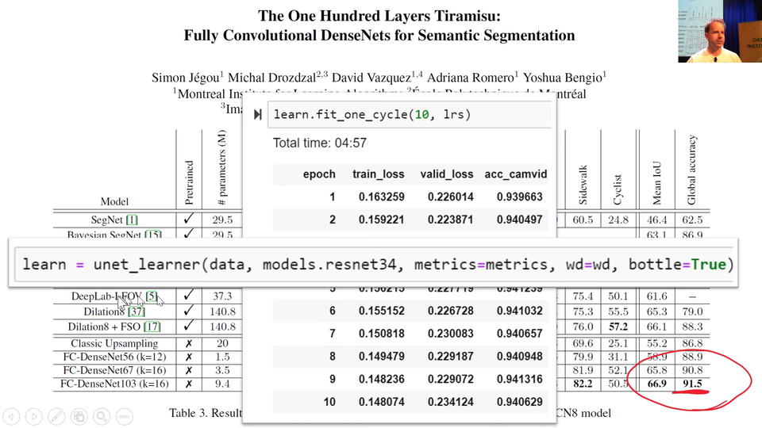

What we will do to get there is we are going to use this U-Net (`unet_learner`). We've use U-Net before. I've improved it a bit since then. So we've use it when we did the CamVid segmentation but we didn't understand what I was doing. So we're now in the position where we can understand what I was doing.

The first thing we need to do is kind of understand the basic idea of how you can do segmentation. If we go back to our [CamVid notebook](https://nbviewer.jupyter.org/github/fastai/course-v3/blob/master/nbs/dl1/lesson3-camvid.ipynb), remember what we was doing was basically taking these photos and adding a class to every single pixel. So we then go `data.show_batch` for something which is a `SegmentationItemList` it will automatically shows you these color coded pixels.

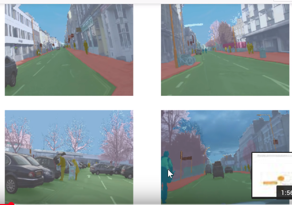

Here's the thing, in order to color code this as a pedestrian, but this as a bicyclist, it needs to know what it is. It needs to actually know what a pedestrian looks like. It needs to actually know where the pedestrian is. This is the arm of the pedestrian and not part of the shopping basket. It needs to really understand a lot about this picture to do this task. And it really does this task. When you look at the results of our top model, I can't see a single pixel by looking it by my eye, I know there are a few wrong but I can't see the ones that are wrong. It's that accurate. So how does it do that?

The way we are doing it to really really good results is not surprisingly using pre-training. So we start with ResNet-34 and you can see that:

```python
learn = unet_learner(data, models.resnet34, metrics=metrics, wd=wd)
```

and if you don't say `pretrained=False`, by default you get `pretrained=True`, why not.

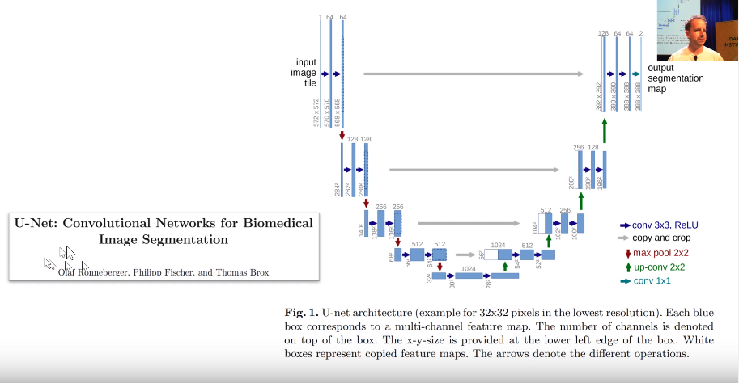

[[00:33:54](https://youtu.be/nWpdkZE2_cc?t=2034)] We start with ResNet-34 which starts with a big image. In this case, this was from the [U-Net paper](https://arxiv.org/abs/1505.04597).

> TL;DR: So the model starts with a normal image and then go through the layers of pre-build model.
> The U’s left side will be the pre-build model. It will reduce the size to pretty small. Then we increase our model on the right side and got the same size image we had when we started. We **increase size by doing stride half convolution a.k.a. deconvolution a.k.a. transpose convolution**.

There's a fantastic paper called ["A guide to convolutional arithmetic for deep learning"](https://arxiv.org/abs/1603.07285) that shows a great picture of exactly what is a 3x3 kernel stride half conv looks like and it's literally this.

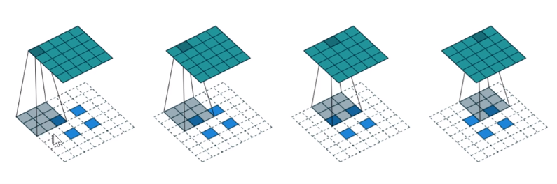

If you've a 2x2 input (the blue squares of the 2x2 input), you add not only 2 pixels of padding all around the outside but you also add a pixel of padding between every pixel.

We can see that because the padding is just zero we are calculating a lot of useless stuff that doesn’t affect anything. In worst cases, we have one out of nine non-zero value. I've showed that instead of adding zero padding we can use the same values multiple times.

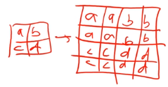

Other approach is to take a weighted average of the nearest pixels. This is not what fastai is doing and we will learn more about that in part 2. It's using **pixel shuffle** a.k.a. sub-pixel convolutions which isn’t much complex than this method but complex enough to take some time to understand.

What we have so far learned was something people did before U-Net. So they just first used a normal pre-trained model to make images small and then they increased it again using deconvolution. Problem was that how the model could reproduce the original image when it needs to start from a really small version. Some researchers invented that they could add skip connection and identity connection but rather than skipping two convolutions they made skips much bigger.


Gray lines represent the skip connections.

As you can see from the image, it is concatenating the layers instead of adding together. The left side of U is called encoder in fastai source code. One thing fastai is doing differently is that it takes input pixels and do skip connection from that to the end which is not shown in the original paper.

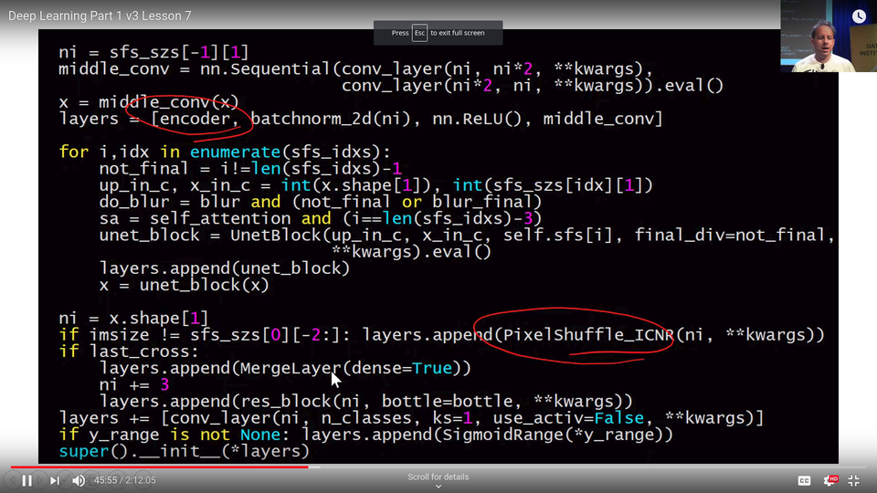

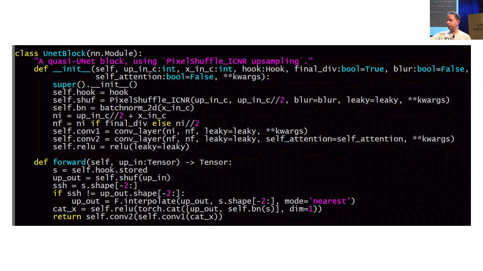

Fastai is using hooks to store activations from the pre-build model (a.k.a. encoder).

This is not just a great technique for image segmentation but also for other problems.

_[:warning: WIP: incomplete video transcribe for this part :warning:]_

**Image Restoration** [[00:48:31](https://youtu.be/nWpdkZE2_cc?t=2911)]

The next task we are going to look at is image restoration. We start with an image but instead of creating segmentation image we try to create a better quality image.

We start with low-resolution images where is writing top of them and purpose is to create high-resolution images where the text is removed.

[lesson7-superres-gan.ipynb](https://nbviewer.jupyter.org/github/fastai/course-v3/blob/master/nbs/dl1/lesson7-superres-gan.ipynb)

The easiest way to do this kind of dataset is to take some good images and _crappify_ those.

```python
def crappify(fn,i):
    dest = path_lr/fn.relative_to(path_hr)
    dest.parent.mkdir(parents=True, exist_ok=True)
    img = PIL.Image.open(fn)
    targ_sz = resize_to(img, 96, use_min=True)
    img = img.resize(targ_sz, resample=PIL.Image.BILINEAR).convert('RGB')
    w,h = img.size
    q = random.randint(10,70)
    ImageDraw.Draw(img).text((random.randint(0,w//2),random.randint(0,h//2)), str(q), fill=(255,255,255))
    img.save(dest, quality=q)
```

I’m not going to write the code again so if you are interested in the exact code look the video again or check the code from the lesson notebooks. It is just using this same method but for a little bit different task and in my opinion there is nothing really important.

_[:warning: WIP: incomplete video transcribe for this part :warning:]_

---

## Generative Adversarial Network (GAN)

[[00:58:26](https://youtu.be/nWpdkZE2_cc?t=3506)] We are not finish because we want this thing to look more like this thing. So how we're going to do that? The reason that we are not making as much progress with that as we like is that our loss function doesn't really describe what we want. Actually the mean squared error between the pixels of this and this is actually very small. If you actually think about it, most of the pixels are very nearly the right color. But we are missing the texture of the pillow and we are missing the eye balls entirely pretty much and we are missing the texture of the fur. We want some loss function that does a better job than pixel mean squared error loss of saying like is this a good quality picture of this thing. So there is a fairly general way of answering that question. It's something called a Generative Adversarial Network or GAN. A GAN tries to solve this problem by using a loss function that actually calls another model. Let me describe it to you.

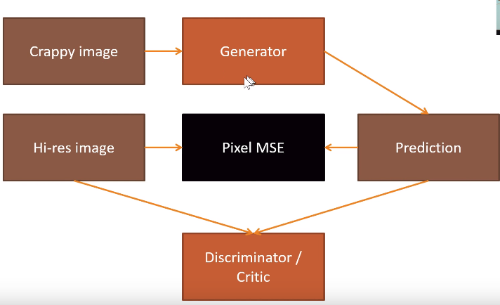

_[:warning: WIP: incomplete video transcribe for this part :warning:]_

We have a crappy image which we then run through generator and got a prediction. We are going to compare that to high-resolution image using MSE. This is not doing well because the pixel difference is not that big. It is looking something similar but details like cat eyes can be still blurry. That is why we build another model (discriminator a.k.a. critic) which is going to get both images and trying to predict is the picture original. Other words that are just classifier that we know how to build. Our plan is to create so good images that classifier mislabels those as real pictures. We are using critic as loss function. We first train generator to do as good images as plausible using MSE. Then we train critic to recognize which is generated using critic and continue this loop until model produces good results. This is called GAN. Idea is that both loss functions offer a different kind of things and using alternately we get better results than just choosing one.

When we are creating critic on our own we can’t use ResNet as a base model. We will learn more about that in part 2 but for now, just use `gan_critic()` function. There is also GAN learner in fastai which take generator and critic as input and train the model using those.

When we are training GAN both generator and critic loss will stay about the same because when other is doing better it will make other doing worst. The only way to look at how these are doing is to look at the results.

To get better results using GAN like in restoring task Jeremy showed a little trick. As we know every layer activations are finding some kind of features. So we put generative model output and _y_ image to ImageNet model and look how different the features are that models are recognizing. For example, if ImageNet model activations in layer 3 are recognizing cat eyes from the given image then the generative model should have also this feature recognizer in that layer. This way we can teach ImageNet model features to this other generative model and get much better results.

**Question**: For what kind of problems do you not want to use U-Net? [[01:14:48](https://youtu.be/nWpdkZE2_cc?t=4488)]

U-Net suffer when the size of your output is similar to the size of your input and kind of align with it. There's no point kind of having cross connections if that level of spatial resolution in the output isn't necessarily useful. So any kind of generative modelling and you know segmentation is kind of generative modelling. It's generating a picture which is a mask of the original objects. Probably anything that you want that kind of resolution of the output to be of the same fidelity of the resolution of the input. Obviously something like a classifier makes no sense. In a classifier, you just want the down-sampling path because at the end, you just want a single number which is like is it a dog or a cat or what kind of pet is it or whatever.

### Wasserstein GAN (WGAN) [[01:15:59](https://youtu.be/nWpdkZE2_cc?t=4559)]

Just before we leave GAN, I just mention there's another notebook you might be interested in looking at which is [lesson7-wgan.ipynb](https://nbviewer.jupyter.org/github/fastai/course-v3/blob/master/nbs/dl1/lesson7-wgan.ipynb). When GANs started a few years ago, people generally use them to kind of create images out of thin air which I personally don't think is a particularly useful or interesting thing to do. But it's a good research exercise I guess I don't know. We implemented this [WGAN paper](https://arxiv.org/abs/1701.07875) which is really the first one to do somewhat adequate job somewhat easily and you can see how to do that with the fastai library.

It is kind of interesting because the dataset we used is the LSUN bedroom dataset which we provided in our `URLs` as you can see has bedrooms, lot of bedrooms. The approach that we use in this case is to just say "can we create a bedroom?". What we actually do is that the input to the generator isn't an image that we clean up. We actually feed the generator random noise. Then the generator task is "can you turn random noise into something which the critic can't tell the difference between that output and the real bedroom?".

We are not doing any pre-training here or any of those stuffs that make it fast and easy. This is a very traditional approach. But you can see you still go `GANLearner.wgan` you know this kind of older style approach. You just pass the data in, the generator and critic in the usual way and you call fit. You will see in this case we have `show_image` on. After epoch 1, it's not creating great bedrooms or 2 or 3. You can really see in the early days these kind of GANs doesn't do a great job or anything. Eventually after a couple hours of training, producing somewhat like bedroom-ish things. So anyway it's notebook you can play with and have a bit of fun.

---

## Super Resolution

[[01:18:34](https://youtu.be/nWpdkZE2_cc?t=4714)] I was very excited when we got fastai to the point in the last week or so that we had GANs working in a way we're kind of API-wise we are far more concise and more flexible than any other library exists but also kind of dissapointed with they take a long time to train and the outputs are still like so so. The next was like can we get rid of GANs entirely. Obviously the better way is come out with better loss function. We want a loss function that does a good a job of saying this is a high quality image without having to go all the GAN trouble and preferably it also doesn't say high quality image but is an image that actually looks like it is meant to.

The real trick here comes back to this paper a couple of years ago, ["Perceptual Losses for Real-Time Style Transfer and Super-Resolution"]((https://arxiv.org/abs/1603.08155)) by Justin Johnson et al. created this thing they called perceptual losses. It's nice paper but I hate this term because is nothing perceptual about them. I would call them feature losses. So in fastai library, you'll see this refer to feature losses.

It shares something with GANs which is that after we go through our generator, which they called the image transform net and you can see they've got this kind of U-Net shape thing they didn't actually use U-Nets because at that time this came out nobody in machine learning world know about U-Nets. Nowadays of course we you U-Nets. Anyway something U-Net-ish. I should mention in this architecture where we have a down-sampling path followed by up-sampling path, the down-sampling path is very often called the **encoder** (as you saw in our code) and the up-sampling path is very often called the **decoder**.

In generative models, generally including generative text models, neural translation stuffs like that, they tend to be called the encoder and the decoder. We have this generator and we want a loss function that says "is the thing that is created like the thing that we want?". The way they do that is they take the predictions (remember _y_hat_ is what we normally use for a prediction from a model) and they put it through pre-trained ImageNet network. At the time that this came out, the pre-trained ImageNet network that we're using was VGG. It's kind of old now but people still tend to use it cause it works fine for this process. So they take the predictions and put it through VGG pre-trained ImageNet network. It doesn't matter much which one it is.

Normally the output of that will tell you "is this generated thing a dog or a cat or an aeroplane or a fire engine or whatever?". But in the process of getting to that final classification, it goes through many different layers. In this case, they color coded all the layers with the same grid size and the feature maps were the same color. So everytime we switch colors, we've switching grid size. There is a stride 2 conv or in VGG case they still used to use some max pooling layers which is kind of similar idea. What we could do is, let's not take the final output of the VGG model on this generated image but let's take something in the middle. Let's take the activations of some layer in the middle. The activations might be a feature map of like 256 channels by 28 by 28. Those 28x28 grid cells would kind of roughly semantically say things like "in this part of 28x28 grid is something that kind of look fury or is something that kind of look shiny or is something that look kind of circular or is something that look like eyeball or whatever.". We then take the target (the actual _y_ value) and we put it through the same pre-trained VGG network and we pull out the activations of the same layer and then we do a mean squared error comparison. It will say like "in the real image, grid cell 1 1 of that 28x28 feature map is fury and blue and round shape and in the generated image, it's fury and blue and not round shape.". So it's like an OK, matched. That ought to go a long way towards fixing our eyeball problem because in this case, the feature map is going to say "there's eyeballs here but there isn't here.". So do a better job at that place make better eyeballs. That is the idea. That's what we called feature losses or Johnson et al. called perceptual losses.

[[01:23:52](https://youtu.be/nWpdkZE2_cc?t=5032)] So to do that, we are going to use the [lesson7-superres.ipynb](https://nbviewer.jupyter.org/github/fastai/course-v3/blob/master/nbs/dl1/lesson7-superres.ipynb). This time the task we are going to do is kind of the same as the previous task but I wrote this notebook a little bit before the GAN notebook before I came out with the idea of like putting text on a version of random JPEG quality. The JPEG quality is always 60. There's no text written on top and is 96x96. Before I realized what a great word "crappify" is. So it's called resize.

`FeatureLoss` class:
- hook outputs
- make features
- forward pass
  - feature losses

_[:warning: WIP: incomplete video transcribe for this part going through the notebook :warning:]_

[[01:33:14](https://youtu.be/nWpdkZE2_cc?t=5594)] It's really exciting to think what could you do with that? One of the inspirations here has been a guy called Jason Antic. Jason was a student in the course last year. What he did very sensibly was decide to focus basically nearly quit his job and work 4 days a week or really 6 days a week studying deep learning and you should do, he created kind of capstone project. His project was to combine GANs and feature losses together. His "crappification" approach was to take color pictures and make it black and white. He took the whole ImageNet, created the black and white ImageNet and then trained the model to recolorize it and he put this up as [DeOldify](https://github.com/jantic/DeOldify). Now he got this actual old photos from the 19th century that he's turning into color. What this is doing is incredible.

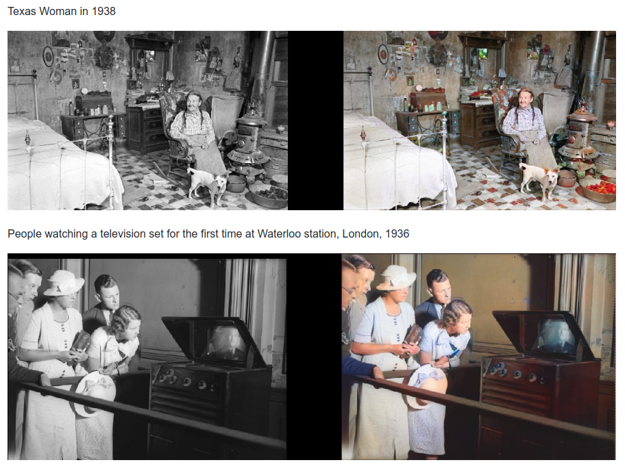

_[:warning: WIP: incomplete video transcribe for this part :warning:]_

**Question**: Is it possible to use similar ideas to U-Net and GANs for NLP? For example if I want to tag the verbs and nouns in a sentence, or create a really good Shakespeare generator? [[01:35:54](https://youtu.be/nWpdkZE2_cc?t=5754)]

Yeah, pretty much. We don't fully know yet. It's a pretty new area. There's a lot of opportunities there. We would be looking at some in a moment actually.

_[:warning: WIP: incomplete video transcribe for this part :warning:]_

---

## What We Learned So Far [[01:37:00](https://youtu.be/nWpdkZE2_cc?t=5820)]

Here is what we learned so far in the course, some of the main thing.

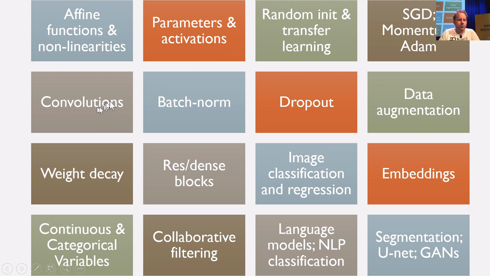

We've learned that neural nets consist of sandwich layers of affine functions which is basically matrix multiplications likely more general version and non-linearities like ReLU. We learned that the results of those calculations are called activations and the things that go into those calculations are called parameters. The parameters are initially randomly initialized or we copy them over from the pre-trained model and then we train them with SGD or faster versions (Momentum, Adam). We learned that convolutions are particular affine functions that worked great for auto-correlated data things like images and stuffs. We learned about Batch-norm, dropout, data augmentation, weight decay as ways of regularizing models and also Batch-norm helps train model quickly. Today we learned about Res/dense blocks. We've obviously learned about image classification and regression, embeddings, categorical and continuous variables, collaborative filtering, language models and NLP classification and then kind of segmentation and U-Net and GANs.

So go over these things and make sure you feel comfortable with each of them. If you only watch these series once, you definitely won't, people normally watch you know 3x or so to really understand the detail.

---

## Recurrent Neural Network (RNN) [[01:38:31](https://youtu.be/nWpdkZE2_cc?t=5911)]

One thing that doesn't get here is RNNs. So that's the last thing. We're going to do RNNs.

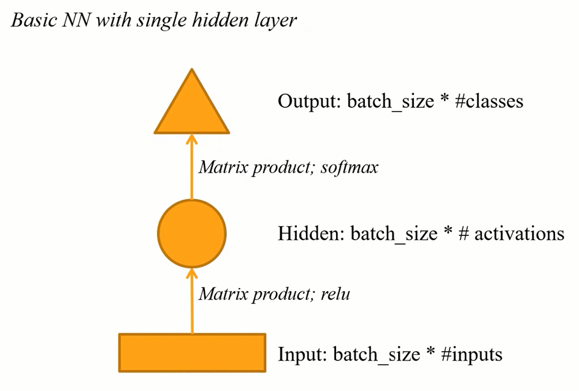

_[:warning: WIP: incomplete video transcribe for this part :warning:]_

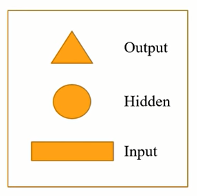

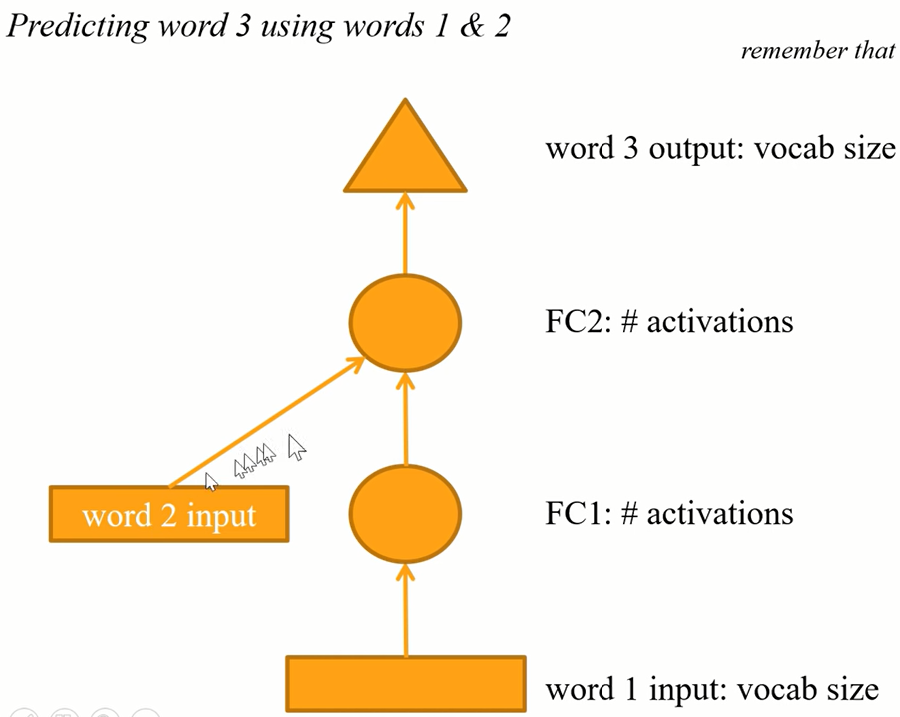


Model is doing the same thing and yellow arrows could (or actually should) use the same weights.

_[:warning: WIP: incomplete video transcribe for this part :warning:]_

This is what we're going to build. We're now going to jump into Human numbers which is [lesson7-human-numbers.ipynb](https://nbviewer.jupyter.org/github/fastai/course-v3/blob/master/nbs/dl1/lesson7-human-numbers.ipynb). This is the dataset I created which literally contains all the numbers from 'one' to 'nine thousand nine hundred ninety nine' written out in English. We are trying to create a language model that can predict the next word in this document. It's just a toy example for this purpose. In this case, we only have one document. That one document has a list of numbers. _[:warning: WIP: incomplete video transcribe for this part :warning:]_

```python
train = TextList(train_txt, path=path)
valid = TextList(valid_txt, path=path)

src = ItemLists(path=path, train=train, valid=valid).label_for_lm()
data = src.databunch(bs=bs)
```

```python
train[0].text[:80]
```

```
'xxbos one , two , three , four , five , six , seven , eight , nine , ten , eleve'
```

```python
len(data.valid_ds[0][0].data)
```

```
13017
```

```python
data.bptt, len(data.valid_dl)
```

```
(70, 3)
```

_[:warning: WIP: incomplete video transcribe for this part :warning:]_

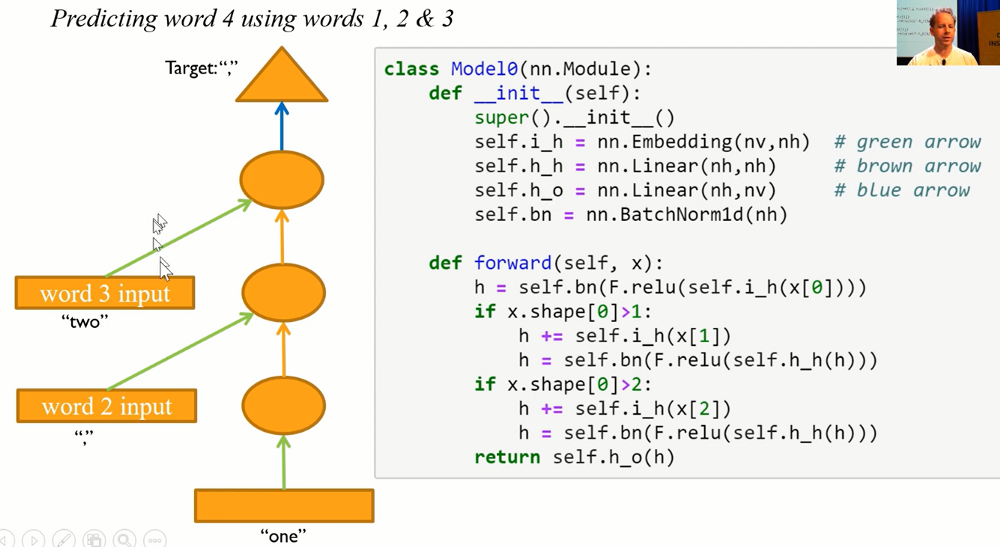


Same thing with a loop:

```python
class Model1(nn.Module):
    def __init__(self):
        super().__init__()
        self.i_h = nn.Embedding(nv,nh)  # green arrow
        self.h_h = nn.Linear(nh,nh)     # brown arrow
        self.h_o = nn.Linear(nh,nv)     # blue arrow
        self.bn = nn.BatchNorm1d(nh)

    def forward(self, x):
        h = torch.zeros(x.shape[0], nh).to(device=x.device)
        for i in range(x.shape[1]):
            h = h + self.i_h(x[:,i])
            h = self.bn(F.relu(self.h_h(h)))
        return self.h_o(h)
```

Code is also the same but this time there is a loop.

_[:warning: WIP: incomplete video transcribe for this part :warning:]_

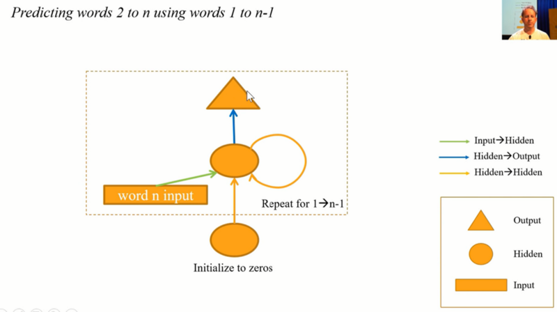

Multi fully connected model:

```python
class Model2(nn.Module):
    def __init__(self):
        super().__init__()
        self.i_h = nn.Embedding(nv,nh)
        self.h_h = nn.Linear(nh,nh)
        self.h_o = nn.Linear(nh,nv)
        self.bn = nn.BatchNorm1d(nh)

    def forward(self, x):
        h = torch.zeros(x.shape[0], nh).to(device=x.device)
        res = []
        for i in range(x.shape[1]):
            h = h + self.i_h(x[:,i])
            h = F.relu(self.h_h(h))
            res.append(self.h_o(self.bn(h)))
        return torch.stack(res, dim=1)
```

Maintain state:

```python
class Model3(nn.Module):
    def __init__(self):
        super().__init__()
        self.i_h = nn.Embedding(nv,nh)
        self.h_h = nn.Linear(nh,nh)
        self.h_o = nn.Linear(nh,nv)
        self.bn = nn.BatchNorm1d(nh)
        self.h = torch.zeros(bs, nh).cuda()

    def forward(self, x):
        res = []
        h = self.h
        for i in range(x.shape[1]):
            h = h + self.i_h(x[:,i])
            h = F.relu(self.h_h(h))
            res.append(self.bn(h))
        self.h = h.detach()
        res = torch.stack(res, dim=1)
        res = self.h_o(res)
        return res
```

_[:warning: WIP: incomplete video transcribe for this part :warning:]_


PyTorch `nn.RNN`:

```python
class Model4(nn.Module):
    def __init__(self):
        super().__init__()
        self.i_h = nn.Embedding(nv,nh)
        self.rnn = nn.RNN(nh,nh, batch_first=True)
        self.h_o = nn.Linear(nh,nv)
        self.bn = BatchNorm1dFlat(nh)
        self.h = torch.zeros(1, bs, nh).cuda()

    def forward(self, x):
        res,h = self.rnn(self.i_h(x), self.h)
        self.h = h.detach()
        return self.h_o(self.bn(res))
```

2-layer GRU:

```python
class Model5(nn.Module):
    def __init__(self):
        super().__init__()
        self.i_h = nn.Embedding(nv,nh)
        self.rnn = nn.GRU(nh, nh, 2, batch_first=True)
        self.h_o = nn.Linear(nh,nv)
        self.bn = BatchNorm1dFlat(nh)
        self.h = torch.zeros(2, bs, nh).cuda()

    def forward(self, x):
        res,h = self.rnn(self.i_h(x), self.h)
        self.h = h.detach()
        return self.h_o(self.bn(res))
```

[[01:55:42](https://youtu.be/nWpdkZE2_cc?t=6942)] One of the nice things about `nn.RNN` is that you now now say how many layers you want. Here I got to do it with 2 layers (`nn.GRU(nh, nh, 2, batch_first=True)`).


But here's the thing, when you think about this, think about it without the loop.


It looks like this. It's like keeps on going and we got a bptt of 20. So there's 20 layers of these. We know from the "Visualizing the loss landscape" paper that deep networks have awful bumpy loss surfaces. So when you start creating a long time scales and multiple layers, this things get impossible to train. There are few tricks you can do. One thing is to add skip connections of course.

What people normally do instead, they put inside, instead of adding this together, they actually use a mini neural net to decide how of the grean arrow to keep and how much of the orange arrow to keep. When you do that, yo get something is either called a GRU or an LSTM depending on the details of that neural net and we will learn about the details of those neural nets in part 2. They really don't matter though frankly. We can now say let's create a GRU instead just like what we had before but it will handle longer sequences in deep networks. Let's use 2 layers. And we are up to ~~75%~~ 81%.

```python
learn = Learner(data, Model5(), metrics=accuracy)

learn.fit_one_cycle(10, 1e-2)
```

```
epoch train_loss  valid_loss  accuracy
1     2.844157    2.208182    0.464037
2     1.763201    1.457846    0.639355
3     0.903733    0.895527    0.795651
4     0.438046    1.318675    0.804441
5     0.231886    1.034801    0.831708
6     0.122585    1.063450    0.836237
7     0.070774    1.039039    0.842596
8     0.039526    1.278373    0.817528
9     0.030600    1.235282    0.828309
10    0.022171    1.449146    0.809551
```

> TL;DR: This technique can be used for text labeling but also for many other tasks.

_[:warning: WIP: incomplete video transcribe for this part :warning:]_

## So what now? [[01:58:59](https://youtu.be/nWpdkZE2_cc?t=7139)]

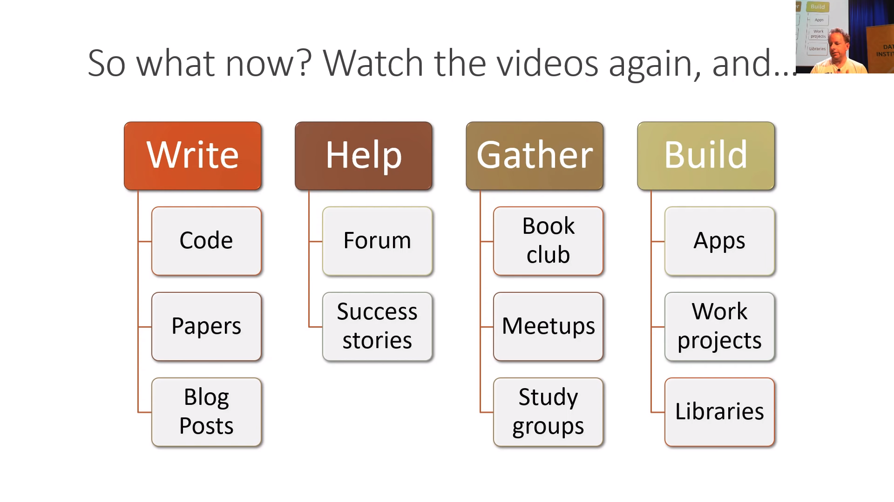

OK. So that's it! That's Deep Learning or at least the kind of the practical pieces from my point of view. Having watched this one time you won't get it all. I do recommend you do watch this so slowly you get it all the first time. Go back, look at it again, take your time and there will be bits like you will go "oh, now I see what you're saying." and then you could implement things you couldn't implement before and you will be able to digging more than before.

Definitely go back and do it again. As you do, write code not just for yourself but put it on GitHub. It doesn't matter if you think is great code or not. The fact that you are writing code and sharing it is impressive and the feedback you'll get tell if you tell people on the forum, you know "hey I wrote this code, it's not great but it's my first effort, anything you see jump out at you.". People will say like "oh that bit was done well, hey but did you know for this bit you could use this library and save some time.". You'll learn a lot by interacting with your peers.

As you noticed, I started introducing more and more papers. Now part 2 will be more papers. It's **a good time to start reading some of the papers that have been introduced in this section. All the bits that say like derivations and theorems or lemmas, you can skip them. I do. They add almost nothing to your understanding of practical deep learning.** But the bits that say like why are we solving this problem and what are the results so forth are really interesting.

Try and write English prose. Not English prose that you want to be read by Geoff Hinton and Yann LeCun but English prose you want to be written read by you as of 6 months ago. Because there's lot more people in the audience of you as of 6 months ago than there is of Geoffrey Hinton and Yann LeCun. That's the person you best understand. You know what they need.

Go and get help and help others. Tell us about your success stories. Perhaps the most important ones are get together with others. People learning got so much better if you got that social experience. So start a book club, get involved in Meetups, create study groups and build things. And again it doesn't have to be amazing. Build something like you think the world would be a little bit better if that work existed or you think be kind of slightly delightful to your 2 year old to see that thing or you just want to show it to your brother the next time they come around to see what you're doing whatever. Just finish something. You know finish something. Then try to make it a little better.

For example, something I just saw this afternoon is the [Elon Musk tweet generator](https://forums.fast.ai/t/share-your-work-here/27676/710?u=cedric). Looking at lots of older Tweets, creating a language model from Elon Musk and then creating new Tweets such as "humanity will also have an option to publish on its journey as an alien civilization. it will always like all human being.", "Mars is no longer possible. with the weather up to 60% it is now a place where most human water deaths are in winter.", "AI will definitely be the central intelligence agency. if it can contact all about the core but this is how we can improve the pace of fighthing of humanity in the future". This is great. I love this. And I love that Dave Smith wrote and said "these are my first commits ever were today. Thanks for teaching a finance guy how to build an app in 8 weeks.". I think this is awesome. I think like clearly a lot of care and passion have been put into this project. Will it systematically change the future direction of society as a whole? May be not? But may be Elon will look at this and go "oh may be I need to rethink my method or pros". :laughing: :laughing: :laughing: I think it's great. Yeah, create something! Put it out there, put a little bit of yourself into it or get involve in fastai.

The fastai project there's a lot going on. You know you can help the documentation and test which might sound boring but you will be surprised how incredibly not boring it is like take a piece of code that hasn't been properly documented and research it and understand it and ask Sylvain and I on the forum what's going on? What did you write it this way? We'll send you off to the papers we're implementing. Writing the test required deeply understanding that part of the machine learning well to really understand how it is meant to work. So that's what we are interesting. [Stas Beckman](https://forums.fast.ai/u/stas) has created this nice [Dev Projects Index](https://forums.fast.ai/t/dev-projects-index/29849) which you can like go on to the forum in the "dev projects" section and find like "here's some stuffs going on you might get involve in." or may be there are stuff you want exist you might add your own.

Create a study group. Deena is already create a study group for San Francisco starting in January. This is how easy to create a study group. Go on the forum, find your little time zone sub-category and a post say "let's create a study group". Make sure you give people a Google Sheets to sign up, someway to actually do something. A great example is [Pierre](https://forums.fast.ai/t/deep-learning-brasilia-licao-8/18540) who is doing a fantastic job in Brazil of running a study group for the last couple of parts of the course.

### Coming up: part 2! Cutting Edge Deep Learning [[02:04:46](https://youtu.be/nWpdkZE2_cc?t=7486)]

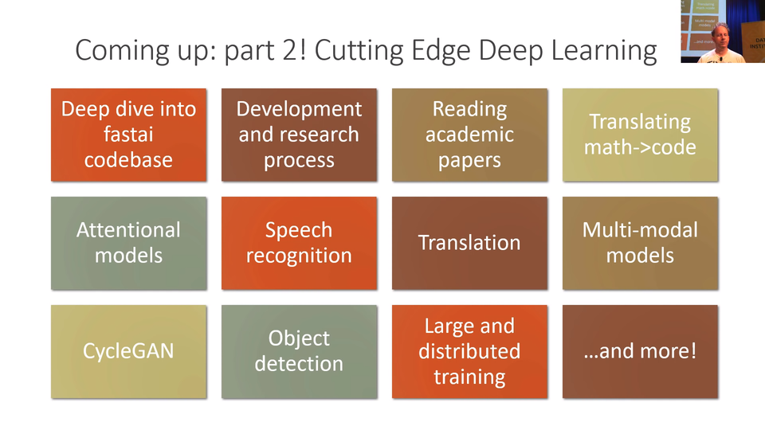

Then come back for part 2 where will be looking at all these interesting stuffs in particular going deep into fastai codebase to understand how did we build exactly. We will actually go through as we are building it, we created notebooks of like here is where we were of each day. We will actually see the software development process itself. We talk about the process of doing research, how to read academic papers, how to turn math into code and then a whole bunch of additional types of models that we haven't seen yet. So we will be kind of like going beyond practical deep learning into actually cutting edge research.

### Ask Me Anything (AMA)

We got 5 minutes to take some questions. We had an [AMA](https://forums.fast.ai/t/jeremy-ama/32551) going on online. We going to have some time for a couple of the highest rank questions from the community.

Rachel: [What’s your typical day like? How do you manage your time across so many things that you do?](https://forums.fast.ai/t/jeremy-ama/32551/54) [[02:05:39](https://youtu.be/nWpdkZE2_cc?t=7539)]

I hear that all the time. I thought I should answer it and it got a few votes. People who have come to our study group are always shock at how disorganized and incompetant I am. So I often hear people saying like "Oh wow I thought you are like this deep learning role model when I get to see be liked you. Now I'm not sure to be liked you at all.". :laughing: :laughing: :laughing: For me it's all about just to have a good time with it. I never have many plans. I just want to finish what I start. If you not having fun with it, it's really hard to continue because there's a lot of frustration in deep learning because it's not like running a web app where it's like "authentication, check, backend service watchdog, check, ok user credentials, check.", like you are making progress. Where else for stuff like these GAN stuff that we've been doing a couple of weeks is just like it's not working, it's not working, it also didn't work, it also didn't work. "I can tell it's amazing, OMG it's a cat.". That's kind of what is. You don't get that kind of regular feedback. You gotta have fund with it. My day is kind of I don't do any meetings, I don't do coffees, I don't watch TV, I don't play computer games. I spend lots of time with my family, lots of time exercising, lots of time reading and coding and doing things I like. The main thing is just finish something like properly finish it. So when you get to that point when you think 80% through, you haven't quite created the README yet and the install process is still a bit clunky. This is what 99% of GitHub projects look like. You'll see the README says, "TODO complete baseline experiments, document, blah blah blah.". Don't be that person. Just do something properly and finish it. May be get some other people around you to work with you so you're doing it together and you know, get it done.

Rachel: What are the up and coming DL/ML things (algorithms, techniques, papers, etc) that you are most excited about? You’ve mentioned last year that you were not a believer in reinforcement learning, do you still feel the same way? [[02:08:21](https://youtu.be/nWpdkZE2_cc?t=7701)]

I still feel exactly the same way as I did 3 years ago when we started this which is it's all about transfer learning, it's under appreciated, it's under research. Everytime we put transfer learning into everything, we make it much better. Our academic paper on transfer learning for NLP has helped be one piece of changing the direction of NLP this year. Made it all the way to New York Times. Just a stupid obvious little thing that we threw it together. I remain excited about that. I remain unexcited about Reinforcement Learning for most things. I don't see it use by normal people for normal things for nearly anything. It's incredibly inefficient way to solve problems which often solve more simply, more quickly in other ways. Probably has a may be a role in the world but a limited one and not in most peoples day-to-day work.

Rachel: For someone planning to take part 2, what would you recommend doing/learning/practicing until the part 2 course starts? [[02:09:37](https://youtu.be/nWpdkZE2_cc?t=7777)]

Just code. **Just code all the time.** I know it's perfectly possible. I hear from people who get to this point of the course and they haven't written any code yet and if that's you, it's OK. You know, you've just go through and do it again and this time do code. Look at the shape of your inputs, look at your outputs and make sure you know how to grab a mini batch, look at its main standard deviation and plot it. There's so much material that we've covered. If you can get to a point where you can rebuild those notebooks from scratch without too much cheating. When I said from scratch, use the fastai library, not from scratch from scratch. You'll be in the top edge of practitioners because you'll be able to do all of these things yourself. And that's really really rare. And that will put you in a great position to part 2.

Rachel: Where do you see the fastai library going in the future? Say in 5 years?  [[02:10:50](https://youtu.be/nWpdkZE2_cc?t=7850)]

Well like I say, I don't make plans. I just piss around. I mean our only plan for fastai as an organization is to make Deep Learning accessible as a tool for normal people to use for normal stuff. So as long we need to code, we failed that because 99.8% of the world can't code. The main goal would be to get to a point where it's not a library but a piece of software that doesn't required code. It certainly shouldn't require a lenghty hardworking course like this one. I want to get rid of the course, get rid of the code. I want to make it so you can do usual stuff quickly and easily. That's may be 5 years, may be longer.

Alright. I hope to see you back here for part 2. Thank you. :clap: :clap: :clap:
