# Lesson 10 - Transfer Learning for NLP and NLP Classification

_These are my personal notes from fast.ai course and will continue to be updated and improved if I find anything useful and relevant while I continue to review the course to study much more in-depth. Thanks for reading and happy learning!_

## Topics

* Jump into NLP.
  * Start with an introduction to the new fastai.text library.
  * Cover a lot of the same ground as lesson 4.
* How to get much more accurate results, by using transfer learning for NLP.
* How pre-training a full language model can greatly surpass previous approaches based on simple word vectors.
  * Use language model to show a new state of the art result in text classification.
* How to complete and understand ablation studies.

## Lesson Resources

* [Website](http://course.fast.ai/lessons/lesson10.html)
* [Video](https://youtu.be/h5Tz7gZT9Fo)
* [Wiki](http://forums.fast.ai/t/part-2-lesson-10-wiki)
* Jupyter Notebook and code
  * [imdb.ipynb](https://nbviewer.jupyter.org/github/fastai/fastai/blob/master/courses/dl2/imdb.ipynb)
* Dataset
  * [IMDB large movie reviews](http://ai.stanford.edu/~amaas/data/sentiment/) / [direct download link](http://ai.stanford.edu/~amaas/data/sentiment/aclImdb_v1.tar.gz)
* [Slides](http://files.fast.ai/part2_2/lesson10_2.pptx)

## Assignments

### Papers

* Must read
  * [Regularizing and Optimizing LSTM Language Models](https://arxiv.org/abs/1708.02182) on understanding dropout in LSTM models by Stephen Merity et al.
  * [Universal Language Model Fine-tuning for Text Classification](https://arxiv.org/abs/1801.06146) (ULMFiT or FitLam) - transfer learning for NLP by Jeremy Howard and Sebastian Ruder
  * [A disciplined approach to neural network hyper-parameters](https://arxiv.org/abs/1803.09820) by Leslie N. Smith
  * [Learning non-maximum suppression](https://arxiv.org/abs/1705.02950) (NMS) - end-to-end convolutional network to replace manual NMS by Jan Hosang et al.

### Other Resources

#### Other Useful Information

* [List of mathematical symbols](https://en.wikipedia.org/wiki/List_of_mathematical_symbols)
* [Stanford CS224n: Natural Language Processing with Deep Learning](http://web.stanford.edu/class/cs224n/index.html)

### Useful Tools and Libraries

* [spaCy](https://spacy.io/) - tokenization

## My Notes

### ([0:00:14](https://youtu.be/h5Tz7gZT9Fo?t=14s)) Review lesson 9 - SSD

- Many students are struggling with last week's material, so if you are finding it difficult, that's fine. The reason Jeremy put it up there up front is so that we have something to cogitate about, think about, and gradually work towards, so by lesson 14, you'll get a second crack at it.
- To understand the pieces, you'll need to understand the shapes of convolutional layer outputs, receptive fields, and loss functions — which are all the things you'll need to understand for all of your deep learning studies anyway.
- One key thing is that we started out with something simple — a single object classifier, single object bounding box without a classifier, and then single object classifier and bounding box. The bit where we go to multiple objects is actually almost identical to that except we first have to solve the matching problem. We ended up creating far more activations than we need for our our number of ground truth bounding boxes, so we match each ground truth object to a subset of those activations. Once we've done that, the loss function that we then do to each matched pair is almost identical to this loss function (i.e. the one for single object classifier and bounding box).
- If you are feeling stuck, go back to lesson 8 and make sure you understand Dataset, DataLoader, and most importantly the loss function.
- So once we have something which can predict the class and bounding box for one object, we went to multiple objects by just creating more activations [[0:02:40](https://youtu.be/h5Tz7gZT9Fo?t=2m40s)]. We had to then deal with the matching problem, having dealt with a matching problem, we then moved each of those anchor boxes in and out a little bit and around a little bit, so they tried to line up with particular ground truth objects.
- We talked about how we took advantage of the convolutional nature of the network to try to have activations that had a receptive field that was similar to the ground truth object we were predicting. Chloe provided the following fantastic picture to talk about what `SSD_MultiHead.forward` does line by line:

](../../../../images/ssd_multihead_linebyline.png)

What Chloe's done here is she's focused particularly on the dimensions of the tensor at each point in the path as we gradually downsampled using stride 2 convolutions, making sure she understands why those grid sizes happen then understanding how the outputs come out of those.

- This is where you've got to remember this `pbd.set_trace()`. I just went in just before the class and went into `SSD_MultiHead.forward` and entered `pdb.set_trace()` and then I ran a single batch. Then I could just print out the size of all these. We make mistakes and that's why we have debuggers and know how to check things and do things in small little bits along the way.
- We then talked about increasing k [00:05:49] which is the number of anchor boxes for each convolutional grid cell which we can do with different zooms, aspect ratios, and that gives us a plethora of activations and therefore predicted bounding boxes.
- Then we went down to a small number using Non Maximum Suppression.
- Non Maximum Suppression is kind of hacky, ugly, and totally heuristic, and we did not even talk about the code because it seems hideous. Somebody actually came up with a [paper](https://arxiv.org/abs/1705.02950) recently which attempts to do an end-to-end conv net to replace that NMS piece.
- Have you been reading the papers?
  - Not enough people are reading papers! What we are doing in class now is implementing papers, the papers are the real ground truth. And I think you know from talking to people a lot of the reason people aren't reading paper is because a lot of people don't think they are capable of reading papers. They don't think they are the kind of people that read papers, but you are. You are here. We started looking at a paper last week and we read the words that were in English and we largely understood them. If you look at the picture above carefully, you'll realize `SSD_MultiHead.forward` is not doing the same. You might then wonder if this is better. My answer is probably. Because `SSD_MultiHead.forward` was the first thing I tried just to get something out there. Between this and YOLO v3 paper, they are probably much better ways.
  - One thing you'll notice in particular they use a smaller `k` but they have a lot more sets of grids 1x1, 3x3, 5x5, 10x10, 19x19, 38x38 — 8732 per class. A lot more than we had, so that'll be an interesting thing to experiment with.
  - Another thing I noticed is that we had 4x4, 2x2, 1c1 which means there are a lot of overlap — every set fits within every other set. In this case where you've got 1, 3, 5, you don't have that overlap. So it might actually make it easier to learn.

    :memo: There's lots of interesting you can play with.
- Match the equations to the code.
  - :bookmark: Perhaps most important thing I would recommend is to put the code and the equations next to each other. You are either math person or code person. By having them side by side, you will learn a little bit of the other.
  - Learning the math is hard because of the notation might seem hard to look up but there are good resources such as [wikipedia](https://en.wikipedia.org/wiki/List_of_mathematical_symbols).
  - Another thing you should try doing is to re-create things that you see in the papers. Here was the key most important figure 1 from the focal loss paper.
  - Last lesson's code had a minor bug—after fixing it the predicted boxes look a lot better! The way Jeremy was flattening out the convolutional activations did not line up with how he was using them in the loss function, and fixing that made it quite a bit better.

### ([0:14:10](https://youtu.be/h5Tz7gZT9Fo?t=14m10s)) Natural Language Processing (NLP)

#### Where we are going

We have seen in every lesson this idea of taking a pre-trained model, whip off some some stuff on the top, replace it with something new, and get it to do something similar. We've kind of dived in a little bit deeper to that to say with `ConvLearner.pretrained` it had a standard way of sticking stuff on the top which does a particular thing (i.e. classification). Then we learned actually we can stick any PyTorch module we like on the end and have it do anything we like with a `custom_head` and so suddenly you discover there's some really interesting things we can do.

In fact, Yang Lu said "what if we did a different kind of custom head?" and the different custom head was let's take the original pictures, rotate them, and the make our dependent variable the opposite of that rotation and see if it can learn to un-rotate it. This is **a super useful thing**, in fact, I think Google Photos nowadays has this option that it'll actually automatically rotate your photos for you. But the cool thing is, as he showed here, you can build that network right now by doing exactly the same as our previous lesson. But your custom head is one that spits out a single number which is how much to rotate by, and your dataset has a dependent variable which is how much you rotated by.
[(Fun with lesson8) Rotation adjustment – things you can do without annotated dataset!](http://forums.fast.ai/t/fun-with-lesson8-rotation-adjustment-things-you-can-do-without-annotated-dataset/14261/1)

So you suddenly realize with this idea of a backbone plus a custom head, you can do almost anything you can think about [[00:16:30](https://youtu.be/h5Tz7gZT9Fo?t=16m30s)].

- Today, we are going to look at the same idea and see how that applies to NLP.
- In the next lesson, we are going to go further and say if NLP and computer vision lets you do the same basic ideas, how do we combine the two. We are going to learn about a model that can actually learn to find word structures from images, images from word structures, or images from images. That will form the basis if you wanted to go further of doing things like going from an image to a sentence (i.e. image captioning) or going from a sentence to an image which we kind of started to do, a phrase to image.
- From there, we've got to go deeper then into computer vision to think what other kinds of things we can do with this idea of pre-trained network plus a custom head. So we will look at various kinds of image enhancement like increasing the resolution of a low-res photo to guess what was missing or adding artistic filters on top of photos, or changing photos of horses into photos of zebras, etc.
- Then finally that's going to bring us all the way back to bounding boxes again. To get there, we're going to first of all learn about segmentation which is not just figuring out where a bounding box is, but figuring out what every single pixel in an image is a part of — so this pixel is a part of a person, this pixel is a part of a car. Then we are going to use that idea, particularly an idea called UNet, which turns out that this idea of UNet, we can apply to bounding boxes — where it's called feature pyramids. We'll use that to get really good results with bounding boxes. That's kind of our path from here. It's all going to build on each other but take us into lots of different areas.

### ([0:16:40](https://youtu.be/h5Tz7gZT9Fo?t=16m40s)) Introducing fastai.text

We've moved from torchtext to fastai.text.

For NLP, last part, we relied on a library called torchtext but as good as it was, Jeremy have since then found the limitation of it too problematic to keep using it.

- Very slow. No parrallel processing.
- Doesn't remember what you did last time and it does it all over again from scratch.
- Hard to do fairly simple things (like multi-label problem).
- Somewhat convoluted API.

To fix all these problems, we've created a new library called fastai.text. Fastai.text is a replacement for the combination of torchtext and fastai.nlp. So don't use fastai.nlp anymore — that's obsolete. It's slower, it's more confusing, it's less good in every way, but there's a lot of overlaps. Intentionally, a lot of the classes and functions have the same names, but this is the non-torchtext version.

```Python
from fastai.text import *
import html
```

### IMDB

#### ([0:20:30](https://youtu.be/h5Tz7gZT9Fo?t=16m40s)) IMDB with fastai.text

[imdb.ipynb](https://nbviewer.jupyter.org/github/fastai/fastai/blob/master/courses/dl2/imdb.ipynb)

We will work with IMDb again. For those of you who have forgotten, go back and checkout [lesson 4](https://medium.com/@hiromi_suenaga/deep-learning-2-part-1-lesson-4-2048a26d58aa). This is a dataset of movie reviews.

> Quick review of lesson 4 NLP `bptt` concept
>
> ```Python
> bptt = 2
>
> Example of text data: 'a b c d e f g h i j k l m n o p q r s t u v w x'
>
> Tokenized: [1 2 3 4 5 6 7 8 9 10 11 12 13 14 15 16 17 18 19 20 21 22 23 24]
>
> Split into 8:
> [1 2 3], [4 5 6],  [7 8 9], [10 11 12], [13 14 15], [16 17 18], [19 20 21], [22 23 24]
>
> Stack and transpose:
>
> a d g j m p s v
> b e h k n q t v
> c f i l o r u x
>
> Transpose vectors:
> [1  [4  [7  [10  [13  [16  [19  [22
>  2   5   8   11   14   17   20   23
>  3]  6]  9]  12]  15]  18]  21]  24]
>
> Stack vectors:
> [1  4  7  10  13  16  19  22
>  2  5  8  11  14  17  20  23
>  3  6  9  12  15  18  21  24]
> Result
> matrix with dimension (3 x 8)
>
> # We then grab a little chunk at time and those chunk lengths are approximately equal to `BPTT`. Here, we grab a little `2` long section and that is the first thing we chuck into our GPU (i.e. the batch).
>
> # The first 3 chunks looks like: [1 2], [3 4], [5 6], ...
> ```

##### Dataset

We need to download the IMDB large movie reviews from this site: http://ai.stanford.edu/~amaas/data/sentiment/
Direct link : [link](http://ai.stanford.edu/~amaas/data/sentiment/aclImdb_v1.tar.gz) and `untar` it into the `PATH` location. We use `pathlib` which makes directory traveral a breeze.

```bash
%cd data
!aria2c --file-allocation=none -c -x 5 -s 5 http://ai.stanford.edu/~amaas/data/sentiment/aclImdb_v1.tar.gz

[#6acf06 79MiB/80MiB(99%) CN:1 DL:14MiB]
06/26 15:59:49 [NOTICE] Download complete: /home/ubuntu/data/aclImdb_v1.tar.gz

Download Results:
gid   |stat|avg speed  |path/URI
======+====+===========+=======================================================
6acf06|OK  |    14MiB/s|/home/ubuntu/data/aclImdb_v1.tar.gz

Status Legend:
(OK):download completed.

!tar -zxf aclImdb_v1.tar.gz
%cd ..
```

Initial setup:

```Python
PATH = Path('data/aclImdb/')

BOS = 'xbos'  # beginning-of-sentence tag
FLD = 'xfld'  # data field tag

!ls -lah {PATH}

total 1.7M
drwxr-xr-x 4 ubuntu ubuntu 4.0K Jun 26  2011 .
drwxrwxr-x 8 ubuntu ubuntu 4.0K Jun 26 16:17 ..
-rw-r--r-- 1 ubuntu ubuntu 882K Jun 11  2011 imdbEr.txt
-rw-r--r-- 1 ubuntu ubuntu 827K Apr 12  2011 imdb.vocab
-rw-r--r-- 1 ubuntu ubuntu 4.0K Jun 26  2011 README
drwxr-xr-x 4 ubuntu ubuntu 4.0K Jun 26 16:02 test
drwxr-xr-x 5 ubuntu ubuntu 4.0K Jun 26 16:02 train
```

#### ([0:23:10](https://youtu.be/h5Tz7gZT9Fo?t=23m10s)) The standard format of text classification dataset

The basic paths for NLP is that we have to take sentences and turn them into numbers, and there is a couple to get there. At the moment, somewhat intentionally, fastai.text does not provide that many helper functions. It's really designed more to let you handle things in a fairly flexible way.

```python
CLAS_PATH = Path('data/imdb_clas/')
CLAS_PATH.mkdir(exist_ok=True)

LM_PATH = Path('data/imdb_lm/')
LM_PATH.mkdir(exist_ok=True)
```
As you can see here, Jeremy wrote something called `get_texts` which goes through each thing in `CLASSES`. There are three classes in IMDb: negative, positive, and then there's another folder "unsupervised" which contains the ones they haven't gotten around to labeling yet — so we will just call that a class for now. So we just go through each one of those classes, then find every file in that folder, and open it up, read it, and chuck it into the end of the array. As you can see, with `pathlib`, it's super easy to grab stuff and pull it in, and then the label is just whatever class we are up to so far. We will do that for both training set and test set.

```python
CLASSES = ['neg', 'pos', 'unsup']

def get_texts(path):
    texts, labels = [], []

    for idx, label in enumerate(CLASSES):
        for fname in (path/label).glob('*.*'):
            texts.append(fname.open('r').read())
            labels.append(idx)
    return np.array(texts), np.array(labels)

trn_texts, trn_labels = get_texts(PATH / 'train')
val_texts, val_labels = get_texts(PATH / 'test')

len(trn_texts), len(val_texts)

# -----------------------------------------------------------------------------
# Output
# -----------------------------------------------------------------------------
(75000, 25000)
```

There are 75,000 in train, 25,000 in test. 50,000 in the train set are unsupervised, and we won't actually be able to use them when we get to the classification. Jeremy found this much easier than torch.text approach of having lots of layers and wrappers because in the end, reading text files is not that hard.

```python
col_names = ['labels', 'text']
```
One thing that's always good idea is to sort things randomly [00:23:19]. It is useful to know this simple trick for sorting things randomly particularly when you've got multiple things you have to sort the same way. In this case, you have labels and texts. `np.random.permutation`, if you give it an integer, it gives you a random list from 0 up to and not including the number you give it in some random order.

```python
# We use a random permutation numpy array to shuffle the text reviews.
np.random.seed(42)
trn_idx = np.random.permutation(len(trn_texts))
val_idx = np.random.permutation(len(val_texts))
```

You can them pass that in as an indexer to give you a list that's sorted in that random order. So in this case, it is going to sort `trn_texts` and `trn_labels` in the same random way. So that's a **useful little idiom to use**.

```python
trn_texts = trn_texts[trn_idx]
val_texts = val_texts[val_idx]

trn_labels = trn_labels[trn_idx]
val_labels = val_labels[val_idx]
```
Now we have our texts and labels sorted, we can create a dataframe from them [00:24:07].

```python
df_trn = pd.DataFrame({ 'text': trn_texts, 'labels': trn_labels }, columns=col_names)
df_val = pd.DataFrame({ 'text': val_texts, 'labels': val_labels }, columns=col_names)
```

Why are we doing this? The reason is because there is a somewhat standard approach starting to appear for text classification datasets which is to have your training set as a CSV file with the labels first, and the text of the NLP documents second. So it basically looks like this:

```python
df_trn.head()
```

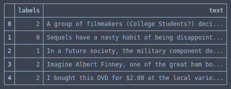

```python
# we remove everything that has a label of 2 because label of 2 is "unsupervised" and we can't use it.
df_trn[df_trn['labels'] != 2].to_csv(CLAS_PATH / 'train.csv', header=False, index=False)

df_val.to_csv(CLAS_PATH / 'test.csv', header=False, index=False)

(CLAS_PATH / 'classes.txt').open('w').writelines(f'{o}\n' for o in CLASSES)
```

So you have your labels and texts, and then a file called `classes.txt` which just lists the classes. I say somewhat standard because in a reasonably recent academic paper Yann LeCun and a team of researcher looked at quite a few datasets and they use this format for all of them. So that's what I started using as well for my recent paper. You'll find that this notebook, if you put your data into this format, the whole notebook will work every time [00:25:17]. So rather than having a thousand different formats, I just said let's just pick a standard format and your job is to put your data in that format which is the CSV file. The CSV files have no header by default.

You'll notice at the start, we have two different paths [00:25:51]. One was the classification path, and the other was the language model path.

`CLAS_PATH = Path('data/imdb_clas/')`

`LM_PATH = Path('data/imdb_lm/')`

In NLP, you'll see LM all the time. LM means language model. The classification path is going to contain the information that we are going to use to create a sentiment analysis model. The language model path is going to contain the information we need to create a language model. So they are a little bit different.

**Difference between classification model and language model**

One thing that is different is that when we create the `train.csv` in the classification path, we remove everything that has a label of 2 `df_trn['labels'] != 2` because label of 2 is "unsupervised" and we can't use it.

The second difference is the labels [00:26:51]. For the classification path, the labels are the actual labels, but for the language model, there are no labels so we just use a bunch of zeros and that just makes it a little easier because we can use a consistent dataframe/CSV format.

**Language model goal**

The LM's goal is to learn the structure of the English language. It learns language by trying to predict the next word given a set of previous words(ngrams). Since the LM does not classify reviews, the labels can be ignored.

The LM can benefit from all the textual data and there is no need to exclude the unsup/unclassified movie reviews.

We start by creating the data for the LM. We can create our own validation set, so you've probably come across by now, `sklearn.model_selection.train_test_split` which is a really simple function that grabs a dataset and randomly splits it into a training set and a validation set according to whatever proportion you specify. In this case, we concatenate our classification training and validation together, split it by 10%, now we have 90,000 training, 10,000 validation for our language model. So that's getting the data in a standard format for our language model and our classifier.

```python
# Concat all the train(pos/neg/unsup = **75k**) and test(pos/neg=**25k**) reviews into a big chunk of **100k** reviews.
#
# And then we use sklearn splitter to divide up the 100k texts into 90% training and 10% validation sets.
trn_texts, val_texts = sklearn.model_selection.train_test_split(
    np.concatenate([trn_texts, val_texts]), test_size=0.1)
```

Save Pandas Dataframes to CSV files:

```python
df_trn = pd.DataFrame({ 'text': trn_texts, 'labels': [0] * len(trn_texts) }, columns=col_names)
df_val = pd.DataFrame({ 'text': val_texts, 'labels': [0] * len(val_texts) }, columns=col_names)

df_trn.to_csv(LM_PATH / 'train.csv', header=False, index=False)
df_val.to_csv(LM_PATH / 'test.csv', header=False, index=False)
```

#### ([0:28:08](https://youtu.be/h5Tz7gZT9Fo?t=28m08s)) Language model tokens

The next thing we need to do is tokenization. Tokenization means at this stage, for a document (i.e. a movie review), we have a big long string and we want to turn it into a list of tokens which is similar to a list of words but not quite. For example, `don't`, we want it to be `do` and `n't`, we probably want full stop to be a token, and so forth. **Tokenization is something that we passed off to a terrific library called [spaCy](https://spacy.io/)** . We put a bit of stuff on top of spaCy but the vast majority of the work's been done by spaCy.

**Pre-processing**

We start cleaning up the messy text. There are 2 main activities we need to perform:

1. Clean up extra spaces, tab chars, new line chars and other characters and replace them with standard ones.
2. Use the spaCy library to tokenize the data. Since **spaCy does not provide a parallel/multicore version of the tokenizer**, the fastai library adds this functionality. This parallel version uses all the cores of your CPUs and runs much faster than the serial version of the spacy tokenizer.

Tokenization is the process of splitting the text into separate tokens so that each token can be assigned a unique index. This means we can convert the text into integer indexes our models can use.

#### ([0:29:59](https://youtu.be/h5Tz7gZT9Fo?t=29m59s)) Pandas 'chunksize' to deal with a large corpus

We use an appropriate `chunksize` as the tokenization process is memory intensive.

```python
chunksize = 24000
```

Before we pass it to spaCy, Jeremy wrote this simple `fixup` function which is each time he's looked at different datasets (about a dozen in building this), every one had different weird things that needed to be replaced. So here are all the ones he's come up with so far, and hopefully this will help you out as well. All the entities are HTML unescaped and there are bunch more things we replace. Have a look at the result of running this on text that you put in and make sure there's no more weird tokens in there.

```python
re1 = re.compile(r'  +')

def fixup(x):
    x = x.replace('#39;', "'").replace('amp;', '&').replace('#146;', "'").replace(
        'nbsp;', ' ').replace('#36;', '$').replace('\\n', "\n").replace('quot;', "'").replace(
        '<br />', "\n").replace('\\"', '"').replace('<unk>', 'u_n').replace(' @.@ ', '.').replace(
        ' @-@ ', '-').replace('\\', ' \\ ')
    return re1.sub(' ', html.unescape(x))

def get_texts(df, n_lbls=1):
    labels = df.iloc[:, range(n_lbls)].values.astype(np.int64)
    texts = f'\n{BOS} {FLD} 1 ' + df[n_lbls].astype(str)
    for i in range(n_lbls + 1, len(df.columns)):
        texts += f' {FLD} {i - n_lbls} ' + df[i].astype(str)
    texts = texts.apply(fixup).values.astype(str)

    tok = Tokenizer().proc_all_mp(partition_by_cores(texts))
    return tok, list(labels)
```

`get_all function` calls `get_texts` and `get_texts` is going to do a few things [00:29:40]. One of which is to apply that `fixup` that we just mentioned.

```python
def get_all(df, n_lbls):
    tok, labels = [], []

    for i, r in enumerate(df):
        print(i)
        tok_, labels_ = get_texts(r, n_lbls)
        tok += tok_
        labels += labels_
    return tok, labels
```

Let's look through this because there is some interesting things to point out [00:29:57]. We are going to use Pandas to open our `train.csv` from the language model path, but we are passing in an extra parameter you may not have seen before called `chunksize`. Python and Pandas can both be pretty inefficient when it comes to storing and using text data. So you'll see that very few people in NLP are working with large corpuses. And Jeremy thinks the part of the reason is that traditional tools made it really difficult — you run out of memory all the time. So this process he is showing us today, he has used on corpuses of over a billion words successfully using this exact code. One of the simple trick is this thing called `chunksize` with Pandas. That that means is that Pandas does not return a data frame, but it returns an iterator that we can iterate through chunks of a data frame. That is why we don't say `tok_trn = get_text(df_trn)` but instead we call `get_all` which loops through the data frame but actually what it's really doing is it's looping through chunks of the data frame so each of those chunks is basically a data frame representing a subset of the data [00:31:05].

:question: When I'm working with NLP data, many times I come across data with foreign texts/characters. Is it better to discard them or keep them [31:31]? No no, definitely keep them. This whole process is unicode and I've actually used this on Chinese text. This is designed to work on pretty much anything. In general, most of the time, it's not a good idea to remove anything. Old-fashioned NLP approaches tended to do all this like lemmatization and all these normalization steps to get rid things, lower case everything, etc. But that's throwing away information which you don't know ahead of time whether it's useful or not. So don't throw away information.

So we go through each chunk each of which is a data frame and we call `get_texts` [00:32:19]. `get_texts` will grab the labels and makes them into integers, and it's going to grab the texts.

#### ([0:32:38](https://youtu.be/h5Tz7gZT9Fo?t=32m38s)) {BOS} (beginning of stream) and {FLD} (field) tokens

A couple things to point out:

- Before we include the text, we have "beginning of stream" (`BOS`) token which we defined in the beginning. There's nothing special about these particular strings of letters — they are just ones I figured don't appear in normal texts very often. So every text is going to start with 'xbos' — why is that? Because it's often useful for your model to know when a new text is starting. For example, if it's a language model, we are going to concatenate all the texts together. So it would be really helpful for it to know all this articles finished and a new one started so I should probably forget some of their context now.
- Ditto is quite often texts have multiple fields like a title and abstract, and then a main document. So by the same token, we've got this thing here which lets us actually have multiple fields in our CSV. So this process is designed to be very flexible. Again at the start of each one, we put a special "field starts here" token followed by the number of the field that's starting here for as many fields as we have. Then we apply `fixup` to it.

#### ([0:33:57](https://youtu.be/h5Tz7gZT9Fo?t=33m57s)) Run spaCy on multi-cores with `proc_all_mp()`

Then most importantly [00:33:54], we tokenize it — we tokenize it by doing a "process all multiprocessing" (`proc_all_mp`). Tokenizing tends to be pretty slow but we've all got multiple cores in our machines now, and some of the better machines on AWS can have dozens of cores. spaCy is not very amenable to multi processing but Jeremy finally figured out how to get it to work. The good news is that it's all wrapped up in this one function now. So all you need to pass to that function is a list of things to tokenize which each part of that list will be tokenized on a different core. There is also a function called `partition_by_cores` which takes a list and splits it into sublists. The number of sublists is the number of cores that you have in your computer. On Jeremy's machine without multiprocessing, this takes about an hour and a half, and with multiprocessing, it takes about 2 minutes. So it's a really hand thing to have. Feel free to look inside it and take advantage of it for your own stuff. Remember, we all have multiple cores even in our laptops and very few things in Python take advantage or it unless you make a bit of an effort to make it work.

```python
df_trn = pd.read_csv(LM_PATH / 'train.csv', header=None, chunksize=chunksize)
df_val = pd.read_csv(LM_PATH / 'test.csv', header=None, chunksize=chunksize)

tok_trn, trn_labels = get_all(df_trn, 1)
tok_val, val_labels = get_all(df_val, 1)

# -----------------------------------------------------------------------------
# Output
# -----------------------------------------------------------------------------
0
1
2
0

(LM_PATH / 'tmp').mkdir(exist_ok=True)
```
:warning: if you encountered an error: `OSError: [E050] Can't find model 'en'. It doesn't seem to be a shortcut link, a Python package or a valid path to a data directory.`. The problem is due to spaCy unable to find 'en' model. Here's how to fix this:

Try running this command and it should install the model to the correct directory.

```bash
python -m spacy download en

Collecting https://github.com/explosion/spacy-models/releases/download/en_core_web_sm-2.0.0/en_core_web_sm-2.0.0.tar.gz
  Downloading https://github.com/explosion/spacy-models/releases/download/en_core_web_sm-2.0.0/en_core_web_sm-2.0.0.tar.gz (37.4MB)
    100% |████████████████████████████████| 37.4MB 81.7MB/s ta 0:00:01
    7%   |██▎                             | 2.6MB 611kB/s eta 0:00:57
Installing collected packages: en-core-web-sm
  Running setup.py install for en-core-web-sm ... done
Successfully installed en-core-web-sm-2.0.0
You are using pip version 9.0.3, however version 10.0.1 is available.
You should consider upgrading via the 'pip install --upgrade pip' command.

    Linking successful
    /home/ubuntu/anaconda3/envs/fastai/lib/python3.6/site-packages/en_core_web_sm
    -->
    /home/ubuntu/anaconda3/envs/fastai/lib/python3.6/site-packages/spacy/data/en

    You can now load the model via spacy.load('en')
```

#### ([0:35:40](https://youtu.be/h5Tz7gZT9Fo?t=35m40s)) Difference between tokens and word - capture semantic of letter case and others

Here is the result at the end [00:35:42]. Beginning of the stream token (`xbos`), beginning of field number 1 token (`xfld 1`), and tokenized text. You'll see that the punctuation is on whole now a separate token.

**`t_up`** : `t_up mgm` — MGM was originally capitalized. But the interesting thing is that normally people either lowercase everything or they leave the case as is. Now if you leave the case as is, then "SCREW YOU" and "screw you" are two totally different sets of tokens that have to be learnt from scratch. Or if you lowercase them all, then there is no difference at all. So how do you fix this so that you both get a semantic impact of "I'M SHOUTING NOW" but not have to learn the shouted version vs. the normal version. So the idea is to come up with a unique token to mean the next thing is all uppercase. Then we lowercase it, so now whatever used to be uppercase is lowercased, and then we can learn the semantic meaning of all uppercase.

**`tk_rep`** : Similarly, if you have 29 `!` in a row, we don't learn a separate token for 29 exclamation marks — instead we put in a special token for "the next thing repeats lots of times" and then put the number 29 and an exclamation mark (i.e. `tk_rep 29 !`). So there are a few tricks like that. If you are interested in NLP, have a look at the tokenizer code for these little tricks that Jeremy added in because some of them are kind of fun.

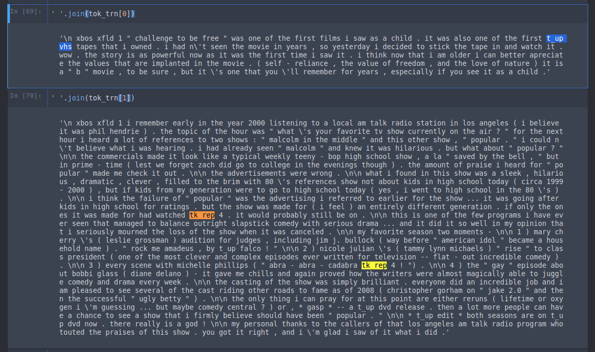

The nice thing with doing things this way is we can now just `np.save` that and load it back up later [00:37:44]. We don't have to recalculate all this stuff each time like we tend to have to do with torchtext or a lot of other libraries.

```python
np.save(LM_PATH / 'tmp' / 'tok_trn.npy', tok_trn)
np.save(LM_PATH / 'tmp' / 'tok_val.npy', tok_val)

tok_trn = np.load(LM_PATH / 'tmp' / 'tok_trn.npy')
tok_val = np.load(LM_PATH / 'tmp' / 'tok_val.npy')
```

#### ([0:38:05](https://youtu.be/h5Tz7gZT9Fo?t=38m05s)) Numericalize tokens - Python `Counter` class

Now that we got it tokenized, the next thing we need to do is to turn it into numbers which we call numericalizing it.

The way we numericalize it is very simple.

- We make a list list of all the words that appear in some order.
- Then we replace every word with its index into that list.
- The list of all the tokens, we call that the vocabulary.

Here is an example of some of the vocabulary [00:38:28]. The `Counter` class in Python is very handy for this. It basically gives us a list of unique items and their counts. Here are the 25 most common things in the vocabulary. Generally speaking, we don't want every unique token in our vocabulary. If it doesn't appear at least twice then might just be a spelling mistake or a word we can't learn anything about it if it doesn't appear that often. Also the stuff we are going to be learning about so far in this part gets a bit clunky once you've got a vocabulary bigger than 60,000.

:bookmark: Time permitting, we may look at some work Jeremy has been doing recently on handling larger vocabularies, otherwise that might have to come in a future course. But actually for classification, doing more than about 60,000 words doesn't seem to help anyway.

```python
freq = Counter(p for o in tok_trn for p in o)
freq.most_common(25)

# -----------------------------------------------------------------------------
# Output
# -----------------------------------------------------------------------------
[('the', 887988),
 ('.', 728554),
 (',', 723734),
 ('and', 431261),
 ('a', 428883),
 ('of', 385045),
 ('to', 356708),
 ('is', 289156),
 ('it', 250838),
 ('in', 247829),
 ('i', 226869),
 ('this', 198753),
 ('that', 192237),
 ('"', 175326),
 ("'s", 162388),
 ('-', 137672),
 ('was', 132132),
 ('\n\n', 131699),
 ('as', 122074),
 ('with', 117296),
 ('for', 117044),
 ('movie', 115864),
 ('but', 110438),
 ('film', 105423),
 ('you', 91306)]
```
So we are going to limit our vocabulary to 60,000 words, things that appear at least twice [00:39:33]. Here is a simple way to do that. Use `.most_common`, pass in the max vocab size. That'll sort it by the frequency and if it appears less often than a minimum frequency, then don't bother with it at all. That gives us `itos` — that's the same name that torchtext used and it means integer-to-string. This is just the list of unique tokens in the vocab. We'll insert two more tokens — a vocab item for unknown (`_unk_`) and a vocab item for padding (`_pad_`).

```python
max_vocab = 60000
min_freq = 2

itos = [o for o, c in freq.most_common(max_vocab) if c > min_freq]
itos.insert(0, '_pad_')
itos.insert(0, '_unk_')
```

We can then create the dictionary which goes in the opposite direction (string to integer)[00:40:19]. That won't cover everything because we intentionally truncated it down to 60,000 words. If we come across something that is not in the dictionary, we want to replace it with zero for unknown so we can use `defaultdict` with a lambda function that always returns zero.

```python
stoi = collections.defaultdict(lambda: 0, { v: k for k, v in enumerate(itos) })
len(itos)

# -----------------------------------------------------------------------------
# Output
# -----------------------------------------------------------------------------
59901
```

So now we have our `stoi` dictionary defined, we can then call that for every word for every sentence [00:40:50].

```python
trn_lm = np.array([ [stoi[o] for o in p] for p in tok_trn ])
val_lm = np.array([ [stoi[o] for o in p] for p in tok_val ])
```

Here is our numericalized version:

```python
' '.join(str(o) for o in trn_lm[0])

# -----------------------------------------------------------------------------
# Output
# -----------------------------------------------------------------------------
'40 41 42 39 15 2803 8 38 868 15 18 37 7 2 107 125 12 231 20 6 521 3 10 18 100 37 7 2 107 31 1913 6523 14 12 4765 3 12 84 29 129 2 23 11 171 4 51 4193 12 882 8 1316 2 1920 11 5 124 10 3 1361 3 2 78 9 20 939 166 20 10 18 2 107 74 12 231 10 3 12 121 166 14 12 257 948 12 77 145 46187 2 1199 14 33 17067 11 2 23 3 30 545 17 11832 4 2 1080 7 2088 4 5 2 130 7 947 27 10 9 6 15 624 15 23 4 8 38 271 4 24 10 16 37 14 26 259 418 22 171 4 282 61 26 83 10 20 6 521 3'
```

Of course, the nice thing is we can save that step as well. Each time we get to another step, we can save it. These are not very big files compared to what you are used with images. Text is generally pretty small.

Very important to also save that vocabulary (`itos`). The list of numbers means nothing unless you know what each number refers to, and that's what `itos` tells you.

```python
np.save(LM_PATH / 'tmp' / 'trn_ids.npy', trn_lm)
np.save(LM_PATH / 'tmp' / 'val_ids.npy', val_lm)
pickle.dump(itos, open(LM_PATH / 'tmp' / 'itos.pkl', 'wb'))
```

So you save those three things, and later on you can load them back up.

```python
trn_lm = np.load(LM_PATH / 'tmp' / 'trn_ids.npy')
val_lm = np.load(LM_PATH / 'tmp' / 'val_ids.npy')
itos = pickle.load(open(LM_PATH / 'tmp' / 'itos.pkl', 'rb'))
```

Now our vocab size is 60,002 and our training language model has 90,000 documents in it.

```python
vs = len(itos)
vs, len(trn_lm)

# -----------------------------------------------------------------------------
# Output
# -----------------------------------------------------------------------------
(60002, 90000)
```

That's the preprocessing you do [00:42:01]. We can probably wrap a little bit more of that in utility functions if we want to but it's all pretty straight forward and that exact code will work for any dataset you have once you've got it in that CSV format.

### ([0:42:16](https://youtu.be/h5Tz7gZT9Fo?t=42m16s)) Pre-Training

Instead of pre-training on ImageNet, for NLP we can pre-train on a large subset of Wikipedia.

Here is kind of a new insight that's not new at all which is that we'd like to pre-train something. We know from lesson 4 that if we pre-train our classifier by first creating a language model and then fine-tuning that as a classifier, that was helpful. It actually got us a new state-of-the-art result — we got the best IMDb classifier result that had been published by quite a bit. We are not going that far enough though, because IMDb movie reviews are not that different to any other English document; compared to how different they are to a random string or even to a Chinese document. So just like ImageNet allowed us to train things that recognize stuff that kind of looks like pictures, and we could use it on stuff that was nothing to do with ImageNet like satellite images. Why don't we train a language model that's good at English and then fine-tune it to be good at movie reviews.

So this basic insight led Jeremy to try building a language model on Wikipedia. Stephen Merity has already processed Wikipedia, found a subset of nearly the most of it, but throwing away the stupid little articles leaving bigger articles. He calls that WikiText-103. Jeremy grabbed WikiText-103 and trained a language model on it. He used exactly the same approach he's about to show you for training an IMDb language model, but instead he trained a WikiText-103 language model. He saved it and made it available for anybody who wants to use it at [this URL](http://files.fast.ai/models/wt103/). The idea now is let's train an IMDb language model which starts with these weights. Hopefully to you folks, this is an extremely obvious, extremely non-controversial idea because it's basically what we've done in nearly every class so far. *But when Jeremy first mentioned this to people in the NLP community June or July of last year, there couldn't have been less interest and was told it was stupid* [00:45:03]. Because Jeremy was obstreperous, he ignored them even though they know much more about NLP and tried it anyway. And let's see what happened.

#### ([00:46:11](https://youtu.be/h5Tz7gZT9Fo?t=46m11s)) WikiText-103 conversion

We are now going to build an English language model (LM) for the IMDb corpus. We could start from scratch and try to learn the structure of the English language. But we use a technique called transfer learning to make this process easier. In transfer learning (a fairly recent idea for NLP) a pre-trained LM that has been trained on a large generic corpus(_like wikipedia articles_) can be used to transfer it's knowledge to a target LM and the weights can be fine-tuned.

Our source LM is the WikiText-103 LM created by Stephen Merity at Salesforce research: [link to dataset](https://www.salesforce.com/products/einstein/ai-research/the-wikitext-dependency-language-modeling-dataset/). The language model for WikiText-103 (AWD LSTM) has been pre-trained and the weights can be downloaded here: [Link](http://files.fast.ai/models/wt103/). Our target LM is the IMDb LM.

Here is how we do it. Grab the WikiText models. If you do `wget -r`, it will recursively grab the whole directory which has a few things in it.

```python
# wget options:
# -nH don't create host directories
# -r specify recursive download
# -np don't ascend to the parent directory
# -P get all images, etc. needed to display HTML page
!wget -nH -r -np -P {PATH} http://files.fast.ai/models/wt103/

... ... ...
... ... ...

--2018-06-28 04:49:17--  http://files.fast.ai/models/wt103/bwd_wt103.h5
Reusing existing connection to files.fast.ai:80.
HTTP request sent, awaiting response... 200 OK
Length: 462387687 (441M) [text/plain]
Saving to: ‘data/aclImdb/models/wt103/bwd_wt103.h5'

models/wt103/bwd_wt 100%[===================>] 440.97M  7.69MB/s    in 59s

2018-06-28 04:50:16 (7.45 MB/s) - ‘data/aclImdb/models/wt103/bwd_wt103.h5' saved [462387687/462387687]

... ... ...
... ... ...

FINISHED --2018-06-28 04:53:14--
Total wall clock time: 4m 0s
Downloaded: 14 files, 1.7G in 3m 56s (7.50 MB/s)

!ls -lh {PATH}/models/wt103/*.h5

-rw-rw-r-- 1 ubuntu ubuntu 441M Mar 29 00:31 data/aclImdb/models/wt103/bwd_wt103_enc.h5
-rw-rw-r-- 1 ubuntu ubuntu 441M Mar 29 00:34 data/aclImdb/models/wt103/bwd_wt103.h5
-rw-rw-r-- 1 ubuntu ubuntu 441M Mar 29 00:36 data/aclImdb/models/wt103/fwd_wt103_enc.h5
-rw-rw-r-- 1 ubuntu ubuntu 441M Mar 29 00:39 data/aclImdb/models/wt103/fwd_wt103.h5
```

We need to make sure that our language model has exactly the same embedding size, number of hidden, and number of layers as Jeremy's WikiText one did otherwise you can't load the weights in.

```python
em_sz, nh, nl = 400, 1150, 3
```

Here are our pre-trained path and our pre-trained language model path.

```python
PRE_PATH = PATH / 'models' / 'wt103'
PRE_LM_PATH = PRE_PATH / 'fwd_wt103.h5'
```

Let's go ahead and `torch.load` in those weights from the forward WikiText-103 model. We don't normally use `torch.load`, but that's the PyTorch way of grabbing a file. It basically gives you a dictionary containing the name of the layer and a tensor/array of those weights.

```python
wgts = torch.load(PRE_LM_PATH, map_location=lambda storage, loc: storage)
```

#### ([0:47:13](https://youtu.be/h5Tz7gZT9Fo?t=47m13s)) Map IMDb vocab to WikiText vocab

Now the problem is that WikiText language model was built with a certain vocabulary which was not the same as ours [00:47:14]. Our #40 is not the same as WikiText-103 model's #40. So we need to map one to the other. That's very very simple because luckily Jeremy saved `itos` for the WikiText vocab.

```python
enc_wgts = to_np(wgts['0.encoder.weight']) # converts np.ndarray from torch.FloatTensor.output shape: (238462, 400)
row_m = enc_wgts.mean(0) # returns the average of the array elements along axis 0. output shape: (400,)
```

`row_m = enc_wgts.mean(0)` : We calculate the mean of the layer 0 encoder weights (`0.encoder.weight`). This can be used to assign weights to unknown tokens when we transfer to target IMDb LM.

Here is the list of what each word is for WikiText-103 model, and we can do the same `defaultdict` trick to map it in reverse (string to integer). We'll use -1 to mean that it is not (found) in the WikiText dictionary when we look it up.

```python
itos2 = pickle.load( (PRE_PATH / 'itos_wt103.pkl').open('rb') )
stoi2 = collections.defaultdict(lambda: -1, { v: k for k, v in enumerate(itos2) })
```

So now we can just say our new set of weights is just a whole bunch of zeros with vocab size by embedding size (i.e. we are going to create an embedding matrix) [00:47:57]. We then go through every one of the words in our IMDb vocabulary. We are going to look it up in `stoi2` (string-to-integer for the WikiText-103 vocabulary) and see if it's a word there. If that is a word there, then we won't get the `-1`. So `r` will be greater than or equal to zero, so in that case, we will just set that row of the embedding matrix to the weight which was stored inside the named element `'0.encoder.weight'`. You can look at this dictionary `wgts` and it's pretty obvious what each name corresponds to. It looks very similar to the names that you gave it when you set up your module, so here are the encoder weights.

If we don't find it [00:49:02], we will use the row mean (`row_m`) — in other words, here is the average embedding weight across all of the WikiText-103. So we will end up with an embedding matrix for every word that's in both our vocabulary for IMDb and the WikiText-103 vocab, we will use the WikiText-103 embedding matrix weights; for anything else, we will just use whatever was the average weight from the WikiText-103 embedding matrix.

```python
new_w = np.zeros((vs, em_sz), dtype=np.float32) # shape: (60002, 400)

for i, w in enumerate(itos):
    r = stoi2[w]
    new_w[i] = enc_wgts[r] if r >= 0 else row_m
```

We will then replace the encoder weights with `new_w` turn into a tensor [00:49:35]. We haven't talked much about **weight tying**, but basically the decoder (the thing that turns the final prediction back into a word) uses exactly the same weights, so we pop it there as well. Then there is a bit of weird thing with how we do embedding dropout that ends up with a whole separate copy of them for a reason that doesn't matter much. So we popped the weights back where they need to go. So this is now a set of torch state which we can load in.

```python
wgts['0.encoder.weight'] = T(new_w)
wgts['0.encoder_with_dropout.embed.weight'] = T(np.copy(new_w)) # weird thing with how we do embedding dropout
wgts['1.decoder.weight'] = T(np.copy(new_w))
```

#### ([00:50:18](https://youtu.be/h5Tz7gZT9Fo?t=50m18s)) Language Model

Now that we have the weights prepared, we are ready to create and start training our new IMDb language PyTorch model!

Basic approach we are going to use is we are going to concatenate all of the documents together into a single list of tokens of length 24,998,320. That is going to be what we pass in as a training set. So for the language model:

- We take all our documents and just concatenate them back to back.
- We are going to be continuously trying to predict what's the next word after these words.
- We will set up a whole bunch of dropouts.
- Once we have a model data object, we can grab the model from it, so that's going to give us a learner.
- Then as per usual, we can call `learner.fit`. We do a single epoch on the last layer just to get that okay. The way it's set up is the last layer is the embedding words because that's obviously the thing that's going to be the most wrong because a lot of those embedding weights didn't even exist in the vocab. So we will train a single epoch of just the embedding weights.
- Then we'll start doing a few epochs of the full model. How is it looking? In lesson 4, we had the loss of 4.23 after 14 epochs. In this case, we have 4.12 loss after 1 epoch. So by pre-training on WikiText-103, we have a better loss after 1 epoch than the best loss we got for the language model otherwise.

:question: What is the WikiText-103 model? Is it a AWD LSTM again [00:52:41]? Yes, we are about to dig into that. The way I trained it was literally the same lines of code that you see above, but without pre-training it on WikiText-103.

---

#### ([0:53:09](https://youtu.be/h5Tz7gZT9Fo?t=53m09s)) A quick discussion about fastai documentation project

The goal of fastai doc project is to create documentation that makes readers say "wow, that's the most fantastic documentation I've ever read" and we have some specific ideas about how to do that. It's the same kind of idea of top-down, thoughtful, take full advantage of the medium approach, interactive experimental code first that we are all familiar with. If you are interested in getting involved, you can see the basic approach [in the docs directory](https://github.com/fastai/fastai/tree/master/docs). In there, there is, amongst other things, [transforms-tmpl.adoc](https://raw.githubusercontent.com/fastai/fastai/master/docs/transforms-tmpl.adoc). `adoc` is [AsciiDoc](http://asciidoc.org/). AsciiDoc is like markdown but it's like what markdown needs to be to create actual books. A lot of actual books are written in AsciiDoc and it's as easy to use as markdown but there's way more cool stuff you can do with it. [Here](https://raw.githubusercontent.com/fastai/fastai/master/docs/transforms.adoc) is more standard AsciiDoc example. You can do things like inserting a table of contents (`:toc:`). `::` means put a definition list here. `+` means this is a continuation of the previous list item. So there are many super handy features and it is like turbo-charged markdown. So this AsciiDoc creates this HTML and no custom CSS or anything added:

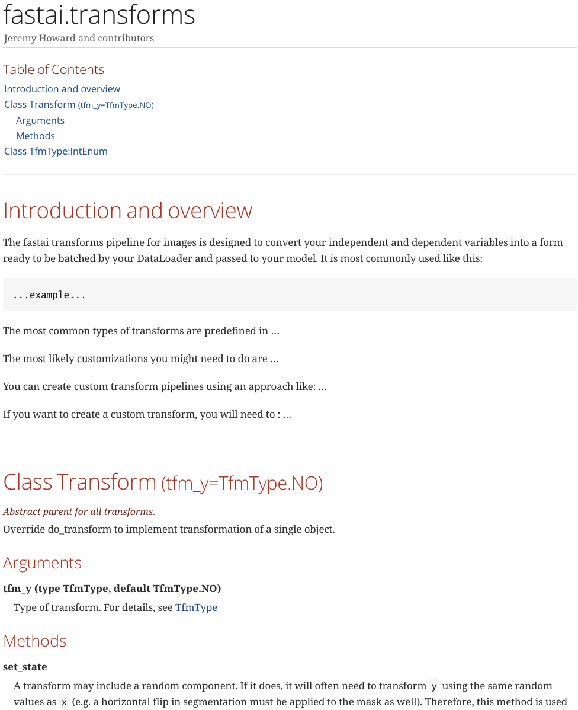

We literally started this project 4 hours ago. So you have a table of contents with hyper links to specific sections. We have cross reference we can click on to jump straight to the cross reference. Each method comes along with its details and so on. To make things even easier, they've created a special template for argument, cross reference, method, etc. The idea is, it will almost be like a book. There will be tables, pictures, video segments, and hyperlink throughout.

You might be wondering what about docstrings. But actually, if you look at the Python standard library and look at the docstring for `re.compile()`, for example, it's a single line. Nearly every docstring in Python is a single line. And Python then does exactly this — they have a website containing the documentation that says "this is what regular expressions are, and this is what you need to know about them, and if you want do them fast, you need to compile, and here is some information about compile" etc. These information is not in the docstring and that's how we are going to do as well — our docstring will be one line unless you need like two sometimes. Everybody is welcome to help contribute to the documentation.

---

#### ([0:58:24](https://youtu.be/h5Tz7gZT9Fo?t=58m24s)) Difference between pre-trained LM and embeddings - word2vec

:question: How does this compare to word2vec [00:58:31]?

This is actually a great thing for you to spend time thinking about during the week. I'll give you the summary now but it's a very important conceptual difference. The main conceptual difference is "what is word2vec?" Word2vec is a single embedding matrix — each word has a vector and that's it. In other words, it's a single layer from a pre-trained model — specifically that layer is the input layer. Also specifically that pre-trained model is a linear model that is pre-trained on something called a co-occurrence matrix. So we have no particular reason to believe that this model has learned anything much about English language or that it has any particular capabilities because it's just a single linear layer and that's it. What's this WikiText-103 model? It's a language model and it has a 400 dimensional embedding matrix, 3 hidden layers with 1,150 activations per layer, and regularization and all that stuff tied input output matrices — it's basically a state-of-the-art [ASGD Weight-Dropped LSTM (AWD LSTM)](https://openreview.net/forum?id=SyyGPP0TZ). What's the difference between a single layer of a single linear model vs. a three layer recurrent neural network? Everything! They are very different levels of capabilities. So you will see when you try using a pre-trained language model vs. word2vec layer, you'll get very different results for the vast majority of tasks.

:question: What if the NumPy array does not fit in memory? Is it possible to write a PyTorch data loader directly from a large CSV file [01:00:32]?

It almost certainly won't come up, so I'm not going to spend time on it. These things are tiny — they are just integers. Think about how many integers you would need to run out of memories? That's not gonna happen. They don't have to fit in GPU memory, just in your memory. I've actually done another Wikipedia model which I called giga wiki which was on all of Wikipedia and even that easily fits in memory. The reason I'm not using it is because it turned out not to really help very much vs. WikiText-103. I've built a bigger model than anybody else I've found in the academic literature and it fits in memory on a single machine.

#### ([1:01:25](https://youtu.be/h5Tz7gZT9Fo?t=1h1m25s)) The idea behind using average of embeddings for non-equivalent tokens

:question: What is the idea behind averaging the weights of embeddings [01:01:24]?

They have to be set to something. These are words that weren't there, so the other option is we could leave them as zero. But that seems like a very extreme thing to do. Zero is a very extreme number. Why would it be zero? We could set it equal to some random numbers, but if so, what would be the mean and standard deviation of those random numbers? Should they be uniform? If we just average the rest of the embeddings, then we have something that's reasonably scaled. Just to clarify, this is how we are initializing words that didn't appear in the training corpus.

### ([01:02:20](https://youtu.be/h5Tz7gZT9Fo?t=1h2m20s)) Back to Language Model

This is a ton of stuff we've seen before, but it's changed a little bit. It's actually a lot easier than it was in part 1, but I want to go a little bit deeper into the language model loader.

```python
wd = 1e-7
bptt = 70
bs = 52
opt_fn = partial(optim.Adam, betas=(0.8, 0.99))
```

#### ([1:02:34](https://youtu.be/h5Tz7gZT9Fo?t=1h2m34s)) Dive into source code of `LanguageModelLoader()`

This is the `LanguageModelLoader` and I really hope that by now, you've learned in your editor or IDE how to jump to symbols [01:02:37]. I don't want it to be a burden for you to find out what the source code of `LanguageModelLoader` is. If your editor doesn't make it easy, don't use that editor anymore. There's lots of good free editors that make this easy.

So this is the source code for `LanguageModelLoader`, and it's interesting to notice that it's not doing anything particularly tricky. It's not deriving from anything at all. What makes something that's capable of being a data loader is that it's something you can iterate over.


Here is the `fit` function inside fastai.model [01:03:41]. This is where everything ends up eventually which goes through each epoch, creates an iterator from the data loader, and then just does a for loop through it. So anything you can do a for loop through can be a data loader. Specifically it needs to return tuples of independent and dependent variables for mini-batches.


So anything with a `__iter__` method is something that can act as an iterator [01:04:09].

:bookmark: `yield` is a neat little Python keywords you probably should learn about if you don't already know it. But it basically spits out a thing and waits for you to ask for another thing — normally in a for loop or something.

In this case, we start by initializing the language model passing it in the numbers `nums` this is the numericalized long list of all of our documents concatenated together. The first thing we do is to "batchfy" it. This is the thing which quite a few of you got confused about last time. If our batch size is 64 and we have 25 million numbers in our list. We are not creating items of length 64 — we are creating 64 items in total. So each of them is of size `t` divided by 64 which is 390k. So that's what we do here:

`data = data.view(self.bs, -1).t().contiguous()`

We reshape it so that this axis is of length 64 and -1 is everything else (390k blob), and we transpose it. So that means that we now have 64 columns, 390k rows. Then what we do each time we do an iterate is we grab one batch of some sequence length, which is approximately equal to `bptt` (back prop through time) which we set to 70. We just grab that many rows. So from `i` to `i + 70` rows, we try to predict that plus one. Remember, we are trying to predict one past where we are up to.

So we have 64 columns and each of those is 1/64th of our 25 million tokens, and hundreds of thousands long, and we just grab 70 at a time [01:06:29]. So each of those columns, each time we grab it, it's going to kind of hook up to the previous column. That's why we get this consistency. This language model is stateful which is really important.

Pretty much all of the cool stuff in the language model is stolen from Stephen Merity's AWD-LSTM [01:06:59] including this little trick here:

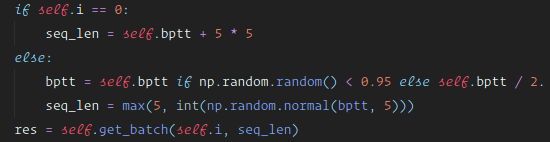

If we always grab 70 at a time and then we go back and do a new epoch, we're going to grab exactly the same batches every time — there is no randomness. Normally, we shuffle our data every time we do an epoch or every time we grab some data we grab it at random. You can't do that with a language model because this set has to join up to the previous set because it's trying to learn the sentence. If you suddenly jump somewhere else, that doesn't make any sense as a sentence. So Stephen's idea is to say "okay, since we can't shuffle the order, let's instead randomly change the sequence length". Basically, 95% of the time, we will use `bptt` (i.e. 70) but 5% of the time, we'll use half that. Then he says "you know what, I'm not even going to make that the sequence length, I'm going to create a normally distributed random number with that average and a standard deviation of 5, and I'll make that the sequence length." So the sequence length is seventy-ish and that means every time we go through, we are getting slightly different batches. So we've got that little bit of extra randomness. Jeremy asked Stephen Merity where he came up with this idea, did he think of it? and he said "I think I thought of it, but it seemed so obvious that I bet I didn't think of it" — which is true of every time Jeremy comes up with an idea in deep learning. It always seems so obvious that you just assume somebody else has thought of it. But Jeremy thinks Stephen thought of it.

`LanguageModelLoader` is a nice thing to look at if you are trying to do something a bit unusual with a data loader [01:08:55]. It's a simple role model you can use as to creating a data loader from scratch — something that spits out batches of data.

Our language model loader took in all of the documents concatenated together along with batch size and bptt [01:09:14].

```python
trn_dl = LanguageModelLoader(np.concatenate(trn_lm), bs, bptt)
val_dl = LanguageModelLoader(np.concatenate(val_lm), bs, bptt)
md = LanguageModelData(PATH, 1, vs, trn_dl, val_dl, bs=bs, bptt=bptt)
```

Now generally speaking, we want to create a learner and the way we normally do that is by getting a model data object and calling some kind of method which have various names but often we call that method `get_model`. The idea is that the model data object has enough information to know what kind of model to give you. So we have to create that model data object which means we need `LanguageModelData` class which is very easy to do [01:09:51].

#### ([1:09:55](https://youtu.be/h5Tz7gZT9Fo?t=1h9m55s)) Create a custom Learner and `ModelData` class

Here are all of the pieces. We are going to create a custom learner, a custom model data class, and a custom model class. So a model data class, again this one doesn't inherit from anything so you really see there's almost nothing to do. You need to tell it most importantly what's your training set (give it a data loader), what's the validation set (give it a data loader), and optionally, give it a test set (data loader), plus anything else that needs to know. It might need to know the bptt, it needs to know number of tokens(i.e. the vocab size), and it needs to know what is the padding index. And so that it can save temporary files and models, model datas as always need to know the path. So we just grab all that stuff and we dump it. That's it. That's the entire initializer. There is no logic there at all.

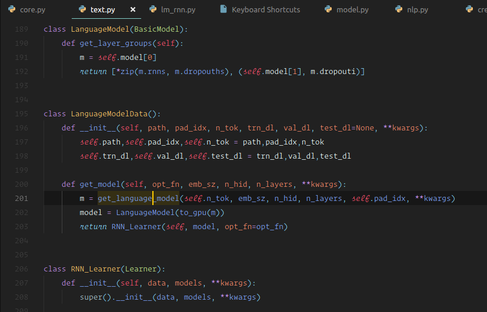

Then all of the work happens inside `get_model` [01:10:55]. `get_model` calls something we will look at later, which just grabs a normal PyTorch `nn.Module` architecture, and chucks it on GPU. Note: with PyTorch, we would say `.cuda()`, with fastai it's better to say `to_gpu()`, the reason is that if you don't have GPU, it will leave it on the CPU. It also provides a global variable you can set to choose whether it goes on the GPU or not, so it's a better approach. We wrapped the model in a `LanguageModel` and the `LanguageModel` is a subclass of `BasicModel` which almost does nothing except it defines layer groups. Remember when we do discriminative learning rates where different layers have different learning rates or we freeze different amounts, we don't provide a different learning rate for every layer because there can be a thousand layers. We provide a different learning rate for every layer group. So when you create a custom model, you just have to override this one thing which returns a list of all of your layer groups. In this case, the last layer group contains the last part of the model and one bit of dropout. The rest of it (`*` here means pull this apart) so this is going to be one layer per RNN layer. So that's all that is.

Then finally turn that into a learner [01:12:41]. So a learner, you just pass in the model and it turns it into a learner. In this case, we have overridden learner and the only thing we've done is to say I want the default loss function to be cross entropy. This entire set of custom model, custom model data, custom learner all fits on a single screen. They always basically look like this.

The interesting part of this code base is `get_language_model` [01:13:18]. Because that gives us our AWD LSTM. It actually contains the big idea. The big, incredibly simple idea that everybody else here thinks it's really obvious that everybody in the NLP community Jeremy spoke to thought was insane. That is, every model can be thought of as a backbone plus a head, and if you pre-train the backbone and stick on a random head, you can do fine-tuning and that's a good idea.

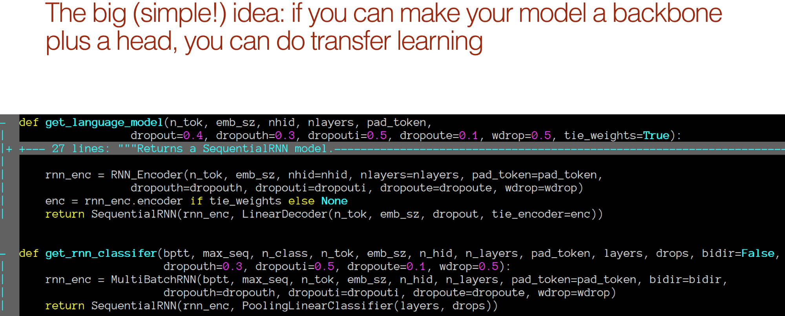

These two bits of code, literally right next to each other, this is all there is inside `fastai.lm_rnn`.

`get_language_model`: Creates an RNN encoder and then creates a sequential model that sticks on top of that — a linear decoder.

`get_rnn_classifer`: Creates an RNN encoder, then a sequential model that sticks on top of that — a pooling linear classifier.

We'll see what these differences are in a moment, but you get the basic idea. They are doing pretty much the same thing. They've got this head and they are sticking on a simple linear layer on top.

:question: There was a question earlier about whether that any of this translates to other languages [01:14:52].

Yes, this whole thing works in any languages. Would you have to retrain your language model on a corpus from that language? Absolutely! So the WikiText-103 pre-trained language model knows English. You could use it maybe as a pre-trained start for like French or German model, start by retraining the embedding layer from scratch might be helpful. Chinese, maybe not so much. But given that a language model can be trained from any unlabeled documents at all, you'll never have to do that. Because almost every language in the world has plenty of documents — you can grab newspapers, web pages, parliamentary records, etc. As long as you have a few thousand documents showing somewhat normal usage of that language, you can create a language model. One of our students tried this approach for Thai and he said the first model he built easily beat the previous state-of-the-art Thai classifier. For those of you that are international fellow, this is an easy way for you to whip out a paper in which you either create the first ever classifier in your language or beat everybody else's classifier in your language. Then you can tell them that you've been a student of deep learning for six months and piss off all the academics in your country. :laughing:

Here is our RNN encoder [01:16:49]. It is a standard `nn.Module`. It looks like there is more going on in it than there actually is, but really all there is is we create an embedding layer, create an LSTM for each layer that's been asked for, that's it. Everything else in it is dropout. Basically all of the interesting stuff (just about) in the AWS LSTM paper is all of the places you can put dropout. Then the forward is basically the same thing. Call the embedding layer, add some dropout, go through each layer, call that RNN layer, append it to our list of outputs, add dropout, that's about it. So it's pretty straight forward.


:memo: The paper you want to be reading is the AWD LSTM paper which is [Regularizing and Optimizing LSTM Language Models](https://arxiv.org/abs/1708.02182). It's well written, pretty accessible, and entirely implemented inside fastai as well — so you can see all of the code for that paper. A lot of the code actually is shamelessly plagiarized with Stephen's permission from his excellent GitHub repo [AWD LSTM](https://github.com/Smerity/awd-lstm-lm).

The paper refers to other papers. For things like why is it that the encoder weight and the decoder weight are the same. It's because there is this thing called "tie weights". Inside `get_language_model`, there is a thing called `tie_weights` which defaults to true. If it's true, then we literally use the same weight matrix for the encoder and the decoder. They are pointing at the same block of memory. Why is that? What's the result of it? That's one of the citations in Stephen's paper which is also a well written paper you can look up and learn about weight tying.

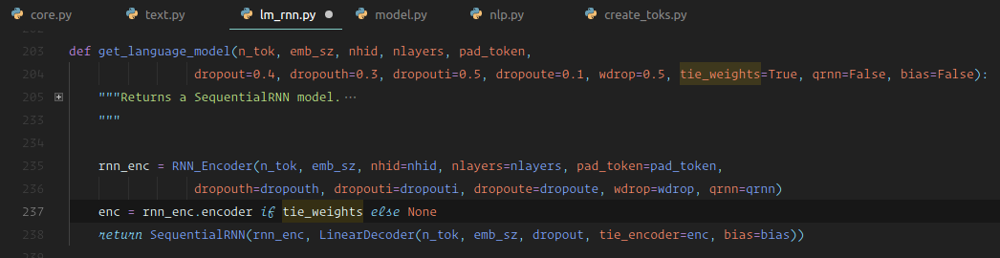

We have basically a standard RNN [01:19:52]. The only reason where it's not standard is it has lots more types of dropout in it. In a sequential model on top of the RNN, we stick a linear decoder which is literally half the screen of code. It has a single linear layer, we initialize the weights to some range, we add some dropout, and that's it. So it's a linear layer with dropout.

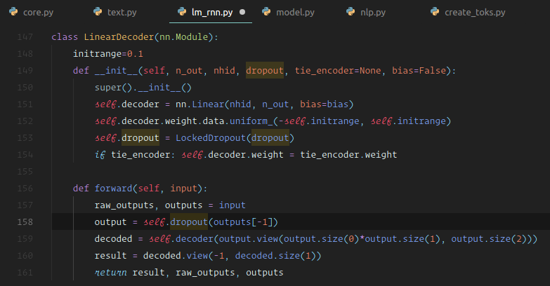

So the language model is:

- RNN :arrow_right: A linear layer with dropout

#### ([1:20:35](https://youtu.be/h5Tz7gZT9Fo?t=1h20m35s)) Guidance to tune dropout in LM

What dropout you choose matters a lot .Through a lot of experimentation, Jeremy found a bunch of dropouts that tend to work pretty well for language models. But if you have less data for your language model, you'll need more dropout. If you have more data, you can benefit from less dropout. You don't want to regularize more than you have to. Rather than having to tune every one of these five things, Jeremy's claim is they are already pretty good ratios to each other, so just tune this number (`0.7` below), we just multiply it all by something. If you are overfitting, then you'll need to increase the number, if you are underfitting, you'll need to decrease this. Because other than that, these ratio seem pretty good.

```python
drops = np.array([0.25, 0.1, 0.2, 0.02, 0.15]) * 0.7
```

We first tune the last embedding layer so that the missing tokens initialized with mean weights get tuned properly. So we freeze everything except the last layer.

We also keep track of the *accuracy* metric.

```python
learner = md.get_model(opt_fn, em_sz, nh, nl,
                       dropouti=drops[0], dropout=drops[1], wdrop=drops[2], dropoute=drops[3], dropouth=drops[4])

learner.metrics = [accuracy]
learner.freeze_to(-1)
```

#### ([1:21:43](https://youtu.be/h5Tz7gZT9Fo?t=1h21m43s)) Measuring accuracy

One important idea which may seem minor but again it's incredibly controversial is that we should measure accuracy when we look at a language model . Normally for language models, we look at a loss value which is just cross entropy loss but specifically we nearly always take `e` to the power of that which the NLP community calls "perplexity". So perplexity is just `e^(cross entropy)`. There is a lot of problems with comparing things based on cross entropy loss. Not sure if there's time to go into it in detail now, but the basic problem is that it is like that thing we learned about focal loss. Cross entropy loss — if you are right, it wants you to be really confident that you are right. So it really penalizes a model that doesn't say "I'm so sure this is wrong" and it's wrong. Whereas accuracy doesn't care at all about how confident you are — it cares about whether you are right. This is much more often the thing which you care about in real life. The accuracy is how often do we guess the next word correctly and it's a much more stable number to keep track of. So that's a simple little thing that Jeremy does.

```python
learner.model.load_state_dict(wgts)

lr = 1e-3
lrs = lr

learner.fit(lrs / 2, 1, wds=wd, use_clr=(32, 2), cycle_len=1)
# -----------------------------------------------------------------------------
# Output
# -----------------------------------------------------------------------------
epoch      trn_loss   val_loss   accuracy
    0      4.663849   4.442456   0.258212

[array([4.44246]), 0.2582116474118943]

learner.save('lm_last_ft')

learner.load('lm_last_ft')

learner.unfreeze()

learner.lr_find(start_lr=lrs / 10, end_lr=lrs * 10, linear=True)

learner.sched.plot()
```

We train for a while and we get down to a 3.9 cross entropy loss which is equivalent of ~49.40 perplexity (`e^3.9`) [01:23:14]. To give you a sense of what's happening with language models, if you look at academic papers from about 18 months ago, you'll see them talking about state-of-the-art perplexity of over a hundred. The rate at which our ability to understand language and measuring language model accuracy or perplexity is not a terrible proxy for understanding language. If I can guess what you are going to say next, I need to understand language well and the kind of things you might talk about pretty well. The perplexity number has just come down so much that it's been amazing, and it will come down a lot more. NLP in the last 12–18 months, it really feels like 2011–2012 computer vision. We are starting to understand transfer learning and fine-tuning, and basic models are getting so much better. Everything you thought about what NLP can and can't do is rapidly going out of date. There's still lots of things NLP is not good at to be clear. Just like in 2012, there were lots of stuff computer vision wasn't good at. But it's changing incredibly rapidly and now is a very very good time to be getting very good at NLP or starting startups base on NLP because there is a whole bunch of stuff which computers would absolutely terrible at two years ago and now not quite good as people and then next year, they'll be much better than people.

```python
learner.fit(lrs, 1, wds=wd, use_clr=(20, 10), cycle_len=15)

# -----------------------------------------------------------------------------
# Output
# -----------------------------------------------------------------------------
epoch      trn_loss   val_loss   accuracy
    0      4.133916   4.017627   0.300258
    1      4.127663   4.023184   0.299315
 70%|███████   | 4818/6872 [57:53<24:40,  1.39it/s, loss=4.14]

---------------------------------------------------------------------------
KeyboardInterrupt                         Traceback (most recent call last)

# Save trained model weights and encoder part as well
learner.save('lm1')
learner.save_encoder('lm1_enc')

learner.sched.plot_loss()
```

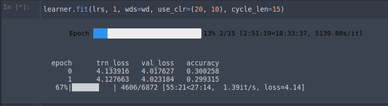

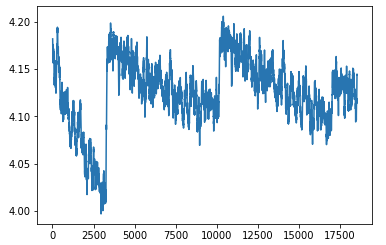

Resume training (after disconnected from network):

```python
learner.load('lm1')
learner.load_encoder('lm1_enc')

learner.fit(lrs, 1, wds=wd, use_clr=(20, 10), cycle_len=13)

# -----------------------------------------------------------------------------
# Output
# -----------------------------------------------------------------------------
epoch      trn_loss   val_loss   accuracy
    0      4.089766   3.987413   0.303426
    1      4.110863   3.993293   0.302394
    2      4.05779    3.982436   0.304094
    3      4.026278   3.972332   0.30501
    4      4.020928   3.95975    0.306272
    5      4.052557   3.951147   0.307224
    6      3.980955   3.941334   0.308409
    7      3.962256   3.937269   0.309225
    8      3.918868   3.932689   0.309884
    9      3.922733   3.924108   0.310882
    10     3.948124   3.914877   0.311638
    11     3.885483   3.914468   0.312277
    12     3.868742   3.910146   0.312858
[array([3.91015]), 0.31285761840572784]

learner.sched.plot_loss()
```

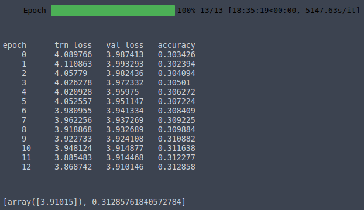


It took me ~1 hour 25 minutes (5147.63s) to train 1 epoch on K80, roughly 1.39 iteration/s.
The full training took me ~20 hours.

#### ([1:25:23](https://youtu.be/h5Tz7gZT9Fo?t=1h25m23s)) Guidance of reading paper vs coding

:question: What is your ratio of paper reading vs. coding in a week [01:25:24]?

Gosh, what do you think, Rachel? You see me. I mean, it's more coding, right? "It's a lot more coding. I feel like it also really varies from week to week" (Rachel). With that bounding box stuff, there were all these papers and no map through them, so I didn't even know which one to read first and then I'd read the citations and didn't understand any of them. So there was a few weeks of just kind of reading papers before I even know what to start coding. That's unusual though. Anytime I start reading a paper, I'm always convinced that I'm not smart enough to understand it, always, regardless of the paper. And somehow eventually I do. But I try to spend as much time as I can coding.

Nearly always after I've read a paper [01:26:34], even after I've read the bit that says this is the problem I'm trying to solve, I'll stop there and try to implement something that I think might solve that problem. And then I'll go back and read the paper, and I read little bits about these are how I solve these problem bits, and I'll be like "oh that's a good idea" and then I'll try to implement those. That's why for example, I didn't actually implement SSD. My custom head is not the same as their head. It's because I kind of read the gist of it and then I tried to create something as best as I could, then go back to the papers and try to see why. So by the time I got to the focal loss paper, Rachel will tell you, I was driving myself crazy with how come I can't find small objects? How come it's always predicting background? I read the focal loss paper and I was like "that's why!!" It's so much better when you deeply understand the problem they are trying to solve. I do find the vast majority of the time, by the time I read that bit of the paper which is solving a problem, I'm then like "yeah, but these three ideas I came up with, they didn't try." Then you suddenly realize that you've got new ideas. Or else, if you just implement the paper mindlessly, you tend not to have these insights about better ways to do it.

#### ([1:28:10](https://youtu.be/h5Tz7gZT9Fo?t=1h28m10s)) Tips to vary dropout for each layer

:question: Is your dropout rate the same through the training or do you adjust it and weights accordingly [01:26:27]?

Varying dropout is really interesting and there are some recent papers that suggest gradually changing dropout [01:28:09]. It was either good idea to gradually make it smaller or gradually make it bigger, I'm not sure which. :bookmark: Maybe one of us can try and find it during the week. I haven't seen it widely used. I tried it a little bit with the most recent paper I wrote and I had some good results. I think I was gradually make it smaller, but I can't remember.

#### ([1:28:44](https://youtu.be/h5Tz7gZT9Fo?t=1h28m44s)) Difference between pre-trained LM and embeddings - Comparison of NLP and Computer Vision

:question: Am I correct in thinking that this language model is build on word embeddings? Would it be valuable to try this with phrase or sentence embeddings? I ask this because I saw from Google the other day, universal sentence encoder [01:28:45].

This is much better than that. This is not just an embedding of a sentence, this is an entire model. An embedding by definition is like a fixed thing. A sentence or a phrase embedding is always a model that creates that. We've got a model that's trying to understand language. It's not just as phrase or as sentence — it's a document in the end, and it's not just an embedding that we are training through the whole thing. This has been a huge problem with NLP for years now is this attachment they have to embeddings. Even the paper that the community has been most excited about recently from [AI2](http://allenai.org/) (Allen Institute for Artificial Intelligence) called [ELMo ](https://allennlp.org/elmo)— they found much better results across lots of models, but again it was an embedding. They took a fixed model and created a fixed set of numbers which they then fed into a model. But in computer vision, we've known for years that that approach of having fixed set of features, they're called hyper columns in computer vision, people stopped using them like 3 or 4 years ago because fine-tuning the entire model works much better. For those of you that have spent quite a lot of time with NLP and not much time with computer vision, you're going to have to start re-learning. All that stuff you have been told about this idea that there are these things called embeddings and that you learn them ahead of time and then you apply these fixed things whether it be word level or phrase level or whatever level — don't do that. You want to actually create a pre-trained model and fine-tune it end-to-end, then you'll see some specific results.

#### ([1:31:21](https://youtu.be/h5Tz7gZT9Fo?t=1h31m21s)) Accuracy vs cross entropy as a loss function

:question: For using accuracy instead of perplexity as a metric for the model, could we work that into the loss function rather than just use it as a metric [01:31:21]?

No, you never want to do that whether it be computer vision or NLP or whatever. It's too bumpy. So cross entropy is fine as a loss function. And I'm not saying instead of, I use it in addition to. I think it's good to look at the accuracy and to look at the cross entropy. But for your loss function, you need something nice and smoothy. Accuracy doesn't work very well.

```python
learner.save('lm1')
learner.save_encoder('lm1_enc')
```

#### `save_encoder`

You'll see there are two different versions of save. `save` saves the whole model as per usual. `save_encoder` just saves that bit:


In other words, in the sequential model, it saves just `rnn_enc` and not `LinearDecoder(n_tok, emb_sz, dropout, tie_encoder=enc)` (which is the bit that actually makes it into a language model). We don't care about that bit in the classifier, we just care about `rnn_enc`. That's why we save two different models here.

```python
learner.sched.plot_loss()
```


### ([01:32:31](https://youtu.be/h5Tz7gZT9Fo?t=1h32m31s)) Classifier tokens

Let's now create the classifier. We will go through this pretty quickly because it's the same. But when you go back during the week and look at the code, convince yourself it's the same.

```python
df_trn = pd.read_csv(CLAS_PATH / 'train.csv', header=None, chunksize=chunksize)
df_val = pd.read_csv(CLAS_PATH /'test.csv', header=None, chunksize=chunksize)

tok_trn, trn_labels = get_all(df_trn, 1)
tok_val, val_labels = get_all(df_val, 1)

(CLAS_PATH / 'tmp').mkdir(exist_ok=True)

np.save(CLAS_PATH / 'tmp' / 'tok_trn.npy', tok_trn)
np.save(CLAS_PATH /'tmp' / 'tok_val.npy', tok_val)

np.save(CLAS_PATH /'tmp' / 'trn_labels.npy', trn_labels)
np.save(CLAS_PATH /'tmp' / 'val_labels.npy', val_labels)

tok_trn = np.load(CLAS_PATH / 'tmp' / 'tok_trn.npy')
tok_val = np.load(CLAS_PATH / 'tmp' / 'tok_val.npy')
```

We don't create a new `itos` vocabulary, we obviously want to use the same vocabulary we had in the language model because we are about to reload the same encoder [01:32:48].

```python
itos = pickle.load((LM_PATH / 'tmp' / 'itos.pkl').open('rb'))
stoi = collections.defaultdict(lambda: 0, { v: k for k, v in enumerate(itos) })
len(itos)

trn_clas = np.array([[stoi[o] for o in p] for p in tok_trn])
val_clas = np.array([[stoi[o] for o in p] for p in tok_val])

np.save(CLAS_PATH / 'tmp' / 'trn_ids.npy', trn_clas)
np.save(CLAS_PATH / 'tmp' / 'val_ids.npy', val_clas)
```

#### Classifier

Now we can create our final model, a classifier which is really a custom linear head over our trained IMDb backbone. The steps to create the classifier model are similar to the ones for the LM.

```python
trn_clas = np.load(CLAS_PATH / 'tmp' / 'trn_ids.npy')
val_clas = np.load(CLAS_PATH / 'tmp' / 'val_ids.npy')

trn_labels = np.squeeze(np.load(CLAS_PATH / 'tmp' / 'trn_labels.npy'))
val_labels = np.squeeze(np.load(CLAS_PATH / 'tmp' / 'val_labels.npy'))
```

The construction of the model hyper parameters are the same [01:33:16]. We can change the dropout. Pick a batch size that is as big as you can that doesn't run out of memory.

```python
bptt, em_sz, nh, nl = 70, 400, 1150, 3
vs = len(itos)
opt_fn = partial(optim.Adam, betas=(0.8, 0.99))
bs = 48

min_lbl = trn_labels.min()
trn_labels -= min_lbl
val_labels -= min_lbl
c = int(trn_labels.max()) + 1
```

#### ([1:33:37](https://youtu.be/h5Tz7gZT9Fo?t=1h33m37s)) Shuffle documents; Sort-ish to save computation

`TextDataset` ([01:33:37](https://youtu.be/h5Tz7gZT9Fo?t=1h33m37s)) This bit is interesting. There's fun stuff going on here.

```python
trn_ds = TextDataset(trn_clas, trn_labels)
val_ds = TextDataset(val_clas, val_labels)
```

The basic idea here is that for the classifier, we do really want to look at one document. Is this document positive or negative? So we do want to shuffle the documents. But those documents have different lengths and so if we stick them all into one batch (this is a handy thing that fastai does for you) — you can stick things of different lengths into a batch and it will automatically pad them, so you don't have to worry about that. But if they are wildly different lengths, then you're going to be wasting a lot of computation times. If there is one thing that's 2,000 words long and everything else is 50 words long, that means you end up with 2000 wide tensor. That's pretty annoying. So James Bradbury who is one of Stephen Merity's colleagues and the guy who came up with torchtext came up with a neat idea which was "let's sort the dataset by length-ish". So kind of make it so the first things in the list are, on the whole, shorter than the things at the end, but a little bit random as well.

Here is how Jeremy implemented that [01:35:10]. The first thing we need is a Dataset. So we have a Dataset passing in the documents and their labels. Here is `TextDataSet` which inherits from `Dataset` and `Dataset` from PyTorch is also shown below:


Actually `Dataset` doesn't do anything at all [01:35:34]. It says you need `__getitem__` if you don't have one, you're going to get an error. Same is true for `__len__`. So this is an abstract class. To `TextDataset`, we are going to pass in our `x` and `y`, and `__getitem__` will grab `x` and `y`, and return them — it couldn't be much simpler. Optionally,

1. they could reverse it,
2. stick an end of stream at the end,
3. stick start of stream at the beginning.

But we are not doing any of those things, so literally all we are doing is putting `x` and `y` and `__getitem__` returns them as a tuple. The length is however long the `x` is. That's all `Dataset` is — something with a length that you can index.

**Turning it to a DataLoader** ([1:36:27](https://youtu.be/h5Tz7gZT9Fo?t=1h36m27s))

```python
trn_samp = SortishSampler(trn_clas, key=lambda x: len(trn_clas[x]), bs=bs // 2)
val_samp = SortSampler(val_clas, key=lambda x: len(val_clas[x]))

trn_dl = DataLoader(trn_ds, bs // 2, transpose=True, num_workers=1, pad_idx=1, sampler=trn_samp)
val_dl = DataLoader(val_ds, bs, transpose=True, num_workers=1, pad_idx=1, sampler=val_samp)

md = ModelData(PATH, trn_dl, val_dl)
```

To turn it into a DataLoader, you simply pass the `Dataset` to the `DataLoader` constructor, and it's now going to give you a batch of that at a time. Normally you can say shuffle equals true or shuffle equals false, it'll decide whether to randomize it for you. In this case though, we are actually going to pass in a sampler parameter and sampler is a class we are going to define that tells the data loader how to shuffle.

- For validation set, we are going to define something that actually just sorts. It just deterministically sorts it so that all the shortest documents will be at the start, all the longest documents will be at the end, and that's going to minimize the amount of padding.
- For training sampler, we are going to create this thing called sort-ish sampler which also sorts (ish!)

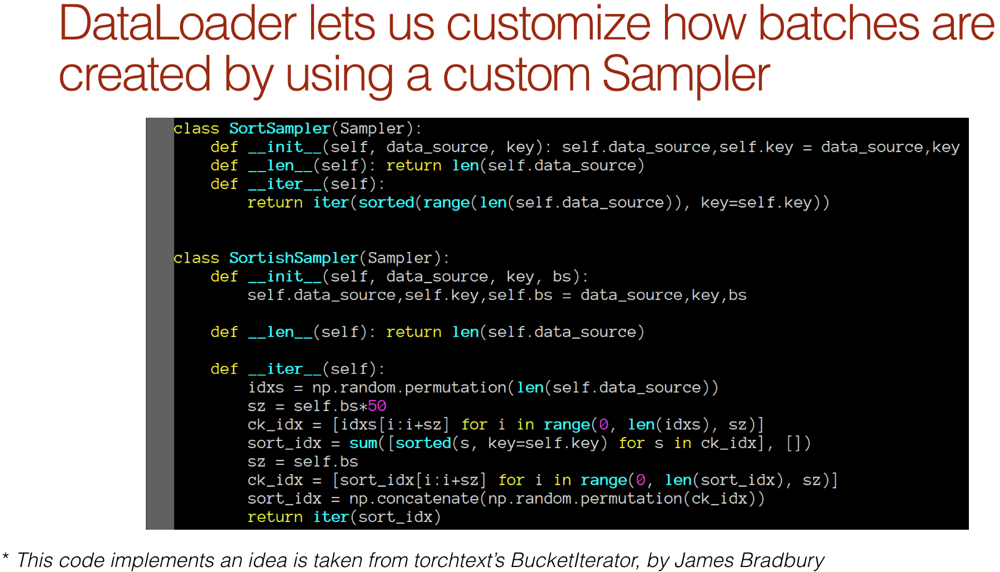

What's great about PyTorch is that they came up with this idea for an API for their data loader where we can hook in new classes to make it behave in different ways [01:37:27]. `SortSampler` is something which has a length which is the length of the data source and has an iterator which is simply an iterator which goes through the data source sorted by length (which is passed in as `key`). For the `SortishSampler`, it basically does the same thing with a little bit of randomness. It's just another of those beautiful design things in PyTorch that Jeremy discovered. He could take James Bradbury's ideas which he had written a whole new set of classes around, and he could just use in-built hooks inside PyTorch. You will notice data loader is not actually PyTorch's data loader — it's actually fastai's data loader. But it's basically almost entirely plagiarized from PyTorch but customized in some ways to make it faster mainly using multi-threading instead of multi-processing.

:question: Does the pre-trained LSTM depth and bptt need to match with the new one we are training [01:39:00]?

No, the bptt doesn't need to match at all. That's just like how many things we look at at a time. It has nothing to do with the architecture.

So now we can call that function we just saw before `get_rnn_classifer` [01:39:16]. It's going to create exactly the same encoder more or less, and we are going to pass in the same architectural details as before. But this time, with the head we add on, you have a few more things you can do. One is you can add more than one hidden layer. In `layers = [em_sz * 3, 50, c]`:

- `em_sz * 3`: this is what the input to my head (i.e. classifier section) is going to be.
- `50`: this is the output of the first layer
- `c`: this is the output of the second layer

And you can add as many as you like. So you can basically create a little multi-layer neural net classifier at the end. Similarly, for `drops=[dps[4], 0.1]`, these are the dropouts to go after each of these layers.

```python
# part 1
dps = np.array([0.4, 0.5, 0.05, 0.3, 0.1])
dps = np.array([0.4, 0.5, 0.05, 0.3, 0.4]) * 0.5

m = get_rnn_classifer(bptt, 20 * 70, c, vs, emb_sz=em_sz, n_hid=nh, n_layers=nl, pad_token=1,
            layers=[em_sz * 3, 50, c], drops=[dps[4], 0.1],
            dropouti=dps[0], wdrop=dps[1], dropoute=dps[2], dropouth=dps[3])

opt_fn = partial(optim.Adam, betas=(0.7, 0.99))
```

We are going to use `RNN_Learner` just like before.

```python
learn = RNN_Learner(md, TextModel(to_gpu(m)), opt_fn=opt_fn)
learn.reg_fn = partial(seq2seq_reg, alpha=2, beta=1)
learn.clip = 25.
learn.metrics = [accuracy]
```

We are going to use discriminative learning rates for different layers [01:40:20].

```python
lr = 3e-3
lrm = 2.6
lrs = np.array([lr / (lrm**4), lr / (lrm**3), lr / (lrm**2), lr / lrm, lr])
```

You can try using weight decay or not. Jeremy has been fiddling around a bit with that to see what happens.

```python
wd = 1e-7
wd = 0
learn.load_encoder('lm2_enc')
```

We start out just training the last layer and we get 93.4% accuracy:

```python
learn.freeze_to(-1)

learn.lr_find(lrs / 1000)
learn.sched.plot()
```

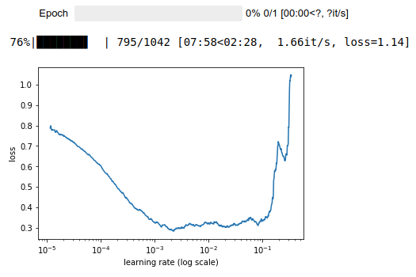

```python
learn.fit(lrs, 1, wds=wd, use_clr=(8, 3), cycle_len=1)

learn.save('clas_0')
learn.load('clas_0')
```

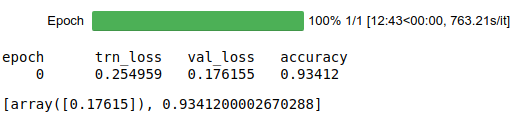

It took me ~13 minutes to train 1 epoch, roughly ~2.2 iteration/s.

Then we unfreeze one more layer, get 93.9% accuracy:

```python
learn.freeze_to(-2)

learn.fit(lrs, 1, wds=wd, use_clr=(8, 3), cycle_len=1)

learn.save('clas_1')
learn.load('clas_1')
```

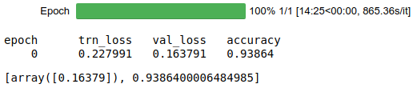

It took me ~14 minutes to train 1 epoch, roughly ~1.74 iteration/s.

Then we fine-tune the whole thing [01:40:47]. This was the main attempt before our paper came along at using a pre-trained model:

```python
learn.unfreeze()

learn.fit(lrs, 1, wds=wd, use_clr=(32, 10), cycle_len=14)

learn.sched.plot_loss()

# -----------------------------------------------------------------------------
# Output
# -----------------------------------------------------------------------------
epoch      trn_loss   val_loss   accuracy
    0      0.24981    0.172563   0.93528
    1      0.263968   0.160485   0.93976
    2      0.202914   0.148376   0.9454
    3      0.156502   0.182274   0.94648
    4      0.134656   0.168832   0.94548
    5      0.107242   0.156522   0.9484
    6      0.102729   0.180831   0.94348
    7      0.075103   0.172596   0.94548
    8      0.07143    0.1826     0.94396
    9      0.066486   0.194617   0.94256
    10     0.047482   0.211435   0.9434
    11     0.049275   0.221188   0.94312
    12     0.0459     0.219328   0.94628
    13     0.040396   0.22585    0.94604

[array([0.22585]), 0.9460399997520447]

learn.save('clas_2')
```

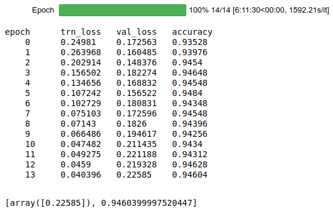

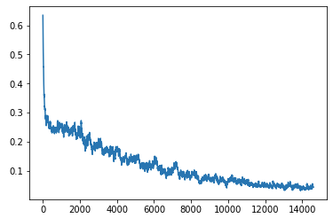

It took me ~25 minutes (1470.71s) to train 1 epoch, roughly 1.35 iteration/s. The full training took me ~6 hours 11 minutes.

[Learned in Translation: Contextualized Word Vectors](https://arxiv.org/abs/1708.00107)

What they did is they used a pre-trained translation model but they didn't fine tune the whole thing. They just took the activations of the translation model and when they tried IMDb, they got 91.8% — which we beat easily after only fine-tuning one layer. They weren't state-of-the-art, the state-of-the-art is 94.1% which we beat after fine-tuning the whole thing for 3 epochs and by the end, we are at 94.8% which is obviously a huge difference because in terms of error rate, that's gone done from 5.9%. A simple little trick is go back to the start of this notebook and reverse the order of all of the documents, and then re-run the whole thing. When you get to the bit that says `fwd_wt_103`, replace `fwd` for forward with `bwd` for backward. That's a backward English language model that learns to read English backward. So if you redo this whole thing, put all the documents in reverse, and change this to backward, you now have a second classifier which classifies things by positive or negative sentiment based on the reverse document. If you then take the two predictions and take the average of them, you basically have a bi-directional model (which you trained each bit separately) and that gets you to 95.4% accuracy. So we basically lowered it from 5.9% to 4.6%. So this kind of 20% change in the state-of-the-art is almost unheard of. It doesn't happen very often. **So you can see this idea of using transfer learning, it's ridiculously powerful that every new field thinks their new field is too special and you can't do it.** So it's a big opportunity for all of us.

### ([1:44:02](https://youtu.be/h5Tz7gZT9Fo?t=1h44m2s)) Universal Language Model Fine-tuning for Text Classification (ULMFiT / FiTLaM) Paper

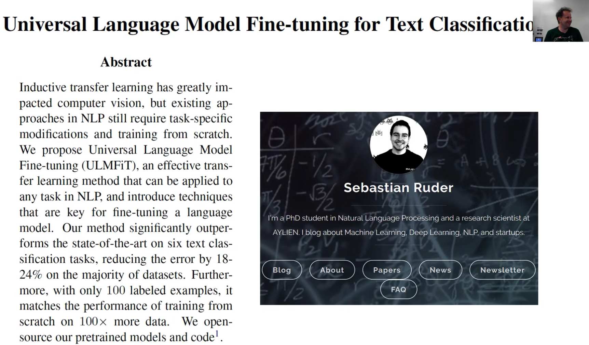

So we turned this into a paper, and when I say we, I did it with this guy Sebastian Ruder. Now you might remember his name because in lesson 5, I told you that I actually had shared lesson 4 with Sebastian because I think he is an awesome researcher who I thought might like it. I didn't know him personally at all. Much to my surprise, he actually watched the video. He watched the whole video and said:

Sebastian: "That's actually quite fantastic! We should turn this into a paper."

Jeremy: "I don't write papers. I don't care about papers and am not interested in papers — that sounds really boring"

Sebastian: "Okay, how about I write the paper for you."

Jeremy: "You can't really write a paper about this yet because you'd have to do like studies to compare it to other things (they are called ablation studies) to see which bit actually works. There's no rigor here, I just put in everything that came in my head and chucked it all together and it happened to work"

Sebastian: "Okay, what if I write all the paper and do all your ablation studies, then can we write the paper?"

Jeremy: "Well, it's like a whole library that I haven't documented and I'm not going to yet and you don't know how it all works"

Sebastian: "Okay, if I wrote the paper, and do the ablation studies, and figure out from scratch how the code works without bothering you, then can we write the paper?"

Jeremy: "Um… yeah, if you did all those things, then we can write the paper. Okay!"

Then two days later, he comes back and says "okay, I've done a draft of the paper." So, I share this story to say, if you are some student in Ireland and you want to do good work, don't let anybody stop you. I did not encourage him to say the least. But in the end, he said "I want to do this work, I think it's going to be good, and I'll figure it out" and he wrote a fantastic paper. He did the ablation study and he figured out how fastai works, and now we are planning to write another paper together. You've got to be a bit careful because sometimes I get messages from random people saying like "I've got lots of good ideas, can we have coffee?" — "I don't want… I can have coffee in my office anytime, thank you". But it's very different to say "hey, I took your ideas and I wrote a paper, and I did a bunch of experiments, and I figured out how your code works, and I added documentation to it — should we submit this to a conference?" You see what I mean? There is nothing to stop you doing amazing work and if you do amazing work that helps somebody else, in this case, I'm happy that we have a paper. I don't particularly care about papers but I think it's cool that these ideas now have this rigorous study.

**Let me show you what he did**

He took all my code, so I'd already done all the fastai.text and as you have seen, it lets us work with large corpuses. Sebastian is fantastically well-read and he said "here's a paper that Yann LeCun and some guys just came out with where they tried lots of classification datasets so I'm going to try running your code on all these datasets." So these are the datasets:

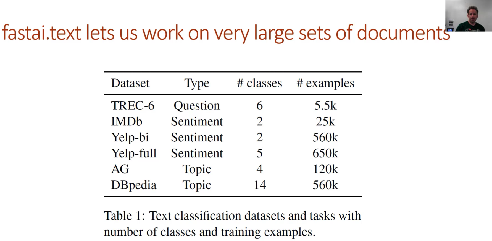

Some of them had many many hundreds of thousands of documents and they were far bigger than I had tried — but I thought it should work.

And he had a few good ideas as we went along and so you should totally make sure you read the paper. He said "well, this thing that you called in the lessons differential learning rates, differential kind of means something else. Maybe we should rename it" so we renamed it. It's now called **discriminative learning rate**. So this idea that we had from part one where we use different learning rates for different layers, after doing some literature research, it does seem like that hasn't been done before so it's now officially a thing — discriminative learning rates. This is something we learnt in lesson 1 but it now has an equation with Greek and everything [01:48:41]:

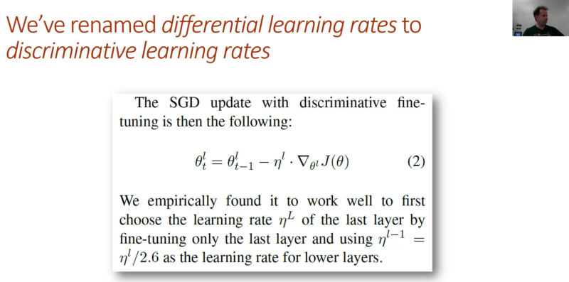

When you see an equation with Greek and everything, that doesn't necessarily mean it's more complex than anything we did in lesson 1 because this one isn't.

Again, that idea of like unfreezing a layer at a time, also seems to never been done before so it's now a thing and it's got the very clever name "gradual unfreezing" [01:48:57].

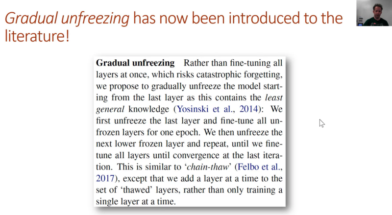

#### ([1:49:09](https://youtu.be/h5Tz7gZT9Fo?t=1h49m09s)) New version of Cyclical Learning Rate

So then, as promised, we will look at **slanted triangular learning rates** . This actually was not my idea. Leslie Smith, one of my favorite researchers who you all now know about, emailed me a while ago and said "I'm so over cyclical learning rates. I don't do that anymore. I now do a slightly different version where I have one cycle which goes up quickly at the start, and then slowly down afterwards. I often find it works better." I've tried going back over all of my old datasets and it works better for all of them — every one I tried. So this is what the learning rate look like. You can use it in fastai just by adding `use_clr=` to your `fit`. The first number is the ratio between the highest learning rate and the lowest learning rate so the initial learning rate is 1/32 of the peak. The second number is the ratio between the first peak and the last peak. The basic idea is if you are doing a cycle length 10, that you want the first epoch to be the upward bit and the other 9 epochs to be the downward bit, then you would use 10. I find that works pretty well and that was also Leslie's suggestion is make about 1/10 of it the upward bit and 9/10 the downward bit. Since he told me about it, maybe two days ago, he wrote this amazing paper: [A DISCIPLINED APPROACH TO NEURAL NETWORK HYPER-PARAMETERS](https://arxiv.org/abs/1803.09820). In which, he describes something very slightly different to this again, but the same basic idea. This is a **must read paper**. It's got all the kinds of ideas that fastai talks about a lot in great depth and nobody else is talking about this. It's kind of a slog, unfortunately Leslie had to go away on a trip before he really had time to edit it properly, so it's a little bit slow reading, but don't let that stop you. It's amazing.

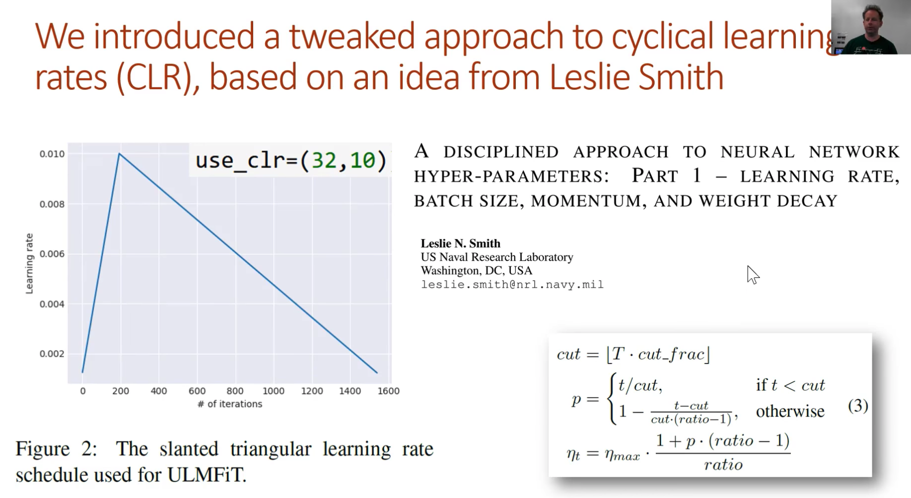

The equation on the right is from my paper with Sebastian. Sebastian asked "Jeremy, can you send me the math equation behind that code you wrote?" and I said "no, I just wrote the code. I could not turn it into math" so he figured out the math for it.

#### ([1:51:34](https://youtu.be/h5Tz7gZT9Fo?t=1h51m34s)) Concat Pooling

So you might have noticed, the first layer of our classifier was equal to embedding size*3 . Why times 3? Times 3 because, and again, this seems to be something which people haven't done before, so a new idea "concat pooling". It is that we take the average pooling over the sequence of the activations, the max pooling of the sequence over the activations, and the final set of activations, and just concatenate them all together. This is something which we talked about in part 1 but doesn't seem to be in the literature before so it's now called "concat pooling" and it's now got an equation and everything but this is the entirety of the implementation. So you can go through this paper and see how the fastai code implements each piece.

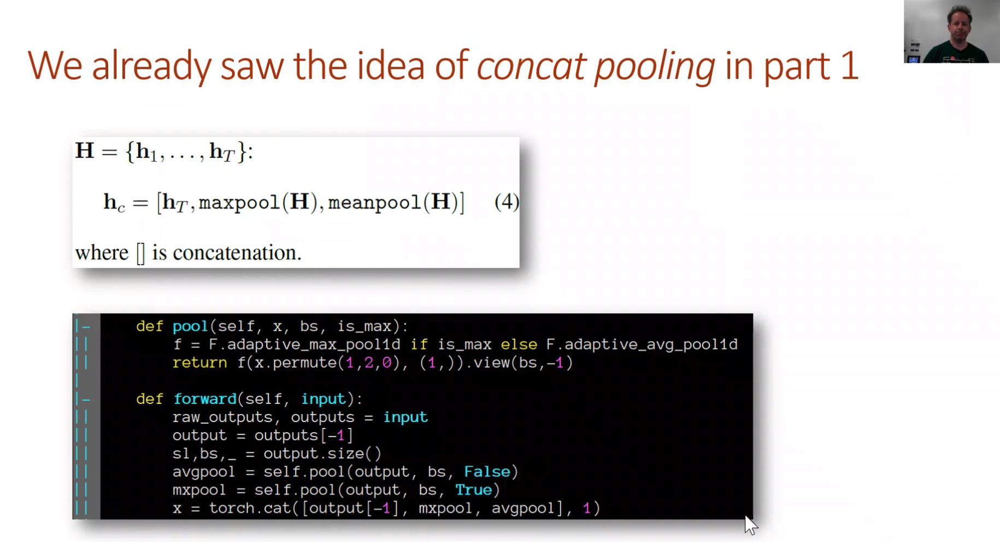

#### ([1:52:44](https://youtu.be/h5Tz7gZT9Fo?t=1h52m44s)) RNN encoder and `MultiBatchRNN` encoder - BPTT for text classification (BPT3C)

One of the kind of interesting pieces is the difference between `RNN_Encoder` which you've already seen and MultiBatchRNN encoder. So what's the difference there? The key difference is that the normal RNN encoder for the language model, we could just do `bptt` chunk at a time. But for the classifier, we need to do the whole document. We need to do the whole movie review before we decide if it's positive or negative. And the whole movie review can easily be 2,000 words long and we can't fit 2,000 words worth of gradients in my GPU memory for every single one of my weights. So what do we do? So the idea was very simple which is I go through my whole sequence length one batch of `bptt` at a time. And I call `super().forward` (in other words, the `RNN_Encoder`) to grab its outputs, and then I've got this maximum sequence length parameter where it says "okay, as long as you are doing no more than that sequence length, then start appending it to my list of outputs." So in other words, the thing that it sends back to this pooling is only as many activations as we've asked it to keep. That way, you can figure out what `max_seq` can your particular GPU handle. So it's still using the whole document, but let's say `max_seq` is 1,000 words and your longest document length is 2,000 words. It's still going through RNN creating states for those first thousand words, but it's not actually going to store the activations for the backprop of the first thousand. It's only going to keep the last thousand. So that means that it can't back-propagate the loss back to any state that was created in the first thousand words — basically that's now gone. So it's a really simple piece of code and honestly when I wrote it I didn't spend much time thinking about it, it seems so obviously the only way this could possibly work. But again, it seems to be a new thing, so we now have backprop through time for text classification. You can see there's lots of little pieces in this paper.

:memo: *Note-to-self: I have skimmed through the paper. TODO: read the paper throughly.*

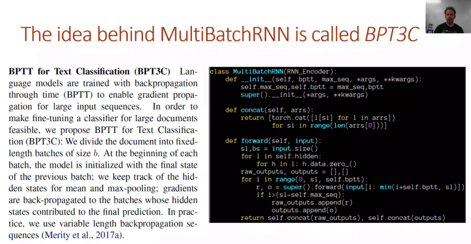

#### ([01:55:56](https://youtu.be/h5Tz7gZT9Fo?t=1h55m56s)) Results

What was the result? On every single dataset we tried, we got better result than any previous academic paper for text classification. All different types. Honestly, IMDb was the only one I spent any time trying to optimize the model, so most of them, we just did it whatever came out first. So if we actually spent time with it, I think this would be a lot better. The things that these are comparing to, most of them are different on each table because they are customized algorithms on the whole. So this is saying one simple fine-tuning algorithm can beat these really customized algorithms.

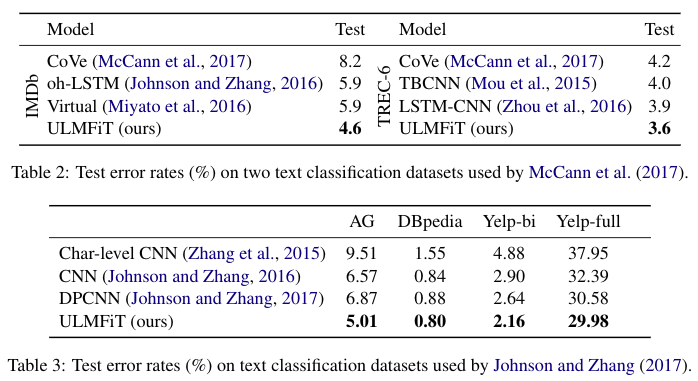

### ([01:56:56](https://youtu.be/h5Tz7gZT9Fo?t=1h56m56s)) Ablation studies

Here is the ablation studies Sebastian did. I was really keen that if you are going to publish a paper, we had to say why it works. So Sebastian went through and tried removing all of those different contributions I mentioned. So what is we don't use gradual freezing? What if we don't use discriminative learning rates? What if instead of discrimination rates, we use cosign annealing? What if we don't do any pre-training with Wikipedia? What if we don't do any fine tuning? And the really interesting one to me was, what's the validation error rate on IMDb if we only used a hundred training examples (vs. 200, vs. 500, etc). And you can see, very interestingly, the full version of this approach is nearly as accurate on just a hundred training examples — it's still very accurate vs. full 20,000 training examples. Where as if you are training from scratch on 100, it's almost random. It's what I expected. I've said to Sebastian I really think that this is most beneficial when you don't have much data. This is where fastai is most interested in contributing — small data regimes, small compute regimes, and so forth. So he did these studies to check.

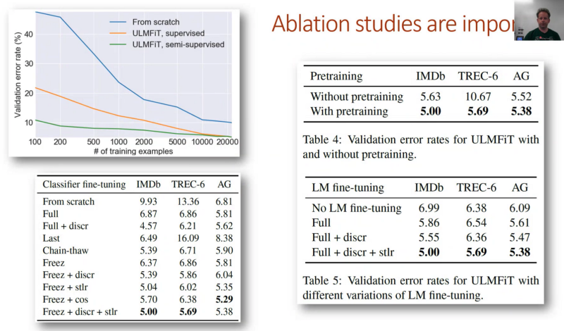

#### ([1:58:32](https://youtu.be/h5Tz7gZT9Fo?t=1h58m32s)) Tricks to run ablation studies

**Trick #1: VNC**

The first trick is something which I know you're all going to find really handy. I know you've all been annoyed when you are running something in a Jupyter notebook, and you lose your internet connection for long enough that it decides you've gone away, and then your session disappears, and you have to start it again from scratch. So what do you do? There is a very simple cool thing called VNC where you can install on your AWS instance or PaperSpace, or whatever:

- X Windows (`xorg`)
- Lightweight window manager (`lxde-core`)
- VNC server (`tightvncserver`)
- Firefox (`firefox`)
- Terminal (`lxterminal`)
- Some fonts (`xfonts-100dpi`)

Chuck the lines at the end of your `./vnc/xstartup` configuration file, and then run this command (`tightvncserver :13 -geometry 1200x900`):

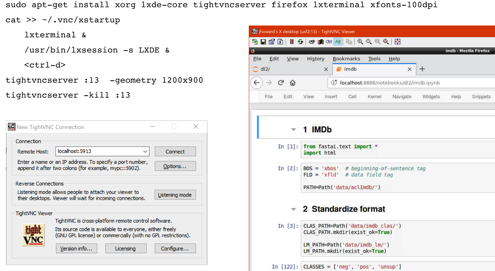

It's now running a server where you can then run the TightVNC Viewer or any VNC viewer on your computer and you point it at your server. But specifically, what you do is you use SSH port forwarding to forward :5913 to localhost:5913:

`(fastai) ubuntu@server:~$ ssh -L 5913:localhost:5913 ubuntu@{insert-your-server-ipaddress}`

Then you connect to port 5013 on localhost. It will send it off to port 5913 on your server which is the VNC port (because you said :13) and it will display an X Windows desktop. Then you can click on the Linux start like button and click on Firefox and you now have Firefox. You see here in Firefox, it says localhost because this Firefox is running on my AWS server. So you now run Firefox, you start your thing running, and then you close your VNC viewer remembering that Firefox is displaying on this virtual VNC display, not in a real display, so then later on that day, you log back into VNC viewer and it pops up again. So it's like a persistent desktop, and it's shockingly fast. It works really well. There's lots of different VNC servers and clients, but this one works fine for me.

**Trick #2: Google Fire** ([02:01:27](https://youtu.be/h5Tz7gZT9Fo?t=2h1m27s))

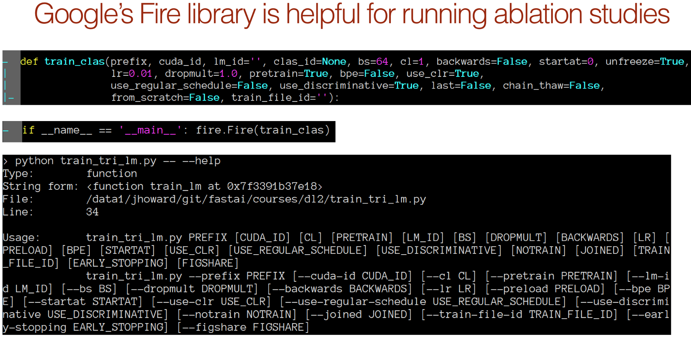

Trick #2 is to create Python scripts, and this is what we ended up doing. So I ended up creating a little Python script for Sebastian to kind of say this is the basic steps you need to do, and now you need to create different versions for everything else. And I suggested to him that he tried using this thing called Google Fire. What Google Fire does is, you create a function with tons of parameters, so these are all the things that Sebastian wanted to try doing — different dropout amounts, different learning rates, do I use pre-training or not, do I use CLR or not, do I use discriminative learning rate or not, etc. So you create a function, and then you add something saying:

`if __name__ == '__main__': fire.Fire(train_clas)`

You do nothing else at all — you don't have to add any metadata, any docstrings, anything at all, and you then call that script and automatically you now have a command line interface. That's a super fantastic easy way to run lots of different variations in a terminal. This ends up being easier if you want to do lots of variations than using a notebook because you can just have a bash script that tries all of them and spits them all out.

**Trick #3: IMDb scripts** ([02:02:47](https://youtu.be/h5Tz7gZT9Fo?t=2h2m47s))

You'll find inside the `courses/dl2` directory in fastai GitHub repo, there's now something called `imdb_scripts`, and I put all the scripts Sebastian and I used. Because we needed to tokenize and numericalize every dataset, then train a language model and a classifier for every dataset. And we had to do all of those things in a variety of different ways to compare them, so we had scripts for all those things. You can check out and see all of the scripts that we used.

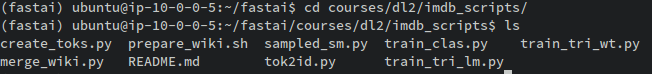

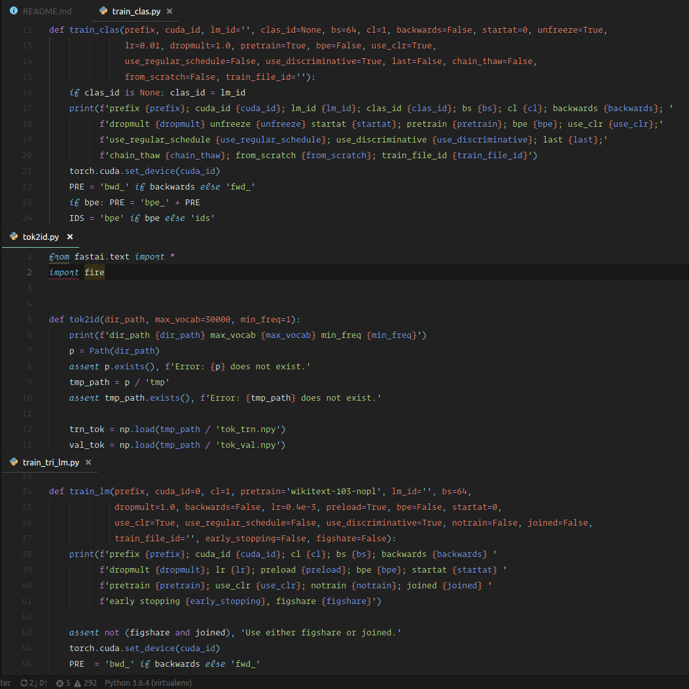

**Trick #4: pip install -e** ([02:03:32](https://youtu.be/h5Tz7gZT9Fo?t=2h3m32s))

When you are doing a lot of scripts, you got different code all over the place. Eventually it might get frustrating that you don't want to symlink your fastai library again and again. But you probably don't want to pip install it because that version tends to be a little bit old as we move so fast that you want to use the current version in Git. If you say `pip install -e` . from fastai repo base, it does something quite neat which is basically creates a symlink to the fastai library (i.e. your locally cloned Git repo) inside site-packages directory. Your site-packages directory is your main Python library. So if you do this, you can then access fastai from anywhere but every time you do `git pull`, you've got the most recent version. One downside of this is that it installs any updated versions of packages from pip which can confuse Conda a little bit, so another alternative here is just do symlink the fastai library to your site packages library. That works just as well. You can use fastai from anywhere and it's quite handy when you want to run scripts that use fastai from different directories on your system.


**Trick #5: SentencePiece; Tokenize sub-word units** ([02:05:06](https://youtu.be/h5Tz7gZT9Fo?t=2h5m6s))

[SentencePiece GitHub repo](https://github.com/google/sentencepiece)

This is something you can try if you like. You don't have to tokenize. Instead of tokenizing words, you can tokenize what are called sub-word units. For example, "unsupervised" could be tokenized as "un" and "supervised". "Tokenizer" can be tokenized as ["token", "izer"]. Then you could do the same thing. The language model that works on sub-word units, a classifier that works on sub-word units, etc. How well does that work? I started playing with it and with not too much playing, I was getting classification results that were nearly as good as using word level tokenization — not quite as good, but nearly as good. I suspect with more careful thinking and playing around, maybe I could have gotten as good or better. But even if I couldn't, if you create a sub-word-unit WikiText model, then IMDb language model, and then classifier forwards and backwards and then ensemble it with the forwards and backwards word level ones, you should be able to beat us. So here is an approach you may be able to beat our state-of-the-art result.

Sebastian told me this particular project — Google has a project called SentencePiece which actually uses a neural net to figure out the optimal splitting up of words and so you end up with vocabulary of sub-word units. In my playing around, I found that create vocabulary of about 30,000 sub-word units seems to be about optimal. If you are interested, there is something you can try. It is a bit of a pain to install — it's C++, doesn't have create error message, but it will work. There is a Python library for it. If anybody tries this, I'm happy to help them get it working. There's been little, if any, experiments with ensembling sub-word and word level classification, and I do think it should be the best approach.
