# Lesson 13 - Image Enhancement; Style Transfer; Data Ethics

_These are my personal notes from fast.ai course and will continue to be updated and improved if I find anything useful and relevant while I continue to review the course to study much more in-depth. Thanks for reading and happy learning!_

## Topics

* Image enhancement.
  * Neural style transfer.
    * An interesting approach that allows us to change the style of images in whatever way we like.
    * Optimize pixels, instead of weights, which is an interesting different way of looking at optimization.
* Generative models (and many other techniques we've discussed) can cause harm just as easily as they can benefit society.
  * Ethics in AI.
    * Bias is an important current topic in data ethics.
  * Get a taste of some of the key issues, and ideas for where to learn more.
* fastai library
  * TrainPhase API
    * SGD, SGD with Warm Restarts (SGDR), 1cycle
    * Discriminative learning rates + 1cycle
  * DAWNBench entries
    * ImageNet training
    * CIFAR10 result

## Lesson Resources

* [Website](http://course.fast.ai/lessons/lesson13.html)
* [Video](https://youtu.be/nG3tT31nPmQ)
* [Wiki](http://forums.fast.ai/t/part-2-lesson-14-wiki)
* Jupyter Notebook and code
  * [training_phase.ipynb](https://nbviewer.jupyter.org/github/fastai/fastai/blob/master/courses/dl2/training_phase.ipynb) - demo notebook on how to use the new TrainingPhase API in fastai library by Sylvain Gugger
  * [style-transfer.ipynb](https://nbviewer.jupyter.org/github/fastai/fastai/blob/master/courses/dl2/style-transfer.ipynb)
* Dataset for style transfer notebook
  * ImageNet sample in files.fast.ai/data / [direct download link](http://files.fast.ai/data/imagenet-sample-train.tar.gz) (2.1 GB)
  * Full ImageNet [[faster download from Kaggle](https://www.kaggle.com/c/imagenet-object-localization-challenge/data), mirrored over from the [ImageNet Download Site](http://www.image-net.org/download-imageurls)]

## Assignments

### Papers

* Must read
  * [Deep Painterly Harmonization](https://arxiv.org/abs/1804.03189) by Fujun Luan, et. al
  * [Progressive Growing of GANs for Improved Quality, Stability, and Variation](http://research.nvidia.com/publication/2017-10_Progressive-Growing-of) by Tero Karras, et. al
  * [A Neural Algorithm of Artistic Style](https://arxiv.org/abs/1508.06576) by Leon A. Gatys, et. al
* Additional papers (optional)
  * [Large Batch Training of Convolutional Networks](https://arxiv.org/abs/1708.03888) - a training algorithm based on Layer-wise Adaptive Rate Scaling (LARS)

### Other Resources

#### Blog Posts and Articles

* [Adding a cutting-edge deep learning training technique to the fast.ai library](https://medium.com/@hortonhearsafoo/adding-a-cutting-edge-deep-learning-training-technique-to-the-fast-ai-library-2cd1dba90a49) by fast.ai International Fellow, William Horton - averaging weights leads to wider optima and better generalization

#### Other Useful Information

* [Rachel's numerical linear algebra course](https://github.com/fastai/numerical-linear-algebra)
* [Pytorch implementation of Universal Style Transfer via Feature Transforms](https://github.com/sunshineatnoon/PytorchWCT)
* [Gender Shades by MIT Media Lab](http://gendershades.org/) - AI and ethics

## My Notes

### Image enhancement

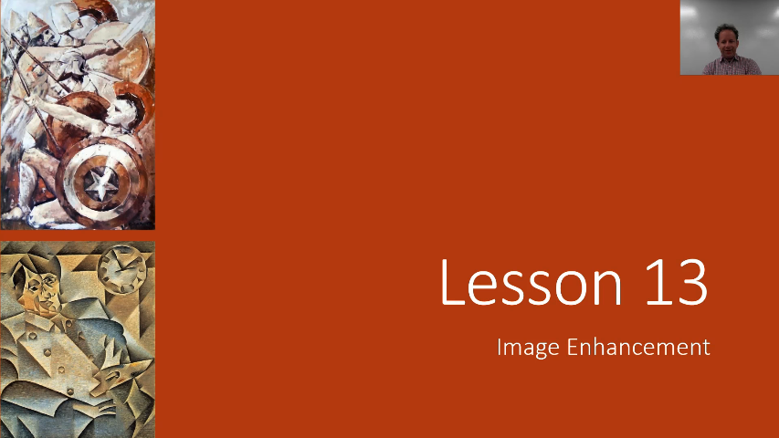


Image enhancement — we'll cover things like this painting that you might be familiar with. However, you might not have noticed before that this painting of an eagle in it. The reason you may not have noticed that before is this painting didn't used to have an eagle in it. By the same token, the painting on the first slide did not used to have Captain America's shield on it either.

#### Deep painterly harmonization paper - style transfer [[00:00:40](https://youtu.be/xXXiC4YRGrQ?t=40)]

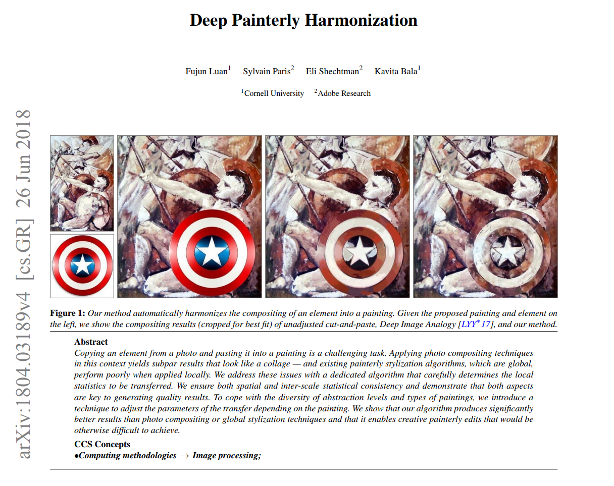

This is a cool new paper that just came out a couple of days ago called [Deep Painterly Harmonization](https://arxiv.org/abs/1804.03189) and it uses almost exactly the technique we are going to learn in this lesson with some minor tweaks. But you can see the basic idea is to take one picture pasted on top of another picture, and then use some kind of approach to combine the two. The approach is called a "style transfer".

---

### Stochastic Weight Averaging [[00:01:10](https://youtu.be/xXXiC4YRGrQ?t=70)]

Before we talk about that, I wanted to mention this really cool contribution by [William Horton who added this stochastic weight averaging technique to the fastai library](https://medium.com/@hortonhearsafoo/adding-a-cutting-edge-deep-learning-training-technique-to-the-fast-ai-library-2cd1dba90a49) that is now all merged and ready to go. He's written a whole post about that which I strongly recommend you check out not just because stochastic weight averaging lets you get higher performance from your existing neural network with basically no extra work (it's as simple as adding two parameters to your fit function: `use_swa`, `swa_start`) but also he's described his process of building this and how he tested it and how he contributed to the library. So I think it's interesting if you are interested in doing something like this. I think William had not built this kind of library before so he describes how he did it.

### Train Phase [[00:02:01](https://youtu.be/xXXiC4YRGrQ?t=2m1s)]

[Notebook](https://nbviewer.jupyter.org/github/fastai/fastai/blob/master/courses/dl2/training_phase.ipynb)

Another very cool contribution to the fastai library is a new Train Phase API. And I'm going to do something I've never done before which is I'm going to present somebody else's notebook. The reason I haven't done it before is because I haven't liked any notebooks enough to think they are worth presenting it, but Sylvain has done a fantastic job here of not just creating this new API but also creating a beautiful notebook describing what it is and how it works and so forth. The background here is as you guys know **we've been trying to train networks faster**, partly as part of this DAWSBench competition and also for a reason that you'll learn about next week. I mentioned on the forum last week it would be really handy for our experiments if we had an easier way to try out different learning rate schedules etc, and I laid out an API that I had in mind as it'd be really cool if somebody could write this because I am going to bed now and I kind of need it by tomorrow. And Sylvain replied on the forum well that sounds like a good challenge and by 24 hours later, it was done and it's been super cool. I want to take you through it because it's going to allow you to research things that nobody has tried before.

It's called the `TrainPhase` API [00:03:32] and the easiest way to show it is to show an example of what it does. Here is an iteration against learning rate chart as you are familiar with seeing. This is one where we train for a while at the learning rate of 0.01 and then we train for a while at the learning rate of 0.001. I actually wanted to create something very much like that learning rate chart because most people that trained ImageNet use this stepwise approach and it's actually not something that's built into fastai because it's not generally something we recommend. But in order to replicate existing papers, I wanted to do it the same way. So rather than writing a number of fit, fit, fit calls with different learning rates, it would be nice to be able to say train for *n* epochs at this learning rate and then *m* epochs at that learning rate.

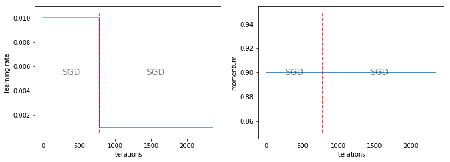

So here is how you do that:

```python
phases = [TrainingPhase(epochs=1, opt_fn=optim.SGD, lr=1e-2),
          TrainingPhase(epochs=2, opt_fn=optim.SGD, lr=1e-3)]
```

A phase is a period of training with particular optimizer parameters and `phases` consist of a number of training phase objects. A training phase object says how many epochs to train for, what optimization function to use, and what learning rate amongst other things that we will see. Here, you'll see the two training phases that you just saw on that graph. So now, rather than calling `learn.fit`, you say:

```python
learn.fit_opt_sched(phases)
```

In other words, `learn.fit` with an optimizer scheduler with these phases. From there, most of the things you pass in can just get sent across to the fit function as per usual, so most of the usual parameter will work fine. Generally speaking, we can just use these training phases and you will see it fits in a usual way. Then when you say `plot_lr` you will see the graphs above. Not only does it plot the learning rate, it also plots momentum, and for each phase, it tells you what optimizer it used. You can turn off the printing of the optimizers (`show_text=False`), you can turn off the printing of momentums (`show_moms=False`), and you can do other little things like a training phase could have a `lr_decay` parameter [00:05:47]:

```python
phases = [TrainingPhase(epochs=1, opt_fn=optim.SGD, lr=1e-2),
          TrainingPhase(epochs=1, opt_fn=optim.SGD, lr=(1e-2, 1e-3), lr_decay=DecayType.LINEAR),
          TrainingPhase(epochs=1, opt_fn=optim.SGD, lr=1e-3)]
```

So here is a fixed learning rate, then a linear decay learning rate, and then a fixed learning rate which gives up this picture:

```python
lr_i = start_lr + (end_lr - start_lr) * i/n
```


This might be quite a good way to train because we know at high learning rates, you get to explore better, and at low learning rates, you get to fine-tune better. And it's probably better to gradually slide between the two. So this actually isn't a bad approach, I suspect.

You can use other decay types such as cosine [00:06:25]:

```python
phases = [TrainingPhase(epochs=1, opt_fn=optim.SGD, lr=1e-2),
          TrainingPhase(epochs=1, opt_fn=optim.SGD, lr=(1e-2, 1e-3), lr_decay=DecayType.COSINE),
          TrainingPhase(epochs=1, opt_fn=optim.SGD, lr=1e-3)]
```

This probably makes even more sense as a genuinely potentially useful learning rate annealing shape.

```python
lr_i = end_lr + (start_lr - end_lr) / 2 * (1 + np.cos(i * np.pi) / n)
```


Exponential which is super popular approach:

```python
lr_i = start_lr * (end_lr / start_lr)**(i / n)
```


Polynomial which isn't terribly popular but actually in the literature works better than just about anything else, but seems to have been largely ignored. So polynomial is good to be aware of. And what Sylvain has done is he's given us the formula for each of these curves. So with a polynomial, you get to pick what polynomial to use. I believe `p` of `0.9` is the one I've seen really good results for — FYI.

```python
lr_i = end_lr + (start_lr - end_lr) * (1 - i / n)**p
```


If you don't give a tuple of learning rates when there is an LR decay, then it will decay all the way down to zero [00:07:26]. And as you can see, you can happily start the next cycle at a different point.

```python
phases = [TrainingPhase(epochs=1, opt_fn=optim.SGD, lr=1e-2),
          TrainingPhase(epochs=1, opt_fn=optim.SGD, lr=1e-2, lr_decay=DecayType.COSINE),
          TrainingPhase(epochs=1, opt_fn=optim.SGD, lr=1e-3)]
```


### SGDR [[00:07:43](https://youtu.be/xXXiC4YRGrQ?t=7m43s)]

So the cool thing is, now we can replicate all of our existing schedules using nothing but these training phases. So here is a function called `phases_sgdr` which does SGDR using the new training phase API.

```python
def phases_sgdr(lr, opt_fn, num_cycle, cycle_len, cycle_mult):
    phases = [TrainingPhase(epochs=cycle_len / 20, opt_fn=opt_fn, lr=lr / 100),
              TrainingPhase(epochs=cycle_len * 19 / 20,
                            opt_fn=opt_fn, lr=lr, lr_decay=DecayType.COSINE)]

    for i in range(1, num_cycle):
        phases.append(TrainingPhase(epochs=cycle_len * (cycle_mult**i), opt_fn=opt_fn, lr=lr,
                      lr_decay=DecayType.COSINE))
    return phases
```

So you can see, if he runs this schedule, here is what it looks like:


He's even done the little trick I have where you're training at really low learning rate just for a little bit and then pop up and do a few cycles, and the cycles are increasing in length [00:08:05]. And that's all done in a single function.

### 1cycle [[00:08:20](https://youtu.be/xXXiC4YRGrQ?t=8m20s)]

The new [1cycle policy](https://sgugger.github.io/the-1cycle-policy.html), we can now implement with, again, a single little function.

```python
def phases_1cycle(cycle_len, lr, div, pct, max_mom, min_mom):
    tri_cyc = (1 - pct / 100) * cycle_len

    return [TrainingPhase(epochs=tri_cyc/2, opt_fn=optim.SGD,
                          lr=(lr/div, lr), lr_decay=DecayType.LINEAR,
                          momentum=(max_mom, min_mom),
                          momentum_decay=DecayType.LINEAR),
           TrainingPhase(epochs=tri_cyc/2, opt_fn=optim.SGD,
                         lr=(lr, lr/div), lr_decay=DecayType.LINEAR,
                          momentum=(min_mom, max_mom),
                          momentum_decay=DecayType.LINEAR),
           TrainingPhase(epochs=cycle_len-tri_cyc, opt_fn=optim.SGD,
                         lr=(lr/div, lr/(100*div)),
                         lr_decay=DecayType.LINEAR,
                         momentum=max_mom)]
```

So if we fit with that, we get this triangle followed by a little flatter bit and the momentum is a cool thing — the momentum has a momentum decay. And in the third `TrainingPhase`, we have a fixed momentum. So it's doing the momentum and the learning rate at the same time.

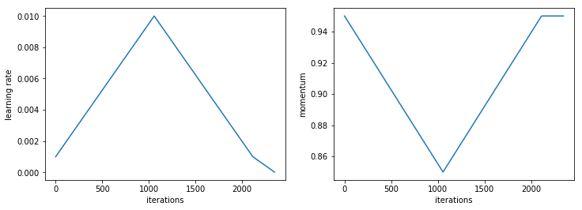

### Discriminative learning rates + 1cycle [[00:08:53](https://youtu.be/xXXiC4YRGrQ?t=8m53s)]

So something that I haven't tried yet, but I think would be really interesting is to use the combination of discriminative learning rates and 1cycle. No one has tried yet. So that would be really interesting. The only paper I've come across which has discriminative learning rate uses something called [LARS](https://arxiv.org/abs/1708.03888). It was used to train ImageNet with very very large batch sizes by looking at the ratio between the gradient and the mean at each layer and using that to change the learning rate of each layer automatically. They found that they could use much larger batch sizes. That's the only other place I've seen this kind of approach used, but there's lots of interesting things you could try with combining discriminative learning rates and different interesting schedules.

### Customize LR finder / Your own LR finder [[00:10:06](https://youtu.be/xXXiC4YRGrQ?t=10m6s)]

You can now write your own LR finder of different types, specifically because there is now this `stop_div` parameter which basically means that it'll use whatever schedule you asked for but when the loss gets too bad, it'll stop training.

One useful thing that's been added is the `linear` parameter to the `plot` function. If you use linear schedule rather than an exponential schedule in your learning rate finder which is a good idea if you fine-tuned into roughly the right area, then you can use linear to find exactly the right area. Then you probably want to plot it with a linear scale. So that's why you can also pass linear to plot now as well.

You can change the optimizer each phase [00:11:06]. That's more important than you might imagine because actually **the current state-of-the-art for training on really large batch sizes really quickly for ImageNet actually starts with RMSProp for the first bit, then they switch to SGD for the second bit**. So that could be something interesting to experiment more with because at least one paper has now shown that that can work well. :bookmark: Again, it's something that isn't well appreciated as yet.

### Changing data [[00:11:49](https://youtu.be/xXXiC4YRGrQ?t=11m49s)]

Then the bit I find most interesting is you can change your data. Why would we want to change our data? Because you remember from lesson 1 and 2, you could **use small images at the start and bigger images later**. The theory is that you could use that to train the first bit more quickly with smaller images, and remember if you halve the height and halve the width, you've got the quarter of the activations every layer, so it can be a lot faster. It might even generalize better. So you can now create a couple of different sizes, for example, here, we got 28 and 32 sized images. This is CIFAR10 so there's only so much you can do. Then if you pass in an array of data in this `data_list` parameter when you call `fit_opt_sched`, it'll use different dataset for each phase.

```python
data1 = get_data(28, batch_size)
data2 = get_data(32, batch_size)
learn = ConvLearner.from_model_data(ShallowConvNet(), data1)
phases = [TrainingPhase(epochs=1, opt_fn=optim.Adam, lr=1e-2,
                        lr_decay=DecayType.COSINE),
          TrainingPhase(epochs=2, opt_fn=optim.Adam, lr=1e-2,
                        lr_decay=DecayType.COSINE)]
learn.fit_opt_sched(phases, data_list=[data1, data2])
```

:bookmark: *note-to-self: run experiments in `train_phase.ipyn` notebook with my own dataset.*

#### DAWNBench competition for ImageNet

That's really cool because we can use that now like we could use that in our DAWNBench entries and see what happens when we actually increase the size with very little code. So what happens when we do that [00:13:02]? The answer is here in DAWNBench training on ImageNet:

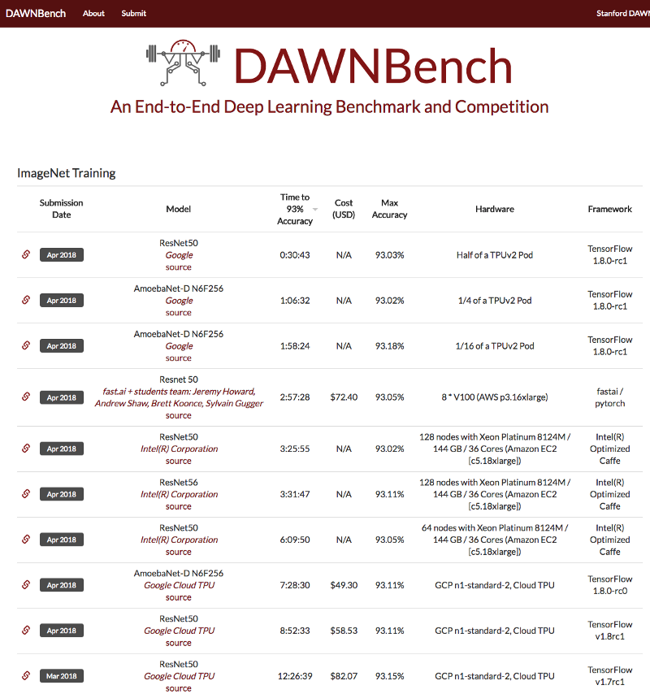

You can see here that Google has won this with half an hour on a cluster of TPUs. The best non-cluster of TPU result is fast.ai + students under 3 hours beating out Intel on 128 computers, where else, we ran on a single computer. We also beat Google running on a TPU so using this approach, we've shown:

- the fastest GPU result
- the fastest single machine result
- the fastest publicly available infrastructure result

These TPU pods, you can't use unless you're Google. Also the cost is tiny ($72.54), this Intel one costs them $1,200 worth of compute — they haven't even written it here, but that's what you get if you use 128 computers in parallel each one with 36 cores, each one with 140G compare to our single AWS instance. So **this is kind of a breakthrough in what we can do**. The idea that we can train ImageNet on a single publicly available machine and this is $72, by the way, it was actually $25 because we used a spot instance. One of our students Andrew Shaw built this whole system to allow us to throw a whole bunch of spot instance experiments up and run them simultaneously and pretty much automatically, but DAWNBench doesn't quote the actual number we used. So *it's actually $25, not $72*. So this `data_list` idea is super important and helpful.

#### CIFAR10 result on DAWNBench [[00:15:15](https://youtu.be/xXXiC4YRGrQ?t=15m15s)]

Our CIFAR10 results are also now up there officially and you might remember the previous best was a bit over an hour. The trick here was using 1cycle, so all of this stuff that's in Sylvain's training phase API is really all the stuff that we used to get these top results. And another fast.ai student who goes by the name *bkj* has taken that and done his own version, he took a Resnet18 and added the concat pooling that you might remember that we learnt about on top, and used Leslie Smith's 1cycle and so he's got on the leaderboard. So all the top 3 are fast.ai students which wonderful.


#### CIFAR10 cost result [[00:16:05](https://youtu.be/xXXiC4YRGrQ?t=16m5s)]

Same for cost — the top 3 and you can see, Paperspace. Brett ran this on Paperspace and got the cheapest result just ahead of *bkj*.

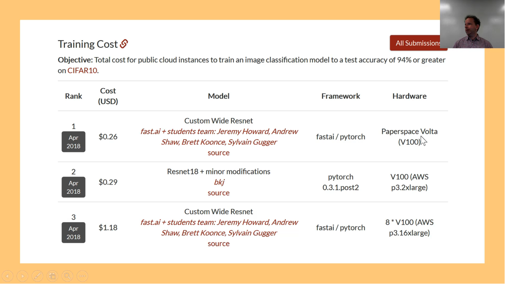

So I think you can see [00:16:25], a lot of the interesting opportunities at the moment for the training stuff more quickly and cheaply are all about learning rate annealing, size annealing, and training with different parameters at different times, and I still think everybody is scratching the surface. I think we can go a lot faster and a lot cheaper. That's really helpful for people in resource constrained environment which is basically everybody except Google, maybe Facebook.

### Conv Architecture Gap - Inception ResNet [[00:17:00](https://youtu.be/xXXiC4YRGrQ?t=17m)]

Architectures are interesting as well though, and one of the things we looked at last week was creating a simpler version of DarkNet architecture. But there's a piece of architecture we haven't talk about which is necessary to understand the [Inception network](https://arxiv.org/abs/1409.4842v1). The Inception network is actually pretty interesting because they use some tricks to make things more efficient. We are not currently using these tricks and I feel that maybe we should try it. The most interesting and most successful Inception network is their [Inception-ResNet-v2](https://ai.googleblog.com/2016/08/improving-inception-and-image.html) network and most of the blocks in that looks something like this:


It looks a lot like a standard ResNet block in that there's an identity connection, and there's a conv path, and we add them up together [00:17:47]. But it's not quite that. The first is the middle conv path is a 1x1 conv, and it's worth thinking about what a 1x1 conv actually is.

#### 1x1 convolution [[00:18:23](https://youtu.be/xXXiC4YRGrQ?t=18m23s)]

1x1 conv is simply saying for each grid cell in your input, you've got basically a vector. 1 by 1 by number of filters tensor is basically a vector. For each grid cell in your input, you're just doing a dot product with that tensor. Then of course, it's going to be one of those vectors for each of the 192 activations we are creating. So basically do 192 dot products with grid cell (1, 1) and then 192 with grid cell (1, 2) or (1, 3) and so forth. So you will end up with something which has the same grid size as the input and 192 channels in the output. So that's a really **good way to either reduce the dimensionality or increase the dimensionality of an input without changing the grid size**. That's normally what we use 1x1 convs for. Here, we have a 1x1 conv and another 1x1 conv, and then they add it together. Then there is a third path and this third path is not added. It is not explicitly mentioned but this third path is concatenated. There is a form of ResNet which is basically identical to ResNet but we don't do plus, we do concat. That's called a DenseNet. It's just a ResNet where we **do concat instead of plus**. That's an interesting approach because then the kind of the **identity path** is literally being copied. So you get that flow all the way through and so as we'll see next week, that tends to be **good for segmentation and stuff like that where you really want to keep the original pixels**, the first layer of pixels, and the second layer of pixels untouched.

#### Concat in Inception networks

Concatenating rather than adding branches is a very useful thing to do and we are concatenating the middle branch and the right right branch [00:20:22]. The right most branch is doing something interesting, which is, it's doing, first of all, the 1x1 conv, and then a 1x7, and then 7x1. What's going on there? So, what's going on there is basically what we really want to do is do 7x7 conv. The reason we want to do 7x7 conv is that if you have multiple paths (each of which has different kernel sizes), then it's able to look at different amounts of the image. The original Inception network had 1x1, 3x3, 5x5, 7x7 getting concatenated together or something like that. So if we can have a **7x7 filter, then we get to look at a lot of the image at once and create a really rich representation**. So the stem of the Inception network that is the first few layers of the Inception network actually also used this kind fo 7x7 conv because you start out with this 224 by 224 by 3, and you want to turn it into something that's 112 by 112 by 64. **By using a 7x7 conv, you can get a lot of information in each one of those outputs to get those 64 filters**. But the problem is that 7x7 conv is a lot of work. You've got 49 kernel values to multiply by 49 inputs for every input pixel across every channel. So the **compute is crazy**. You can kind of get away with it (maybe) for the very first layer, and in fact, the very first conv of ResNet is a 7x7 conv.

#### Basic idea of Inception networks

But not so for Inception [00:22:30]. They don't do a 7x7 conv, instead, they do a 1x7 followed by 7x1. So to explain, the basic idea of the Inception networks or all the different versions of it that you have a number of separate paths which have different convolution widths. In this case, conceptually the idea is the middle path is 1x1 convolution width, and the right path is going to be a 7 convolution width, so **they are looking at different amount of data and then we combine them together**. But we don't want to have a 7x7 conv through out the network because it's just too computationally expensive.

#### Instead of *A x A* use *A x 1* followed by *1 x A* - Lower rank approximation

But if you think about it [00:23:18], if we've got some input coming in and we have some big filter that we want and it's too big to deal with. What could we do? Let's do 5x5. What we can do is to create two filters — one which is 1x5, one which is 5x1. We take our activations of the previous layer, and we put it through the 1x5. We take the activations out of that, and put it through the 5x1, and something comes out the other end. Now what comes out the other end? Rather than thinking of it as, first of all, we take the activations, then we put it through the 1x5 then we put it through the 5x1, what if instead we think of these two operations together and say what is a 5x1 dot product and a 1x5 dot product do together? Effectively, you could take a 1x5 and 5x1 and the outer product of that is going to give you a 5x5. Now you can't create any possible 5x5 matrix by taking that product, but there's a lot of 5x5 matrices that you can create. So the basic idea here is when you think about the order of operations (if you are interested in more of the theory here, you should check out Rachel's numerical linear algebra course which is basically a whole course about this). **But conceptually, the idea is that very often the computation you want to do is actually more simple than an entire 5x5 convolution. Very often, the term we use in linear algebra is that there's some lower rank approximation.** In other words, that the 1x5 and the 5x1 combined together — that 5x5 matrix is nearly as good as the 5x5 matrix you ideally would have computed if you were able to. So this is very often the case in practice — just because the nature of the real world is that the real world tends to have more structure than randomness.

The cool thing is [00:26:16], if we replace our 7x7 conv with a 1x7 and 7x1, for each cell (grid), it has 14 by input channel by output channel dot products to do, whereas 7x7 one has 49 to do. So it's going to be a lot faster and we have to hope that it's going to be nearly as good. It's certainly capturing as much width of information by definition.

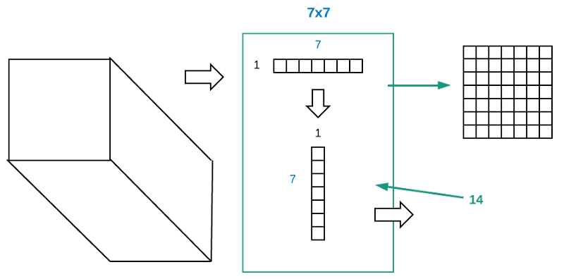

#### Factored convolutions

If you are interested in learning more about this, specifically in a deep learning area, you can google for **[Factored Convolutions](https://medium.com/@lisulimowicz/dilated-convolutions-and-kronecker-factored-convolutions-b42ed58b2bc7)**. The idea was come up with 3 or 4 years ago now. It's probably been around for longer, but that was when I first saw it. It turned out to work really well and the Inception network uses it quite widely.

#### Stem in backbone

They actually use it in their stem. We've talked before about how we tend to add-on — we tend to say this is main backbone when we have ResNet34, for example. This is main backbone which is all of the convolutions, and then we can add on to it a custom head that tends to be a max pooling or a fully connected layer. It's better to talk about the backbone is containing two pieces: one is the stem and the other is the main backbone. The reason is that the thing that's coming in has only 3 channels, so we want some sequence of operations which is going to expand that out into something richer — generally something like 64 channels.


In ResNet, the stem is super simple. It's a 7x7 stride 2 conv followed by a stride 2 max pool (I think that's it if memory serves correctly). Inception have a much more complex stem with multiple paths getting combined and concatenated including factored conv (1x7 and 7x1). I'm interested in what would happen if you stacked a standard ResNet on top of an Inception stem, for instance. I think that would be a really interesting thing to try because an Inception stem is quite a carefully engineered thing, and this thing of how you take 3 channel input and turn it into something richer seems really important. And all of that work seems to have gotten thrown away for ResNet. We like ResNet, it works really well. But what if we put a dense net backbone on top of an Inception stem? Or what if we replaced the 7x7 conv with a 1x7 and 7x1 factored conv in standard ResNet? There are lots of things we could try and I think it would be really interesting. :bookmark: So there's some more thoughts about potential research directions.

---

### Image enhancement paper - Progressive GANs

So that was kind of my little bunch of random stuff section [00:29:51]. Moving a little bit closer to the actual main topic of this which is image enhancement. I'm going to talk about a new paper briefly because it really connects what I just discussed with what we are going to discuss next. It's a paper on progressive GANS which came from Nvidia: [Progressive Growing of GANs for Improved Quality, Stability, and Variation](http://research.nvidia.com/publication/2017-10_Progressive-Growing-of). Progressive GANS takes this idea of gradually increasing the image size. It's the only other direction I am aware of that people have actually gradually increase the image size. It surprises me because this paper is actually very popular, well known, and well liked and yet, people haven't taken the basic idea of gradually increasing the image size and use it anywhere else which shows you the general level of creativity you can expect to find in the deep learning research community, perhaps.

#### Progressive GAN - increase image size

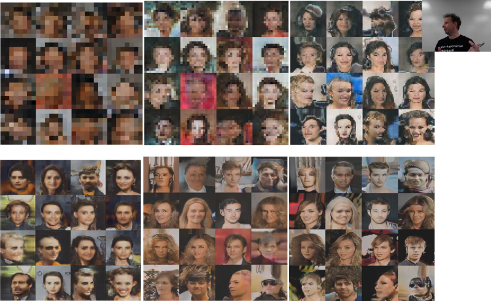

They really go back and they start with 4x4 GAN [00:31:47]. Literally, they are trying to replicate 4x4 pixel, and then 8x8 (the upper left ones above). This is the CelebA dataset so we are trying to recreate pictures of celebrities. Then they go 16x16, 32, 64, 128, then 256. One of the really nifty things they do is that as they increase the size, they also add more layers to the network. Which kind of makes sense because if you are doing more of a ResNet-y type thing, then you are spitting out something which hopefully makes sense at each grid cell size, so you should be able to layer stuff on top. They do another nifty thing where they add a skip connection when they do that, and they gradually change the linear interpolation parameter that moves it more and more away from the old 4x4 network and towards the new 8x8 network. Then once this totally moved it across, they throw away that extra connection. The details don't matter too much but it uses the basic ideas we've talked about, gradually increasing the image size and skip connections. It's a great paper to study because it is one of these rare things where good engineers actually built something that just works in a really sensible way. Now it's not surprising this actually comes from Nvidia themselves. Nvidia don't do a lot of papers and it's interesting that when they do, they build something that is so throughly practical and sensible. :bookmark: So I think **it's a great paper to study if you want to put together lots of the different things we've learned and there aren't many re-implementation of this so it's an interesting thing to project**, and maybe you could build on and find something else.

#### High-res GAN

Here is what happens next [00:33:45]. We eventually go up to 1024x1024, and you'll see that the images are not only getting higher resolution but they are getting better. So I am going to see if you can guess which one of the following is fake:

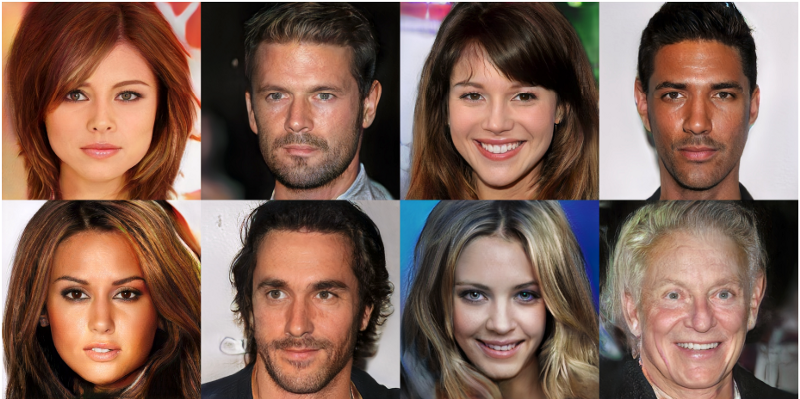

They are all fake. That's the next stage. You go up up up up and them BOOM. So GANS and stuff are getting crazy and some of you may have seen this during the week [00:34:16]. This video just came out and it's a speech by Barack Obama and let's check it out:

[](https://www.youtube.com/watch?v=cQ54GDm1eL0 "Fake Obama video")

As you can see, they've used this kind of technology to literally move Obama's face in the way that Jordan Peele's face was moving. You basically have all the techniques you need now to do that. Is that a good idea?

---

### Ethics in AI [[00:35:31](https://youtu.be/xXXiC4YRGrQ?t=35m31s)]

This is the bit where we talk about what's most important which is now that we can do all this stuff, what should we be doing and how do we think about that? The TL;DR version is I actually don't know. Recently a lot of you saw the founders of the spaCy prodigy folks down at the Explosion AI did a talk, Matthew and Ines, and I went to dinner with them afterwards, and we basically spent the entire evening talking, debating, arguing about what does it mean the companies like ours are building tools that are democratizing access to tools that can be used in harmful ways. They are incredibly thoughtful people and we, I wouldn't say we didn't agree, we just couldn't come to a conclusion ourselves. So I'm just going to lay out some of the questions and point to some of the research, and when I say research, most of the actual literature review and putting this together was done by Rachel, so thanks Rachel.

Let me start by saying the models we build are often pretty crappy in ways which are not immediately apparent [00:36:52]. You won't know how crappy they are unless the people that are building them with you are a range of people and the people that are using them with you are a range of people. For example, a couple of wonderful researchers, [Timnit Gebru](https://twitter.com/timnitGebru) is at Microsoft and [Joy Buolamwini](https://twitter.com/jovialjoy) just finished PhD from MIT, they did this really interesting research where they looked at some off-the-shelf face recognizers, one from FACE++ which is a huge Chinese company, IBM's, and Microsoft's, and they looked for a range of different face types.


Generally speaking, Microsoft one in particular was incredibly accurate unless the face type happened to be dark-skinned when suddenly it went 25 times worse. IBM got it wrong nearly half the time. For a big company like this to release a product that, for large percentage of the world, doesn't work is more than a technical failure. It's a really deep failure of understanding what kind of team needs to be used to create such a technology and to test such a technology or even an understanding of who your customers are. Some of your customers have dark skin. "I was also going to add that the classifiers all did worse on women than on men" (Rachel). Shocking. It's funny that Rachel tweeted about something like this the other day, and some guy said "What's this all about? What are you saying? Don't you know people made cars for a long time — are you saying you need women to make cars too?" And Rachel pointed out — well actually yes. For most of the history of car safety, women in cars have been far more at risk of death than men in cars because the men created male looking, feeling, sized crash test dummies, so car safety was literally not tested on women size bodies. Crappy product management with a total failure of diversity and understanding is not new to our field.

"I was just going to say that was comparing impacts of similar strength for men and women " (Rachel). I don't know why whenever you say something like this on Twitter, Rachel has to say this because anytime you say something like this on Twitter, there's about 10 people who'll say "oh, you have to compare all these other things" as if we didn't know that.

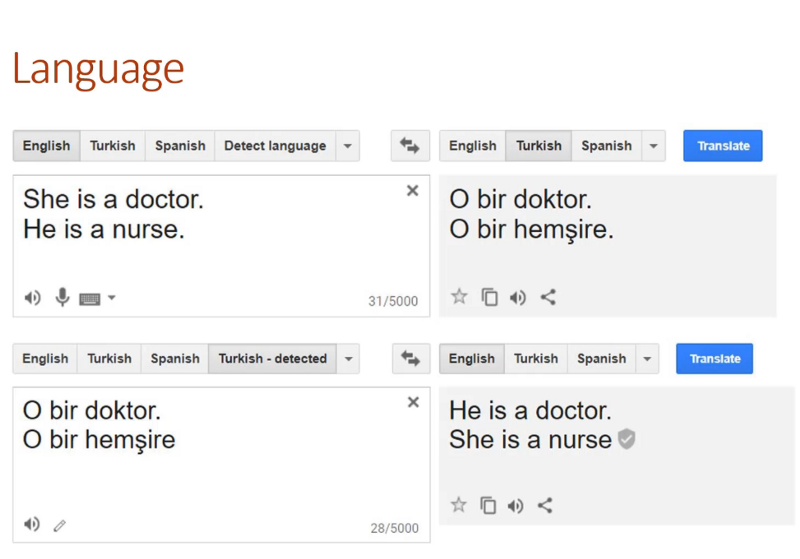

Other things our very best most famous systems do like Microsoft's face recognizer or Google's language translator, you turn "She is a doctor. He is a nurse." into Turkish and quite correctly — both pronouns become O because there is no gendered pronouns in Turkish. Go the other direction, what does it get turned into? "He is a doctor. She is a nurse." So we've got these kind of biases built into tools that we are all using every day. And again, people say "oh, it's just showing us what's in the world" and okay, there's lots of problems with that basic assertion, but as you know, machine learning algorithms love to generalize.

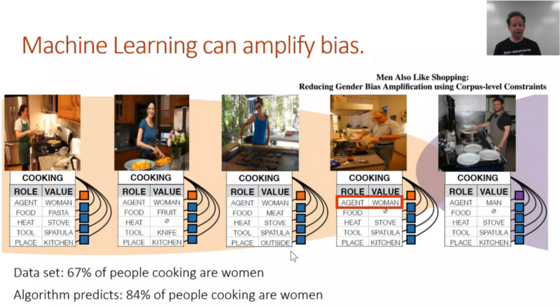

So because they love to generalize, this is one fo the cool things about you guys knowing the technical details now, because they love to generalize when you see something like 60% of people cooking are women in the pictures they used to build this model and then you run the model on a separate set of pictures, then 84% of the people they choose as cooking are women rather than the correct 67%. Which is a really understandable thing for an algorithm to do as it took a biased input and created a more biased output because for this particular loss function, that's where it ended up. This is a really common kind of model amplification.

This stuff matters [00:41:41]. It matters in ways more than just awkward translations or black people's photos not being classified correctly. Maybe there's some wins too as well — like horrifying surveillance everywhere and maybe won't work on black people. "Or it'll be even worse because it's horrifying surveillance and it's flat-out racist and wrong" (Rachel). But let's go deeper. For all we say about human failings, there is a long history of civilization and societies creating layers of human judgement which avoid, hopefully, the most horrible things happening. And sometimes companies which love technology think "let's throw away humans and replace them with technology" like Facebook did. A couple years ago, Facebook literally got rid of their human editors, and this was in the news at the time. And they were replaced with algorithms. So now as algorithms put all the stuff on your news feed and human editors were out of the loop. What happened next?

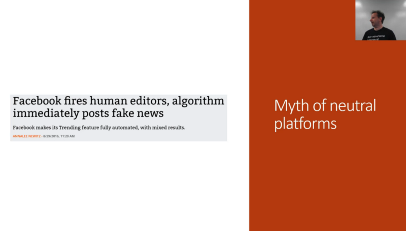

Many things happened next. One of which was a massive horrifying genocide in Myanmar. Babies getting torn out of their mothers arms and thrown into fires. Mass rape, murder, and an entire people exiled from their homeland.

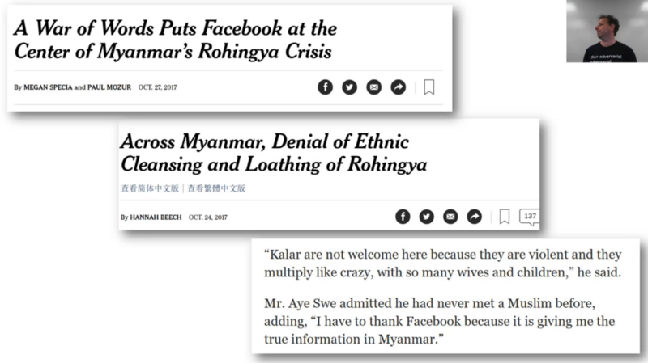

Okay, I'm not gonna say that was because Facebook did this, but what I will say is that when the leaders of this horrifying project are interviewed, they regularly talk about how everything they learnt about the disgusting animal behaviors of Rohingyas that need to be thrown off the earth, they learnt from Facebook. Because the algorithms just want to feed you more stuff that gets you clicking. If you get told these people that don't look like you and you don't know the bad people and here's lots of stories about bad people and then you start clicking on them and then they feed you more of those things. Next thing you know, you have this extraordinary cycle. People have been studying this, so for example, we've been told a few times people click on our fast.ai videos and then the next thing recommended to them is like conspiracy theory videos from Alex Jones, and then continues from there. Because humans click on things that shock us, surprise us, and horrify us. At so many levels, this decision has had extraordinary consequences which we're only beginning to understand. Again, this is not to say this particular consequence is because of this one thing, but to say it's entirely unrelated would be clearly ignoring all of the evidence and information that we have.

#### Unintended consequences [[00:45:04](https://youtu.be/xXXiC4YRGrQ?t=45m4s)]

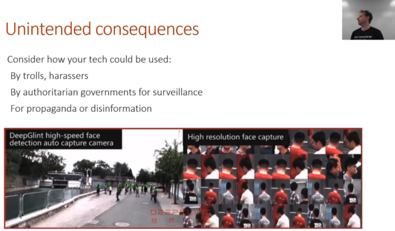

The key takeaway is to think what are you building and how could it be used. Lots and lots of effort now being put into face detection including in our course. We've been spending a lot of time thinking about how to recognize stuff and where it is. There's lots of good reasons to want to be good at that for improving crop yields in agriculture, for improving diagnostic and treatment planning in medicine, for improving your LEGO sorting robot system, etc. But it's also being widely used in surveillance, propaganda, and disinformation. Again, the question is what do I do about that? I don't exactly know. But it's definitely at least important to be thinking about it, talking about it.

#### Runaway feedback loops [[00:46:10](https://youtu.be/xXXiC4YRGrQ?t=46m10s)]

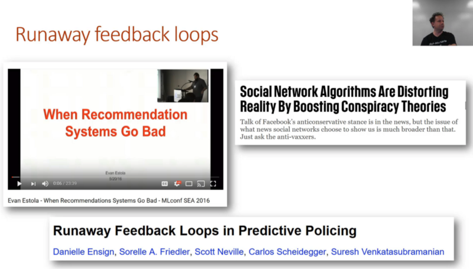

Sometimes you can do really good things. For example, meetup.com did something which I would put in the category of really good thing which is they recognized early a potential problem which is that more men are tending to go to their meet ups. And that was causing their collaborative filtering systems, which you are familiar building now to recommend more technical content to men. And that was causing more men to go to more technical content which was causing the recommendation system to suggest more technical content to men. This kind of runaway feedback loop is extremely common when we interface the algorithm and the human together. So what did Meetup do? They intentionally made the decision to recommend more technical content to women, not because highfalutin idea about how the world should be, but just because that makes sense. Runaway feedback loop was a bug — there are women that want to go to tech meetups, but when you turn up for a tech meet up and it's all men and you don't go, then it recommends more to men and so on and so forth. So Meetup made a really strong product management decision here which was to not do what the algorithm said to do. Unfortunately this is rare. Most of these runaway feedback loops, for example, in predictive policing where algorithms tell policemen where to go which very often is more black neighborhoods which end up crawling with more policemen which leads to more arrests which is assisting to tell more policemen to go to more black neighborhoods and so forth.

### Bias in AI [[00:48:09](https://youtu.be/xXXiC4YRGrQ?t=48m9s)]

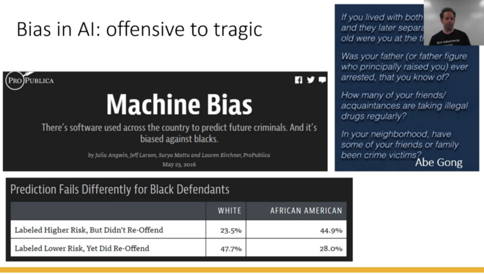

This problem of algorithmic bias is now very wide spread and as algorithms become more and more widely used for specific policy decisions, judicial decisions, day-to-day decisions about who to give what offer to, this just keeps becoming a bigger problem. Some of them are really things that the people involved in the product management decision should have seen at the very start, didn't make sense, and unreasonable under any definition of the term. For example, this stuff Abe Gong pointed out — these were questions that were used for both pretrial so who was required to post bail, so these are people that haven't even been convicted, as well as for sentencing and for who gets parole. This was upheld by the Wisconsin Supreme Court last year despite all the flaws. So whether you have to stay in jail because you can't pay the bail and how long your sentence is for, and how long you stay in jail for depends on what your father did, whether your parents stayed married, who your friends are, and where you live. Now turns out these algorithms are actually terribly terribly bad so some recent analysis showed that they are basically worse than chance. But even if the company's building them were confident on these were statistically accurate correlations, does anybody imagine there's a world where it makes sense to decide what happens to you based on what your dad did?

A lot of this stuff at the basic level is obviously unreasonable and a lot of it just fails in these ways that you can see empirically that these kind of runaway feedback loops must have happened and these over generalizations must have happened. For example, these are the cross tabs that anybody working in any field using these algorithm should be preparing. So prediction of likelihood of reoffending for black vs. white defendants, we can just calculate this very simply. Of the people that were labeled high-risk but didn't reoffend — they were 23.5% white but about twice that African American. Where else, those that were labeled lower risk but did reoffend was half the white people and only 28% of the African American. This is the kind of stuff where at least if you are taking the technologies we've been talking about and putting the production in any way, building an API for other people, providing training for people, or whatever — then at least make sure that what you are doing can be tracked in a way that people know what's going on so at least they are informed. I think it's a mistake in my opinion to assume that people are evil and trying to break society. I think I would prefer to start with an assumption of if people are doing dumb stuff, it's because they don't know better. So at least make sure they have this information. I find very few ML practitioners thinking about what is the information they should be presenting in their interface. Then often I'll talk to data scientists who will say "oh, the stuff I'm working on doesn't have a societal impact." Really? A number of people who think that what they are doing is entirely pointless? Come on. People are paying you to do it for a reason. It's going to impact people in some way. So think about what that is.

### Responsibility in hiring [[00:52:46](https://youtu.be/xXXiC4YRGrQ?t=52m46s)]

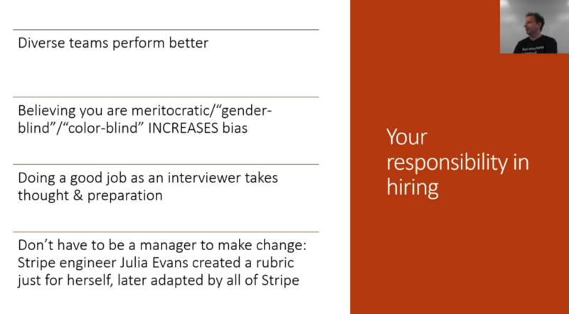

The other thing I know is a lot of people involved here are hiring people and if you are hiring people, I guess you are all very familiar with the fast.ai philosophy now which is the basic premise that, and I thin it comes back to this idea that I don't think people on the whole are evil, I think they need to be informed and have tools. So we are trying to give as many people the tools as possible that they need and particularly we are trying to put those tools in the hands of a more diverse range of people. So if you are involved in hiring decisions, perhaps you can keep this kind of philosophy in mind as well. If you are not just hiring a wider range of people, but also promoting a wider range of people, and providing appropriate career management for a wider range of people, apart from anything else, your company will do better. It actually turns out that more diverse teams are more creative and tend to solve problems more quickly and better than less diverse teams, but also you might avoid these kind of awful screw-ups which, at one level, are bad for the world and another level if you ever get found out, they can destroy your company.

#### IBM & "Death's Calculator" [[00:54:08](https://youtu.be/xXXiC4YRGrQ?t=54m8s)]

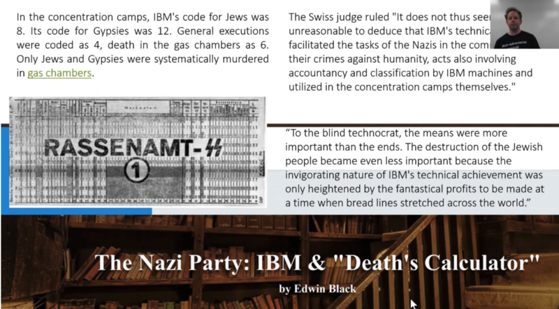

Also they can destroy you or at least make you look pretty bad in history. A couple of examples, one is going right back to the second world war. IBM provided all of the infrastructure necessary to track the Holocaust. These are the forms they used and they had different code — Jews were 8, Gypsies were 12, death in the gas chambers was 6, and they all went on these punch cards. You can go and look at these punch cards in museums now and this has actually been reviewed by a Swiss judge who said that IBM's technical assistance facilitated the task of the Nazis and the commission their crimes against humanity. It is interesting to read back the history from these times to see what was going through the minds of people at IBM at that time. What was clearly going through the minds was the opportunity to show technical superiority, the opportunity to test out their new systems, and of course the extraordinary amount of money that they were making. When you do something which at some point down the line turns out to be a problem, even if you were told to do it, that can turn out to be a problem for you personally. For example, you all remember the diesel emission scandal in VW. Who is the one guy that went to jail? It was the engineer just doing his job. If all of this stuff about actually not messing up the world isn't enough to convince you, it can mess up your life too. If you do something that turns out to cause problems even though somebody told you to do it, you can absolutely be held criminally responsible. Aleksandr Kogan was the guy that handed over the Cambridge Analytica data. He is a Cambridge academic. Now a very famous Cambridge academic the world over for doing his part to destroy the foundations of democracy. This is not how we want to go down in history.


:question: In one of your tweets, you said dropout is patented [00:56:50]. I think this is about WaveNet patent from Google. What does it mean? Can you please share more insight on this subject? Does it mean that we will have to pay to use dropout in the future?

One of the patent holders is Geoffrey Hinton. So what? Isn't that great? Invention is all about patents, blah blah. My answer is no. Patents have gone wildly crazy. The amount of things that are patentable that we talk about every week would be dozens. It's so easy to come up with a little tweak and then if you turn that into a patent to stop everybody from using that little tweak for the next 14 years and you end up with a situation we have now where everything is patented in 50 different ways. Then you get these patent trolls who have made a very good business out of buying lots of crappy little patents and then suing anybody who accidentally turned out did that thing like putting rounded corners on buttons. So what does it mean for us that a lot of stuff is patented in deep learning? I don't know.

One of the main people doing this is Google and people from Google who replied to this patent tend to assume that Google doing it because they want to have it defensively so if somebody sues them, they can say don't sue us we'll sue you back because we have all these patents. The problem is that as far as I know, they haven't signed what's called a defensive patent pledge so basically you can sign a legally binding document that says our patent portfolio will only be used in defense and not offense. Even if you believe all the management of Google would never turn into a patent troll, you've got to remember that management changes. To give you a specific example I know, the somewhat recent CFO of Google has a much more aggressive stance towards the PNL, I don't know, maybe she might decide that they should start monetizing their patents or maybe the group that made that patent might get spun off and then sold to another company that might end up in private equity hands and decide to monetize the patents or whatever. So I think it's a problem. There has been a big shift legally recently away from software patents actually having any legal standing, so it's possible that these will all end up thrown out of court but the reality is that anything but a big company is unlikely to have the financial ability to defend themselves against one of these huge patent trolls.

You can't avoid using patented stuff if you write code. I wouldn't be surprised if most lines of code you write have patents on them. Actually funnily enough, the best thing to do is not to study the patents because if you do and you infringe knowingly then the penalties are worse. So the best thing to do is to put your hands in your ear, sing a song, and get back to work. So the thing about dropouts patented, forget I said that. You don't know that. You skipped that bit.

---

### Style Transfer [[01:01:28](https://youtu.be/xXXiC4YRGrQ?t=1h1m28s)]

[Notebook](https://nbviewer.jupyter.org/github/fastai/fastai/blob/master/courses/dl2/style-transfer.ipynb)

[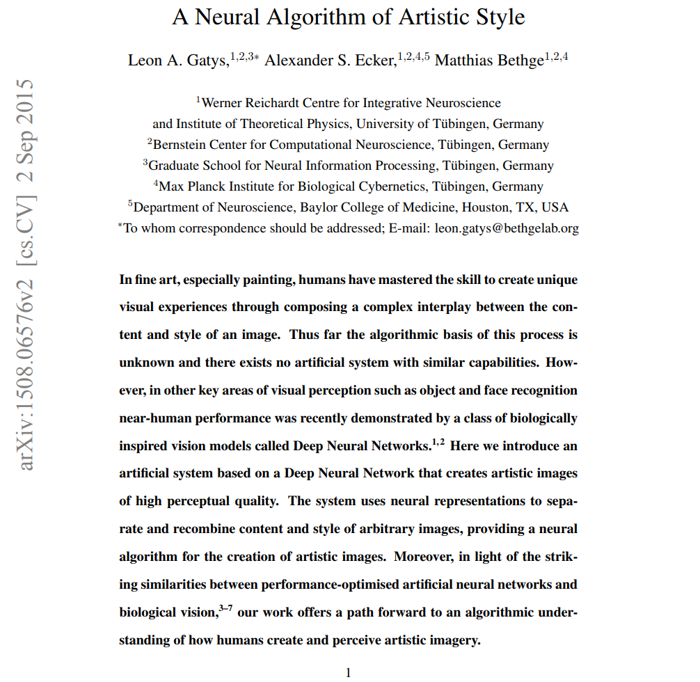](https://arxiv.org/abs/1508.06576 "A Neural Algorithm of Artistic Style")

This is super fun — artistic style. We are going a bit retro here because this is actually the original artistic style paper and there's been a lot of updates to it and a lot of different approaches and I actually think in many ways the original is the best. We are going to look at some of the newer approaches as well, but I actually think the original is a terrific way to do it even with everything that's gone since. Let's jump to the code.

```python
%matplotlib inline
%reload_ext autoreload
%autoreload 2

# import libraries
from fastai.conv_learner import *
from pathlib import Path
from scipy import ndimage

# torch.cuda.set_device(0)
torch.backends.cudnn.benchmark = True

# Setup directory and file paths
PATH = Path('data/imagenet')
PATH_TRN = PATH / 'train'

# Initialize pre-trained VGG model
m_vgg = to_gpu(vgg16(True)).eval()
set_trainable(m_vgg, False)
```

The idea here is that we want to take a photo of a bird, and we want to create a painting that looks like Van Gogh painted the picture of the bird. Quite a bit of the stuff that I'm doing, by the way, uses an ImageNet. You don't have to download the whole of ImageNet for any of the things I'm doing. There is an ImageNet sample in files.fast.ai/data which has a couple of gig which should be plenty good enough for everything we are doing. If you want to get really great result, you can grab ImageNet. You can download it from [Kaggle](https://www.kaggle.com/c/imagenet-object-localization-challenge/data). The localization competition actually contains all of the classification data as well. If you've got room, it's good to have a copy of ImageNet because it comes in handy all the time.

```python
img_fn = PATH_TRN / 'n01558993' / 'n01558993_9684.JPEG'
img = open_image(img_fn)
plt.imshow(img)
```

So I just grabbed the bird out of my ImageNet folder and there is my bird:


```python
sz = 288

trn_tfms, val_tfms = tfms_from_model(vgg16, sz)
img_tfm = val_tfms(img)
img_tfm.shape

# -----------------------------------------------------------------------------
# Output
# -----------------------------------------------------------------------------
(3, 288, 288)

opt_img = np.random.uniform(0, 1, size=img.shape).astype(np.float32)
plt.imshow(opt_img)
```

What I'm going to do is I'm going to start with this picture:


And I'm going to try to make it more and more like a picture of the bird painted by Van Gogh. The way I do that is actually very simple. You're all familiar with it [1:03:44]. We will create a loss function which we will call *f*. The loss function is going to take as input a picture and spit out as output a value. The value will be lower if the image looks more like the bird photo painted by Van Gogh. Having written that loss function, we will then use the PyTorch gradient and optimizers. Gradient times the learning rate, and and we are not going to update any weights, we are going to update the pixels of the input image to make it a little bit more like a picture which would be a bird painted by Van Gogh. And we will stick it through the loss function again to get more gradients, and do it again and again. That's it. So it's identical to how we solve every problem. You know I'm a one-trick pony, right? This is my only trick. Create a loss function, use it to get some gradients, multiply it by learning rates to update something, always before, we've updated weights in a model but today, we are not going to do that. They're going to update the pixels in the input. But it's no different at all. We are just taking the gradient with respect to the input rather than respect to the weights. That's it. So we are nearly done.

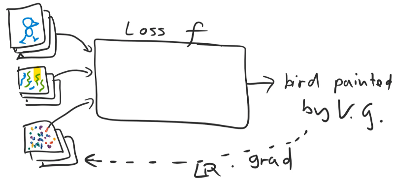

Let's do a couple more things [1:05:49]. Let's mention here that there's going to be two more inputs to our loss function One is the picture of the bird. The second is an artwork by Van Gogh. By having those as inputs as well, that means we'll be able to rerun the function later to make it look like a bird painted by Monet or a jumbo jet painted by Van Gogh, etc. Those are going to be the three inputs. Initially, as we discussed, our input here is some random noise. We start with some random noise, use the loss function, get the gradients, make it a little bit more like a bird painted by Van Gogh, and so forth.

So the only outstanding question which I guess we can talk about briefly is how we calculate how much our image looks like this bird painted by Van Gogh [1:07:09]. Let's split it into two parts:

**Content Loss**: Returns a value that's lower if it looks more like the bird (not just any bird, the specific bird that we have coming in).

**Style Loss**: Returns a lower number if the image is more like V.G.'s style.

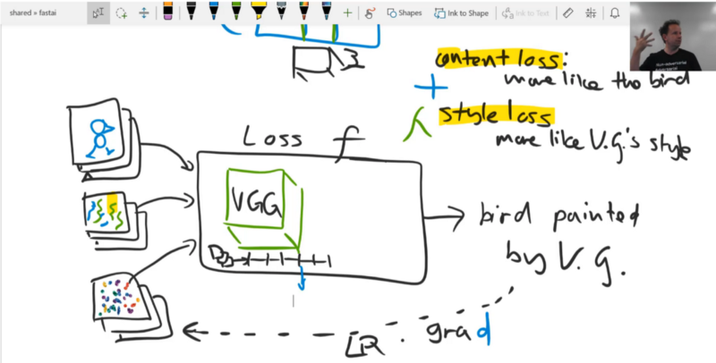

There is one way to do the content loss which is very simple — we could look at the pixel of the output, compare them to the pixel of the bird, and do a mean squared error, and add them up. So if we did that, I ran this for a while. Eventually our image would turn into an image of the bird. You should try it. You should try this as an exercise. Try to use the optimizer in PyTorch to start with a random image and turn it into another image by using mean squared error pixel loss. Not terribly exciting but that would be step one.

The problem is, even if we already had our style loss function working beautifully and then presumably, what we are going to do is we are going to add these two together, and then one of them, we'll multiply by some lambda to adjust how much style versus how much content. Assuming we had a style loss and we picked some sensible lambda, if we used pixel wise content loss then anything that makes it look more like Van Gogh and less like the exact photo, the exact background, the exact contrast, lighting, everything will increase the content loss — which is not what we want. We want it to look like the bird but not in the same way. It is still going to have the same two eyes in the same place and be the same kind of shape and so forth, but not the same representation. So what we are going to do is, this is going to shock you, we are going to use a neural network! :bookmark: We are going to use the VGG neural network because that's what I used last year and I didn't have time to see if other things worked so you can try that yourself during the week.

The VGG network is something which takes in an input and sticks it through a number of layers, and I'm going to treat these as just the convolutional layers there's obviously ReLU there and if it's a VGG with batch norm, which most are today, then it's also got batch norm. There's some max pooling and so forth but that's fine. What we could do is, we could take one of these convolutional activations and then rather than comparing the pixels of this bird, we could instead compare the VGG layer 5 activations of this (bird painted by V.G.) to the VGG layer 5 activations of our original bird (or layer 6, or layer 7, etc). So why might that be more interesting? Well for one thing, it wouldn't be the same bird. It wouldn't be exactly the same because we are not checking the pixels. We are checking some later set of activations. So what are those later sets of activations contain? Assuming it's after some max pooling, they contain a smaller grid — so it's less specific about where things are. And rather than containing pixel color values, they are more like semantic things like is this kind of an eyeball, is this kind of furry, is this kind of bright, or is this kind of reflective, or laying flat, or whatever. So we would hope that there's some level of semantic features through those layers where if we get a picture that matches those activations, then any picture that matches those activations looks like the bird but it's not the same representation of the bird. So that's what we are going to do. That's what our content loss is going to be. People generally call this a **perceptual loss** because it's really important in deep learning that you always create a new name for every obvious thing you do. If you compare two activations together, you are doing a perceptual loss. That's it. Our content loss is going to be a perceptual loss. Then we will do the style loss later.

Let's start by trying to create a bird that initially is random noise and we are going to use perceptual loss to create something that is bird-like but it's not the particular bird [1:13:13]. We are going to start with 288 by 288. Because we are going to do one bird, there is going to be no GPU memory problems. I was actually disappointed that I realized that I picked a rather small input image. It would be fun to try this with something much bigger to create a really grand scale piece. The other thing to remember is if you are productionizing this, you could do a whole batch at a time. People sometimes complain about this approach (Gatys is the lead author) the Gatys' style transfer approaches being slow, and I don't agree it's slow. It takes a few seconds and you can do a whole batch in a few seconds.


```python
sz = 288
```

So we are going to stick it through some transforms for VGG16 model as per usual [1:14:12]. Remember, the transform class has dunder call method (`__call__`) so we can treat it as if it's a function. If you pass an image into that, then we get the transformed image. Try not to treat the fast.ai and PyTorch infrastructure as a black box because it's all designed to be really easy to use in a decoupled way. So this idea of that transforms are just "callables" (i.e. things that you can do with parentheses) comes from PyTorch and we totally plagiarized the idea. So with torch.vision or with fast.ai, your transforms are just callables. And the whole pipelines of transforms is just a callable.

```python
trn_tfms, val_tfms = tfms_from_model(vgg16, sz)
img_tfm = val_tfms(img)
img_tfm.shape

# -----------------------------------------------------------------------------
# Output
# -----------------------------------------------------------------------------
(3, 288, 288)
```

Now we have something of 3 by 288 by 288 because PyTorch likes the channel to be first [1:15:05]. As you can see, it's been turned into a square for us, it's been normalized to (0, 1), all that normal stuff.

Now we are creating a random image.

```python
opt_img = np.random.uniform(0, 1, size=img.shape).astype(np.float32)
plt.imshow(opt_img)
```


Here is something I discovered. Trying to turn this into a picture of anything is actually really hard. I found it very difficult to actually get an optimizer to get reasonable gradients that went anywhere. And just as I thought I was going to run out of time for this class and really embarrass myself, I realized the key issue is that pictures don't look like this. They have more smoothness, so I turned this into the following by blurring it a little bit:

```python
opt_img = scipy.ndimage.filters.median_filter(opt_img, [8, 8, 1])
plt.imshow(opt_img)
```


I used a median filter — basically it is like a median pooling, effectively. As soon as I change it to this, it immediately started training really well. A number of little tweaks you have to do to get these things to work is kind of insane, but here is a little tweak.

So we start with a random image which is at least somewhat smooth [1:16:21]. I found that my bird image had a mean of pixels that was about half of this, so I divided it by 2 just trying to make it a little bit easier for it to match (I don't know if it matters). Turn that into a variable because this image, remember, we are going to be modifying those pixels with an optimization algorithm, so anything that's involved in the loss function needs to be a variable. And specifically, it requires a gradient because we are actually updating the image.

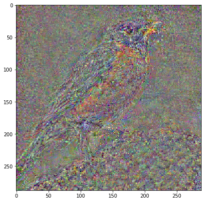

```python
opt_img = val_tfms(opt_img) / 2
opt_img_v = V(opt_img[None], requires_grad=True)
opt_img_v.shape

# -----------------------------------------------------------------------------
# Output
# -----------------------------------------------------------------------------
torch.Size([1, 3, 288, 288])
```

So we now have a mini batch of 1, 3 channels, 288 by 288 random noise.

#### Using mid layer activations

```python
m_vgg = nn.Sequential(*children(m_vgg)[:37])
```

We are going to use, for no particular reason, the 37th layer of VGG. If you print out the VGG network (you can just type in `m_vgg` and prints it out), you'll see that this is mid to late stage layer. So we can just grab the first 37 layers and turn it into a sequential model. So now we have a subset of VGG that will spit out some mid layer activations, and that's what the model is going to be. So we can take our actual bird image and we want to create a mini batch of one. Remember, if you slice in NumPy with `None`, also known as `np.newaxis`, it introduces a new unit axis in that point. Here, I want to create an axis of size 1 to say this is a mini batch of size one. So slicing with `None` just like I did here (`opt_img_v = V(opt_img[None], requires_grad=True)`) to get one unit axis at the front. Then we turn that into a variable and this one doesn't need to be updated, so we use `VV` to say you don't need gradients for this guy. So that is going to give us our target activations.

- We've taken our bird image
- Turned it into a variable
- Stuck it through our model to grab the 37th layer activations which is our target. We want our content loss to be this set of activations.
- We are going to create an optimizer (we will go back to the details of this in a moment)
- We are going to step a bunch of times
- Zero the gradients
- Call some loss function
- Loss.backward()

That's the high level version. I'm going to come back to the details in a moment, but the key thing is that the loss function we are passing in that randomly generated image — the variable of optimization image. So we pass that to our loss function and it's going to update this using the loss function, and the loss function is the mean squared error loss comparing our current optimization image passed through our VGG to get the intermediate activations and comparing it to our target activations. We run that bunch of times and we'll print it out. And we have our bird but not the representation of it.

```python
targ_t = m_vgg(VV(img_tfm[None]))
targ_v = V(targ_t)
targ_t.shape

# -----------------------------------------------------------------------------
# Output
# -----------------------------------------------------------------------------
torch.Size([1, 512, 18, 18])

max_iter = 1000
show_iter = 100
optimizer = optim.LBFGS([opt_img_v], lr=0.5)
```

#### Broyden–Fletcher–Goldfarb–Shanno (BFGS) [[01:20:18](https://youtu.be/xXXiC4YRGrQ?t=1h20m18s)]

A couple of new details here. One is a weird optimizer (`optim.LBFGS`). Anybody who's done certain parts of math and computer science courses comes into deep learning discovers we use all this stuff like Adam and the SGD and always assume that nobody in the field knows the first thing about computer science and immediately says "any of you guys tried using BFGS?" There's basically a long history of a totally different kind of algorithm for optimization that we don't use to train neural networks. And of course the answer is actually the people who have spent decades studying neural networks do know a thing or two about computer science and it turns out these techniques on the whole don't work very well. But it's actually going to work well for this, and it's a good opportunity to talk about an interesting algorithm for those of you that haven't studied this type of optimization algorithm at school. BFGS (initials of four different people) and the L stands for limited memory. It is an optimizer so as an optimizer, that means that there's some loss function and it's going to use some gradients (not all optimizers use gradients but all the ones we use do) to find a direction to go and try to make the loss function go lower and lower by adjusting some parameters. It's just an optimizer. But it's an interesting kind of optimizer because it does a bit more work than the ones we're used to on each step. Specifically, the way it works is it starts the same way that we are used to which is we just pick somewhere to get started and in this case, we've picked a random image as you saw. As per usual, we calculate the gradient. But we then don't just take a step but we actually do is as well as finding the gradient, we also try to find the second derivative. The second derivative says how fast does the gradient change.

**Gradient**: how fast the function change

**The second derivative**: how fast the gradient change

In other words, how curvy is it? The basic idea is that if you know that it's not very curvy, then you can probably jump farther. But if it's very curvy then you probably don't want to jump as far. So in higher dimensions, the gradient is called the Jacobian and the second derivative is called the Hessian. You'll see those words all the time, but that's all they mean. Again, mathematicians have to invent your words for everything as well. They are just like deep learning researchers — maybe a bit more snooty. With BFGS, we are going to try and calculate the second derivative and then we are going to use that to figure out what direction to go and how far to go — so it's less of a wild jump into the unknown.

Now the problem is that actually calculating the Hessian (the second derivative) is almost certainly not a good idea[1:24:15]. Because in each possible direction that you are going to head, for each direction that you're measuring the gradient in, you also have to calculate the Hessian in every direction. It gets ridiculously big. So rather than actually calculating it, we take a few steps and we basically look at how much the gradient is changing as we do each step, and we approximate the Hessian using that little function. Again, this seems like a really obvious thing to do but nobody thought of it until someone did surprisingly a long time later. Keeping track of every single step you take takes a lot of memory, so duh, don't keep track of every step you take — just keep the last ten or twenty.

##### Limited memory optimizer

And the second bit there, that's the L to the LBFGS. So a limited-memory BFGS means keep the last 10 or 20 gradients, use that to approximate the amount of curvature, and then use the curvature in gradient to estimate what direction to travel and how far. That's normally not a good idea in deep learning for a number of reasons. It's obviously more work to do than than Adam or SGD update, and it also uses more memory — memory is much more of a big issue when you've got a GPU to store it on and hundreds of millions of weights. But more importantly, the mini-batch is super bumpy so figuring out curvature to decide exactly how far to travel is kind of polishing turds as we say (yeah, Australian and English expression — you get the idea). Interestingly, actually using the second derivative information, it turns out, is like a magnet for saddle points. So there's some interesting theoretical results that basically say it actually sends you towards nasty flat areas of the function if you use second derivative information. So normally not a good idea.

```python
def actn_loss(x):
    return F.mse_loss(m_vgg(x), targ_v) * 1000

def step(loss_fn):
    global n_iter
    optimizer.zero_grad()
    # passing in that randomly generated image — the variable of optimization image to the loss function
    loss = loss_fn(opt_img_v)
    loss.backward()
    n_iter += 1
    if n_iter % show_iter == 0:
        print(f'Iteration: n_iter, loss: {loss.data[0]}')
    return loss
```

But in this case [1:26:40], we are not optimizing weights, we are optimizing pixels so all the rules change and actually turns out BFGS does make sense. Because it does more work each time, it's a different kind of optimizer, the API is a little bit different in PyTorch. As you can see here, when you say `optimizer.step`, you actually pass in the loss function. So our loss function is to call `step` with a particular loss function which is our activation loss (`actn_loss`). And inside the loop, you don't say step, step, step. But rather it looks like this. So it's a little bit different and you're welcome to try and rewrite this to use SGD, it'll still work. It'll just take a bit longer — I haven't tried it with SGD yet and I'd be interested to know how much longer it takes.

```python
n_iter = 0
while n_iter <= max_iter:
    optimizer.step(partial(step, actn_loss))

# -----------------------------------------------------------------------------
# Output
# -----------------------------------------------------------------------------
Iteration: n_iter, loss: 0.8200027942657471
Iteration: n_iter, loss: 0.3576483130455017
Iteration: n_iter, loss: 0.23157010972499847
Iteration: n_iter, loss: 0.17518416047096252
Iteration: n_iter, loss: 0.14312393963336945
Iteration: n_iter, loss: 0.1230238527059555
Iteration: n_iter, loss: 0.10892671346664429
Iteration: n_iter, loss: 0.09870683401823044
Iteration: n_iter, loss: 0.09066757559776306
Iteration: n_iter, loss: 0.08464114367961884
```

So you can see the loss function going down [1:27:38]. The mean squared error between the activations at layer 37 of our VGG model for our optimized image vs. the target activations, remember the target activations were the VGG applied to our bird. Make sense?

#### Content loss

So we've now got a content loss. Now, one thing I'll say about this content loss is we don't know which layer is going to work the best. So it would be nice if we were able to experiment a little bit more. And the way it is here is annoying:


Maybe we even want to use multiple layers. So rather than lopping off all of the layers after the one we want, wouldn't it be nice if we could somehow grab the activations of a few layers as it calculates. Now, we already know one way to do that back when we did SSD, we actually wrote our own network which had a number of outputs. Remember? The different convolutional layers, we spat out a different `oconv` thing? But I don't really want to go and add that to the torch.vision ResNet model especially not if later on, I want to try torch.vision VGG model, and then I want to try NASNet-A model, I don't want to go into all of them and change their outputs. Beside which, I'd like to easily be able to turn certain activations on and off on demand. So we briefly touched before this idea that PyTorch has these fantastic things called **hooks**. You can have forward hooks that let you plug anything you like into the forward pass of a calculation or a backward hook that lets you plug anything you like into the backward pass. So we are going to create the world's simplest forward hook.

```python
x = val_tfms.denorm(np.rollaxis(to_np(opt_img_v.data), 1, 4))[0]
plt.figure(figsize=(7, 7))
plt.imshow(x)
```


### PyTorch hooks - forward hook [[01:29:42](https://youtu.be/xXXiC4YRGrQ?t=1h29m42s)]

This is one of these things that almost nobody knows about so almost any code you find on the internet that implements style transfer will have all kind of horrible hacks rather than using forward hooks. But forward hook is really easy.

To create a forward hook, you just create a class. The class has to have something called `hook_fn`. And your hook function is going to receive the `module` that you've hooked, the input for the forward pass, and the output then you do whatever you'd like. So what I'm going to do is I'm just going to store the output of this module in some attribute. That's it. So `hook_fn` can actually be called anything you like, but "hook function" seems to be the standard because, as you can see, what happens in the constructor is I store inside some attribute the result of `m.register_forward_hook` (`m` is going to be the layer that I'm going to hook) and pass in the function that you want to be called when the module's forward method is called. When its forward method is called, it will call `self.hook_fn` which will store the output in an attribute called `features`.

```python
class SaveFeatures():
    features = None
    def __init__(self, m): self.hook = m.register_forward_hook(self.hook_fn)
    def hook_fn(self, module, input, output): self.features = output
    def close(self): self.hook.remove()
```

#### VGG activations

So now what we can do is we can create a VGG as before. And let's set it to not trainable so we don't waste time and memory calculating gradients for it. And let's go through and find all the max pool layers. So let's go through all of the children of this module and if it's a max pool layer, let's spit out index minus 1 — so that's going to give me the layer before the max pool. In general, the layer before a max pool or stride 2 conv is a very interesting layer. It's the most complete representation we have at that grid cell size because the very next layer is changing the grid. So that seems to me like a good place to grab the content loss from. The best most semantic, most interesting content we have at that grid size. So that's why I'm going to pick those indexes.

```python
m_vgg = to_gpu(vgg16(True)).eval()
set_trainable(m_vgg, False)
```

These are the indexes of the last layer before each max pool in VGG [1:32:30].

```python
block_ends = [i - 1 for i, o in enumerate(children(m_vgg))
              if isinstance(o, nn.MaxPool2d)]
block_ends

# -----------------------------------------------------------------------------
# Output
# -----------------------------------------------------------------------------
[5, 12, 22, 32, 42]
```

I'm going to grab `32` — no particular reason, just try something else. So I'm going to say `block_ends[3]` (i.e. 32). `children(m_vgg)[block_ends[3]]` will give me the 32nd layer of VGG as a module.

```python
sf = SaveFeatures(children(m_vgg)[block_ends[3]])
```

Then if I call the SaveFeatures constructor, it's going to go:

```python
self.hook = {32nd layer of VGG}.register_forward_hook(self.hook_fn)
```

Now, every time I do a forward pass on this VGG model, it's going to store the 32nd layer's output inside `sf.features`.

```python
def get_opt():
    opt_img = np.random.uniform(0, 1, size=img.shape).astype(np.float32)
    opt_img = scipy.ndimage.filters.median_filter(opt_img, [8, 8, 1])
    opt_img_v = V(val_tfms(opt_img / 2)[None], requires_grad=True)
    return opt_img_v, optim.LBFGS([opt_img_v])
```

See here [1:33:33], I'm calling my VGG network, but I'm not storing it anywhere. I'm not saying `activations = m_vgg(VV(img_tfm[None]))`. I'm calling it, throwing away the answer, and then grabbing the features we stored in our `SaveFeatures` object.

`m_vgg()` — this is how you do a forward path in PyTorch. You don't say `m_vgg.forward()`, you just use it as a callable. Using as a callable on an `nn.module` automatically calls `forward`. That's how PyTorch modules work.

So we call it as a callable, that ends up calling our forward hook, that forward hook stores the activations in `sf.features`, and so now we have our target variable — just like before but in a much more flexible way.

`get_opt` contains the same 4 lines of code we had earlier [1:34:34]. It is just giving me my random image to optimize and an optimizer to optimize that image.

```python
m_vgg(VV(img_tfm[None]))
targ_v = V(sf.features.clone())
targ_v.shape

# -----------------------------------------------------------------------------
# Output
# -----------------------------------------------------------------------------
torch.Size([1, 512, 36, 36])

def actn_loss2(x):
    m_vgg(x)
    out = V(sf.features)
    return F.mse_loss(out, targ_v) * 1000
```

Now I can go ahead and do exactly the same thing. But now I'm going to use a different loss function `actn_loss2` (activation loss #2) which doesn't say `out = m_vgg`, again, it calls `m_vgg` to do a forward pass, throws away the results, and and grabs `sf.features`. So that's now my 32nd layer activations which I can then do my MSE loss on. You might have noticed, the last loss function and this one are both multiplied by a thousand. Why are they multiplied by a thousand? This was like all the things that were trying to get this lesson to not work correctly. I didn't used to have a thousand and it wasn't training. Lunch time today, nothing was working. After days of trying to get this thing to work, and finally just randomly noticed "gosh, the loss functions — the numbers are really low (like 10E-7)" and I thought what if they weren't so low. So I multiplied them by a thousand and it started working.

#### Single precision floating point, half precision

So why did it not work? Because we are doing single precision floating point, and single precision floating point isn't that precise. Particularly once you're getting gradients that are kind of small and then you are multiplying by the learning rate that can be small, and you end up with a small number. If it's so small, they could get rounded to zero and that's what was happening and my model wasn't ready. I'm sure there are better ways than multiplying by a thousand, but whatever. It works fine. It doesn't matter what you multiply a loss function by because all you care about is its direction and the relative size. Interestingly, this is something similar we do for when we were training ImageNet. We were using half precision floating point because Volta tensor cores require that. And it's actually a standard practice if you want to get the half precision floating to train, you actually have to multiply the loss function by a scaling factor. We were using 1024 or 512. I think fast.ai is now the first library that has all of the tricks necessary to train in half precision floating point built-in, so if you are lucky enough to have a Volta or you can pay for a AWS P3, if you've got a learner object, you can just say `learn.half`, it'll now just magically train correctly half precision floating point. It's built into the model data object as well, and it's all automatic. Pretty sure no other library does that.

```python
n_iter = 0
while n_iter <= max_iter:
    optimizer.step(partial(step, actn_loss2))

# -----------------------------------------------------------------------------
# Output
# -----------------------------------------------------------------------------
Iteration: n_iter, loss: 0.2201523780822754
Iteration: n_iter, loss: 0.09734754264354706
Iteration: n_iter, loss: 0.06434715539216995
Iteration: n_iter, loss: 0.04877760633826256
Iteration: n_iter, loss: 0.03993375599384308
Iteration: n_iter, loss: 0.03418143838644028
Iteration: n_iter, loss: 0.030093519017100334
Iteration: n_iter, loss: 0.026956692337989807
Iteration: n_iter, loss: 0.024544663727283478
Iteration: n_iter, loss: 0.022647056728601456
```

This is just doing the same thing on a slightly earlier layer [1:37:35]. And the bird looks more bird-like. Hopefully that makes sense to you that earlier layers are getting closer to the pixels. There are more grid cells, each cell is smaller, smaller receptive field, less complex semantic features. So the earlier we get, the more it's going to look like a bird.

```python
x = val_tfms.denorm(np.rollaxis(to_np(opt_img_v.data),1,4))[0]
plt.figure(figsize=(7,7))
plt.imshow(x);
```


```python
sf.close()
```

#### Pictures from paper

In fact, the paper has a nice picture of that showing various different layers and zooming into this house [1:38:17]. They are trying to make this house look like The Starry Night picture. And you can see that later on, it's pretty messy, and earlier on, it looks like the house. So this is just doing what we just did. One of the things I've noticed in our study group is anytime I say to somebody to answer a question, anytime I say read the paper there is a thing in the paper that tells you the answer to that question, there's always this shocked look "read the paper? me?" but seriously the papers have done these experiments and drawn the pictures. There's all this stuff in the papers. It doesn't mean you have to read every part of the paper. But at least look at the pictures. So check out Gatys' paper, it's got nice pictures. So they've done the experiment for us but looks like they didn't go as deep — they just got some earlier ones.

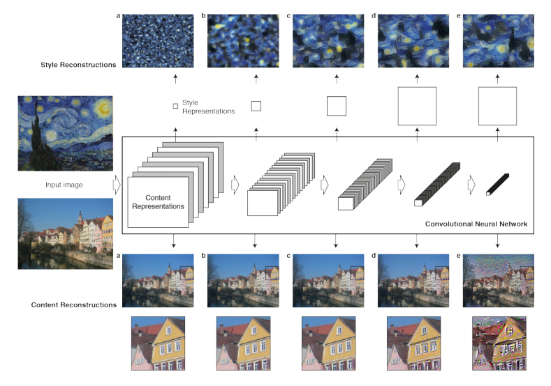

#### Style match [[01:39:29](https://youtu.be/xXXiC4YRGrQ?t=1h39m29s)]

The next thing we need to do is to **create style loss**. We've already got the loss which is how much like the bird is it. Now we need how like this painting style is it. And we are going to do nearly the same thing. We are going to **grab the activations of some layer**. Now the problem is, the activations of some layer, let's say it was a 5x5 layer (of course there are no 5x5 layers, it's 224x224, but we'll pretend). So here're some activations and we could get these activations both per the image we are optimizing and for our Van Gogh painting. Let's look at our Van Gogh painting. There it is — The Starry Night.

```python
style_fn = PATH / 'style' / 'starry_night.jpg'

style_img = open_image(style_fn)
style_img.shape, img.shape

# -----------------------------------------------------------------------------
# Output
# -----------------------------------------------------------------------------
((1198, 1513, 3), (291, 483, 3))

plt.imshow(style_img)
```

#### Look at painting from Wikipedia


I downloaded this from Wikipedia and I was wondering what is taking so long to load [1:40:39] — turns out, the Wikipedia version I downloaded was 30,000 by 30,000 pixels. It's pretty cool that they've got this serious gallery quality archive stuff there. I didn't know it existed. Don't try to run a neural net on that. Totally killed my Jupyter notebook.

So we can do that for our Van Gogh image and we can do that for our optimized image. Then we can compare the two and we would end up creating an image that has content like the painting but it's not the painting — that's not what we want. We want something with the same style but it's not the painting and doesn't have the content. So we want to throw away all of the spatial information. We are not trying to create something that has a moon here, stars here, and a church here. We don't want any of that. So how do we throw away all the special information?

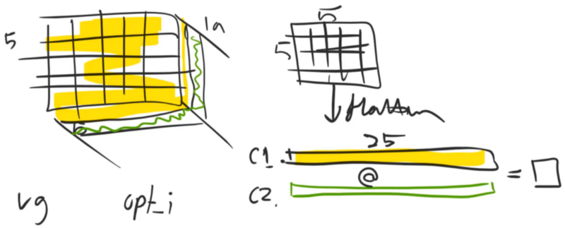

In this case, there are 19 faces on this — 19 slices. So let's grab this top slice that's going to be a 5x5 matrix. Now, let's flatten it and we've got a 25 long vector. In one stroke, we've thrown away the bulk of the spacial information by flattening it. Now let's grab a second slice (i.e. another channel) and do the same thing. So we have channel 1 flattened and channel 2 flattened, and they both have 25 elements.

#### Dot product of channels - intuition

Now, let's take the dot product which we can do with `@` in NumPy (Note: [here is Jeremy's answer to my dot product vs. matrix multiplication question](http://forums.fast.ai/t/part-2-lesson-13-wiki/15297/140?u=hiromi)). So the dot product is going to give us one number. What's that number? What is it telling us? Assuming the activations are somewhere around the middle layer of the VGG network, we might expect some of these activations to be how textured is the brush stroke, and some of them to be like how bright is this area, and some of them to be like is this part of a house or a part of a circular thing, or other parts to be, how dark is this part of the painting. So a dot product is basically a correlation. If this element and and this element are both highly positive or both highly negative, it gives us a big result. Where else, if they are the opposite, it gives a small results. If they are both close to zero, it gives no result. So **basically a dot product is a measure of how similar these two things are**. So if the activations of channel 1 and channel 2 are similar, then it basically says — Let's give an example [1:44:28]. Let's say the first one was how textured are the brushstrokes (C1) and that one there says how diagonally oriented are the brush strokes (C2).

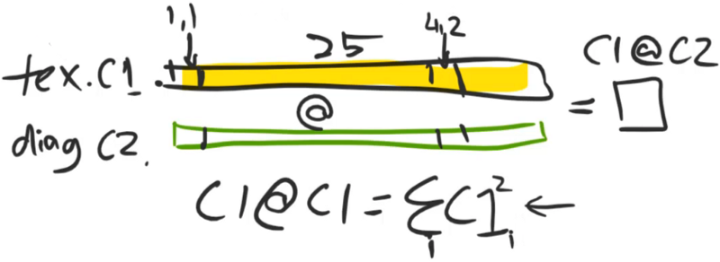

If C1 and C2 are both high for a cell (1, 1) at the same time, and same is true for a cell (4, 2), then it's saying grid cells that would have texture tend to also have diagonal. So dot product would be high when grid cells that have texture also have diagonal, and when they don't, they don't (have high dot product). So that's `C1 @ C2`. Where else, `C1 @ C1` is the 2-norm effectively (i.e. the sum of the squares of C1). This is basically saying how many grid cells in the textured channel is active and how active it is. So in other words, `C1 @ C1` tells us how much textured painting is going on. And `C2 @ C2` tells us how much diagonal paint stroke is going on. Maybe C3 is "is it bright colors?" so `C3 @ C3` would be how often do we have bright colored cells.

### Gram matrix

So what we could do then is we could create a 19 by 19 matrix containing every dot product [1:47:17]. And like we discussed, mathematicians have to give everything a name, so this particular matrix where you flatten something out and then do all the dot product is called Gram matrix.


I'll tell you a secret [1:48:29]. Most deep learning practitioners either don't know or don't remember all these things like what is a Gram matrix if they ever did study at university. They probably forgot it because they had a big night afterwards. And the way it works in practice is you realize "oh, I could create a kind of non-spacial representation of how the channels correlate with each other" and then when I write up the paper, I have to go and ask around and say "does this thing have a name?" and somebody will be like "isn't that the Gram matrix?" and you go and look it up and it is. So don't think you have to go study all of math first. Use your intuition and common sense and then you worry about what the math is called later, normally. Sometimes it works the other way, not with me because I can't do math.

So this is called the Gram matrix [1:49:22]. And of course, if you are a real mathematician, it's very important that you say this as if you always knew it was a Gram matrix and you kind of just go oh yes, we just calculate the Gram matrix. So the Gram matrix then is this kind of map — the diagonal is perhaps the most interesting. The diagonal is which channels are the most active and then the off diagonal is which channels tend to appear together. And overall, if two pictures have the same style, then we are expecting that some layer of activations, they will have similar Gram matrices. Because if we found the level of activations that capture a lot of stuff about like paint strokes and colors, then the diagonal alone (in Gram matrices) might even be enough. That's another interesting homework assignment, if somebody wants to take it, is try doing Gatys' style transfer not using the Gram matrix but just using the diagonal of the Gram matrix. That would be like a single line of code to change. But I haven't seen it tried and I don't know if it would work at all, but it might work fine.

"Okay, yes Christine, you've tried it" [1:50:51]. "I have tried that and it works most of the time except when you have funny pictures where you need two styles to appear in the same spot. So it seems like grass in one half and a crowd in one half, and you need the two styles." (Christine). Cool, you're still gonna do your homework, but Christine says she'll do it for you. :smile:

```python
def scale_match(src, targ):
    h, w, _ = src.shape
    sh, sw, _ = targ.shape
    rat = max(h / sh, w / sw)
    print(rat)
    res = cv2.resize(targ, (int(sw * rat), int(sh * rat)))
    return res[:h, :w]

style = scale_match(img, style_img)

plt.imshow(style)
style.shape, img.shape

# -----------------------------------------------------------------------------
# Output
# -----------------------------------------------------------------------------
((291, 483, 3), (291, 483, 3))
```


So here is our painting [1:51:22]. I've tried to resize the painting so it's the same size as my bird picture. So that's all this is just doing. It doesn't matter too much which bit I use as long as it's got lots of the nice style in it.

I grab my optimizer and my random image just like before:

```python
opt_img_v, optimizer = get_opt()
```

#### Save features for all blocks

And this time, I call `SaveFeatures` for all of my `block_ends` and that's going to give me an array of `SaveFeatures` objects — one for each module that appears the layer before the max pool. Because this time, I want to play around with different activation layer styles, or more specifically I want to let you play around with it. So now I've got a whole array of them.

```python
sfs = [SaveFeatures(children(m_vgg)[idx]) for idx in block_ends]
```

`style_img` is my Van Gogh painting. So I take my `style_img`, put it through my transformations to create my transform style image (`style_tfm`).

```python
style_tfm = val_tfms(style_img)
```

Turn that into a variable, put it through the forward pass of my VGG module, and now I can go through all of my `SaveFeatures` objects and grab each set of features. Notice I call `clone` because later on, if I call my VGG object again, it's going to replace those contents. I haven't quite thought about whether this is necessary. If you take it away and it's not, that's fine. But I was just being careful. So here is now an array of the activations at every `block_end` layer. And here, you can see all of those shapes:

```python
m_vgg(VV(style_tfm[None]))
targ_styles = [V(o.features.clone()) for o in sfs]
[o.shape for o in targ_styles]

# -----------------------------------------------------------------------------
# Output
# -----------------------------------------------------------------------------
[torch.Size([1, 64, 288, 288]),
 torch.Size([1, 128, 144, 144]),
 torch.Size([1, 256, 72, 72]),
 torch.Size([1, 512, 36, 36]),
 torch.Size([1, 512, 18, 18])]
```

And you can see, being able to whip up a list comprehension really quickly, it's really important in your Jupyter fiddling around [1:53:30]. Because you really want to be able to immediately see here's my channel (64, 128, 256, …), and grid size halving as we would expect (288, 144, 72…) because all of these appear just before a max pool.

So to do a Gram MSE loss, it's going to be the MSE loss on the Gram matrix of the input vs. the gram matrix of the target. And the Gram matrix is just the matrix multiply of `x` with `x` transpose (`x.t()`) where x is simply equal to my input where I've flattened the batch and channel axes all down together. I've only got one image, so you can ignore the batch part — it's basically channel. Then everything else (`-1`), which in this case is the height and width, is the other dimension because there's now going to be channel by height and width, and then as we discussed we can them just do the matrix multiply of that by its transpose. And just to normalize it, we'll divide that by the number of elements (`b*c*h*w`) — it would actually be more elegant if I had said `input.numel` (number of elements) that would be the same thing. Again, this gave me tiny numbers so I multiply it by a big number to make it something more sensible. So that's basically my loss.

```python
def gram(input):
    b, c, h, w = input.size()
    x = input.view(b * c, -1)
    return torch.mm(x, x.t()) / input.numel() * 1e6

def gram_mse_loss(input, target): return F.mse_loss(gram(input), gram(target))
```

So now my style loss is to take my image to optimize, throw it through VGG forward pass, grab an array of the features in all of the `SaveFeatures` objects, and then call my Gram MSE loss on every one of those layers [1:55:13]. And that's going to give me an array and then I just add them up. Now you could add them up with different weightings, you could add up subsets, or whatever. In this case, I'm just grabbing all of them.

```python
def style_loss(x):
    m_vgg(opt_img_v)
    outs = [V(o.features) for o in sfs]
    losses = [gram_mse_loss(o, s) for o, s in zip(outs, targ_styles)]
    return sum(losses)
```

Pass that into my optimizer as before:

```python
n_iter = 0
while n_iter <= max_iter:
    optimizer.step(partial(step, style_loss))

# -----------------------------------------------------------------------------
# Output
# -----------------------------------------------------------------------------
Iteration: n_iter, loss: 488.1943664550781
Iteration: n_iter, loss: 160.02984619140625
Iteration: n_iter, loss: 85.17698669433594
Iteration: n_iter, loss: 51.89944076538086
Iteration: n_iter, loss: 34.03820037841797
Iteration: n_iter, loss: 23.21661949157715
Iteration: n_iter, loss: 16.497699737548828
Iteration: n_iter, loss: 12.354783058166504
Iteration: n_iter, loss: 9.861383438110352
Iteration: n_iter, loss: 8.337841987609863
```

And here we have a random image in the style of Van Gogh which I think is kind of cool.

```python
x = val_tfms.denorm(np.rollaxis(to_np(opt_img_v.data), 1, 4))[0]
plt.figure(figsize=(7, 7))
plt.imshow(x)
```


Again Gatys has done it for us. Here is different layers of random image in the style of Van Gogh. So the first one, as you can see, the activations are simple geometric things — not very interesting at all. The later layers are much more interesting. So we kind of have a suspicion that we probably want to use later layers largely for our style loss if we wanted to look good.

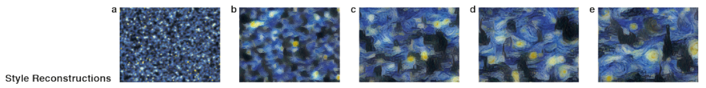


I added this `SaveFeatures.close` [1:56:35] which just calls `self.hook.remove()`. Remember, I stored the hook as `self.hook` so `hook.remove()` gets rid of it. It's a good idea to get rid of it because otherwise you can potentially just keep using memory. So at the end, I just go through each of my `SaveFeatures` object and close it:

```python
for sf in sfs:
    sf.close()
```

#### Style transfer [[01:57:08](https://youtu.be/xXXiC4YRGrQ?t=1h57m8s)]

Style transfer is adding content loss and style loss together with some weight. So there is no much to show.

Grab my optimizer, grab my image:

```python
opt_img_v, optimizer = get_opt()
```

And my combined loss is the MSE loss at one particular layer, my style loss at all of my layers, sum up the style losses, add them to the content loss, the content loss I'm scaling. Actually the style loss, I scaled already by 1E6. So they are both scaled exactly the same. Add them together. Again, you could trying weighting the different style losses or you could maybe remove some of them, so this is the simplest possible version.

```python
def comb_loss(x):
    m_vgg(opt_img_v)
    outs = [V(o.features) for o in sfs]
    # gram matrix loss
    losses = [gram_mse_loss(o, s) for o, s in zip(outs, targ_styles)]
    # content loss
    cnt_loss = F.mse_loss(outs[3], targ_vs[3]) * 1e6
    # style loss
    style_loss = sum(losses)
    return cnt_loss + style_loss
```

Train that:

```python
n_iter = 0
while n_iter <= max_iter:
    optimizer.step(partial(step, comb_loss))

# -----------------------------------------------------------------------------
# Output
# -----------------------------------------------------------------------------
Iteration: n_iter, loss: 1683.57763671875
Iteration: n_iter, loss: 1178.25
Iteration: n_iter, loss: 999.766357421875
Iteration: n_iter, loss: 893.4268798828125
Iteration: n_iter, loss: 827.3020629882812
Iteration: n_iter, loss: 782.7379150390625
Iteration: n_iter, loss: 750.3278198242188
Iteration: n_iter, loss: 727.0342407226562
Iteration: n_iter, loss: 708.3321533203125
Iteration: n_iter, loss: 693.3798828125

x = val_tfms.denorm(np.rollaxis(to_np(opt_img_v.data), 1, 4))[0]
plt.figure(figsize=(9, 9))
plt.imshow(x, interpolation='lanczos')
plt.axis('off')
```

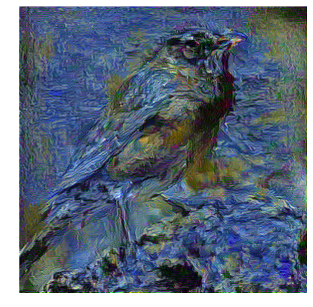

```python
for sf in sfs:
    sf.close()
```

And holy crap, it actually looks good. So I think that's pretty awesome. The main take away here is if you want to solve something with a neural network, all you've got to do is set up a loss function and then optimize something. And the loss function is something which a lower number is something that you're happier with. Because then when you optimize it, it's going to make that number as low as you can, and it'll do what you wanted it to do. So here, Gatys came up with the loss function that does a good job of being a smaller number when it looks like the thing we want it to look like, and it looks like the style of the thing we want to be in the style of. That's all we had to do.

What it actually comes to it [1:59:10], apart from implementing Gram MSE loss which was like 6 lines of code if that, that's our loss function:

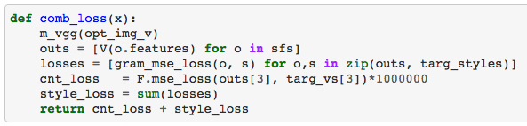

Pass it to our optimizer, and wait about 5 seconds, and we are done. And remember, we could do a batch of these at a time, so we could wait 5 seconds and 64 of these will be done. So I think that's really interesting and since this paper came out, it has really inspired a lot of interesting work. To me though, most of the interesting work hasn't happened yet because to me, the interesting work is the work where you combine human creativity with these kinds of tools. I haven't seen much in the way of tools that you can download or use where the artist is in control and can kind of do things interactively. It's interesting talking to the guys at [Google Magenta](https://magenta.tensorflow.org/) project which is their creative AI project, all of the stuff they are doing with music is specifically about this. It's building tools that musicians can use to perform in real time. And you'll see much more of that on the music space thanks to Magenta. If you go to their website, there's all kinds of things where you can press the buttons to actually change the drum beats, melodies, keys, etc. You can definitely see Adobe or NVidia is starting to release little prototypes and starting to do this but this kind of creative AI explosion hasn't happened yet. I think we have pretty much all the technology we need but no one's put it together into a thing and said "look at the thing I built and look at the stuff that people built with my thing." So that's just a huge area of opportunity.

#### Deep painterly harmonization - putting Captain America's shield

So the paper that I mentioned at the start of class in passing [2:01:16] — the one where we can add Captain America's shield to arbitrary paintings basically used this technique. The trick was though some minor tweaks to make the pasted Captain America shield blend in nicely. :bookmark: But that paper is only a couple of days old, so that would be a really interesting project to try because you can use all this code. It really does leverage this approach. Then you could start by making the content image be like the painting with the shield and then the style image could be the painting without the shield. That would be a good start, and then you could see what specific problems they try to solve in this paper to make it better. But you could have a start on it right now.

#### Probabilistic programming

:question: Two questions — earlier there were a number of people that expressed interest in your thoughts on Pyro and probabilistic programming [2:02:34].

So TensorFlow has now got this TensorFlow probability or something. There's a bunch of probabilistic programming framework out there. I think they are intriguing, but as yet unproven in the sense that I haven't seen anything done with any probabilistic programming system which hasn't been done better without them. The basic premise is that it allows you to create more of a model of how you think the world works and then plug in the parameters. So back when I used to work in management consulting 20 years ago, we used to do a lot of stuff where we would use a spreadsheet and then we would have these Monte Carlo simulation plugins — there was one called At Risk(?) and one called Crystal Ball. I don't know if they still exist decades later. Basically they would let you change a spreadsheet cell to say this is not a specific value but it actually represents a distribution of values with this mean and the standard deviation or it's got this distribution, and then you would hit a button and the spreadsheet would recalculate a thousand times pulling random numbers from these distributions and show you the distribution of your outcome that might be profit or market share or whatever. We used them all the time back then. Apparently feel that a spreadsheet is a more obvious place to do that kind of work because you can see it all much more naturally, but I don't know. We'll see. At this stage, I hope it turns out to be useful because I find it very appealing and it appeals to as I say the kind of work I used to do a lot of. There's actually whole practices around this stuff they used to call system dynamics which really was built on top of this kind of stuff, but it's not quite gone anywhere.

#### Pre-training for generic style transfer

:question: Then there was a question about pre-training for generic style transfer [2:04:57].

I don't think you can pre-train for a generic style, but you can pre-train for a generic photo for a particular style which is where we are going to get to. Although, it may end up being a homework. I haven't decided yet. But I'm going to do all the pieces.

:question: Please ask him to talk about multi-GPU [2:05:31].

Oh yeah, Jeremy haven't. Jeremy had a slide about that. We're about to hit it.

Before we do, just another interesting picture from the Gatys' paper. They've got a few more just didn't fit in my slide but different convolutional layers for the style. Different style to content ratios, and here's the different images. Obviously this isn't Van Gogh any more, this is a different combination. So you can see, if you just do all style, you don't see any image. If you do lots of content, but you use low enough convolutional layer, it looks okay but the back ground is kind of dumb. So you kind of want somewhere in the middle. So you can play around with it and experiment, but also use the paper to help guide you.

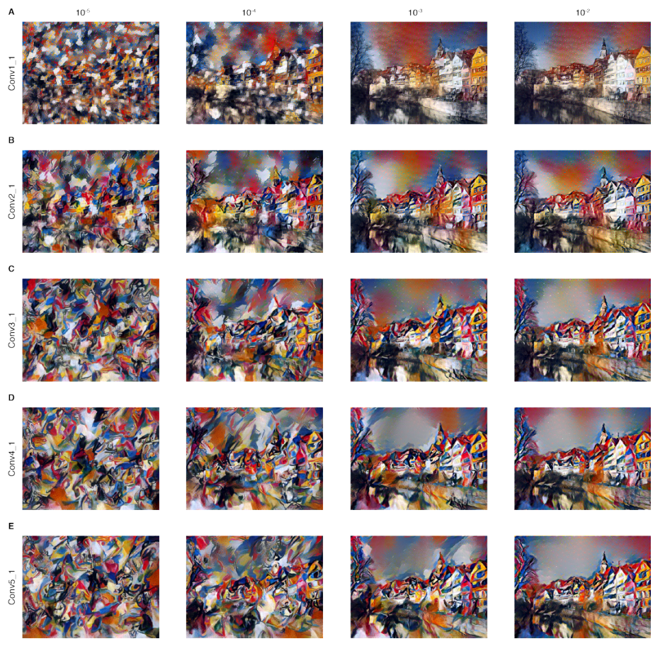

#### The Math [[02:06:33](https://youtu.be/xXXiC4YRGrQ?t=2h6m33s)]

Actually, I think I might work on the math now and we'll talk about multi GPU and super resolution next week because this is from the paper and one of the things I really do want you to do after we talk about a paper is to read the paper and then ask questions on the forum anything that's not clear. But there's a key part of this paper which I wanted to talk about and discuss how to interpret it. So the paper says, we're going to be given an input image *x* and this little thing means normally it means it's a vector, Rachel, but this one is a matrix. I guess it could mean either. I don't know. Normally small letter bold means vector or a small letter with an arrow on top means vector. And normally big letter means matrix or small letter with two arrows on top means matrix. In this case, our image is a matrix. We are going to basically treat it as a vector, so maybe we're just getting ahead of ourselves.

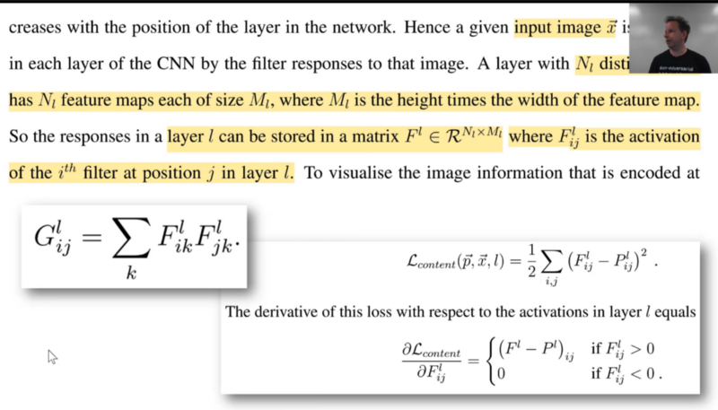

So we've got an input image *x* and it can be encoded in a particular layer of the CNN by the filter responses (i.e. activations). Filter responses are activations. Hopefully, that's something you all understand. That's basically what a CNN does is it produces layers of activations. A layer has a bunch of filters which produce a number of channels. This here says that layer number L has capital N*l* filters. Again, this capital does not mean matrix. So I don't know, math notation is so inconsistent. So capital N*l* distinct filters at layer L which means it has also that many feature maps. So make sure you can see this letter Nl is the same as this letter. So you've got to be very careful to read the letters and recognize it's like snap, that's the same letter as that. So obviously, Nl filters create create Nl feature maps or channels, each one of size M*l* (okay, I can see this is where the unrolling is happening). So this is like M[*l*] in numpy notation. It's the *l*th layer. So M for the *l*th layer. The size is height times width — so we flattened it out. So the responses in a layer l can be stored in a matrix F (and now the l goes at the top for some reason). So this is not f^*l*, it's just another indexing. We are just moving it around for fun. This thing here where we say it's an element of R — this is a special R meaning the real numbers N times M (this is saying that the dimensions of this is N by M). So this is really important, you don't move on. It's just like with PyTorch, making sure that you understand the rank and size of your dimensions first, same with math. These are the bits where you stop and think why is it N by M? N is a number of filters, M is height by width. So do you remember that thing when we did `.view(b * c, -1)`? Here that is. So try to map the code to the math. So F is `x`:


If I was nicer to you, I would have used the same letters as the paper. But I was too busy getting this darn thing working to do that carefully. So you can go back and rename it as capital F.

So this is why we moved the L to the top is because we're now going to have some more indexing. Where else in NumPy or PyTorch, we index things by square brackets and then lots of things with commas between. The approach in math is to surround your letter by little letters all around it — just throw them up there everywhere. So here, F*l* is the *l*th layer of F and then *ij* is the activation of the *i*th filter at position *j* of layer *l*. So position *j* is up to size M which is up to size height by width. This is the kind of thing that would be easy to get confused. Often you'd see an *ij* and assume that's indexing into a position of an image like height by width, but it's totally not, is it? It's indexing into channel by flattened image. It even tells you — it's the *i*th filter/channel in the *j*th position in the flattened out image in layer *l*. So you're not gonna be able to get any further in the paper unless you understand what F is. That's why these are the bits where you stop and make sure you're comfortable.

So now, the content loss, I'm not going to spend much time on but basically we are going to just check out the values of the activations vs. the predictions squared [2:12:03]. So there's our content loss. The style loss will be much the same thing, but using the Gram matrix G:


I really wanted to show you this one. I think it's super. Sometimes I really like things you can do in math notation, and they're things that you can also generally do in J and APL which is this kind of this implicit loop going on here. What this is saying is there's a whole bunch of values of *i* and a whole bunch of values of *j*, and I'm going to define G for all of them. And there's whole bunch of values of *l* as well, and I'm going to define G for all of those as well. So for all of my G at every *l* of every *i* at every *j*, it's going to be equal to something. And you can see that something has an *i* and a *j* and a *l*, matching G, and it also has a *k* and that's part of the sum. So what's going on here? Well, it's saying that my Gram matrix in layer *l* for the *i*th position in one axis and the *j*th position in another axis is equal to my F matrix (so my flattened out matrix) for the *i*th channel in that layer vs. the *j*th channel in the same layer, then I'm going to sum over. We are going to take the *k*th position and multiply them together and then add them all up. So that's exactly what we just did before when we calculated our Gram matrix. So this, there's a lot going on because of some, to me, very neat notation — which is there are three implicit loops all going on at the same time, plus one explicit loop in the sum, then they all work together to create this Gram matrix for every layer. So let's go back and see if you can match this. All that's happening all at once which is pretty great.

That's it. So next lesson, we're going to be looking at a very similar approach, basically doing style transfer all over again but in a way where we actually going to train a neural network to do it for us rather than having to do the optimization. We'll also see that you can do the same thing to do super resolution. And we are also going to go back and revisit some of the SSD stuff as well as doing some segmentation. So if you've forgotten SSD, might be worth doing a little bit of revision this week. Alright, thanks everybody. See you in the next lesson.
