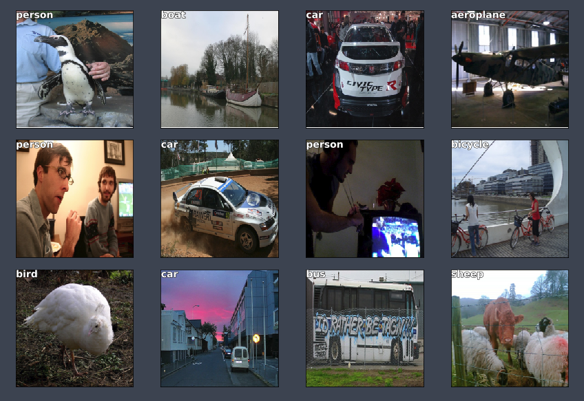
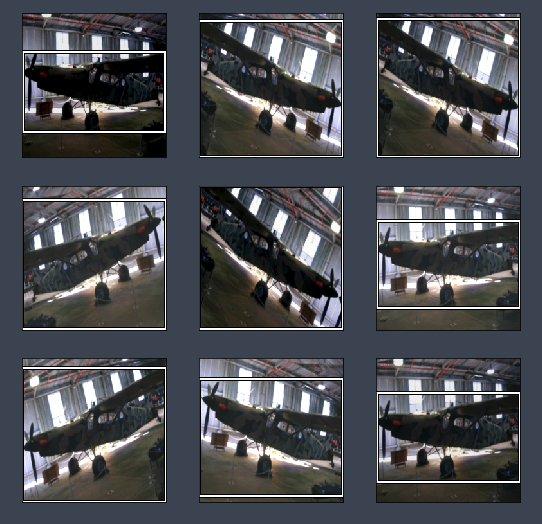
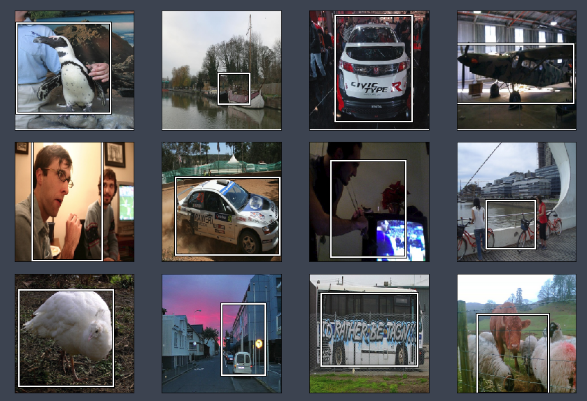

# Lesson 8 - Object Detection

_These are my personal notes from fast.ai course and will continue to be updated and improved if I find anything useful and relevant while I continue to review the course to study much more in-depth. Thanks for reading and happy learning!_

## Topics

* A quick recap of what we learned in part 1.
* Introduces the new focus of this part of the course: cutting edge research.
* We’ll show you how to read an academic paper in a way that you don’t get overwhelmed by the notation and writing style.
* Another difference in this part is that we’ll be digging deeply into the source code of the fastai and PyTorch libraries.
* We’ll see how to use Python’s debugger to deepen your understand of what’s going on, as well as to fix bugs.
* The **main topic** of this lesson is object detection, which means getting a model to draw a box around every key object in an image, and label each one correctly.
  * Two main tasks: find and localize the objects, and classify them; we’ll use a single model to do both these at the same time.
  * Such multi-task learning generally works better than creating different models for each task—which many people find rather counter-intuitive.
  * To create this custom network whilst leveraging a pre-trained model, we’ll use fastai's flexible custom head architecture.

## Lesson Resources

* [Website](http://course.fast.ai/lessons/lesson8.html)
* [Video](https://youtu.be/Z0ssNAbe81M)
* [Wiki](http://forums.fast.ai/t/part-2-lesson-8-wiki)
* [Forum discussion](http://forums.fast.ai/t/part-2-lesson-8-in-class/13556)
* Jupyter Notebook and Code
  * [pascal.ipynb](https://nbviewer.jupyter.org/github/fastai/fastai/blob/master/courses/dl2/pascal.ipynb)
* [Slides](https://github.com/fastai/fastai/blob/master/courses/dl2/ppt/lesson8.pptx)

## Assignments

### Papers

* Must read
  * _WIP_
* Additional papers \(optional\)
  * _WIP_

### Other Resources

#### Blog Posts and Articles

* [Lesson summary](https://medium.com/@theimgclist/fast-ai-part-2-lecture-1-object-detection-58095aa76290) by Avinash

#### Other Useful Information

* [Object Oriented Matplotlib](https://realpython.com/blog/python/python-matplotlib-guide/)
* [Learn Greek letters](http://platonicrealms.com/encyclopedia/greek-alphabet)
* [JupyterLab demo (video)](https://www.youtube.com/watch?v=dSjvK-Z3o3U)

#### Tips and Tricks

* [Python plotting with Matplotlib](https://realpython.com/python-matplotlib-guide/)

### Useful Tools and Libraries

* Integrated Development Environment (IDE)
  * If you don't have a IDE or light-weight editor, download one.
    * [PyCharm](https://www.jetbrains.com/pycharm/) for community is free
    * [Visual Studio Code](https://code.visualstudio.com/)
* [JupyterLab](http://jupyterlab.readthedocs.io/en/stable/)
* Bounding box annotation tools
    * [Rectlabel](https://rectlabel.com/)
    * [List of manual image annotation tools](https://en.wikipedia.org/wiki/List_of_manual_image_annotation_tools)

## My Notes

### Where We Are

* What we've learnt so far.
  * Differentiable Layers
  * Transfer Learning
  * Architecture Design
  * Handling over-fitting
  * Embeddings
* From Part 1 "practical" to Part 2 "cutting edge".
  * Goals or approach.
  * Part 1 really was all about introducing best practices in deep learning.
  * Part 2 is cutting edge deep learning for coders, and what that means is Jeremy often does not know the exact best parameters, architecture details, and so forth to solve a particular problem. We do not necessarily know if it’s going to solve a problem well enough to be practically useful.
  * :warning: Be aware of sample codes [00:13:20]! The code academics have put up to go along with papers or example code somebody else has written on github, Jeremy nearly always find there is some massive critical flaw, so be careful of taking code from online resources and be ready to do some debugging.
* It's time to start reading papers.
  * Each week, we will be implementing a paper or two. In academic papers, people love to use Greek letters. They also hate to refactor, so you will often see a page long formula where when you look at it carefully you'll realize the same sub equation appears 8 times. Academic papers are a bit weird, but in the end, it's the way that the research community communicates their findings so we need to learn to read them.
* Part 2's topics.
* This lesson will start on object detection.

### Object Detection

Two main differences from what we are used to:

**1. We have multiple things that we are classifying.**

  This part is not new, as we have done this in part 1, the Planet satellite tutorial.

**2. Bounding boxes around what we are classifying.**

  The box has the object entirely in it, but is no bigger than it needs to be. For these object detection datasets, we are looking for a pool of objects, but not necessarily **every** object in the image (horse, person, car, tree, etc).

#### Stages

1. Find the largest object.
2. Find where it is.
3. Try and do both at the same time.

### Pascal Notebook

Start with the Pascal Notebook.

```Python
from pathlib import Path
import json
from PIL import ImageDraw, ImageFont
from matplotlib import patches, patheffects
torch.cuda.set_device(3)
```

You may find a line `torch.cuda.set_device(3)` left behind which will give you an error if you only have one GPU. This is how you select a GPU when you have multiple, so just set it to zero (`torch.cuda.set_device(0)`) or take out the line entirely.

#### Pascal VOC

We will be looking at the [Pascal VOC](http://host.robots.ox.ac.uk/pascal/VOC/) dataset. It's quite slow, so you may prefer to download from [this mirror](https://pjreddie.com/projects/pascal-voc-dataset-mirror/). There are two different competition/research datasets, from 2007 and 2012. **We'll be using the 2007 version.** You can use the larger 2012 for better results, or even combine them (but be careful to avoid data leakage between the validation sets if you do this).

:memo: How to download the dataset:

```bash
# Make a data and pascal dir to keep our downloaded files
cd ~/fastai/courses/dl2
ln -s ~/data data && cd $_
mkdir pascal && cd $_

# Download the two compressed files.
# Download images
aria2c --file-allocation=none -c -x 5 -s 5 http://pjreddie.com/media/files/VOCtrainval_06-Nov-2007.tar

# Download annotations - bounding boxes
curl -OL https://storage.googleapis.com/coco-dataset/external/PASCAL_VOC.zip

# Extract tar and zip files
tar -xf VOCtrainval_06-Nov-2007.tar
unzip PASCAL_VOC.zip

# Move the .json files out of the PASCAL_VOC into the pascal/ dir
mv PASCAL_VOC/*.json .
rmdir PASCAL_VOC
```

#### Pathlib

Unlike previous lessons, we are using the python 3 standard library `pathlib` for our paths and file access. Note that it returns an OS-specific class (on Linux, `PosixPath`) so your output may look a little different. Most libraries than take paths as input can take a pathlib object - although some (like `cv2`) can't, in which case you can use `str()` to convert it to a string.

:memo: [pathlib cheat sheet](http://pbpython.com/pathlib-intro.html)

```Python
PATH = Path('data/pascal')
list(PATH.iterdir())
```

```Python
[PosixPath('data/pascal/pascal_train2012.json'),
 PosixPath('data/pascal/VOCtrainval_06-Nov-2007.tar'),
 PosixPath('data/pascal/pascal_train2007.json'),
 PosixPath('data/pascal/VOCdevkit'),
 PosixPath('data/pascal/pascal_val2007.json'),
 PosixPath('data/pascal/pascal_test2007.json'),
 PosixPath('data/pascal/pascal_val2012.json'),
 PosixPath('data/pascal/PASCAL_VOC.zip')]
```

##### Python 3 Generators

Generators are a simple and powerful tool for creating iterators. They are written like regular functions but use the `yield` statement whenever they want to return data.

```Python
# Turn a generator into a list
list(PATH.iterdir())

# List comprehension
[i for i in PATH.iterdir()]

# Loop over a list
for i in PATH.iterdir():
    print(i)
```

The reason that things generally return generators is that if the directory had 10 million items in, you don’t necessarily want 10 million long list. Generator lets you do things "lazily".

#### Loading Pascal VOC Annotations

```Python
trn_j = json.load( (PATH / 'pascal_train2007.json').open() )
trn_j.keys()
```

`pascal_train2007.json` file contains not the images but the bounding boxes and the classes of the objects.

:memo: `json.load()` deserialize file-like object containing a JSON document to a Python object.

##### Images

```Python
IMAGES, ANNOTATIONS, CATEGORIES = ['images', 'annotations', 'categories']
trn_j[IMAGES][:5]
```

```Python
[{'file_name': '000012.jpg', 'height': 333, 'width': 500, 'id': 12},
 {'file_name': '000017.jpg', 'height': 364, 'width': 480, 'id': 17},
 {'file_name': '000023.jpg', 'height': 500, 'width': 334, 'id': 23},
 {'file_name': '000026.jpg', 'height': 333, 'width': 500, 'id': 26},
 {'file_name': '000032.jpg', 'height': 281, 'width': 500, 'id': 32}]
```

##### Annotations

```Python
trn_j[ANNOTATIONS][:2]
```

```Python
[{'segmentation': [[155, 96, 155, 270, 351, 270, 351, 96]],
  'area': 34104,
  'iscrowd': 0,
  'image_id': 12,
  'bbox': [155, 96, 196, 174],
  'category_id': 7,
  'id': 1,
  'ignore': 0},
 {'segmentation': [[184, 61, 184, 199, 279, 199, 279, 61]],
  'area': 13110,
  'iscrowd': 0,
  'image_id': 17,
  'bbox': [184, 61, 95, 138],
  'category_id': 15,
  'id': 2,
  'ignore': 0}]
```

Schema:
- `bbox` : column (x coord, origin of top left), row (y coord, origin of top left), height, width
- `image_id` : you'd have join this up with `trn_j[IMAGES]` (above) to find `file_name` etc.
- `category_id` : see `trn_j[CATEGORIES]` (below)
- `segmentation` : polygon segmentation (we will not be using them)
- `ignore` : we will ignore the `ignore` flags
- `iscrowd` : specifies that it is a crowd of that object, not just one of them

##### Categories

```Python
trn_j[CATEGORIES][:8]
```

```Python
[{'supercategory': 'none', 'id': 1, 'name': 'aeroplane'},
 {'supercategory': 'none', 'id': 2, 'name': 'bicycle'},
 {'supercategory': 'none', 'id': 3, 'name': 'bird'},
 {'supercategory': 'none', 'id': 4, 'name': 'boat'},
 {'supercategory': 'none', 'id': 5, 'name': 'bottle'},
 {'supercategory': 'none', 'id': 6, 'name': 'bus'},
 {'supercategory': 'none', 'id': 7, 'name': 'car'},
 {'supercategory': 'none', 'id': 8, 'name': 'cat'}]
```

#### Convert VOC's Bounding Box

Convert VOC's height/width into top-left/bottom-right, and switch x/y coords to be consistent with numpy.

```Python
# bb is an example of VOC's bbox
# x, y, width, height -> top-left coord (y, x), bottom-right coord (y+height-1, x+width-1)
#ix   0    1   2    3
bb = [155, 96, 196, 174]
bb[1], bb[0], bb[3] + bb[1] - 1, bb[2] + bb[0] - 1 # (96, 155, 269, 350)
```

```Python
def hw_bb(bb):
    return np.array([ bb[1], bb[0], bb[3] + bb[1] - 1, bb[2] + bb[0] - 1 ])
```

```Python
trn_anno = collections.defaultdict(lambda:[])

for o in trn_j[ANNOTATIONS]:
    if not o['ignore']:
        bb = o[BBOX]  # one bbox. looks like '[155, 96, 196, 174]'.
        bb = hw_bb(bb) # output '[96 155 269 350]'.
        trn_anno[o[IMG_ID]].append( (bb, o[CAT_ID]) )
```

```Python
list(trn_anno.values())[0]
```

```Python
[(array([ 96, 155, 269, 350]), 7)] # [bbox], class id
```

##### Python's defaultdict

A `defaultdict` is useful any time you want to have a default dictionary entry for new keys [00:55:05]. If you try and access a key that doesn’t exist, it magically makes itself exist and it sets itself equal to the return value of the function you specify (in this case `lambda:[]`).

#### Covert Back to VOC Bounding Box Format

Some libs take VOC format bounding boxes, so this let’s us convert back when required [1:02:23]:

```Python
def bb_hw(a):
    return np.array( [ a[1], a[0], a[3] - a[1] + 1, a[2] - a[0] + 1 ] )
```

#### Fastai's `open_image` function

Fastai uses [OpenCV](https://opencv.org/). [TorchVision](https://pytorch.org/docs/stable/torchvision/index.html) uses PyTorch tensors for data augmentations etc. A lot of people use [Pillow](http://python-pillow.org/) `PIL`. Jeremy did a lot of testing of all of these and he found **OpenCV was about 5 to 10 times faster than TorchVision**.

```Python
def open_image(fn):
    """ Opens an image using OpenCV given the file path.

    Arguments:
        fn: the file path of the image

    Returns:
        The image in RGB format as numpy array of floats normalized to range between 0.0 - 1.0
    """
    flags = cv2.IMREAD_UNCHANGED+cv2.IMREAD_ANYDEPTH+cv2.IMREAD_ANYCOLOR
    if not os.path.exists(fn):
        raise OSError('No such file or directory: {}'.format(fn))
    elif os.path.isdir(fn):
        raise OSError('Is a directory: {}'.format(fn))
    else:
        try:
            if str(fn).startswith("http"):
                req = urllib.urlopen(str(fn))
                image = np.asarray(bytearray(resp.read()), dtype="uint8")
                im = cv2.imdecode(image, flags).astype(np.float32)/255
            else:
                im = cv2.imread(str(fn), flags).astype(np.float32)/255
            if im is None: raise OSError(f'File not recognized by opencv: {fn}')
            return cv2.cvtColor(im, cv2.COLOR_BGR2RGB)
        except Exception as e:
            raise OSError('Error handling image at: {}'.format(fn)) from e
```

#### Matplotlib

:bookmark: _Note to self: as we will frequently use Matplotlib, for the better, we need to prioritize learning Matplotlib._

Tricks:

1. `plt.subplots`.

    Useful wrapper for creating plots, regardless of whether you have more than one subplot.

    :memo: Matplotlib has an optional object-oriented API which I think is much easier to understand and use (although few examples online use it!).

2. Visible text regardless of background color.

    A simple but rarely used trick to making text visible regardless of background is to use white text with black outline, or visa versa. Here's how to do it in Matplotlib:

    ```Python
    def draw_outline(o, lw):
        o.set_path_effects( [patheffects.Stroke(linewithd=lw, foreground='black'),
                              patheffects.Normal()] )
    ```

#### Packaging it all up

When you are working with a new dataset, getting to the point that you can rapidly explore it pays off.

#### Next Complex Step - Largest Item Classifier

Rather than trying to solve everything at once, let’s make continual progress. We know how to find the biggest object in each image and classify it, so let’s start from there.

Steps we need to do:

1. Go through each of the bounding boxes in an image and get the largest one.
    - Sort the annotation for each image - by bounding box size (descending).

    ```Python
    def get_lrg(b):
        if not b:
            raise Exception()
        # x is tuple. e.g.: (array([96 155 269 350]), 16)
        # x[0] returns a numpy array. e.g.: [96 155 269 350]
        # x[0][-2:] returns a numpy array. e.g.: [269 350]. This is the width x height of a bbox.
        # x[0][:2] returns a numpy array. e.g.: [96 155]. This is the x/y coord of a bbox.
        # np.product(x[0][-2:] - x[0][:2]) returns a scalar. e.g.: 33735
        b = sorted(b, key=lambda x: np.product(x[0][-2:] - x[0][:2]), reverse=True)
        return b[0] # get the first element in the list, which is the largest bbox for one image.

    # a is image id (int), b is tuple of bbox (numpy array) & class id (int)
    trn_lrg_anno = { a: get_lrg(b) for a, b in trn_anno.items() if (a != 0 and a != 1) }
    ```

    - Now we have a dictionary from image id to a single bounding box - the largest for that image.

2. Plot the bounding box.

    ```Python
    def draw_largest_bbox(img_id):
        b, c = trn_lrg_anno[img_id] # trn_lrg_anno is a tuple. destructuring syntax.
        print(f'### DEBUG ### bbox: {b.tolist()}, class id: {c}') # print numpy.ndarray using tolist method.

        b = bb_hw(b) # convert back fastai's bbox to VOC format
        ax = show_img(open_image(IMG_PATH / trn_fns[img_id]), figsize=(5, 10))
        draw_rect(ax, b)
        draw_text(ax, b[:2], cats[c], sz=16)

    img_id = 23
    draw_largest_bbox(img_id)
    ```

    ```Pyhon
    ### DEBUG ### bbox: [1, 2, 461, 242], class id: 15
    ```

#### Model Data

:memo: Often it's easiest to simply create a CSV of the data you want to model, rather than trying to create a custom dataset.

Here we use Pandas to help us create a CSV of the image filename and class.

```Python
# Makes tmp directory
(PATH / 'tmp').mkdir(exist_ok=True)
CSV = PATH / 'tmp/lrg.csv'

# Pandas
df = pd.DataFrame({ 'fn': [trn_fns[o] for o in trn_ids],
                    'cat': [cats[trn_lrg_anno[o][1]] for o in trn_ids] }, columns=['fn', 'cat'])
df.to_csv(CSV, index=False)
```

:bookmark: _note to self: learn Pandas._

#### Model

From here it’s just like lesson 2 "Dogs vs Cats"!

```Python
tfms = tfms_from_model(f_model, sz, aug_tfms=transforms_side_on, crop_type=CropType.NO)
md = ImageClassifierData.from_csv(PATH, JPEGS, CSV, tfms=tfms, bs=bs)
```

One thing that is different is `crop_type`.

For bounding boxes, we **do not want to crop the image** because unlike an ImageNet where the thing we care about is pretty much in the middle and pretty big, a lot of the things in object detection is quite small and close to the edge. By setting `crop_type` to `CropType.NO`, it will not crop.

##### Data Loaders

You already know that inside of a model data object, we have bunch of things which include training data loader and training data set. The main thing to know about data loader is that it is an **iterator** that each time you grab the next iteration of stuff from it, you get a mini batch.

If you want to grab just a single batch, this is how you do it:

```Python
# x: independent variable
# y: dependent variable
x, y = next(iter(md.val_dl))
```

#### Training with ResNet34

```Python
# Create ResNet34 model
learn = ConvLearner.pretrained(f_model, md, metrics=[accuracy])
learn.opt_fn = optim.Adam

# Find a learning rate
lrf = learn.lr_find(1e-5, 100)

# To change the truncation of the plot, use the command below
learn.sched.plot(n_skip=5, n_skip_end=1)

# Set the learning rate
lr = 2e-2
# Train a bit
learn.fit(lr, 1, cycle_len=1)

# Freeze all layers except the last two layers, find new learning rate and retrain
lrs = np.array([lr/1000, lr/100, lr])
learn.freeze_to(-2)

lrf = learn.lr_find(lrs/1000)
learn.sched.plot(1)

learn.fit(lrs/5, 1, cycle_len=1)
```

```Python
epoch      trn_loss   val_loss   accuracy
    0      0.789873   0.674313   0.788
[array([0.67431]), 0.7879999985694885]
```

Accuracy is still at 79%.

Accuracy isn’t improving much — since many images have multiple different objects, it’s going to be impossible to be that accurate.

```Python
# Unfreeze the whole thing and train
learn.unfreeze()
learn.fit(lrs/5, 1, cycle_len=2)
```

```Python
epoch      trn_loss   val_loss   accuracy
    0      0.600366   0.672303   0.794
    1      0.444746   0.691367   0.786
[array([0.69137]), 0.786]
```

```Python
# Save model
learn.save('clas_one')
learn.load('clas_one')
```

##### Training Results

Let's look at the 20 classes.

```Python
# Get images as numpy arrays
x, y = next(iter(md.val_dl))
probs = F.softmax(predict_batch(learn.model, x), -1)
x, preds = to_np(x), to_np(probs)
preds = np.argmax(preds, -1)

# Plot images and labels
fig, axes = plt.subplots(3, 4, figsize=(12, 8))

for i, ax in enumerate(axes.flat):
    ima = md.val_ds.denorm(x)[i]
    b = md.classes[preds[i]]
    ax = show_img(ima, ax=ax)
    draw_text(ax, (0, 0), b)

plt.tight_layout()
```



It's doing a pretty good job of classifying the largest object.

In the next stage, we create a bounding box around an object.

#### Debugging

How to understand the unfamiliar code:

- Run each line of code step by step, print out the inputs and outputs.

**Method 1**: Break down a large piece of code from a cell and put them all in separate cells, one line per cell. Example, you can take the contents of the loop, copy it, create a cell above it, paste it, un-indent it, set `i=0` and put them all in separate cells.

**Method 2**: Use Python debugger `pdb` to step through code.

:bookmark: _note to self: re-learn `pdb`_

#### Next Stage: Create A Bounding Box Around An Object

We know we can make a regression neural net instead of a classification. This is accomplished by changing the last layer of the neural net. Instead of Softmax, and use MSE, it is now a regression problem. We can have multiple outputs.

##### Bounding Box Only

Now we’ll try to find the bounding box of the largest object. This is simply a regression with 4 outputs (predict the following values). So, we can use a CSV with multiple 'labels'.
- top left `x`
- top left `y`
- lower right `x`
- lower right `y`

```Python
BB_CSV = PATH / 'tmp/bb.csv'
```

Transform the bounding box data

```Python
bb = np.array([ trn_lrg_anno[o][0] for o in trn_ids ])
bbs = [' '.join( str(p) for p in o ) for o in bb]

df = pd.DataFrame({
    'fn': [ trn_fns[o] for o in trn_ids ],
    'bbox': bbs
}, columns=['fn', 'bbox'])
df.to_csv(BB_CSV, index=False)
```

Open and read CSV up to 5 lines.

```Python
BB_CSV.open().readlines()[:5]
```

```Python
['fn,bbox\n',
 '008197.jpg,186 450 226 496\n',
 '008199.jpg,84 363 374 498\n',
 '008202.jpg,110 190 371 457\n',
 '008203.jpg,187 37 359 303\n']
```

Set our model and parameters.

```Python
f_model = resnet34
sz = 224
bs = 64
```

**Tell fastai lib to make a continous network model**

Set `continuous=True` to tell fastai this is a regression problem, which means it won't one-hot encode the labels, and will use MSE as the default crit.

Note that we have to tell the transforms constructor that our labels are coordinates, so that it can handle the transforms correctly.

Also, we use `CropType.NO` because we want to 'squish' the rectangular images into squares, rather than center cropping, so that we don't accidentally crop out some of the objects. (This is less of an issue in something like ImageNet, where there is a single object to classify, and it's generally large and centrally located).

```Python
augs = [RandomFlip(tfm_y=TfmType.COORD),
        RandomRotate(30, tfm_y=TfmType.COORD),
        RandomLighting(0.1,0.1, tfm_y=TfmType.COORD)]

tfms = tfms_from_model(f_model, sz, crop_type=CropType.NO, aug_tfms=augs, tfm_y=TfmType.COORD)
md = ImageClassifierData.from_csv(PATH, JPEGS, BB_CSV, tfms=tfms, continuous=True, bs=4)
```

We will look at `TfmType.COORD` in the next lesson, but for now, just realize that when we are doing scaling and data augmentation, that needs to happen to the bounding boxes, not just images.

```Python
idx = 3
fig, axes = plt.subplots(3, 3, figsize=(9, 9))

for i, ax in enumerate(axes.flat):
    x, y = next(iter(md.aug_dl))
    ima = md.val_ds.denorm(to_np(x))[idx]
    b = bb_hw(to_np(y[idx]))
    print(b)
    show_img(ima, ax=ax)
    draw_rect(ax, b)
```

```Python
[  1.  60. 221. 125.]
[  0.  12. 224. 211.]
[  0.   9. 224. 214.]
[  0.  21. 224. 202.]
[  0.   0. 224. 223.]
[  0.  55. 224. 135.]
[  0.  15. 224. 208.]
[  0.  31. 224. 182.]
[  0.  53. 224. 139.]
```



#### Custom Head

Custom head allows us to add additional layers on the end of the ResNet.

fastai library lets you use a `custom_head` to add your own module on top of a convnet, instead of the adaptive pooling and fully connected net which is added by default. In this case, we don't want to do any pooling, since we need to know the activations of each grid cell.

The final layer has 4 activations, one per bounding box coordinate. Our target is continuous, not categorical, so the MSE loss function used does not do any sigmoid or softmax to the module outputs.

```Python
head_reg4 = nn.Sequential(Flatten(), nn.Linear(512*7*7, 4))
learn = ConvLearner.pretrained(f_model, md, custom_head=head_reg4)
learn.opt_fn = optim.Adam
learn.crit = nn.L1Loss()
```
- `Flatten()`

  Normally the previous layer has 7x7x512 in ResNet34, so flatten that out into a single vector of length 25088.
- `L1Loss`

  Rather than adding up the squared errors, add up the absolute values of the errors. It is normally what you want because adding up the squared errors really penalizes bad misses by too much. So L1Loss is generally better to work with.

Check the model to see that the additional layer has been added:

```Python
learn.summary()
```

```
OrderedDict([('Conv2d-1',
              OrderedDict([('input_shape', [-1, 3, 224, 224]),
                           ('output_shape', [-1, 64, 112, 112]),
                           ('trainable', False),
                           ('nb_params', 9408)])),
             ... ... ... ... ... ... ... ... ... ... ... ... ...
             ... ... ... ... ... ... ... ... ... ... ... ... ...
             ('Conv2d-119',
              OrderedDict([('input_shape', [-1, 512, 7, 7]),
                           ('output_shape', [-1, 512, 7, 7]),
                           ('trainable', False),
                           ('nb_params', 2359296)])),
             ('BatchNorm2d-120',
              OrderedDict([('input_shape', [-1, 512, 7, 7]),
                           ('output_shape', [-1, 512, 7, 7]),
                           ('trainable', False),
                           ('nb_params', 1024)])),
             ('ReLU-121',
              OrderedDict([('input_shape', [-1, 512, 7, 7]),
                           ('output_shape', [-1, 512, 7, 7]),
                           ('nb_params', 0)])),
             ('BasicBlock-122',
              OrderedDict([('input_shape', [-1, 512, 7, 7]),
                           ('output_shape', [-1, 512, 7, 7]),
                           ('nb_params', 0)])),
             ('Flatten-123',
              OrderedDict([('input_shape', [-1, 512, 7, 7]),
                           ('output_shape', [-1, 25088]),
                           ('nb_params', 0)])),

             ################### New layer ###################
             ('Linear-124',
              OrderedDict([('input_shape', [-1, 25088]),
                           ('output_shape', [-1, 4]),
                           ('trainable', True),
                           ('nb_params', 100356)]))])
             ################### New layer ###################
```

Try and fit the model.

```Python
learn.lr_find(1e-5, 100)
learn.sched.plot(5)
```

```Python
# Set the learning rate and train
lr = 2e-3
learn.fit(lr, 2, cycle_len=1, cycle_mult=2)
```

```Python
epoch      trn_loss   val_loss
    0      48.960351  35.755788
    1      37.135304  29.60765
    2      31.466736  29.009163
[array([29.00916])]
```

```Python
# Freeze all layers except the last two layers, find new learning rate and retrain
lrs = np.array([lr/100, lr/10, lr])

learn.freeze_to(-2)

lrf = learn.lr_find(lrs/1000)
learn.sched.plot(1)

learn.fit(lrs, 2, cycle_len=1, cycle_mult=2)
```

```Python
epoch      trn_loss   val_loss
    0      25.858838  25.091344
    1      22.565964  22.855172
    2      19.391733  21.236308
[array([21.23631])]
```

```Python
# Freeze all layers except the three two layers, find new learning rate and retrain
learn.freeze_to(-3)

learn.fit(lrs, 1, cycle_len=2)
```

```Python
epoch      trn_loss   val_loss
    0      18.009395  21.977178
    1      16.113632  20.927288
[array([20.92729])]
```

Save model.

```Python
learn.save('reg4')
```

##### Training Results

Let's see how our model did.

```Python
# Evaluate model
x, y = next(iter(md.val_dl))
learn.model.eval()
preds = to_np(learn.model(VV(x)))

# Plot images with bbox
fig, axes = plt.subplots(3, 4, figsize=(12, 8))

for i, ax in enumerate(axes.flat):
    ima = md.val_ds.denorm(to_np(x))[i]
    b = bb_hw(preds[i])
    ax = show_img(ima, ax=ax)
    draw_rect(ax, b)
plt.tight_layout()
```



We will revise this more next lesson.

As you look further down, it starts looking a bit crappy — anytime we have more than one object. This is not surprising. Overall, it did a pretty good job.