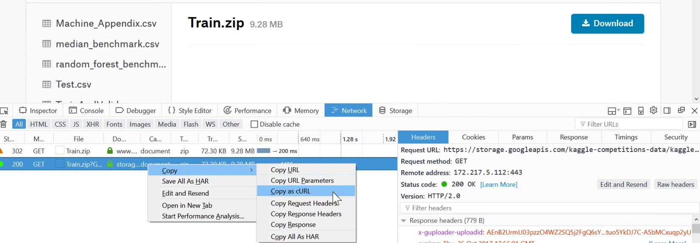
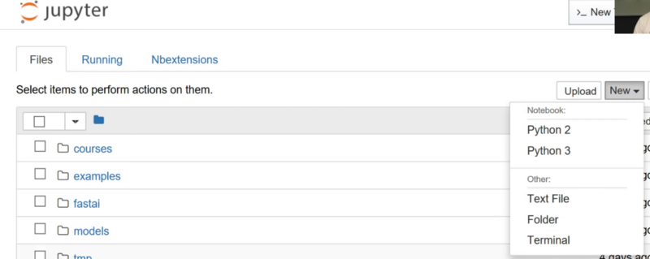
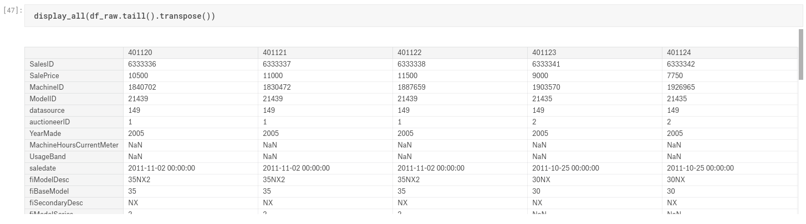
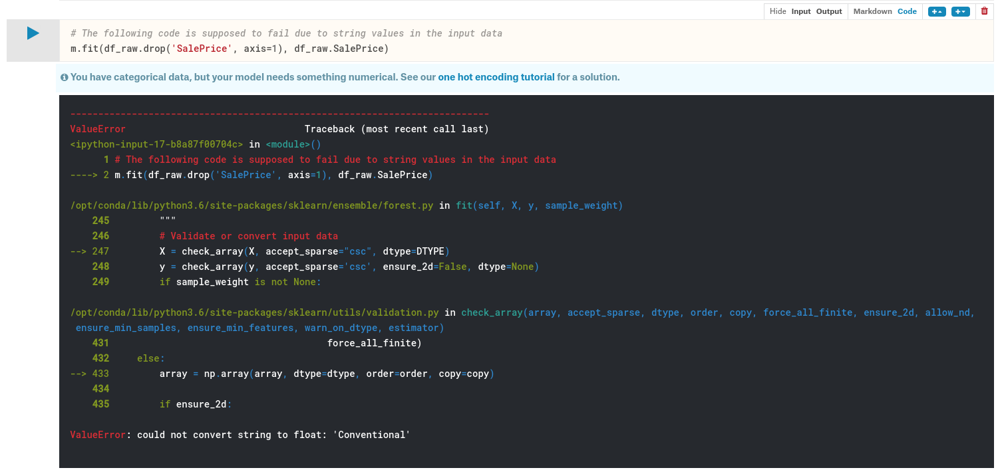
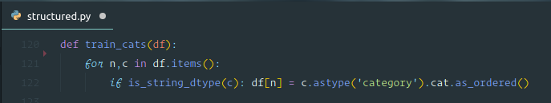
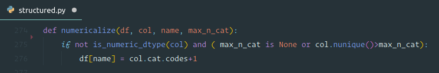
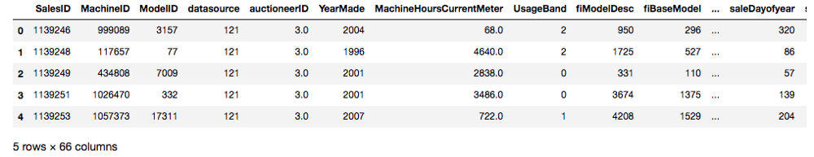

# Lesson 1 - Introduction to Random Forests

_These are my personal notes from fast.ai machine learning course and will continue to be updated and improved if I find anything useful and relevant while I continue to review the course to study much more in-depth. Thanks for reading and happy learning!_

## Topics

* Introduction to Random Forests
* Blue Book for Bulldozers Kaggle competition
* Continuous and categorical variables

## Lesson Resources

* [Video](https://youtu.be/CzdWqFTmn0Y)
* Jupyter Notebook and code
  * [lesson1-rf.ipynb](https://nbviewer.jupyter.org/github/fastai/fastai/blob/master/courses/ml1/lesson1-rf.ipynb)
* Dataset
  * [Blue Book for Bulldozers Kaggle competition](https://www.kaggle.com/c/bluebook-for-bulldozers)

## Assignments

* Entering to Kaggle competition
* Solve as many Kaggle competitions as possible

### Other Resources

#### Books

* The more familiarity you have with numeric programming in Python, the better. If you're looking to improve in this area, we strongly suggest Wes McKinney's [Python for Data Analysis: Data Wrangling with `Pandas`, NumPy, and IPython, 2nd edition](https://www.amazon.com/Python-Data-Analysis-Wrangling-IPython/dp/1491957662/ref=asap_bc?ie=UTF8).
* For machine learning with Python, we recommend:
  * [Introduction to Machine Learning with Python](https://www.amazon.com/Introduction-Machine-Learning-Andreas-Mueller/dp/1449369413): From one of the scikit-learn authors, which is the main library we'll be using.
  * [Python Machine Learning: Machine Learning and Deep Learning with Python, scikit-learn, and TensorFlow, 2nd Edition](https://www.amazon.com/Python-Machine-Learning-scikit-learn-TensorFlow/dp/1787125939/ref=dp_ob_title_bk): New version of a very successful book. A lot of the new material however covers deep learning in Tensorflow, which isn't relevant to this course.
  * [Hands-On Machine Learning with Scikit-Learn and TensorFlow](https://www.amazon.com/Hands-Machine-Learning-Scikit-Learn-TensorFlow/dp/1491962291/ref=pd_lpo_sbs_14_t_0?_encoding=UTF8&psc=1&refRID=MBV2QMFH3EZ6B3YBY40K)

## My Notes

### Syllabus in brief

Depending on time and class interests, we'll cover something like (not necessarily in this order):

* Train vs test
  * Effective validation set construction
* Trees and ensembles
  * Creating random forests
  * Interpreting random forests
* What is ML? Why do we use it?
  * What makes a good ML project?
  * Structured vs unstructured data
  * Examples of failures/mistakes
* Feature engineering
  * Domain specific - dates, URLs, text
  * Embeddings / latent factors
* Regularized models trained with SGD
  * GLMs, Elasticnet, etc (NB: see what James covered)
* Basic neural nets
  * PyTorch
  * Broadcasting, Matrix Multiplication
  * Training loop, backpropagation
* KNN
* CV / bootstrap (Diabetes data set?)
* Ethical considerations

<br />

* Skip:
  * Dimensionality reduction
  * Interactions
  * Monitoring training
  * Collaborative filtering
  * Momentum and learning rate annealing

### fast.ai approach to machine learning

Most machine learning courses will throw at you dozens of different algorithms, with a brief technical description of the math behind them, and maybe a toy example. You're left confused by the enormous range of techniques shown and have little practical understanding of how to apply them.

The good news is that **modern machine learning can be distilled down to a couple of key techniques that are of very wide applicability**. Recent studies have shown that the vast majority of datasets can be best modeled with just two methods:

- *Ensembles of decision trees* (i.e. Random Forests and Gradient Boosting Machines), mainly for structured data (such as you might find in a database table at most companies)
- *Multi-layered neural networks learnt with SGD* (i.e. shallow and/or deep learning), mainly for unstructured data (such as audio, vision, and natural language)

In this course we'll be doing a deep dive into random forests, and simple models learnt with SGD. You'll be learning about gradient boosting and deep learning in part 2.

### Random Forest: Blue Book for Bulldozers Kaggle Competition

- [Notebook](https://nbviewer.jupyter.org/github/fastai/fastai/blob/master/courses/ml1/lesson1-rf.ipynb)
- [Kaggle competition](https://www.kaggle.com/c/bluebook-for-bulldozers)

```python
%load_ext autoreload
%autoreload 2
%matplotlib inline

from fastai.imports import *
from fastai.structured import *

from pandas_summary import DataFrameSummary
from sklearn.ensemble import RandomForestRegressor, RandomForestClassifier

from IPython.display import display
from sklearn import metrics
```

Data science ≠ Software engineering [[00:08:43](https://youtu.be/CzdWqFTmn0Y?t=8m43s)]. You will see code that does not follow PEP 8 and things like import *, but go along with it for a while. What we are doing right now is prototyping models, and prototyping models has a very different set of best practices that are taught nowhere. The key is to be able to do things very interactively and iteratively. Jupyter notebook makes this easy. If you ever wondered what display is, you can do one of the three things:

1. type `display` in a cell and press `shift + enter`—it will tell you where it came from `<function IPython.core.display.display>`.
2. type `?display` in a cell and press `shift + enter`—it will show you the documentation.
3. type `??display` in a cell and press `shift + enter `— it will show you the source code. This is particularly useful for fastai library because most of the functions are easy to read and no longer than 5 lines long.

#### Download data [[00:12:05](https://youtu.be/CzdWqFTmn0Y?t=12m5s)]

Entering to Kaggle competition will let you know whether you are competent at this kind of data in this kind of model. Is the accuracy bad because the the data is so noisy that you cannot do better? Or is it actually an easy dataset and you have made a mistake? When you are working on your own project with your own dataset, you will not get this kind of feedback—we just have to know that we have good effective techniques to reliably building baseline model.

Machine learning should help us understand a dataset, not just make predictions about it [[00:15:36](https://youtu.be/CzdWqFTmn0Y?t=15m36s)]. So by picking an area which we are not familiar with, it is a good test of whether we can build an understanding. Otherwise what can happen is that your intuition about the data can make it very difficult for you to be open-minded enough to see what the data really says.

There are a few options to download the data:

1. Download to your computer and `scp` to AWS.
2. From Firefox [[00:17:32](https://youtu.be/CzdWqFTmn0Y?t=17m32s)], press `ctrl + shift + i` to open web developer tool. Go to `Network` tab, click on `Download` button, and cancel out of the dialog box. It shows network connections that were initiated. You then right-click on it and select `Copy as cURL`. Paste the command and add `-o bulldozer.zip` at the end (possibly remove `—— 2.0` in the cURL command).



Jupyter trick [[00:21:39](https://youtu.be/CzdWqFTmn0Y?t=21m39s)]—you can open web-based terminal like so:



The goal of this competition is to use the training set which contains data through the end of 2011 to predict the sale price of bulldozers.

#### Let's look at the data [[00:25:25](https://youtu.be/CzdWqFTmn0Y?t=25m25s)]:

**Structured data**: Columns representing a wide range of different types of things such as identifier, currency, date, size.

**Unstructured data**: Images

`pandas` is the most important library when you are working with structured data which is usually imported as `pd`.

```python
df_raw = pd.read_csv(f'{PATH}Train.csv', low_memory=False,
                     parse_dates=["saledate"])
```

- `parse_dates`—A list of any columns that contain dates.
- `low_memory=False `— Forces it to read more of the file to decide what the types are.

```python
def display_all(df):
    with pd.option_context("display.max_rows", 1000, "display.max_columns", 1000):
        display(df)

display_all(df_raw.tail().transpose())
```

In Jupyter Notebook, if you type a variable name and press `ctrl + enter` whether that being Dataframe, video, HTML, etc—it will generally figure out a way of displaying it for you [[00:32:13](https://youtu.be/CzdWqFTmn0Y?t=32m13s)].



The variable we want to predict is called **Dependent Variable** in this case our dependent variable is `SalePrice`.

:question: Should you never look at the data because of the risk of overfit? [[00:33:08](https://youtu.be/CzdWqFTmn0Y?t=33m08s)]

We want to find out at least enough to know that we have managed to imported okay, but tend not to really study it at all at this point, because we do not want to make too many assumptions about it. Many books say to do a lot of exploratory data analysis (EDA) first. We will learn **machine learning driven EDA** today.

#### Purpose of the project—Evaluation [[00:34:06](https://youtu.be/CzdWqFTmn0Y?t=34m6s)]

Root mean squared log error. The reason we use log is because generally, you care not so much about missing by $10 but missing by 10%. So if it was $1000,000 item and you are $100,000 off or if it was a $10,000 item and you are $1,000 off—we would consider those equivalent scale issues.

```python
df_raw.SalePrice = np.log(df_raw.SalePrice)
```
- `np` —[ NumPy](http://www.numpy.org/) lets us treat arrays, matrices, vectors, high dimensional tensors as if they are Python variables.

### What is a random forest? [[00:36:37](https://youtu.be/CzdWqFTmn0Y?t=36m37s)]

Random forest is a universal machine learning technique.

- It can predict something that can be of any kind—it could be a category (classification), a continuous variable (regression).
- It can predict with columns of any kind—pixels, zip codes, revenues, etc (i.e. both structured and unstructured data).
- It does not generally overfit too badly, and it is very easy to stop it from overfitting.
- You do not need a separate validation set in general. It can tell you how well it generalizes even if you only have one dataset.
- It has **few, if any, statistical assumptions**. It does not assume that your data is normally distributed, the relationship is linear, or you have specified interactions.
- It requires very few pieces of feature engineering. For many different types of situation, you do not have to take the log of the data or multiply interactions together.

:question: What about a curse of dimensionality? [[00:38:16](https://youtu.be/CzdWqFTmn0Y?t=38m16s)]

There are two concepts you often hear—curse of dimensionality and no free lunch theorem. They are both largely meaningless and basically stupid and yet many people in the field not only know that but think the opposite so it is well worth explaining. The curse of dimensionality is this idea that the more columns you have, it creates a space that is more and more empty. There is this fascinating mathematical idea that the more dimensions you have, the more all of the points sit on the edge of that space. If you just have a single dimension where things are random, then they are spread out all over. Where else, if it is a square then the probability that they are in the middle means that they cannot be on the edge of either dimension so it is a little less likely that they are not on the edge. Each dimension you add, it becomes multiplicatively less likely that the point is not on the edge of at least one dimension, so in high dimensions, everything sits on the edge. What that means in theory is that the distance between points is much less meaningful. So if we assume it matters, then it would suggest that when you have lots of columns and you just use them without being careful to remove the ones you do not care about that things will not work. This turns out not to be the case for number of reasons

- Points still do have different distances away from each other. Just because they are on the edge, they still vary on how far away they are from each other and so this point is more similar at this point than it is to that point.
- So things like k-nearest neighbors actually work really well in high dimensions despite what the theoreticians claimed. What really happened here was that in 90's, theory took over machine learning. There was this concept of support vector machines that were theoretically well justified, extremely easy to analyze mathematically, and you can prove things about them—and we lost a decade of real practical development. And all these theories became very popular like the curse of dimensionality. Nowadays the world of machine learning has become very empirical and it turns out that in practice, building models on lots of columns works really well.

No free lunch theorem [[00:41:08](https://youtu.be/CzdWqFTmn0Y?t=41m8s)]—their claim is that there is no type of model that works well for any kind of dataset. In the mathematical sense, any random dataset by definition is random, so there is not going to be some way of looking at every possible random dataset that is in someway more useful than any other approach. In real world, we look at data which is not random. Mathematically we would say it sits on some lower dimensional manifold. It was created by some kind of causal structure. There are some relationships in there, so the truth is that we are not using random datasets and hence there are actually techniques that work much better than other techniques for nearly all of the datasets you look at. Nowadays, there are empirical researchers who study which techniques work a lot of the time. Ensembles of decisions trees, which random forest for one, is perhaps the technique which most often comes at the top. Fast.ai provides a standard way to pre-process them properly and set their parameters.

### [scikit-learn](http://scikit-learn.org/stable/) [[42:54](https://youtu.be/CzdWqFTmn0Y?t=42m54s)]

Most popular and important package for machine learning in Python. It is not the best at everything (e.g. XGBoost is better than Gradient Boosting Tree), but pretty good at nearly everything.

```python
m = RandomForestRegressor(n_jobs=-1)
```

- RandomForestRegressor—regressor is a method for predicting continuous variables (i.e. regression)
- RandomForestClassifier—classifier is a method for predicting categorical variables (i.e. classification)

```python
m.fit(df_raw.drop('SalePrice', axis=1), df_raw.SalePrice)
```

Everything in scikit-learn has the same form.

- Create an instance of an object for the machine learning model
- Call `fit` by passing in the independent variables (the things you are going to use to predict) and dependent variable (the thing you want to predict).
- `axis=1` means remove columns.
- `shift + tab` in Jupyter Notebook will bring up the inspection of the parameters of a function.
- "list-like" means anything you can index in Python.



The above code will result in an error. There was a value inside the dataset "Conventional", and it did not know how to create a model using that String. We have to pass numbers to most machine learning models and certainly to random forests. So step 1 is to convert everything into numbers.

This dataset contains a mix of **continuous** and **categorical** variables.

- continuous—numbers where the meaning is numeric such as price.
- categorical—either numbers where the meaning is not continuous like zip code or string such as "large", "medium", "small"

Here are some of the information we can extract from date—year, month, quarter, day of month, day of week, week of year, is it a holiday? weekend? was it raining? was there a sport event that day? It really depends on what you are doing. If you are predicting soda sales in SoMa, you would probably want to know if there was a San Francisco Giants ball game that day. What is in a date is one of the most important piece of feature engineering you can do and no machine learning algorithm can tell you whether the Giants were playing that day and that it was important. So this is where you need to do feature engineering.

The `add_datepart` method extracts particular date fields from a complete datetime for the purpose of constructing categoricals. You should always consider this feature extraction step when working with date-time. Without expanding your date-time into these additional fields, you can't capture any trend/cyclical behavior as a function of time at any of these granularities.

```python
def add_datepart(df, fldname, drop=True):
    fld = df[fldname]
    if not np.issubdtype(fld.dtype, np.datetime64):
        df[fldname] = fld = pd.to_datetime(fld, infer_datetime_format=True)
    targ_pre = re.sub('[Dd]ate$', '', fldname)
    for n in ('Year', 'Month', 'Week', 'Day', 'Dayofweek', 'Dayofyear',
            'Is_month_end', 'Is_month_start', 'Is_quarter_end', 'Is_quarter_start', 'Is_year_end', 'Is_year_start'):
        df[targ_pre+n] = getattr(fld.dt,n.lower())
    df[targ_pre+'Elapsed'] = fld.astype(np.int64) // 10**9
    if drop: df.drop(fldname, axis=1, inplace=True)
```

- `getattr `—look inside of an object and finds an attribute with that name
- `drop=True`—unless specified, it will drop the date time field because we cannot use "saledate" directly because it is not a number.

```python
fld = df_raw.saledate
fld.dt.year
```

- `fld`—Pandas series
- `dt`—`fld` does not have "year" because it only apply to Pandas series that are date time objects. So what Pandas does is it splits out different methods inside attributes that are specific to what they are. So date time objects will have `dt` attribute defined and that is where you will find all the date time specific attributes.

```python
add_datepart(df_raw, 'saledate')
df_raw.saleYear.head()
```

:question: [[00:55:40](https://youtu.be/CzdWqFTmn0Y?t=55m40s)] What is the difference between `df['saleYear']` and `df.saleYear` ?

It is safer to use square brackets especially when assigning values and there is a possibility that the column does not already exist.

After running `add_datepart`, it added many numerical columns and removed `saledate` column. This is not quite enough to get passed the error we saw earlier as we still have other columns that contain string values. Pandas has a concept of a category data type, but by default it would not turn anything into a category for you. Fast.ai provides a function called `train_cats` which creates categorical variables for everything that is a String. Behind the scenes, it creates a column that is an integer and it is going to store a mapping from the integers to the strings. `train_cats` is called "train" because it is training data specific. It is important that validation and test sets will use the same category mappings (in other words, if you used 1 for "high" for a training dataset, then 1 should also be for "high" in validation and test datasets). For validation and test dataset, use `apply_cats` instead.



- `DataFrame.items()`—Iterator over (column name, Series) pairs.
- `is_string_dtype()`—Check whether the provided array or dtype is of the string dtype.
- `n`—name
- `c`—values
- `astype()`—Cast a Series (pandas object) to a specified data type `dtype`

```python
train_cats(df_raw)
df_raw.UsageBand.cat.categories
Index(['High', 'Low', 'Medium'], dtype='object)
```

- `df_raw.UsageBand.cat`—Similar to `fld.dt.year` , `.cat` gives you access to things assuming something is a category.

The order does not matter too much, but since we are going to be creating a decision tree that split things at a single point (i.e. `High` vs. `Low` and `Medium` , `High` and `Low` vs. `Medium` ) which is a little bit weird. To order them in a sensible manner, you can do the following:

```python
df_raw.UsageBand.cat.set_categories(['High', 'Medium', 'Low'], ordered=True, inplace=True)
```

- `inplace` will ask Pandas to change the existing dataframe rather than returning a new one.

There is a kind of categorical variable called "ordinal". An ordinal categorical variable has some kind of order (e.g. "Low" < "Medium" < "High"). Random forests are not terribly sensitive for that fact, but it is worth noting.

```python
display_all(df_raw.isnull().sum().sort_index()/len(df_raw))
```

The above will add a number of empty values for each series, we sort them by the index ([`pandas.Series.sort_index`](https://pandas.pydata.org/pandas-docs/stable/generated/pandas.Series.sort_index.html)), and divide by a number of dataset.

Reading CSV took about 10 seconds, and processing took another 10 seconds, so if we do not want to wait again, it is a good idea to save them. Here we will save it in a feather format. What this is going to do is to save it to disk in exactly the same basic format that it is in RAM. This is by far the fastest way to save something, and also to read it back. Feather format is becoming standard in not only Pandas but in Java, Apache Spark, etc.

```python
os.makedirs('tmp', exist_ok=True)
df_raw.to_feather('tmp/bulldozers-raw')
```

We can read it back as so:

```python
df_raw = pd.read_feather('tmp/bulldozers-raw')
```

We will replace categories with their numeric codes, handle missing continuous values, and split the dependent variable into a separate variable.

```python
df, y, nas = proc_df(df_raw, 'SalePrice')
```


- `df`—data frame
- `y_fld`—name of the dependent variable
- It makes a copy of the data frame, grab the dependent variable values (`y_fld`), and drop the dependent variable from the data frame.
- Then it will `fix_missing` (see below)
- We then will go through the data frame and call `numericalize` (see below).
- `dummies`—There are columns with a small number of possible values, you can put into dummies instead of numericalizing them. But we will not do that for now.

#### `fix_missing`


- For numeric data type, first we check if there is null column. If so, it will create a new column with a name with `_na` appended at the end and set it to 1 if it is missing; 0 otherwise (boolean). It will then replace the missing value with a median.
- We do not need to do this for categorical variables because Pandas handles them automatically by setting them to `-1` .

#### numericalize



- If it is not numeric and is a categorical type, we will replace the column with its code plus 1. By default pandas uses `-1` for missing, so now missing will have an ID of `0` .

```python
df.head()
```



Now we have all numerical values. Note that booleans are treated as numbers. So we can create a random forest.

```python
m = RandomForestRegressor(n_jobs=-1)
m.fit(df, y)
m.score(df, y) # returns the coefficient of determination R^2 of the prediction.
```

Random forests are **trivially parallelizable**—meaning if you have more than one CPU, you can split up the data across different CPUs and it linearly scale. So the more CPUs you have, it will divide the time it takes by that number (not exactly but roughly). `n_jobs=-1` tells the random forest regressor to create a separate job/process for each CPU you have. In other words, the number of jobs to run in parallel for fit. If `-1`, then the number of jobs is set to the number of cores.

`m.score` will return [r²](http://scikit-learn.org/stable/modules/generated/sklearn.ensemble.RandomForestRegressor.html#sklearn.ensemble.RandomForestRegressor.score) value (1 is good, 0 is bad). We will learn r² next week.

Wow, an r² of 0.98—that's great, right? Well, perhaps not…

Possibly **the most important idea** in machine learning is that of having separate training & validation data sets. As motivation, suppose you don't divide up your data, but instead use all of it. And suppose you have lots of parameters:


The error for the pictured data points is lowest for the model on the far right (the blue curve passes through the red points almost perfectly), yet it's not the best choice. Why is that? If you were to gather some new data points, they most likely would not be on that curve in the graph on the right, but would be closer to the curve in the middle graph.

This illustrates how using all our data can lead to **overfitting**. A validation set helps diagnose this problem.

```python
def split_vals(a,n): return a[:n].copy(), a[n:].copy()

n_valid = 12000  # same as Kaggle's test set size
n_trn = len(df)-n_valid
raw_train, raw_valid = split_vals(df_raw, n_trn)
X_train, X_valid = split_vals(df, n_trn)
y_train, y_valid = split_vals(y, n_trn)

X_train.shape, y_train.shape, X_valid.shape

# -----------------------------------------------------------------------------
# Output
# -----------------------------------------------------------------------------
((389125, 66), (389125,), (12000, 66))
```

### Base Model

By using validation set, you see that the r² is 0.88 for validation set.

```python
def rmse(x, y): return math.sqrt(((x - y)**2).mean())

def print_score(m):
    res = [rmse(m.predict(X_train), y_train), rmse(m.predict(X_valid), y_valid),
                m.score(X_train, y_train), m.score(X_valid, y_valid)]
    if hasattr(m, 'oob_score_'): res.append(m.oob_score_)
    print(res)

m = RandomForestRegressor(n_jobs=-1)
%time m.fit(X_train, y_train)
print_score(m)

# -----------------------------------------------------------------------------
# Output
# -----------------------------------------------------------------------------
CPU times: user 1min 40s, sys: 646 ms, total: 1min 41s
Wall time: 1min 24s
[0.09057056725780595, 0.2503660807375712, 0.9828561245974444, 0.8880564808160493]
```

_*[training rmse, validation rmse, r² for training set, r² for validation set]_

If you check Kaggle competition's public board, RMSE of 0.25 will fall around top 25%. Random forests are insanely powerful and this totally standardized process is insanely good for any datasets.

#### Before the next class

Please try this process to solve as many Kaggle competitions as possible. What will likely happen is that you will be pleasantly surprised that you will do pretty well with just an hour of lecture.
