# Lesson 4 - Random Forest Interpretation

_These are my personal notes from fast.ai machine learning course and will continue to be updated and improved if I find anything useful and relevant while I continue to review the course to study much more in-depth. Thanks for reading and happy learning!_

## Topics

* Confidence based on tree variance
* Feature importance
* Logistic regression coefficients
* One-hot encoding for categorical variables
* Removing redundant features
  * Using a dendogram
  * Hierarchical clustering
  * Spearman's R correlation matrix
* Partial dependence
  * Partial dependence plot
* What is the purpose of interpretation, what to do with that information
* Tree interpreter

## Lesson Resources

* [Video](https://youtu.be/0v93qHDqq_g)
* Jupyter Notebook and code
  * [lesson2-rf_interpretation.ipynb](https://nbviewer.jupyter.org/github/fastai/fastai/blob/master/courses/ml1/lesson2-rf_interpretation.ipynb)
* Dataset
  * [Blue Book for Bulldozers Kaggle competition](https://www.kaggle.com/c/bluebook-for-bulldozers)

## My Notes

**Terrance**: A :question: before getting started: Could we summarize the relationship between the hyper-parameters of the random forest and its effect on overfitting, dealing with collinearity, etc? [[00:01:51](https://youtu.be/0v93qHDqq_g?t=1m51s)]

Yeah, that sounds like a question born from experience. Absolutely. So, going back to [lesson 1 notebook](https://nbviewer.jupyter.org/github/fastai/fastai/blob/master/courses/ml1/lesson1-rf.ipynb).

In terms of the hyper-parameters that are interesting, we are ignoring like pre-processing:

1. `set_rf_samples` command [[00:02:45](https://youtu.be/0v93qHDqq_g?t=2m45s)]

  - Determines how many rows are in each tree. So before we start a new tree, we either bootstrap a sample (i.e. sampling with replacement from the whole thing) or we pull out a subsample of a smaller number of rows and then we build a tree from there.
  - Step 1 is we have our whole big dataset, we grab a few rows at random from it, and we turn them into a smaller dataset. From that, we build a tree.

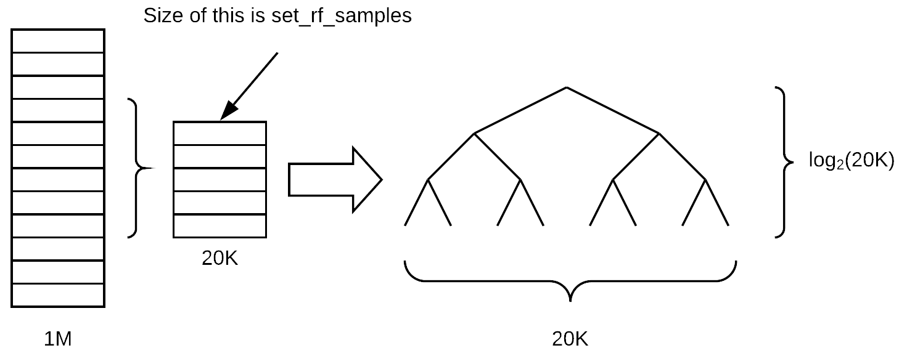

  - Assuming that the tree remains balanced as we grow it, how many layers deep will this tree be (assuming we are growing it until every leaf is of size one)? log base 2 of 20K, `log2(20000)`. The depth of the tree doesn't actually vary that much depending on the number of samples because it is related to the log of the size.
  - Once we go all the way down to the bottom, how many leaf nodes would there be? 20K. We have a linear relationship between the number of leaf nodes and the size of the sample. So when you decrease the sample size, there are less final decisions that can be made. Therefore, the tree is going to be less rich in terms of what it can predict because it is making less different individual decisions and it also is making less binary choices to get to those decisions.
  - Setting RF samples lower is going to mean that you overfit less, but it also means that you are going to have a less accurate individual tree model. The way Breiman, the inventor of random forest, described this is that you are trying to do two things when you build a model with bagging. One is that each individual tree/estimator is as accurate as possible (so each model is a strong predictive model). But then the across the estimators, correlation between them is as low as possible so that when you average them out together, you end up with something that generalizes. By decreasing the `set_rf_samples` number, we are actually decreasing the power of the estimator and increasing the correlation—so is that going to result in a better or worse validation set result for you? It depends. This is the kind of compromise which you have to figure out when you do machine learning models.

    A :question: about `oob=True` [[00:06:46](https://youtu.be/0v93qHDqq_g?t=6m46s)]. All `oob=True` does is it says whatever your subsample is (it might be a bootstrap sample or a subsample), take all of the other rows (for each tree), put them into a different data set, and calculate the error on those. So it doesn't actually impact training at all. It just gives you an additional metric which is the OOB error. So if you don't have a validation set, then this allows you to get kind of a quasi validation set for free.

    :question: If I don't do `set_rf_samples`, what would it be called? [[00:07:55](https://youtu.be/0v93qHDqq_g?t=7m55s)]

    The default is, if you say `reset_rf_samples`, that causes it to bootstrap, so it will sample a new dataset as big as the original one but with replacement.

    The second benefit of `set_rf_samples` is that you can run more quickly [[00:08:28](https://youtu.be/0v93qHDqq_g?t=8m28s)]. Particularly if you are running on a really large dataset like a hundred million rows, it will not be possible to run it on the full dataset. So you would either have to pick a subsample yourself before you start or you `set_rf_samples`.

2. `min_samples_leaf` [[00:08:48](https://youtu.be/0v93qHDqq_g?t=8m48s)]

    Before, we assumed that `min_samples_leaf=1`, if it is set to 2, the new depth of the tree is `log2(20000)-1`. Each time we double the `min_samples_leaf` , we are removing one layer from the tree, and halving the number of leaf nodes (i.e. 10k). The result of increasing `min_samples_leaf` is that now each of our leaf nodes has more than one thing in, so we are going to get a more stable average that we are calculating in each tree. We have a little less depth (i.e. we have less decisions to make) and we have a smaller number of leaf nodes. So again, we would expect the result of that node would be that each estimator would be less predictive, but the estimators would be also less correlated. So this might help us avoid overfitting.

    :question: I am not sure if every leaf node will have exactly two nodes [[00:10:33](https://youtu.be/0v93qHDqq_g?t=10m33s)].

    No, it won't necessarily have exactly two. The example of uneven split such as a leaf node containing 100 items is when they are all the same in terms of the dependent variable (suppose either, but much more likely would be the dependent). So if you get to a leaf node where every single one of them has the same auction price, or in classification every single one of them is a dog, then there is no split that you can do that's going to improve your information. Remember, **information** is the term we use in a general sense in random forest to describe the amount of difference about the additional information we create from a split is how much we are improving the model. So you will often see this word information gain which means how much better the model got by adding an additional split point, and it could be based on RMSE or cross-entropy or how different to the standard deviations, etc.

    So that is the second thing that we can do. It's going to speed up our training because it has one less set of decisions to make. Even though there is one less set of decisions, those decisions have as much data as the previous set. So each layer of the tree can take twice as long as the previous layer. So it could definitely speed up training and generalize better.

3. `max_features` [[00:12:22](https://youtu.be/0v93qHDqq_g?t=12m22s)]

    At each split, it will randomly sample columns (as opposed to `set_rf_samples` pick a subset of rows for each tree). It sounds like a small difference but it's actually quite a different way of thinking about it. We do `set_rf_samples` so we pull out our sub sample or a bootstrap sample and that's kept for the whole tree and we have all of the columns in there. With `max_features=0.5`, at each split, we'd pick a different half of the features. The reason we do that is because we want the trees to be as rich as possible. Particularly, if you were only doing a small number of trees (e.g. 10 trees) and you picked the same column set all the way through the tree, you are not really getting much variety in what kind of things it can find. So this way, at least in theory, seems to be something which is going to give us a better set of trees by picking a different random subset of features at every decision point.

    The overall effect of the `max_features` is the same—it's going to mean that each individual tree is probably going to be less accurate but the trees are going to be more varied. In particular, here this can be critical because imagine that you got one feature that is just super predictive. It's so predictive that every random subsample you look at always starts out by splitting on that same feature then the trees are going to be very similar in the sense they all have the same initial split. But there may be some other interesting initial splits because they create different interactions of variables. So by half the time that feature won't even be available at the top of the tree, at least half the tree are going to have a different initial split. It definitely can give us more variation and therefore it can help us to create more generalized trees that have less correlation with each other even though the individual trees probably won't be as predictive.

    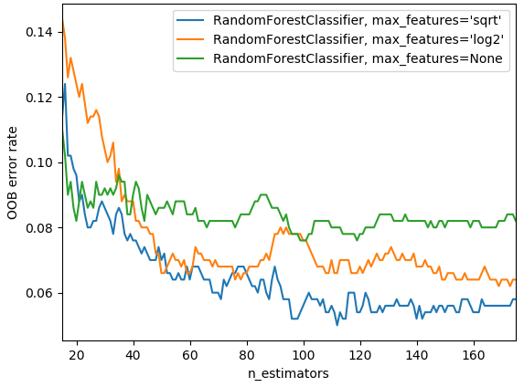

    In practice, as you add more trees, if you have `max_features=None`, that is going to use all the features every time. Then with very few trees, that can still give you a pretty good error. But as you create more trees, it's not going to help as much because they are all pretty similar as they are all trying every single variable. Where else, if you say `max_features=sqrt` or `log2` , then as we add more estimators, we see improvements so there is an interesting interaction between those two. The chart above is from scikit-learn docs.

4. Things which do not impact our training at all [[00:16:32](https://youtu.be/0v93qHDqq_g?t=16m32s)]

    `n_jobs`: simply specifies how many CPU or cores we run on, so it'll make it faster up to a point. Generally speaking, making this more than 8 or so, they may have diminishing returns. -1 says use all of your cores. It seems weird that the default is to use one core. You will definitely get more performance by using more cores because all of you have computers with more than one core nowadays.

    `oob_score=True`: This simply allows us to see OOB score. If you had `set_rf_samples` pretty small compared to a big dataset, OOB is going to take forever to calculate. Hopefully at some point, we will be able to fix the library so that doesn't happen. There is no reason that need to be that way, but right now, that's how the library works.

    So they are our key basic parameters we can change [[00:17:38](https://youtu.be/0v93qHDqq_g?t=17m38s)]. There are more that you can see in the docs or `shift + tab` to have a look at them, but the ones you've seen are the ones that I've found useful to play with so feel free to play with others as well. Generally speaking, these values work well:

    `max_features`: None, 0.5, sqrt, log2

    `min_samples_leaf` : 1, 3, 5, 10, 25, 100… As you increase, if you notice by the time you get to 10, it's already getting worse then there is no point going further. If you get to 100 and it's still going better, then you can keep trying.

---

### Random Forest Interpretation [[00:18:50](https://youtu.be/0v93qHDqq_g?t=18m50s)]

Random forest interpretation is something which you could use to create some really cool Kaggle kernels. Confidence based on tree variance is something which doesn't exist anywhere else. Feature importance definitely does and that's already in quite a lot of Kaggle kernels. If you are looking at a competition or a dataset where nobody's done feature importance, being the first person to do that is always going to win lots of votes because the most important thing is which features are important.

### Confidence based on tree variance [[00:20:43](https://youtu.be/0v93qHDqq_g?t=20m43s)]

As I mentioned, when we do model interpretation, I tend to `set_rf_samples` to some subset—something small enough that I can run a model in under 10 seconds because there is no point running a super accurate model. Fifty thousand is more than enough to see each time you run an interpretation, you'll get the same results back and so as long as that's true, then you are already using enough data.

```python
set_rf_samples(50000)
m = RandomForestRegressor(n_estimators=40, min_samples_leaf=3,
        max_features=0.5, n_jobs=-1, oob_score=True)
m.fit(X_train, y_train)
print_score(m)
```

### Feature Importance [[00:21:14](https://youtu.be/0v93qHDqq_g?t=21m14s)]

We learnt it works by randomly shuffling a column, each column one at a time, then seeing how accurate the pre-trained model is when you pass that in all the data as before but with one column shuffled.

Some of the questions I got after class reminded me that it is very easy to under appreciate how powerful and magic this approach is. To explain, I'll mention a couple of the questions I heard.

One question was "what if we just took one column at a time, and created a tree on just that column". Then we will see which column's tree is the most predictive. Why may that give misleading results about feature importance? We are going to lose the interactions between the features. If we just shuffle them, it will add randomness and we are able to both capture the interactions and the importance of the feature. **This issue of interaction is not a minor detail. It is massively important.** Think about this bulldozers dataset where, for example, there is one field called "year made" and another field called "sale date." If we think about it, it's pretty obvious that what matters is the combination of these two. In other words, the difference between the two is how old the piece of the equipment was when it got sold. So if we only included one of these, we are going to massively underestimate how important that feature is. Now, here is a really important point though. It's pretty much always possible to create a simple logistic regression which is as good as pretty much any random forest if you know ahead of time exactly what variables you need, exactly how they interact, exactly how they need to be transformed. In this case, for example, we could have created a new field which was equal to sale year minus year made and we could have fed that to a model and got that interaction for us. But the point is, we never know that. You might have a guess of it — I think some of these things are interacting in this way, and I think this thing we need to take the log, and so forth. But the truth is that the way the world works, the causal structures, they have many many things interacting in many many subtle ways. That's why using trees, whether it be gradient boosting machines or random forests, work so well.

**Terrance's comment:** One thing that bit me years ago was also I tried doing one variable at a time thinking "oh well, I'll figure out which one's most correlated with the dependent variable" [[00:24:45](https://youtu.be/0v93qHDqq_g?t=24m45s)]. But what it doesn't pull apart is that what if all variables are basically copied the same variable then they are all going to seem equally important but in fact it's really just one factor.

That is also true here. If we had a column appear twice, then shuffling that column isn't going to make the model much worse. If you think about how it's built, particularly if we had `max_features=0.5`, some of the times, we are going to get version A of the column, some of the times, we are going to get version B of the column. So half the time, shuffling version A of the column is going to make a tree a bit worse, half the time it's going to make column B it'll make it a bit worse, and so it'll show that both of those features are somewhat important. And it will share the importance between the two features. So this is why "collinearity" (I write collinearity but it means that they are linearly related, so this isn't quite right)—but this is why having two variables that are closely related to each other or more variables that are closely related to each other means that you will often underestimate their importance using this random forest technique.

:question: Once we've shuffled and we get a new model, what exactly are the units of these importance? Is this a change in the R² [[00:26:26](https://youtu.be/0v93qHDqq_g?t=26m26s)]? It depends on the library we are using. So the units are kind of like… I never think about them. I just know that in this particular library, 0.005 is often a cutoff I would tend to use. But all I actually care about is this picture (the feature importance ordered for each variable):

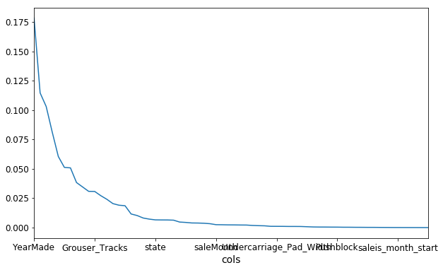

Then zooming in, turning it into a bar plot and then find where it becomes flat (~0.005).

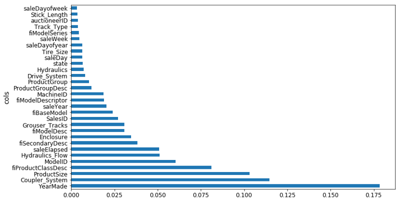

So I removed them at that point and check the validation score didn't get worse.

```python
to_keep = fi[fi.imp > 0.005].cols
len(to_keep)
```

If it did get worse, I will just decrease the cutoff a little bit until it doesn't get worse. So the units of measure of this don't matter too much. We will learn later about a second way of doing variable importance, by the way.

:question: What is the purpose of removing them [[00:27:42](https://youtu.be/0v93qHDqq_g?t=27m42s)]?

Having looked at our feature importance plot, we see the ones less than 0.005 is this long tail of boringness. So I said let's just try grabbing the columns where it is greater than 0.005, create a new data frame called `df_keep` which is `df_train` with just those kept columns, create a new training and validation sets with just those columns, create a new random forest, and look to see how the validation set score. And the validation set RMSE changed and they got a bit better. So if they are about the same or a tiny bit better then my thinking is well this is just as good a model, but it's now simpler.

So when I redo the feature importance, there is less collinearity. In this case, I saw that `YearMade` went from being a bit better than the next best thing (`CouplerSystem`), but now it's way better. So it did seem to definitely change these feature importances and hopefully give me some more insight there.

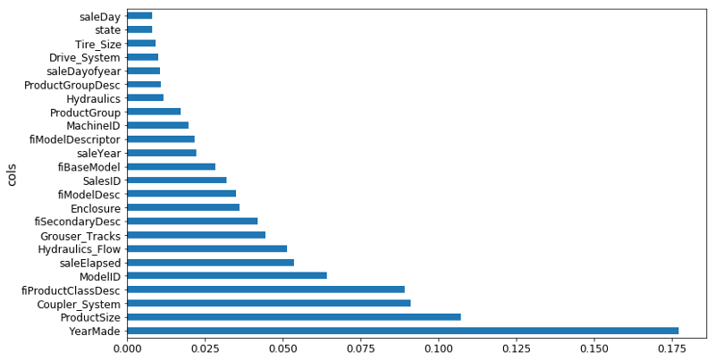

:question: So how did that help our model [[00:29:30](https://youtu.be/0v93qHDqq_g?t=29m30s)]?

We are going to dig into that now. Basically it tells us that, for example, if we are looking for how we are dealing with missing value, is there noise in the data, if it is a high cardinality categorical variable—they are all different steps we would take. So for example, if it was a high cardinality categorical variable that was originally a string, maybe `fiProductClassDesc` in above case, I remember one of the ones we looked at the other day had first of all was the type of vehicle and then a hyphen, and then the size of the vehicle. We might look at that and say "okay, that was an important column. Let's try splitting it into two on hyphen and then take that bit which is a size of it and parse it and convert it into an integer." We can try and do some feature engineering. Basically until you know which ones are important, you don't know where to focus that feature engineering time. You can talk to your client or folks that are responsible for creating this data. If you were actually working at a bulldozer auction company, you might now go to the actual auctioneers and say "I am really surprised that coupler system seems to be driving people's pricing decisions so much. Why do you think that might be?" and they can say to you "oh, it's actually because only these classes of vehicles have coupler systems or only this manufacturer has coupler systems. So frankly this is actually not telling you about coupler systems but about something else. Oh hey, that reminds me, that's something else we actually have measured that. It is in this different CSV file. I'll go get it for you." So it helps you focus your attention.

:question: So I had a fun little problem this weekend as you know. I introduced a couple of crazy computation into my random forest and all of a sudden they're like oh my god these are the most important variables ever squashing all of the others. But then I got a terrible score and then is that because now that I think I have my scores computed correctly, what I noticed is that the importance went through the roof but the validation set was still bad or got worse. Is that because somehow that computation allow the training to almost like an identifier map exactly what the answer was going to be for training but of course that doesn't generalize to the validation set. Is that what I observed [[00:31:33](https://youtu.be/0v93qHDqq_g?t=31m33s)]?

There are two reasons why your validation score might not be very good.

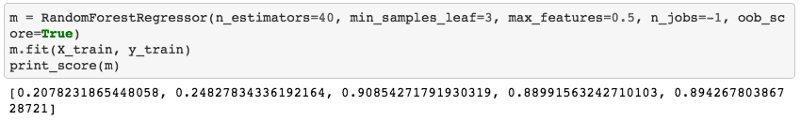

So we got these five numbers: RMSE of training, validation, R² of the training, validation, and R² of OOB. There're two reasons and really in the end what we care about for this Kaggle competition is the RMSE of the validation set assuming we've created a good validation set. So Terrance's case, he is saying that RMSE of the validation got worse when I did some feature engineering. Why is that? There are two possible reasons.

- Reason one is that you are overfitting. If you are overfitting, then your OOB will also get worse. If you are doing a huge dataset with a small `set_rf_samples` so you can't use an OOB, then instead create a second validation set which is a random sample and do that. So in other words, if your OOB or your random sample validation set has gotten much worse then you must be overfitting. I think in your case, Terrance, it's unlikely that's the problem because random forests don't overfit that badly. It's very hard to get them to overfit that badly unless you use some really weird parameters like only one estimator, for example. Once we've got ten trees in there, there should be enough variation that you can definitely overfit but not so much that you're going to destroy your validation score by adding a variable. So I'd think you'll find that's probably not the case, but it's easy to check. And if it's not the case, then you'll see that your OOB score or your random sample validation score hasn't gotten much worse.
- The second reason your validation score can get worse, if your OOB score hasn't got worse, you're not overfitting but your validation score has gotten worse that means you're doing something that is true in the training set but not true in the validation set. So this can only happen when your validation set is not a random sample. For example, in this bulldozers competition or in the grocery shopping competition, we've intentionally made a validation set that is for a different date range—it's for the most recent two weeks. So if something different happened in the last two weeks to the previous weeks, then you could totally break your validation set. For example, if there was some kind of unique identifier which is different in the two date periods, then you could learn to identify things using that identifier in the training set. But then the last two weeks may have a totally different set of IDs or the different set of behavior, it could get a lot worse. What you are describing is not common though. So I'm a bit skeptical — it might be a bug but hopefully there's enough things you can now use to figure out if it is a bug. We will be interested to hear what you learned.

### Linear regression, logistic regression [[00:36:01](https://youtu.be/0v93qHDqq_g?t=36m1s)]

That's feature importance. I'd like to compare that to how feature importance is normally done in industry and in academic communities outside of machine learning, like in psychology, economics, and so forth. Generally speaking, people in those environments tend to use some kind of linear regression, logistic regression, general linear models. They start with their dataset and they say I am going to assume that I know the kind of parametric relationship between my independent variables and my dependent variable. So I'm going to assume that it's a linear relationship or a linear relationship with a link function like a sigmoid to create logistic regression. So assuming I already know that, I can now write this as an equation. So if you have x1, x2, so forth.

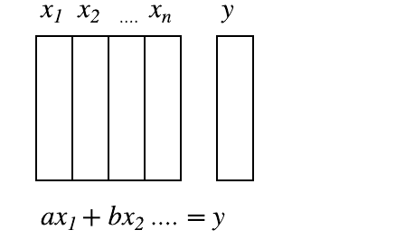

I can say my *y* values are equal to *ax1 + bx2 = y*, therefore I can find out the feature importance easily enough by just looking at these coefficients and see which one is the highest, particularly if you have normalized the data first. There is this trap out there that is very common is that this is somehow more accurate, more pure, in some way better way of doing feature importance but that couldn't be farther from the truth. If you think about it, if you were missing an interaction, if you were missing a transformation you needed, or if you have any way being anything less than a 100% perfect in all of your pre-processing so that your model is the absolute correct truth of the situation—unless you've got all of that correct, then your coefficients are wrong. Your coefficients are telling you "in your totally wrong model, this is how important those things are" which is basically meaningless. Where else, the random forest feature importance is telling you in this extremely high parameter, highly flexible functional form, with few if any statistical assumptions, this is your feature importance. So I would be very cautious.

Again, I can't stress this enough when you leave this program, you are much more often going to see people talk about logistic regression coefficients than you are going to see them talk about random forest variable importance. And every time you see that happen, you should be very very skeptical of what you are seeing. Anytime you read a paper in economics or in psychology, or the marketing department tells you that this regression or whatever, every single those coefficients are going to be massively biased by any issues in the model. Furthermore, if they've done so much pre-processing that actually the model is pretty accurate then now you are looking at coefficients that are going to be like a coefficient of some principal component from a PCA or a coefficient of some distance from some cluster or something. At which point, they are very very hard to interpret anyway. They are not actual variables. So they are kind of the two options I've seen when people try to use classic statistical techniques to do a variable importance equivalent. I think things are starting to change slowly. There are some fields that are starting to realize that this is totally the wrong way to do things. But it's been nearly 20 years since random forests appeared so it takes a long time. People say that the only way that knowledge really advances is when the previous generation dies, and that's kind of true. Particularly academics, they make a career of being good at a particular sub thing and often it's not until the next generation comes along that people notice that's actually no longer a good way to do things. And I think that's what happened here.

We've got now a model which isn't really any better predictive accuracy wise, but we are getting a good sense that there seems to be four main important things [[00:40:38](https://youtu.be/0v93qHDqq_g?t=40m38s)]: `YearMade`, `Coupler_System`, `ProductSize`, `fiProductClassDesc`.

### One hot encoding [[00:41:00](https://youtu.be/0v93qHDqq_g?t=41m)]

There is something else that we can do, however, which is we can do something called one hot encoding. So this is going to where we were talking about categorical variable. Remember, a categorical variable, let's say we had a string high, low, medium (the order we got was kind of weird — in alphabetical order by default). So we mapped it to 0, 1, 2. By the time it gets into our data frame, it's now a number so the random forest doesn't know that it was originally a category—it's just a number. So when the random forest is built, it basically says oh is it greater than 1 or not. Or is it greater than naught or not. They are basically the two possible decisions it could have made. For something with 5 or 6 bands, it could be that just one of the levels of category is actually interesting. Maybe the only thing that mattered was whether it was unknown. Maybe not knowing its size somehow impacts the price. So if we wanted to be able to recognize that and particularly if it just so happened that the way that the numbers were coded was it unknown ended up in the middle, then it going to take two splits to get to the point where we can see that it's actually unknown that matters. So this is a little inefficient and we are wasting tree computation. Wasting tree computation matters because every time we do a split, we are halving the amount of data at least that we have to do more analysis. So it's going to make our tree less rich and less effective if we are not giving the data in a way that is convenient for it to do the work it needs to do.

What we could do instead is create 6 columns for each category and each column would contain 1's and 0's. Having added 6 additional columns to our dataset, the random forest now has the ability to pick one of these and say oh, let's have a look at is_unknown. There is one possible fit I can do which is 1 vs. 0. Let's see that's any good. So it now has the ability in a single step to pull out a single category level and this kind of coding is called one-hot encoding. For many types of machine learning model, something like this is necessary. If you are doing logistic regression, you can't possibly put in a categorical variable that goes naught through five because there is obviously no written linear relationship between that and anything. So one hot encoding, a lot of people incorrectly assume that all machine learning requires one hot encoding. But in this case, I'm going to show you how we could use it optionally and see whether it might improve things sometimes.

:question: If we have six categories like in this case, would there be any problems with adding a column for each of the categories?

In linear regression, if there are six categories, we should only do it for five of them [[00:45:17](https://youtu.be/0v93qHDqq_g?t=45m17s)]. You certainly can say let's not worry about adding `is_medium` because we can infer it from the other five. I would say include it anyway because otherwise, the random forest has to make five decisions to get to that point. The reason you need to not include one in linear models is because linear models hate collinearity but we don't care about that here.

So we can do one hot encoding easily enough and the way we do it is we pass one extra parameter to `proc_df` which is what is the max number of categories (`max_n_cat`). So if we say it's seven, then anything with less than seven levels is going to be turned into a one-hot encoded bunch of columns.

```python
df_trn2, y_trn, nas = proc_df(df_raw, 'SalePrice', max_n_cat=7)
X_train, X_valid = split_vals(df_trn2, n_trn)
m = RandomForestRegressor(n_estimators=40, min_samples_leaf=3,
       max_features=0.6, n_jobs=-1, oob_score=True)
m.fit(X_train, y_train)
print_score(m)

# -----------------------------------------------------------------------------
# Output
# -----------------------------------------------------------------------------
[0.2132925755978791, 0.25212838463780185, 0.90966193351324276, 0.88647501408921581, 0.89194147155121262]
```

Like zip code has more than six levels so that would be left as a number. Generally speaking, you obviously probably wouldn't want to one hot encode zip code because that's just going to create masses of data, memory problems, computation problems, and so forth. So this is another parameter you can play around with.

So if I try it out, run the random forest as per usual, you can see what happens to the R² of the validation set and to the RMSE of the validation set. In this case, I found it got a little bit worse. This isn't always the case and it's going to depend on your dataset. It depends on if you have a dataset where single categories tend to be quite important or not. In this particular case, it did not make it more predictive. However, what it did do is that we now have different features. `proc_df` puts the name of the variable, an underscore, and the level name. So interestingly, it turns out that before, it said that enclosure was somewhat important. When we do it as one hot encoded, it actually says `Enclosure_EROPS w AC` is the most important thing. So for at least the purpose of interpreting your model, you should always try one hot encoding quite a few of your variables. I often find somewhere around 6 or 7 pretty good. You can try making that number as high as you can so that it doesn't take forever to compute and the feature importance doesn't include really tiny levels that aren't interesting. That is up to you to play around with, but in this case, I found this very interesting. It clearly tells me I need to find out what `Enclosure_EROPS w AC` is and why it is important because it means nothing to me right now but it is the most important thing. So I should go figure that out.

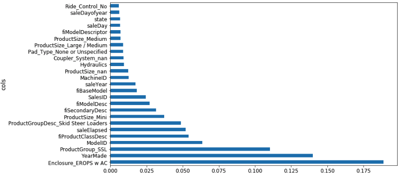

:question: Can you explain how changing the max number of category works? Because for me, it just seems like there are five categories or six categories [[00:49:15](https://youtu.be/0v93qHDqq_g?t=49m15s)].

All it's doing is is here is a column called zip code, usage band, and sex, for example. Say, zip code has 5,000 levels. The number of levels in a category, we call its "cardinality". So it has a cardinality of 5,000. Usage band may have a cardinality of six. Sex has a cardinality of two. So when `proc_df` goes through and says okay, this is a categorical variable, should I one-hot encode it? It checks the cardinality against `max_n_cat` and says 5,000 is bigger than seven so I don't one hot encode it. Then it goes to usage band — 6 is less than 7, so I do one hot encode it. It goes to sex, and 2 is less than 7, so one hot encode that too. So it just says for each variable, how I decide whether ton one hot encode it or not. Once we decide to one hot encode it, it does not keep the original variable.

If you have actually made an effort to turn your ordinal variables into proper ordinals, using `proc_df` can destroy that. The simple way to avoid that is if we know that we always want to use the codes for usage band, you could just go ahead and replace it:

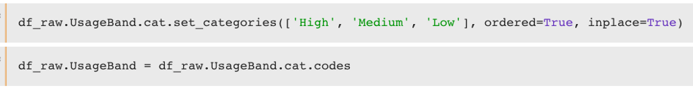

Now it's an integer. So it will never get changed.

### Removing redundant features [[00:54:57](https://youtu.be/0v93qHDqq_g?t=54m57s)]

We've already seen how variables which are basically measuring the same thing can confuse our variable importance. They can also make our random forest slightly less good because it requires more computation to do the same thing and there're more columns to check. So we are going to do some more work to try and remove redundant features. The way I do that is to do something called "**dendrogram**". And it is kind of hierarchical clustering.

**Cluster analysis** is something where you are trying to look at objects, they can be either rows in the dataset or columns and find which ones are similar to each other. Often you will see people particularly talking about cluster analysis, they normally refer to rows of data and they will say "let's plot it" and find clusters. A common type of cluster analysis, time permitting, we may get around to talking about this in some detail, is called k-means. It is basically where you assume that you don't have any labels at all and you take a couple of data points at random and you gradually find the ones that are near to it and move them closer and closer to centroids, and you repeat it again and again. It is an iterative approach that you tell it how many clusters you want and it will tell you where it thinks that classes are.

A really under used technique (20 or 30 years ago it was much more popular than it is today) is a hierarchical clustering also known as agglomerated clustering. In hierarchical or agglomerated clustering, we look at every pair of objects and say which two objects are the closest. We then take the closest pair, delete them, and replace them with the midpoint of the two. Then repeat that again and again. Since we are removing points and replacing them with their averages, you are gradually reducing a number of points by pairwise combining. The cool thing is, you can plot that.

```python
from scipy.cluster import hierarchy as hc

corr = np.round(scipy.stats.spearmanr(df_keep).correlation, 4)
# squareform -- convert distance matrix to a condensed one and vice versa
corr_condensed = hc.distance.squareform(1 - corr)
# Perform hierarchical/agglomerative clustering.
z = hc.linkage(corr_condensed, method='average')

fig = plt.figure(figsize=(16, 10))

# Plot the hierarchical clustering as a dendrogram.
dendogram = hc.dendrogram(z, labels=df_keep.columns, orientation='left', leaf_font_size=16)
plt.show()
```

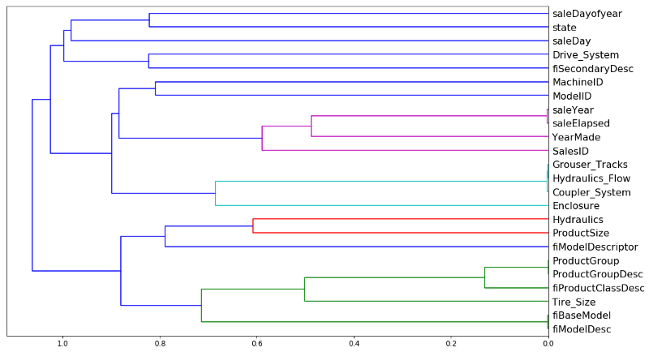

Like so. Rather than looking at points, you look at variables and we can see which two variables are the most similar. `saleYear` and `saleElapsed` are very similar. So the horizontal axis here is how similar are the two points that are being compared. If they are closer to the right, that means that they are very similar. So `saleYear` and `saleElapsed` have been combined and they were very similar.

In this case, I actually used Spearman's R. You guys familiar with correlation coefficients already? So correlation is almost exactly the same as the R², but it's between two variables rather than a variable and its prediction. The problem with a normal correlation is that if you have data that looks like this then you can do a correlation and you'll get a good result.

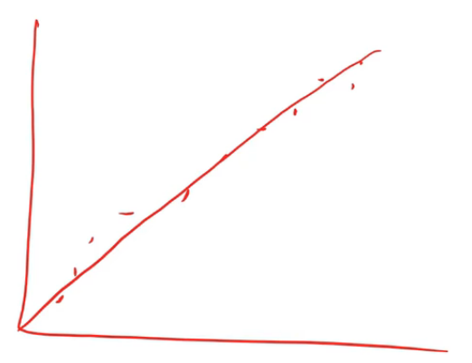

But if you've got data which looks like this and you try and do a correlation (assuming linearity), that's not very good.

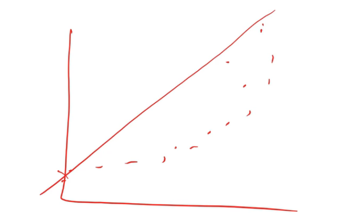

So there is a thing called a rank correlation which is a really simple idea. Replace every point by its rank.

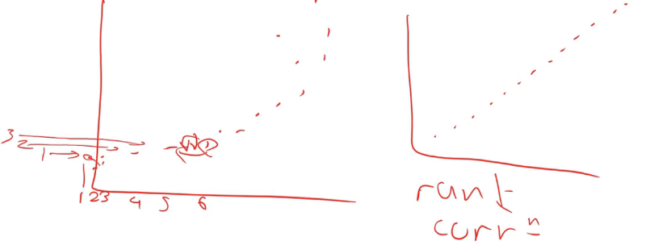

From left to right, we rank from 1, 2, …6. Then you do the same for the y-axis. Then you create a new plot where you don't plot the data but you plot the rank of the data. If you think about it, the rank of this dataset is going to look like an exact line because every time something was greater on the x-axis, it was also greater on the y-axis. So if we do a correlation on the rank, that's called a rank correlation.

Because we want to find the columns that are similar in a way that the random forest would find them similar (random forests do not care about linearity, they just care about ordering), so a rank correlation is the right way to think about that [[01:00:05](https://youtu.be/0v93qHDqq_g?t=1h5s)]. So Spearman's R is the name of the most common rank correlation. But you can literally replace the data with its rank and chuck it at the regular correlation and you will get basically the same answer. The only difference is in how ties are handled which is a pretty minor issue.

Once we have a correlation matrix, there is basically a couple of standard steps you do to turn that into a dendrogram which I have to look up on stackoverflow each time I do it. You basically turn it into a distance matrix and then you create something that tells you which things are connected to each other things hierarchically. So these are three standard steps you always have to do to create a dendrogram:

```python
corr_condensed = hc.distance.squareform(1 - corr)
z = hc.linkage(corr_condensed, method='average')
dendrogram = hc.dendrogram(z, labels=df_keep.columns, orientation='left', leaf_font_size=16)
```

Then you can plot it [[01:01:30](https://youtu.be/0v93qHDqq_g?t=1h1m30s)]. `saleYear` and `saleElapsed` are measuring basically the same thing (at least in terms of rank) which is not surprising because `saleElapsed` is the number of days since the first day in my dataset so obviously these two are nearly entirely correlated. `Grouser_Tracks`, `Hidraulics_Flow`, and `Coupler_System` all seem to be measuring the same thing. This is interesting because remember, `Coupler_System` it said was super important. So this rather supports our hypothesis there is nothing to do with whether it's a coupler system but whether it is whatever kind of vehicle it is has these kind of features. `ProductGroup` and `ProductGroupDesc` seem to be measuring the same thing, and so are `fiBaseModel` and `fiModelDesc`. Once we get past that, suddenly things are further away, so I'm probably going to not worry about those. So we are going to look into those four groups that are very similar.

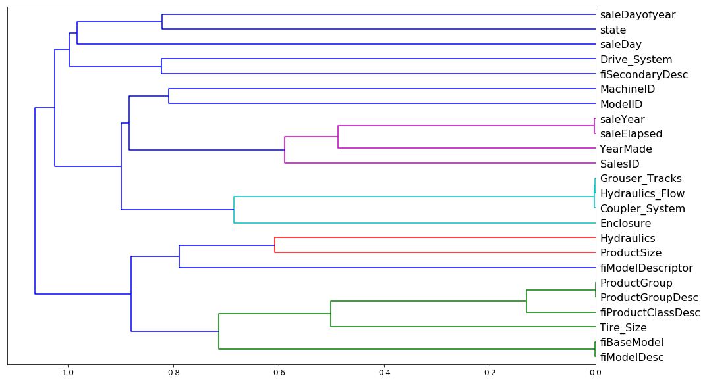

If you just want to know how similar is this thing to this thing, the best way is to look at the Spearman's R correlation matrix [[01:03:43](https://youtu.be/0v93qHDqq_g?t=1h3m43s)]. There is no random forest being used here. The distance measure is being done entirely on rank correlation.

What I then do is I take these groups and I create a little function `get_oob` (get Out Of Band score) [[01:04:29](https://youtu.be/0v93qHDqq_g?t=1h4m29s)]. It does a random forest for some data frame. I make sure that I have taken that data frame and split it into a training and validation set, and then I call `fit` and return the OOB score.

```python
def get_oob(df):
    m = RandomForestRegressor(n_estimators=30, min_samples_leaf=5, max_features=0.6,
                              n_jobs=-1, oob_score=True)
    x, _ = split_vals(df, n_trn)
    m.fit(x, y_train)
    return m.oob_score_
```

Basically what I'm going to do is try removing each one of these 9 or so variables one at a time and see which ones I can remove and it doesn't make the OOB score get worse.

```python
get_oob(df_keep)

# -----------------------------------------------------------------------------
# Output
# -----------------------------------------------------------------------------
0.89019425494301454
```

And each time I run this, I get slightly different results so actually it looks like the last time I had 6 things and not 9 things. So you can see, I just do a loop through each of the things that I am thinking maybe I can get rid of this because it's redundant and I print out the column name and the OOB score of a model that is trained after dropping that one column.

```python
for c in ('saleYear', 'saleElapsed', 'fiModelDesc', 'fiBaseModel',
          'Grouser_Tracks', 'Coupler_System'):
    print(c, get_oob(df_keep.drop(c, axis=1)))
```

The OOB score on my whole data frame is .89 and then after dropping each one of these things, basically none of them got much worse. `saleElapsed` is getting quite a bit worse than `saleYear`. But it looks like pretty much everything else, I can drop with only like a third decimal place problem. So obviously though, you've got to remember the dendrogram. Let's take `fiModelDesc` and `fiBaseModel`, they are very similar to each other. So what this says isn't that I can get rid of both of them, I can get rid of one of them because they are basically measuring the same thing.

```python
# -----------------------------------------------------------------------------
# Output
# -----------------------------------------------------------------------------
saleYear 0.889037446375
saleElapsed 0.886210803445
fiModelDesc 0.888540591321
fiBaseModel 0.88893958239
Grouser_Tracks 0.890385236272
Coupler_System 0.889601052658
```

So then I try it. Let's try getting rid of one from each group:

```python
to_drop = ['saleYear', 'fiBaseModel', 'Grouser_Tracks']
get_oob(df_keep.drop(to_drop, axis=1))

# -----------------------------------------------------------------------------
# Output
# -----------------------------------------------------------------------------
0.88858458047200739
```

We've gone from .890 to .888, again, it's so close as to be meaningless. So that sounds good. Simpler is better. So I'm now going to drop these columns from my data frame, and then I can try running the full model again.

```python
df_keep.drop(to_drop, axis=1, inplace=True)
X_train, X_valid = split_vals(df_keep, n_trn)

np.save('tmp/keep_cols.npy', np.array(df_keep.columns))

keep_cols = np.load('tmp/keep_cols.npy')
df_keep = df_trn[keep_cols]
```

`reset_rf_samples` means I'm using my whole bootstrapped sample. With 40 estimators, we got 0.907.

```python
reset_rf_samples()

m = RandomForestRegressor(n_estimators=40, min_samples_leaf=3, max_features=0.5, n_jobs=-1,
                          oob_score=True)
m.fit(X_train, y_train)
print_score(m)

[0.12615142089579687, 0.22781819082173235, 0.96677727309424211, 0.90731173105384466, 0.9084359846323049]
```

So I've now got a model which is smaller and simpler, and I'm getting a good score for. So at this point, I've now got rid of as many columns as I feel I comfortably can (ones that either didn't have a good feature importance or were highly related to other variables, and the model didn't get worse significantly when I removed them).

### Partial dependence [[01:07:34](https://youtu.be/0v93qHDqq_g?t=1h7m34s)]

So now I'm at the point where I want to try and really understand my data better by taking advantage of the model. And we are going to use something called partial dependence. Again, this is something that you could use in the Kaggle kernel and lots of people are going to appreciate this because almost nobody knows about partial dependence and it's a very very powerful technique. What we are going to do is we are going to find out, for the features that are important, how do they relate to the dependent variable. Let's have a look.

```python
from pdpbox import pdp
from plotnine import *
```

Again, since we are doing interpretation, we will set `set_rf_samples` to 50,000 to run things quickly.

```python
set_rf_samples(50000)
```

We'll take our data frame, we will get our feature importance and notice that we are using `max_n_cat` because I am actually pretty interested in seeing the individual levels for interpretation.

```python
df_trn2, y_trn, nas = proc_df(df_raw, 'SalePrice', max_n_cat=7)
X_train, X_valid = split_vals(df_trn2, n_trn)

m = RandomForestRegressor(n_estimators=40, min_samples_leaf=3, max_features=0.6,
                          n_jobs=-1)
m.fit(X_train, y_train)
```

Here is the top 10:

```python
plot_fi(rf_feat_importance(m, df_trn2)[:10])
```

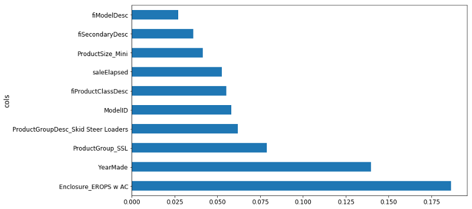

Let's try to learn more about those top 10. `YearMade` is the second most important. So one obvious thing we could do would be to plot `YearMade` against `saleElapsed` because as we've talked about already, it seems to make sense that they are both important but it seems very likely that they are combined together to find how old was the product when it was sold. So we could try plotting `YearMade` against `saleElapsed` to see how they relate to each other.

```python
df_raw.plot('YearMade', 'saleElapsed', 'scatter', alpha=0.01, figsize=(10, 8))
```

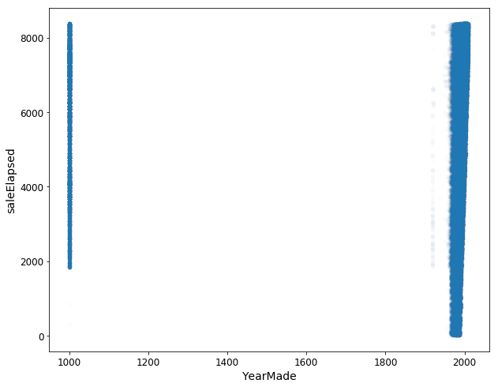

And when we do, we get this very ugly graph [[01:09:08](https://youtu.be/0v93qHDqq_g?t=1h9m8s)]. It shows us that `YearMade` actually has a whole bunch that are a thousand. Clearly, this is where I would tend to go back to the client and say okay, I'm guessing that these bulldozers weren't actually made in the year 1000 and they would presumably say to me "oh yes, they are ones where we don't know where it was made". Maybe "before 1986, we didn't track that" or maybe "the things that are sold in Illinois, we don't have that data provided", etc—they will tell us some reason. So in order to understand this plot better, I'm just going to remove them from this interpretation section of the analysis. We will just grab things where `YearMade` is greater than 1930.

```python
x_all = get_sample(df_raw[df_raw.YearMade > 1930], 500)

ggplot(x_all, aes('YearMade', 'SalePrice')) + stat_smooth(se=True, method='loess')
```

Let's now look at the relationship between `YearMade` and `SalePrice`. There is a really great package called `ggplot`. `ggplot` originally was an R package (GG stands for the Grammar of Graphics). The grammar of graphics is this very powerful way of thinking about how to produce charts in a very flexible way. I'm not going to be talking about it much in this class. There is lots of information available online. But I definitely recommend it as a great package to use. `ggplot` which you can `pip` install, it's part of the fast.ai environment already. `ggplot` in Python has basically the same parameters and API as the R version. The R version is much better documented so you should read its documentation to learn how to use it. But basically you say "okay, I want to create a plot for this data frame (`x_all`). When you create plots, most of the datasets you are using are going to be too big to plot. For example, if you do a scatter plot, it will create so many dots that it's just a big mess and it will take forever. Remember, when you are plotting things, you are looking at it, so there is no point plotting something with a hundred million samples when if you only used a hundred thousand, it's going to be pixel identical. That's why I call `get_sample` first. `get_sample` just grabs a random sample.

```python
ggplot(x_all, aes('YearMade', 'SalePrice')) + stat_smooth(se=True, method='loess')
```

So I'm just going to grab 500 points from my data frame and plot `YearMade` against `SalePrice`. `aes` stands for "aesthetic" — this is the basic way that you set up your columns in `ggplot`. Then there is this weird thing in `ggplot` where "+" means add chart elements. So I'm going to add a smoother. Often you will find that a scatter plot is very hard to see what is going on because there's too much randomness. Or else, a smoother basically creates a little linear regression for every little subset of the graph. So it joins it up and allows you to see a nice smooth curve. This is the main way that I tend to look at univariate relationships. By adding standard error equals true (`se=True`), it also shows me the confidence interval of this smoother. `loess` stands for locally weighted regression which is this idea of doing lots of little mini regressions.

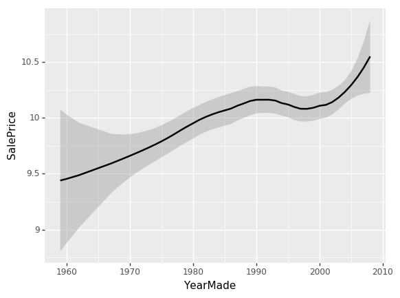

So we can see here [[01:12:48](https://youtu.be/0v93qHDqq_g?t=1h12m48s)], the relationship between `YearMade` and `SalePrice` is all over the place which is not really what we would expect. I would have expected that stuff that's sold more recently would probably be more expensive because of inflation and they are more current models. The problem is that when you look at a univariate relationship like this, there is a whole lot of collinearity going on — a whole lot of interactions that are being lost. For example, why did the price drop? Is it actually because things made between 1991 and 1997 are less valuable? Or is it actually because most of them were also sold during that time and there was maybe a recession then? Or maybe it was because products sold during that time, a lot more people were buying types of vehicles that were less expensive? There's all kind of reasons for that. So again, as data scientists, one of the things you are going to keep seeing is that at the companies that you join, people will come to you with these kind of univariate charts where they'll say "oh my gosh, our sales in Chicago have disappeared. They got really bad." or "people aren't clicking on this ads anymore" and they will show you a chart that looks like this and ask what happened. Most of the time, you'll find the answer to the question "what happened" is that there is something else going on. So for instance, "actually in Chicago last week, actually we were doing a new promotion and that's why our revenue went down — it's not because people are not buying stuff in Chicago anymore; the prices were lower".

So what we really want to be able to do is say "well, what's the relationship between `SalePrice` and `YearMade` all other things being equal. "All other things being equal" basically means if we sold something in 1990 vs. 1980 and it was exactly the same thing to exactly the same person in exactly the same auction so on and so forth, what would have been the difference in price? To do that, we do something called a **partial dependence plot** [[01:15:02](https://youtu.be/0v93qHDqq_g?t=1h15m2s)].

```python
x = get_sample(X_train[X_train.YearMade > 1930], 500)
```

There is a really nice library which nobody's heard of called [`pdp`](https://pdpbox.readthedocs.io/en/latest/) which does these partial dependence plots, and what happens is this. We've got our sample of 500 data points and we are going to do something really interesting. We are going to take each one of those five hundred randomly chosen auctions and we are going to make a little dataset out of it.

Here is our dataset of 500 auctions and here is our columns, one of which is the thing that we are interested in which is `YearMade`. We are now going to try and create a chart where we say all other things being equal in 1960, how much did things cost in auctions? The way we are going to do that is we are going to replace the `YearMade` column with 1960. We are going to copy in the value 1960 again and again all the way down. Now every row, the year made is 1960 and all of the other data is going to be exactly the same. We are going to take our random forest, we are going to pass all this through our random forest to predict the sale price. That will tell us for everything that was auctioned, how much do we think it would have been sold for if that thing was made in 1960. And that's what we are going to plot on the right.

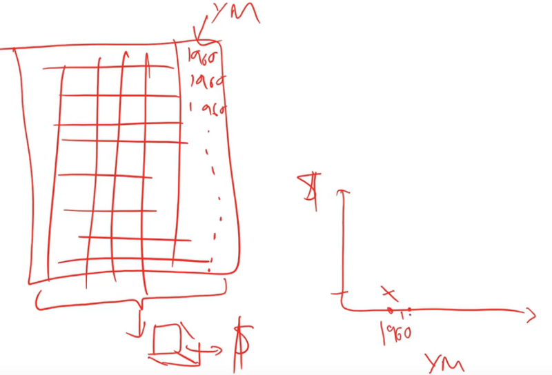

And we are going to do the same thing for 1961.

:question: To be clear, we've already fit the random forest and then we are just passing a new year and seeing what it determines the price should be [[01:17:10](https://youtu.be/0v93qHDqq_g?t=1h17m10s)]?

Yes, so this is a lot like the way we did feature importance. But rather than randomly shuffling the column, we are going to replace the column with a constant value. Randomly shuffling the column tells us how accurate it is when you don't use that column anymore. Replacing the whole column with a constant estimates for us how much we would have sold that product for in that auction on that day in that place if that product had been made in 1961. We then take the average of all of the sale prices that we calculate from that random forest. We do it in 1961 and we get this value:

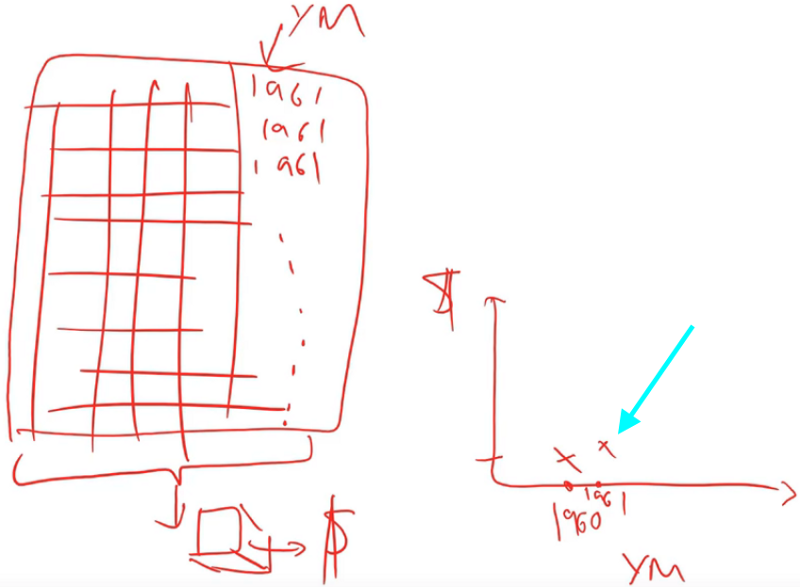

```python
def plot_pdp(feat, clusters=None, feat_name=None):
    feat_name = feat_name or feat
    p = pdp.pdp_isolate(m, x, model_features=x.columns.values, feature=feat)
    return pdp.pdp_plot(p, feat_name, plot_lines=True,
                        cluster=clusters is not None,
                        n_cluster_centers=clusters)
plot_pdp('YearMade')
```

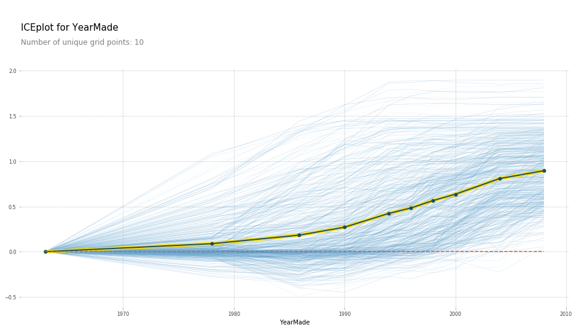

So what the partial dependence plot (PDP) here shows us is each of these light blue lines actually is showing us all 500 lines [[01:18:01](https://youtu.be/0v93qHDqq_g?t=1h18m1s)]. So for row number 1 in our dataset, if we sold it in 1960, we are going to index that to zero so call that zero. If we sold it in 1970 that particular auction, it would have been here, etc. We actually plot all 500 predictions of how much every one of those 500 auctions would have gone for if we replaced its `YearMade` with each of these different values. Then this dark line is the average. So this tells us how much would we have sold on average all of those auctions for if all of those products were actually made in 1985, 1990, 1993, etc. So you can see, what's happened here is at least in the period where we have a reasonable amount of data which is since 1990, this is basically a totally straight line — which is what you would expect. Because if it was sold on the same date, and it was the same kind of tractor, sold to the same person in the same auction house, then you would expect more recent vehicles to be more expensive because of inflation and they are newer. You would expect that relationship to be roughly linear and that is exactly what we are finding. By removing all these externalities, it often allows us to see the truth much more clearly.

This partial dependence plot is something which is using a random forest to get us a more clear interpretation of what's going on in our data [[01:20:02](https://youtu.be/0v93qHDqq_g?t=1h20m2s)]. The steps were:

1. First of all look at the feature importance to tell us which things do we think we care about.
2. Then to use the partial dependence plot to tell us what's going on on average.

There is another cool thing we can do with PDP which is we can use clusters. What clusters does is it uses cluster analysis to look at each one of the 500 rows and say do some those 500 rows move in the same way. We could kind of see it seems like there's a whole a lot of rows that go down and then up, and there seems to be a bunch of rows that go up and then go flat. It does seem like there's some kind of different types of behaviors being hidden and so here is the result of doing that cluster analysis:

```python
plot_pdp('YearMade', clusters=5)
```

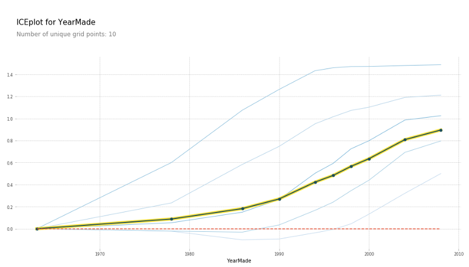

We still get the same average but it says here are five most common shapes that we see. And this is where you could then go in and say all right, it looks like some kinds of vehicle, after 1990, their prices are pretty flat. Before that, they were pretty linear. Some other kinds of vehicle were exactly the opposite, so different kinds of vehicle have these different shapes. So, this is something you could dig into.

:question: So what are we going to do with this information [[01:21:40](https://youtu.be/0v93qHDqq_g?t=1h21m40s)]?

The purpose of interpretation is to learn about a dataset and so why do you want to learn about a dataset? It's because you want to do something with it. So in this case, it's not so much something if you are trying to win a Kaggle competition — it can be a little bit like some of these insights might make you realize I could transform this variable or create this interaction, etc. Obviously feature importance is super important for Kaggle competitions. But this one is much more for real life. So this is when you are talking to somebody and you say to them "okay, those plots you've been showing me which actually say that there was this kind of dip in prices based on things made between 1990 and 1997. There wasn't really. Actually they were increasing, and there was something else going on at that time." It's basically the thing that allows you to say for whatever this outcome I'm trying to drive in my business is, this is how something is driving it. So if it's like I'm looking at advertising technology, what's driving clicks that I I'm actually digging in to say okay, this is actually how clicks are being driven. This is actually the variable that's driving it. This is how it's related. So therefore, we should change our behavior in this way. That's really the goal of any model. I guess there are two possible goals: one goal of a model is just to get the predictions, like if you are doing hedge fund trading, you probably want to know what the price of that equity is going to be. If you are doing insurance, you probably just want to know how much claims that guy is going to have. But probably most of the time, you are actually trying to change something about how you do business — how you do marketing, how you do logistics, so the thing you actually care about is how the things are related to each other.

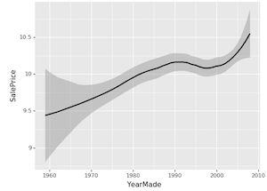

:question: Could you explain again why the dip did not signify what we thought it did [[01:23:36](https://youtu.be/0v93qHDqq_g?t=1h23m36s)]?

Yes. So this is a classic boring univariate plot. So this is just taking all of the dots, all of the options, plotting `YearMade` against `SalePrice` and we are just fitting a rough average through them. It's true that the products made between 1992 and 1997 on average in our dataset are being sold for less. Very often in business, you'll hear somebody look at something like this and say "we should stop auctioning equipment that is made in those years because we are getting less money for", for example. But if the truth actually is that during those years, it's just that people were making more small industrial equipment where you would expect it to be sold for less and actually our profit on it is just as high, for instance. Or it's not that things made during those years now would now be cheaper, it's that when we were selling things in those years, they were cheaper because there was a recession going on. If you are trying to actually take some action based on this, you probably don't just care about the fact that things made in those years are cheaper on average, but how does that impact today. So PDP approach where we actually say let's try and remove all of these externalities. So if something is sold on the same day to the same person of the same kind of vehicle, then actually how does year made impact the price. This basically says, for example, if I am deciding what to buy at an auction, then this is saying to me that getting a more recent vehicle on average really does give you more money which is not what the naive univariate plot said.

**Comment:** Bulldozers made in 2010 probably are not close to the type of bulldozers that were made in 1960. If you are taking something that would be so very different, like a 2010 bulldozer, and then trying to just drop it to say "oh if it was made in 1960" that may cause poor prediction at a point because it's so far outside of the training set [[01:26:12](https://youtu.be/0v93qHDqq_g?t=1h26m12s)].

Absolutely. That's a good point. It is a limitation, however, if you've got a datapoint that's in a part of the space that it has not seen before, like maybe people didn't put air conditioning in bulldozers in 1960 and you are saying how much would this bulldozer with air conditioning would have gone for in 1960, you don't really have any information to know that. This is still the best technique I know of but it's not perfect. And you kind of hope that the trees are still going to find some useful truth even though it hasn't seen that combination of features before. But yeah, it's something to be aware of.

```python
feats = ['saleElapsed', 'YearMade']
p = pdp.pdp_interact(m, x, model_features=x.columns.values, features=feats)
pdp.pdp_interact_plot(p, feats)
```

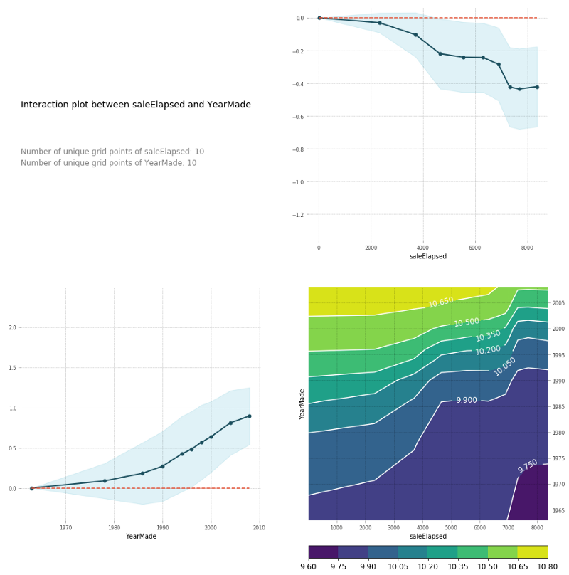

You can also do the same thing in a PDP interaction plot [[01:27:36](https://youtu.be/0v93qHDqq_g?t=1h27m36s)]. And PDP interaction plot which is really what I'm trying to get to here is how does `saleElapsed` and `YearMade` together impact the price. If I do a PDP interaction plot, it shows me `saleElapsed` vs. price, `YearMade` vs. price, and the combination vs. price. Remember, this is always log of price. That's why these prices look weird. You can see that the combination of `saleElapsed` and `YearMade` is as you would expect—the highest prices are those where there's the least elapsed and the most recent year made. The upper right is the univariate relationship between `saleElapsed` and price, the lower left is the univariate relationship between `YearMade` and price, and the lower right is the combination of the two. It's enough to see clearly that these two things are driving price together. You can also see these are not simple diagonal lines so there is some interesting interaction going on. Based on looking at these plots, it's enough to make me think, oh, we should maybe put in some kind of interaction term and see what happens. So let's come back to that in a moment, but let's just look at a couple more.

Remember, in this case, we did one-hot-encoding — way back at the top, we said `max_n_cat=7` [[01:29:18](https://youtu.be/0v93qHDqq_g?t=1h29m18s)]. So we have things like `Enclosure_EROPS w AC`. So if you have one-hot-encoded variables, you can pass an array of them to `plot_pdp` and it will treat them as a category.

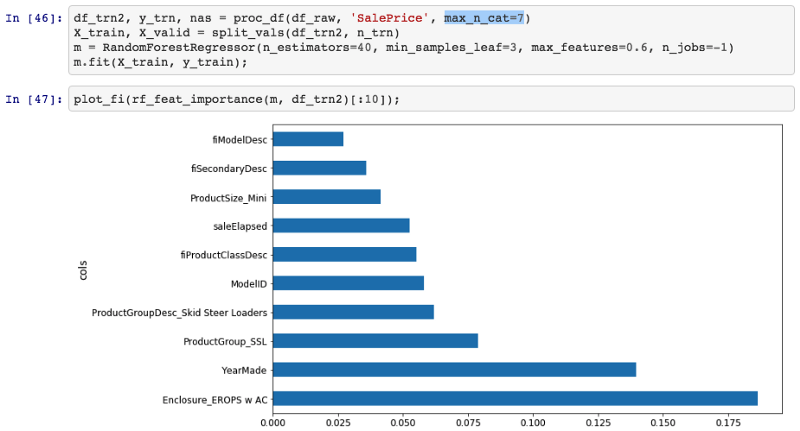

So in this case, I'm going to create a PDP plot of these three categories, and I'm going to call it "Enclosure".

```python
plot_pdp(['Enclosure_EROPS w AC', 'Enclosure_EROPS', 'Enclosure_OROPS'], 5, 'Enclosure')
```

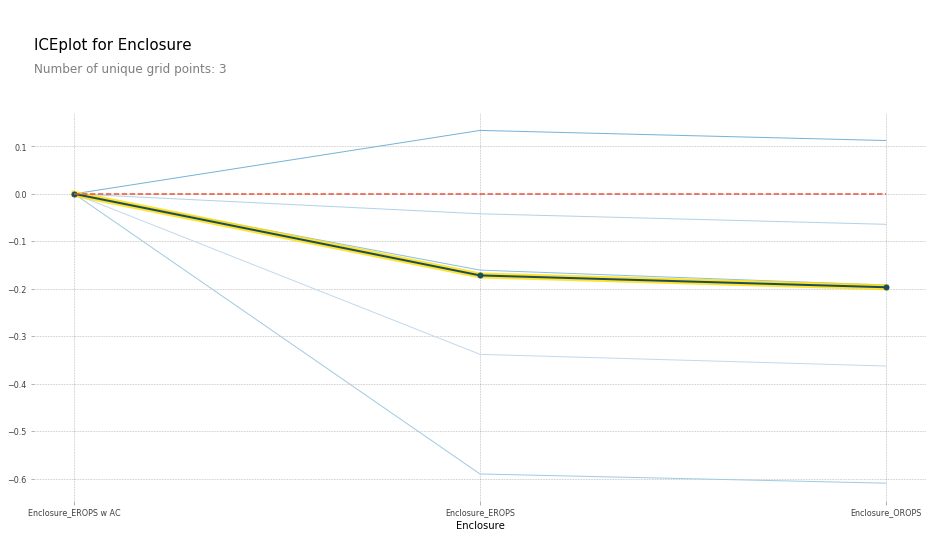

I can see here that `Enclosure_EROPS w AC` on average are more expensive than `Enclosure_EROPS` or `Enclosure_OROPS`. It actually looks like the latter two are pretty similar or else `Enclosure_EROPS w AC` is higher. So at this point, I'm probably being inclined to hop on to Google and type "erops orops" and find out what these things are and here we go.

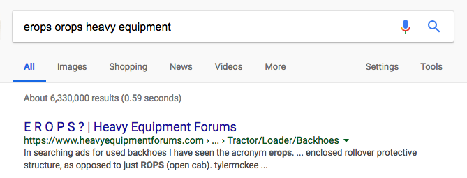

So it turns out that EROPS is enclosed rollover protective structure and so it turns out that if your bulldozer is fully enclosed then optionally you can also get air conditioning. So actually this thing is telling us whether it has air conditioning. If it's an open structure, then obviously you don't have air conditioning at all. So that's what these three levels are. So we've now learnt all other things being equal, the same bulldozer, sold at the same time, built at the same time, sold to the same person is going to be quite a bit more expensive if it has air conditioning than if it doesn't. So again, we are getting this nice interpretation ability. Now that I spent some time with this dataset, I'd certainly noticed that knowing this is the most important thing, you do notice that there is a lot more air conditioned bulldozers nowadays than they used to be and so there is definitely an interaction between date and that.

```python
df_raw.YearMade[df_raw.YearMade < 1950] = 1950
df_keep['age'] = df_raw['age'] = df_raw.saleYear - df_raw.YearMade

X_train, X_valid = split_vals(df_keep, n_trn)

m = RandomForestRegressor(n_estimators=40, min_samples_leaf=3, max_features=0.6, n_jobs=-1)
m.fit(X_train, y_train)

plot_fi(rf_feat_importance(m, df_keep))
```

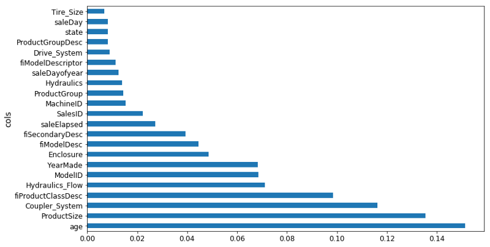

Based on the earlier interaction analysis, I've tried, first of all, setting everything before 1950 to 1950 because it seems to be some kind of missing value [[01:31:25](https://youtu.be/0v93qHDqq_g?t=1h31m25s)]. I've set `age` to be equal to `saleYear - YearMade`. Then I tried running a random forest on that. Indeed, `age` is now the single biggest thing, `saleElapsed` is way back down here, `YearMade` is back down here. So we've used this to find an interaction. But remember, of course a random forest can create an interaction through having multiple split points, so we shouldn't assume that this is actually going to be a better result. And in practice, I actually found when I looked at my score and my RMSE, adding `age` was actually a little worse. We will see about that later probably in the next lesson.

### Tree Interpreter [[01:32:24](https://youtu.be/0v93qHDqq_g?t=1h32m34s)]

One last thing is tree interpreter. This is also in the category of things that most people don't know exists, but it's super important. Almost pointless for Kaggle competitions but super important for real life. Here is the idea. Let's say you are an insurance company and somebody rings up and you give them a quote and they say "oh, that's $500 more than last year. Why?" So in general, you've made a prediction from some model and somebody asks why. This is where we use this method called tree interpreter. What tree interpreter does is it allows us to take a particular row.

```python
from treeinterpreter import treeinterpreter as ti
df_train, df_valid = split_vals(df_raw[df_keep.columns], n_trn)
```

So in this case, we are going to pick row number zero.

```python
row = X_valid.values[None, 0]
row
```

Here are all the columns in row zero.

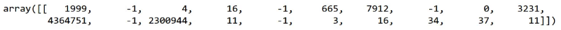

What I can do with a tree interpreter is I can go `ti.predict`, pass in my random forest and my row (so this would be like this particular customer's insurance information, or in this case this particular auction). And it will give me back three things:

- `prediction`: The prediction from the random forest
- `bias`: The average sale price across the whole original dataset
- `contributions`: A column and the value to split by (i.e. the predictor), and how much it changed the predicted value.

```python
prediction, bias, contributions = ti.predict(m, row)
```

So you can think of it this way [[01:34:51](https://youtu.be/0v93qHDqq_g?t=1h34m51s)]. The whole dataset had an average log sale price of 102. The dataset for those with `Coupler_system ≤ 0.5` had an average of 10.3. The dataset for `Coupler_system ≤ 0.5` and `Enclosure ≤ 2.0` was 9.9, and then eventually we get all the way up here and also with `ModelID ≤ 4573.0`, it's 10.2. So you could ask, okay, why did we predict 10.2 for this particular row?

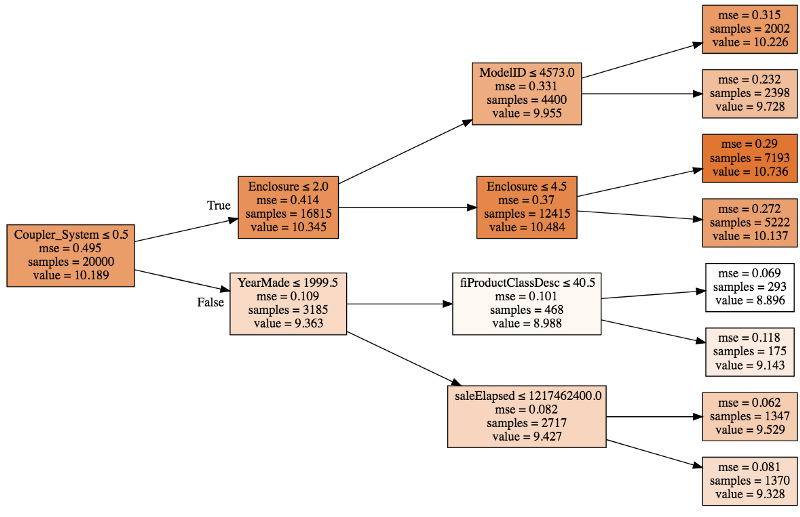

That is because we started with 10.19:

- Because the coupler system was less than .3, we added about .2 to that (so we went from 10.19 to 10.34).
- Because enclosure was less than 2, we subtracted about .4.
- Then because model ID was less than 4573, we added about .7

So you can see with a single tree, you could break down why is it that we predicted 10.2. At each one of these decision points, we are adding or subtracting a little bit from the value. What we could then do is we could do that for all the trees and then we could take the average. So every time we see enclosure did we increase or decrease the value and by how much? Every time we see model ID, did we increase or decrease the value and by how much? We could take the average of all of those and that's what ends up in this thing called `contributions`.

```python
prediction[0], bias[0]

# -----------------------------------------------------------------------------
# Output
# -----------------------------------------------------------------------------
(9.1909688098736275, 10.10606580677884)

idxs = np.argsort(contributions[0])
[o for o in zip(df_keep.columns[idxs], df_valid.iloc[0][idxs], contributions[0][idxs])]
```

So here is all of our predictors and the value of each [[01:37:54](https://youtu.be/0v93qHDqq_g?t=1h37m54s)].

```python
# -----------------------------------------------------------------------------
# Output
# -----------------------------------------------------------------------------
[('ProductSize', 'Mini', -0.54680742853695008),
 ('age', 11, -0.12507089451852943),
 ('fiProductClassDesc',
  'Hydraulic Excavator, Track - 3.0 to 4.0 Metric Tons',
  -0.11143111128570773),
 ('fiModelDesc', 'KX1212', -0.065155113754146801),
 ('fiSecondaryDesc', nan, -0.055237427792181749),
 ('Enclosure', 'EROPS', -0.050467175593900217),
 ('fiModelDescriptor', nan, -0.042354676935508852),
 ('saleElapsed', 7912, -0.019642242073500914),
 ('saleDay', 16, -0.012812993479652724),
 ('Tire_Size', nan, -0.0029687660942271598),
 ('SalesID', 4364751, -0.0010443985823001434),
 ('saleDayofyear', 259, -0.00086540581130196688),
 ('Drive_System', nan, 0.0015385818526195915),
 ('Hydraulics', 'Standard', 0.0022411701338458821),
 ('state', 'Ohio', 0.0037587658190299409),
 ('ProductGroupDesc', 'Track Excavators', 0.0067688906745931197),
 ('ProductGroup', 'TEX', 0.014654732626326661),
 ('MachineID', 2300944, 0.015578052196894499),
 ('Hydraulics_Flow', nan, 0.028973749866174004),
 ('ModelID', 665, 0.038307429579276284),
 ('Coupler_System', nan, 0.052509808150765114),
 ('YearMade', 1999, 0.071829996446492878)]
```

*There was an issue with sorting in the video as it was not using the index sort, but above example is the corrected version.*

```python
contributions[0].sum()

# -----------------------------------------------------------------------------
# Output
# -----------------------------------------------------------------------------
-0.7383536391949419
```

So then there is this thing called bias and the bias is just the average before we start doing any splits [[01:39:03](https://youtu.be/0v93qHDqq_g?t=1h39m3s)]. If you start with the average log of value and then we went down each tree and each time we saw `YearMade`, we had some impact, coupler system some impact, product size some impact, and so forth.

We might come back to tree interpreter next time, but the basic idea (this is the last of our key interpretation points) is that we want some ability to not only tell us about the model as a whole and how it works on average, but to look at how the model makes prediction for an individual row. And that's what we are doing here.
